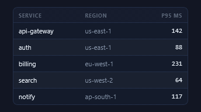
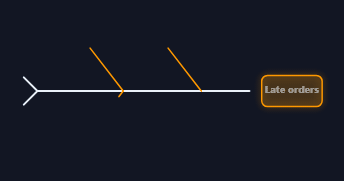

<div align="center">

# ✦ Prism

**One prism. Every facet of your report.**

A single-file gallery of **3,422** offline, self-contained CSS/SVG animations, components, and backdrops — built to be browsed by humans *and* driven by AI agents. Ships with a **zero-dependency MCP server** so Claude (Desktop, Code, or the API) can search the catalog and compose production-ready HTML/CSS on demand.

     

</div>

---

## About this fork

This is [k33bz/Prism](https://github.com/k33bz/Prism), a fork of [crazy54/Prism](https://github.com/crazy54/Prism). Upstream is the design library and the MCP server; the fork keeps both intact and adds, on top:

- **Two galleries:** 📋 Tables & Data Layouts (55 facets, including click-driven sorting demos and a holographic file tree) and 📐 Diagrams & Frameworks (53 facets: every fishbone variant, flow, hierarchy, comparison, timeline, network, strategy frameworks, flywheels).
- **New facet families inside existing galleries:** the Elemental Base blocks and Pokémon Battle scenes in FX Store, a self-hosted-Forgejo landing kit in Animated Objects and Text Effects, presence status modifiers and a live avatar stack in Notifications.
- **Three more theme packs** (Cloudflare Orange, Google Cloud Console, Fluent for Azure) through the same profile, scaffolder, generator and 100-facet gate as upstream's packs, plus two skins (Frutiger Aero, Liquid Glass).
- **A GIF showcase** of every facet, recorded headlessly by Firefox over WebDriver BiDi (Chromium over CDP as the alternative), with per-gallery pages and an offline browser.
- **Git-derived metadata:** every catalog record carries `addedOn`, `updatedOn` and `author` mined from history, the New Facets page is built from those dates with an adjustable window, and Search filters and sorts by author.

Every facet records who introduced it (`author`: `crazy54` upstream, `k33bz` fork), so attribution travels with the catalog rather than living in this paragraph.

---

## What Prism is

Prism is **one HTML file** — `Prism.html` — containing a whole design library of animated elements: charts, visual effects, "AI is thinking" states, 3D objects, form inputs, text treatments, shaped text, offline maps, notifications, architecture diagrams, report callouts, Obsidian facets, menus, tables and data layouts, diagrams and frameworks, and Spectrum families that render the same components in 22 visual languages. Everything is hand-authored, pure HTML/CSS (plus tiny inline JS only where an effect genuinely needs it). No fonts, scripts, images, or CDNs are fetched, so anything you copy out of Prism runs anywhere, forever, including fully offline.

It serves two audiences from the same source of truth:

- **Humans** open the file in a browser, browse the galleries, and hit **Copy** on any element to grab ready-to-paste, self-contained markup.
- **AI agents** talk to the **Prism MCP server** (in [`prism-mcp-server/`](./prism-mcp-server)) — or read the embedded [JSON island](#-the-json-island) directly — to discover effects and compose them programmatically: *"make the KPI cards pulse and put a wind backdrop behind the streaming agent text."*

---

## Install the MCP server

The [Model Context Protocol](https://modelcontextprotocol.io) lets an AI agent call tools over a well-defined resource. The bundled server exposes Prism's catalog as **29 tools** — discovery, composition, facet creation, and saved collections — so an agent can go from *"give me a pulsing KPI card with a wind background"* to **discovered, composed, deduplicated, validated HTML/CSS** in one turn.

It has **zero runtime dependencies** (pure Node.js ≥ 18) and speaks MCP JSON-RPC 2.0 over **stdio** — the transport Claude Desktop, Claude Code, and the Anthropic API use to launch a local MCP server as a subprocess.

### 1. Get the code

```bash
git clone <this-repo> prism
cd prism/prism-mcp-server
```

There is **nothing to `npm install`** — the server has no dependencies. It runs straight from `node cli.js`.

> Requires **Node.js 18 or newer** (`node --version` to check).

### 2. Sanity-check it before wiring it up

```bash
# Print catalog stats and exit (no server) — confirms it can read Prism.html
node cli.js info --catalog ../Prism.html

# List the 29 tools it exposes
node cli.js tools

# Run the server over stdio (Ctrl-C to stop). This is what a client launches.
node cli.js start --catalog ../Prism.html
```

`info` should report **3,110 effects across 17 galleries** (1,300 of those are the 13 theme packs' Spectrum facets, 100 per pack). If it does, the server is working — the remaining steps just tell a client *how* to launch it.

> **Always point `--catalog` at `Prism.html`.** The `#prism-catalog` island inside it is the authoritative catalog and can be fresher than `catalog/manifest.json`. If `--catalog` is omitted, the server defaults to `../Prism.html`, falling back to `../catalog/manifest.json`.

Optionally put the `prism-mcp` binary on your `PATH` so you can drop the `node cli.js` prefix:

```bash
npm link          # or: npm i -g .
prism-mcp info --catalog ../Prism.html
```

### 3. Connect it to a client

Use **absolute paths** everywhere below — clients launch the server from their own working directory, not yours. Replace `/ABS/PATH/prism` with the absolute path to your clone.

<details open>
<summary><b>Claude Code (CLI)</b></summary>

```bash
claude mcp add prism -- node /ABS/PATH/prism/prism-mcp-server/cli.js start --catalog /ABS/PATH/prism/Prism.html
```

Then `claude mcp list` should show `prism`, and the 29 tools become available in your session. Remove it with `claude mcp remove prism`.
</details>

<details>
<summary><b>Claude Desktop</b></summary>

Add the block below to your `claude_desktop_config.json`, then **restart Claude Desktop**. The 21 Prism tools appear in the tools menu.

- **macOS:** `~/Library/Application Support/Claude/claude_desktop_config.json`
- **Windows:** `%APPDATA%\Claude\claude_desktop_config.json`

```json
{
  "mcpServers": {
    "prism": {
      "command": "node",
      "args": [
        "/ABS/PATH/prism/prism-mcp-server/cli.js",
        "start",
        "--catalog",
        "/ABS/PATH/prism/Prism.html"
      ]
    }
  }
}
```

A ready-to-edit copy lives at [`prism-mcp-server/examples/claude_desktop_config.json`](./prism-mcp-server/examples/claude_desktop_config.json).
</details>

<details>
<summary><b>Anthropic API (Messages)</b></summary>

The Messages API can launch the local stdio server via the `mcp_servers` parameter and let Claude call its tools during a turn:

```jsonc
// POST https://api.anthropic.com/v1/messages
{
  "model": "claude-opus-5",
  "max_tokens": 2048,
  "mcp_servers": [
    {
      "type": "stdio",
      "name": "prism",
      "command": "node",
      "args": [
        "/ABS/PATH/prism/prism-mcp-server/cli.js",
        "start",
        "--catalog",
        "/ABS/PATH/prism/Prism.html"
      ]
    }
  ],
  "messages": [
    { "role": "user", "content": "Find a pulsing KPI card and a wind background, then compose them into one paste-ready bundle." }
  ]
}
```

See [`prism-mcp-server/examples/anthropic_api.md`](./prism-mcp-server/examples/anthropic_api.md) for a full request plus a runnable SDK Tool-Runner snippet.
</details>

### CLI reference

```
prism-mcp start [options]     Run the MCP server over stdio (default command)
prism-mcp info  [options]     Print catalog metadata + stats, then exit
prism-mcp tools               List available tools, then exit
prism-mcp help                Show help

Options:
  --catalog <path>   Path to Prism.html or catalog/manifest.json
                     (default: ../Prism.html, else ../catalog/manifest.json)
  --no-watch         Disable catalog hot reload (edits are otherwise picked up live)
  --log-level <lvl>  debug | info | warn | error | silent   (default: info)
```

Logs go to **stderr** (stdout is reserved for the JSON-RPC channel), so they never corrupt the MCP protocol stream. Verbosity is also settable via `PRISM_MCP_LOG_LEVEL`. A `--port` flag is accepted but ignored — this build is stdio-only; add an HTTP/SSE transport by implementing one against `PrismMCPServer`.

### The 29 tools

| Group | Tools |
|---|---|
| **Discovery (11)** | `list_effects` · `search_effects` · `get_effect` · `list_galleries` · `get_catalog_stats` · `get_available_filters` · `list_filter_values` · `get_theme_variants` · `get_theme_palette` · `get_component_variants` · `get_variants_for_theme` |
| **Saved searches (3)** | `create_saved_search` · `get_saved_searches` · `execute_saved_search` (in-memory, per server process) |
| **Composition (3)** | `compose` · `compose_with_template` (`stack`/`row`/`grid`/`card`) · `validate_composition` |
| **Content creation (3)** | `create_facet` · `update_facet` · `validate_facet` |
| **Catalog management (3)** | `get_catalog_metadata` · `export_collection` (`bundle`/`document`/`schema`) · `get_token_reference` |
| **Collections & favorites (6)** | `list_collections` · `get_collection` · `create_collection` · `add_to_collection` · `remove_from_collection` · `delete_collection` |

`compose` merges HTML, deduplicates CSS rules, collapses `:root` token blocks, validates the output, and reports size savings. **Collections** are named, disk-backed sets of effects that persist across sessions (stored in `prism-mcp-server/collections.json`, which is git-ignored); export one with `export_collection { collectionId, format: "schema" }` to hand it to the Prism.html UI. Full parameter schemas come back from `tools/list`, and one example call per tool lives in [`prism-mcp-server/examples/`](./prism-mcp-server/examples).

For deeper server internals (architecture, error model, facet draft→register→persist flow), see [`prism-mcp-server/README.md`](./prism-mcp-server/README.md).

### A worked example — real Prism artifacts

Every block below is **actual output** from the server against the shipped `Prism.html` — the artifacts an agent sees mid-conversation.

**1. Ask for a KPI card** → `search_effects { "query": "kpi pulse", "limit": 3 }`:

```json
[
  { "id": "charts-mini-kpi-row",       "name": "Mini KPI Row",        "gallery": "charts", "score": 12 },
  { "id": "charts-kpi-sparkline",      "name": "KPI + Sparkline",     "gallery": "charts", "score": 11 },
  { "id": "charts-kpi-delta-card-grid","name": "KPI Delta Card Grid", "gallery": "charts", "score": 11 }
]
```

**2. Fetch a tile** → `get_effect { "id": "charts-kpi-tile-delta" }` returns a self-contained, paste-ready facet. Its `html` (the real artifact — a value tile with a colored change badge):

```html
<div class="kpi">
  <div class="l">Coverage</div>
  <div class="n" style="color:var(--info)">72<span class="unit">%</span></div>
  <div class="delta up">▲ 6.2 pts vs last mo</div>
</div>
```

…paired with `css` that draws entirely from Prism's shared tokens, so it reskins with the active theme:

```css
.kpi   { background-image: var(--cardgrad); border: 1px solid var(--line);
         border-radius: 12px; padding: 16px 20px; min-width: 150px; }
.kpi .n{ font-size: 40px; font-weight: 800; font-variant-numeric: tabular-nums; }
.delta      { display: inline-flex; gap: 4px; padding: 2px 9px; border-radius: 20px; font-weight: 800; }
.delta.up   { color: var(--pos); background: rgba(var(--pos-rgb), .13); }
.delta.down { color: var(--neg); background: rgba(var(--neg-rgb), .13); }
```

**3. Bundle a whole KPI row** → `compose { "ids": ["charts-mini-kpi-row", "charts-kpi-tile-delta", "charts-kpi-delta-card-grid"] }`. The engine merges the HTML and deduplicates the shared `.kpi` / `.delta` rules — real `metrics` from this call:

```json
{
  "effectCount": 3,
  "rulesIn": 47,
  "rulesOut": 28,
  "duplicatesRemoved": 19,
  "naiveCssLength": 4854,
  "finalCssLength": 3018,
  "reductionPct": 37.8
}
```

Three overlapping components collapse into one clean bundle **37.8% smaller** than concatenating them — validated and paste-ready. Add a background layer (`objects-windy-day`, `objects-snowfall`, `objects-rain`…) to the `ids` and `compose` reports the required initializer (e.g. `amb-particles`) so the backdrop animates once dropped in.

> These snippets render as static markup on GitHub (it strips CSS/animation), but paste them into any HTML page — with Prism's `tokens.css` included once — and they animate exactly as they do in the gallery. Fetch `tokens.css` any time via `get_token_reference`.

### Try it with no client

```bash
cd prism-mcp-server

# Drive search -> get -> compose end to end against the real catalog
node examples/quickstart.mjs ../Prism.html

# Run the bundled Node-native test suite (129 tests, zero deps)
node --test test/*.test.js
```

---

## Quick start (just open the file)

You don't need the MCP server to use Prism as a human:

```bash
open Prism.html            # macOS — or double-click the file, or serve the folder statically
```

The page opens on a loader veil, then routes by device: touch devices land on **Mobile**, everything else on **New Facets** (what changed in the last 30 days; adjust the window with the slider). A `#hash` in the URL (e.g. `Prism.html#objects`) always wins, so you can deep-link a gallery. To use an element: browse to it, click **Copy** (or **Copy snippet**), and paste. If an effect reads theme tokens, include the design tokens once globally (see [Composing an effect](#composing-an-effect)).

---

## The galleries

Seventeen authored galleries, plus special views. Every element carries a name, its canonical CSS selector (`.ref`), a one-line description, and a copy affordance.

| Gallery | What's inside | Count |
|---|---|--:|
| 🧪 **Animation Lab** | Motion studies — easing, transforms, loaders, physics, keyframes, loaders and waiting states, reveal choreography | 260 |
| ◆ **Spectrums** | 9 hand-authored families across full visual languages (Material, glass, brutalist, solarpunk…) plus the 13 theme packs at 100 generator facets each | 1566 |
| 📊 **Charts & Metrics** | KPIs, gauges, progress, trends, comparisons, status, 3D charts, correlation/time/distribution plots, treemaps and hierarchies, liquid gauges and variance bands, run charts with SPC rules | 266 |
| 🎇 **FX Store** | Drop-in visual effects: glow, pulse, shimmer, glass, particles, glitch, Pokémon Battle signature scenes, Elemental Base blocks (spray, bolt, streak, burst, aura, volley), glow system, hover and reveal | 213 |
| ◈ **Obsidian Facets** | Callouts, graph links, note chrome, Dataview dashboards, Canvas, focus scenes | 130 |
| 🤖 **AI Working** | "Thinking" states, token streams, tool calls, model internals | 118 |
| ✏️ **Input Methods** | Controls, pickers, toggles, interactive input patterns, button hover effects, retro sci-fi control panels, nixie tubes | 134 |
| 🔤 **Text Effects** | Gradient, neon, glitch, shimmer, kinetic, 3D/extrude text | 102 |
| ⌬ **Animated Objects** | Self-contained animated SVG/CSS objects, icons, 3D objects, forge landing kit, ambient backgrounds, 3D CSS objects, synthwave outrun scenes, hourglass and sand, lava lamps | 165 |
| 🌈 **Text Shapes** | Text arranged into arcs, rings, spirals, 3D tunnels | 53 |
| 🌍 **Maps & Geo** | Offline SVG maps, pulsing markers, great-circle arcs, choropleth, radar, telemetry | 50 |
| 🔔 **Notifications & Status** | Toasts, snackbars, banners, live indicators, presence status set, live avatar stack, empty states, skeletons, geometric and 3D avatar shapes | 55 |
| 🗺 **Architecture Diagrams** | Service nodes, animated connectors, VPC containers, sequence & flow diagrams, AWS reference architectures, network flow maps | 76 |
| ⭐ **Callouts & Annotations** | Admonitions, badges & pills, timelines, dividers, tooltips, key-value meta | 50 |
| 🧭 **Menus & Actions** | Dropdowns, context menus, command palettes, action bars, radial menus, live long-press and drag dial menus | 39 |
| 📋 **Tables & Data Layouts** | Data tables, status cells, matrices, key-value blocks, lists & trees, grids & schedules, ledgers, toolbars | 55 |
| 📐 **Diagrams & Frameworks** | Fishbone variants, flowcharts & loops, trees & funnels, Venn & SWOT, roadmaps & Gantt, networks, Sankey sub-styles, OKR / RACI / canvas, flywheels | 58 |

**Special views:** ✦ **New Facets** (live-assembled page of everything added or changed in a chosen window, default 30 days, with a day slider and an optional Spectrums toggle; dates come from git history) · 🔎 **Search** (faceted search over the whole catalog: gallery, component, interaction, author, status and tags, sortable by relevance, name, git date, gallery or author, with saved searches and shareable URLs) · 🎛 **Variant Matrix** (any facet rendered across every theme at once) · 📚 **Collections** (named sets of facets, exportable to the MCP server) · 📱 **Mobile** / 🖱️ **Desktop** (the library sliced by input modality) · 🎨 **Idea Gallery** (paste code, tweak variables, preview live).

**Facets & markers.** Prism calls its elements *facets*. New items carry a green **NEW** badge and a subtle pulse; repaired/refreshed ones get a blue **UPDATED** badge. Both are collected automatically on the **New Facets** page. Every tile that runs a CSS animation gets a small **▶** button to replay it on demand, and each gallery has a floating **REPLAY ANIMATIONS** button — theme-aware and kept outside the tile's `.stage`, so it never ends up in a copied snippet.

---

<!-- showcase:start -->
## 🎞 GIF showcase

Every one of the **3390 facets** is recorded as a looping GIF from its own standalone HTML sample, so you can browse the whole library without opening Prism.html — see [**showcase/**](showcase/README.md) (82.6 MB of GIFs, rendered by Firefox (WebDriver BiDi) 155.0.1). Click a gallery below to open its page; click any GIF there to get to the effect's self-contained HTML.

<table>
<tr><td align="center" valign="top" width="33%"><a href="showcase/galleries/charts.md"></a><br><b><a href="showcase/galleries/charts.md">Charts &amp; Metrics</a></b><br><sub>266 effects</sub></td><td align="center" valign="top" width="33%"><a href="showcase/galleries/fx.md"></a><br><b><a href="showcase/galleries/fx.md">FX Store</a></b><br><sub>245 effects</sub></td><td align="center" valign="top" width="33%"><a href="showcase/galleries/lab.md"></a><br><b><a href="showcase/galleries/lab.md">Animation Lab</a></b><br><sub>260 effects</sub></td></tr>
<tr><td align="center" valign="top" width="33%"><a href="showcase/galleries/ai.md"></a><br><b><a href="showcase/galleries/ai.md">AI Working</a></b><br><sub>118 effects</sub></td><td align="center" valign="top" width="33%"><a href="showcase/galleries/objects.md"></a><br><b><a href="showcase/galleries/objects.md">Animated Objects</a></b><br><sub>165 effects</sub></td><td align="center" valign="top" width="33%"><a href="showcase/galleries/input.md"></a><br><b><a href="showcase/galleries/input.md">Input Methods</a></b><br><sub>134 effects</sub></td></tr>
<tr><td align="center" valign="top" width="33%"><a href="showcase/galleries/text.md"></a><br><b><a href="showcase/galleries/text.md">Text Effects</a></b><br><sub>102 effects</sub></td><td align="center" valign="top" width="33%"><a href="showcase/galleries/shapes.md"></a><br><b><a href="showcase/galleries/shapes.md">Text Shapes</a></b><br><sub>53 effects</sub></td><td align="center" valign="top" width="33%"><a href="showcase/galleries/maps.md"></a><br><b><a href="showcase/galleries/maps.md">Maps &amp; Geo</a></b><br><sub>50 effects</sub></td></tr>
<tr><td align="center" valign="top" width="33%"><a href="showcase/galleries/notify.md"></a><br><b><a href="showcase/galleries/notify.md">Notifications &amp; Status</a></b><br><sub>55 effects</sub></td><td align="center" valign="top" width="33%"><a href="showcase/galleries/arch.md"></a><br><b><a href="showcase/galleries/arch.md">Architecture Diagrams</a></b><br><sub>76 effects</sub></td><td align="center" valign="top" width="33%"><a href="showcase/galleries/callouts.md"></a><br><b><a href="showcase/galleries/callouts.md">Callouts &amp; Annotations</a></b><br><sub>50 effects</sub></td></tr>
<tr><td align="center" valign="top" width="33%"><a href="showcase/galleries/obsidian.md"></a><br><b><a href="showcase/galleries/obsidian.md">Obsidian Facets</a></b><br><sub>130 effects</sub></td><td align="center" valign="top" width="33%"><a href="showcase/galleries/menus.md"></a><br><b><a href="showcase/galleries/menus.md">Menus &amp; Actions</a></b><br><sub>39 effects</sub></td><td align="center" valign="top" width="33%"><a href="showcase/galleries/tables.md"></a><br><b><a href="showcase/galleries/tables.md">Tables &amp; Data Layouts</a></b><br><sub>55 effects</sub></td></tr>
<tr><td align="center" valign="top" width="33%"><a href="showcase/galleries/diagrams.md"></a><br><b><a href="showcase/galleries/diagrams.md">Diagrams &amp; Frameworks</a></b><br><sub>58 effects</sub></td><td align="center" valign="top" width="33%"><a href="showcase/galleries/spectrums.md"></a><br><b><a href="showcase/galleries/spectrums.md">Spectrums</a></b><br><sub>1,566 effects</sub></td></tr>
</table>

Regenerate with `node showcase/build.mjs` (Node 18+, Firefox or Chromium, ffmpeg) — the GIFs are display-only and never part of the catalog or MCP server.

<!-- showcase:end -->

---

## Themes

Prism ships **16 themes, each in dark and light** (32 entries in the theme registry, mirrored into the MCP server). It is built in the **AWS Cloudscape** design language and defaults to two color modes: **Cloudscape Dark** (the default) and **Cloudscape Light**. Toggle between them from the top navigation bar. The theme picker also carries the design-system packs (Duolingo, Mailchimp, Stack Overflow, Monzo, Heroku, Polaris, Primer, Ant Design, Acorn, Material 3, **Cloudflare Orange**, **Google Cloud Console**, **Fluent (Azure)**), each with a gated 100-facet family in the Spectrums gallery, and two skin-only themes with no facet family of their own: **Frutiger Aero** and **Liquid Glass**. Every theme ships in dark and light. The mode override reskins the entire tool — shell *and* every gallery — by swapping a shared set of CSS custom properties (`--accent`, `--info`, `--pos`, `--bg`, `--ink` …), so every element re-themes at once. Your choice persists across sessions.

---

## 🧩 The JSON island

At the very top of `Prism.html`'s `<head>` sits a single tag:

```html
<script type="application/json" id="prism-catalog"> … </script>
```

This is the **JSON island**: a complete, machine-readable catalog of every effect, embedded right alongside the human UI. It's what the MCP server reads, and an agent can read it directly too — no DOM scraping required:

```js
const catalog = JSON.parse(document.getElementById('prism-catalog').textContent);
catalog._ai;          // read this first: what/howToUse/fields/count
catalog.effects;      // 3110 records, each with self-contained html + css (catalog._ai.count is the live number)
```

The island is purpose-built to back an MCP server because everything a tool needs is precomputed and self-describing: a **`_ai` header** that orients a fresh agent, **fully composable records** (each effect ships its own `html` + `css`, `classes`, `keyframes`, `params`, `needsJs`, `usableAsBackground`, `selfContained`), **searchable dimensions** (`gallery`, `category`, `tags`, `ref`, `description`), and **encoded composition rules** (top-level `tokens.css`, `usage`, `galleries`).

### Effect record schema

```jsonc
{
  "id": "charts-gauge-cluster",     // stable, unique — what an agent references
  "name": "Gauge Cluster",
  "gallery": "charts",              // charts|fx|lab|ai|objects|input|text|shapes|maps|notify|arch|callouts|obsidian|menus|tables|diagrams|spectrums
  "category": "Gauges & Dials",
  "ref": ".nch-gaugetri",           // canonical selector
  "description": "Three half-gauges with sweeping needles…",
  "classes": ["nch-gaugetri", …],
  "keyframes": ["nchNeedle3"],
  "params": { "color": { "var": "--c", "rgbVar": "--c-rgb", … } },
  "tags": ["charts", "animated", "updated"],
  "usableAsBackground": false,      // full-bleed layer meant to sit behind content?
  "needsJs": null,                  // key into initializers[] (top level), or null. Fork tiles declare it with data-needs-js; the shell shows a "needs JS" pill and Copy includes the script
  "selfContained": false,           // true = renders from html alone (inline styles)
  "isNew": false, "isFixed": true,  // release markers (green NEW / blue UPDATED)
  "addedOn": "2026-07-13",          // git-derived: first commit the facet appeared in
  "updatedOn": "2026-07-28",        // git-derived: last commit that changed its markup (or null)
  "author": "crazy54",              // git-derived: handle of whoever introduced the facet (crazy54 upstream, k33bz fork)
  "html": "<div class=\"nch-gaugetri\">…</div>",
  "css":  ".nch-gaugetri{…} @keyframes nchNeedle3{…}",
  "dataSnip": null                  // author-curated minimal snippet, if any
}
```

Top-level also carries `tokens.css` (the `:root` design tokens + `.c-*` color classes — include once globally), `usage` (composition rules), `initializers` (needsJs key → `{ js, page }`; fork facets ship the inline initializer source, upstream's two keys are pointers to their page scripts), and `galleries` / `categories` for browsing. The fork allows a facet to need a small dependency-free inline script: such tiles carry `data-needs-js`, show a **needs JS** pill next to Copy, and Copy includes the script. A pull request upstream should exclude every facet tagged `needs-js`.

### Composing an effect

1. Ensure `tokens.css` is present once in the document.
2. Insert `effect.html`.
3. Include `effect.css`.
4. If `effect.needsJs`, run the matching initializer once **after** the markup is in the DOM.
5. If `effect.params.color` exists, set `--c` / `--c-rgb` (or add a `.c-*` class) to recolor.

The MCP server's `compose` / `compose_with_template` tools do all of this for you and hand back a validated, deduped bundle.

---

## Repository layout

```
.
├── Prism.html              ← the whole tool: UI + all galleries + the JSON island
├── README.md               ← you are here
├── prism-mcp-server/       ← the MCP server (zero-dependency Node, 29 tools)
│   ├── cli.js                 prism-mcp CLI (start / info / tools / help)
│   ├── index.js               PrismMCPServer (JSON-RPC dispatch) + StdioTransport
│   ├── tools/index.js         the 29 tool definitions
│   ├── utils/                 catalog store, collections, themes mirror, css/compose/validate, logger
│   ├── examples/              per-tool example calls + Claude Desktop / Anthropic API configs
│   ├── test/                  Node-native test suite (129 tests)
│   └── README.md              server internals & architecture
├── catalog/                ← the catalog + the maintenance pipeline
│   ├── manifest.json          full catalog (mirror of the island)
│   ├── index.json             slim discovery index (no html/css)
│   ├── facet-dates.json       git-derived addedOn / updatedOn / author per facet
│   ├── systems.json           the registered theme packs (what the gate holds to 100 facets)
│   ├── _facet_dates.mjs       mine git history, embed the #prism-facet-dates island
│   ├── extract-from-prism.mjs re-extract every effect from Prism.html (headless Chrome or Edge)
│   ├── _embed-catalog.mjs     embed the manifest into the #prism-catalog island
│   ├── _smoke.mjs             island + shell parse check
│   ├── _check_ds.mjs          theme-pack gate: 100 facets, token-only, offline, reduced-motion
│   ├── _sync_counts.mjs       keep this README's badges and counts honest
│   ├── _scaffold.mjs / _rescaffold.mjs / _splice.mjs / _splice_page.mjs   build and splice gallery templates from drafts/
│   ├── _scaffold_ds.mjs / _gen_system.mjs / _merge_spectrum.mjs           theme packs: profile → registry + MCP mirror → 100 facets → Spectrums
│   ├── drafts/                gallery sources (body + css) for the drafts-built galleries
│   ├── profiles/              one profile per theme (palette, type, radius)
│   └── additions/             generated facet batches merged into the galleries
└── showcase/               ← GIF showcase: one HTML sample + one looping GIF per effect (display only)
    ├── build.mjs              records every effect headlessly (Firefox BiDi or Chromium CDP, no deps) + ffmpeg
    ├── browsers.mjs           the two raw wire-protocol drivers behind one tiny interface
    ├── html/  gif/            <id>.html standalone samples · <id>.gif recordings
    ├── galleries/*.md         browsable pages per gallery · index.html offline browser · manifest.json
    └── README.md              how it is built, stats, regeneration
```

### Regenerating the catalog

The JSON island is **derived**, not hand-maintained. After editing any gallery, refresh it so the agent-facing catalog (and MCP server) stay in sync with what's on the page:

```bash
node catalog/_facet_dates.mjs         # derives addedOn / updatedOn / author per facet from git history, embeds the #prism-facet-dates island
node catalog/extract-from-prism.mjs   # loads Prism.html headlessly, re-extracts every effect (merges the dates)
node catalog/_embed-catalog.mjs       # embeds the fresh manifest into the #prism-catalog island
node catalog/_smoke.mjs               # island + shell scripts still parse
node catalog/_check_ds.mjs            # theme-pack gate (add --only <pack> for one)
node catalog/_sync_counts.mjs         # README badges and counts
node showcase/build.mjs capture --only <ids>   # re-record the facets you touched, then: node showcase/build.mjs docs
```

> Requires Node 18+ and Google Chrome or Edge for the extractor (headless, over the DevTools Protocol, no packages), plus Firefox or Chromium and ffmpeg for the showcase. With MCP hot reload on, a running server re-reads `Prism.html` automatically.

---

## Design principles

- **Offline & self-contained.** No external fonts, scripts, images, or network — ever.
- **Copy-paste ready.** Every element yields a snippet that renders on its own.
- **Token-themed.** Effects read shared CSS variables, so one theme override reskins everything.
- **Namespaced.** Each effect's classes/keyframes are prefixed to avoid collisions when composed.
- **Accessible motion.** Effects honor `prefers-reduced-motion`.
- **Dual-purpose by design.** The same file is a human gallery, an agent-readable catalog, and an MCP-backed toolset.

---

<div align="center">
<sub>Single-file · offline · MCP server included — <b>One prism. Every facet of your report.</b></sub>
</div>
