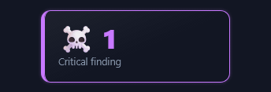
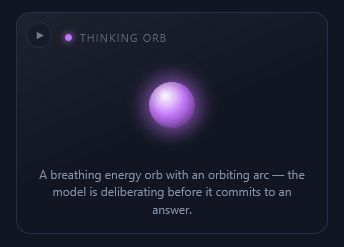
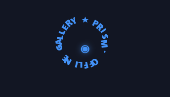
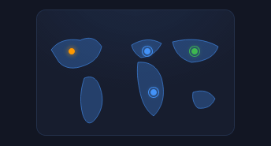
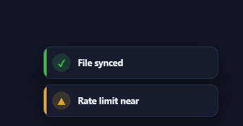
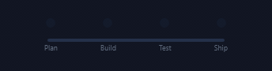
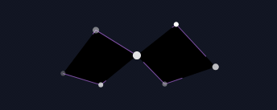

# ✦ Prism GIF showcase

A visual index of **every facet in Prism** — 2670 effects across 15 galleries, each recorded as a looping GIF from its own standalone HTML sample.

- **`gif/<id>.gif`** — the recording (dark theme, real browser render, looped).
- **`html/<id>.html`** — a self-contained sample page: Prism tokens + the effect's HTML/CSS (+ its tiny JS initializer where needed). Open it locally in any browser; no network needed.
- **`galleries/*.md`** — browsable pages, one per gallery, grouped by category.
- **`manifest.json`** — what was recorded (size, frames, duration) so tooling can consume the suite too.

Stats: 2413 animated · 257 static (single-frame GIF) · 57.5 MB total · 10 fps, 1.6–4 s per clip · rendered by Firefox (WebDriver BiDi) 155.0.1 · generated 2026-09-04.

> GIFs are for **display only** — they are not part of the Prism library or the MCP catalog. The authoritative, paste-ready source of every effect remains the `#prism-catalog` island in `Prism.html`.

## Galleries

<table>
<tr><td align="center" valign="top" width="33%"><a href="galleries/charts.md"></a><br><b><a href="galleries/charts.md">Charts &amp; Metrics</a></b><br><sub>209 effects</sub></td><td align="center" valign="top" width="33%"><a href="galleries/fx.md"></a><br><b><a href="galleries/fx.md">FX Store</a></b><br><sub>148 effects</sub></td><td align="center" valign="top" width="33%"><a href="galleries/lab.md"></a><br><b><a href="galleries/lab.md">Animation Lab</a></b><br><sub>217 effects</sub></td></tr>
<tr><td align="center" valign="top" width="33%"><a href="galleries/ai.md"></a><br><b><a href="galleries/ai.md">AI Working</a></b><br><sub>118 effects</sub></td><td align="center" valign="top" width="33%"><a href="galleries/objects.md"></a><br><b><a href="galleries/objects.md">Animated Objects</a></b><br><sub>91 effects</sub></td><td align="center" valign="top" width="33%"><a href="galleries/input.md"></a><br><b><a href="galleries/input.md">Input Methods</a></b><br><sub>101 effects</sub></td></tr>
<tr><td align="center" valign="top" width="33%"><a href="galleries/text.md"></a><br><b><a href="galleries/text.md">Text Effects</a></b><br><sub>100 effects</sub></td><td align="center" valign="top" width="33%"><a href="galleries/shapes.md"></a><br><b><a href="galleries/shapes.md">Text Shapes</a></b><br><sub>53 effects</sub></td><td align="center" valign="top" width="33%"><a href="galleries/maps.md"></a><br><b><a href="galleries/maps.md">Maps &amp; Geo</a></b><br><sub>50 effects</sub></td></tr>
<tr><td align="center" valign="top" width="33%"><a href="galleries/notify.md"></a><br><b><a href="galleries/notify.md">Notifications &amp; Status</a></b><br><sub>50 effects</sub></td><td align="center" valign="top" width="33%"><a href="galleries/arch.md"></a><br><b><a href="galleries/arch.md">Architecture Diagrams</a></b><br><sub>50 effects</sub></td><td align="center" valign="top" width="33%"><a href="galleries/callouts.md"></a><br><b><a href="galleries/callouts.md">Callouts &amp; Annotations</a></b><br><sub>50 effects</sub></td></tr>
<tr><td align="center" valign="top" width="33%"><a href="galleries/obsidian.md"></a><br><b><a href="galleries/obsidian.md">Obsidian Facets</a></b><br><sub>130 effects</sub></td><td align="center" valign="top" width="33%"><a href="galleries/menus.md"></a><br><b><a href="galleries/menus.md">Menus &amp; Actions</a></b><br><sub>37 effects</sub></td><td align="center" valign="top" width="33%"><a href="galleries/spectrums.md"></a><br><b><a href="galleries/spectrums.md">Spectrums</a></b><br><sub>1266 effects · 19 design-system families</sub></td></tr>
</table>

## Regenerating

From the repo root (needs Node 18+, Firefox 129+ or a Chromium-family browser, and `ffmpeg` on `PATH`):

```bash
node showcase/build.mjs                       # record whatever is missing, then rebuild the docs
node showcase/build.mjs --force               # re-record everything
node showcase/build.mjs --browser chrome      # force an engine (default auto: Firefox, else Chromium)
node showcase/build.mjs docs                  # only rebuild README / gallery pages / index.html from manifest.json
node showcase/build.mjs --gallery charts,fx --workers 4
```

The builder reads the catalog island straight out of `Prism.html`, writes one sample page per effect, drives a headless browser over its native wire protocol with no npm dependencies (Firefox via **WebDriver BiDi**, Chromium via **CDP** — see [`browsers.mjs`](browsers.mjs)), captures frames from the sample's stage, and encodes each clip with a per-GIF palette. Clip length is derived from the longest `animation` / `transition` duration the effect declares, clamped to the range above.

Also see [`index.html`](index.html) — an offline, filterable browser for the whole suite.
