# AI Working

Every effect in Prism's **AI Working** gallery, recorded as a looping GIF.

**118 effects** · 118 animated · 8.4 MB of GIF · click any GIF to open its standalone HTML sample (raw file; open it locally, GitHub shows source).

[← Showcase index](../README.md)

**Sections:** [Core working states](#core-working-states) · [Streaming & token output](#streaming-token-output) · [Reasoning & planning](#reasoning-planning) · [Tools, retrieval & agents](#tools-retrieval-agents) · [Spinners, latency & media](#spinners-latency-media) · [Futuristic & next](#futuristic-next) · [New](#new) · [3D & Spatial](#3d-spatial) · [Model Internals & Agent Runtime](#model-internals-agent-runtime)

## Core working states

<table>
<tr><td align="center" valign="top" width="33%"><a href="../html/ai-parallel-agents.html">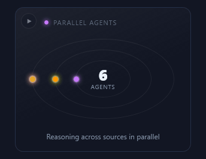</a> <b>Parallel agents</b> <code>ai-parallel-agents</code></td><td align="center" valign="top" width="33%"><a href="../html/ai-thinking.html">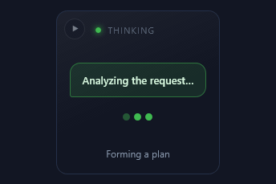</a> <b>Thinking</b> <code>ai-thinking</code></td><td align="center" valign="top" width="33%"><a href="../html/ai-processing.html">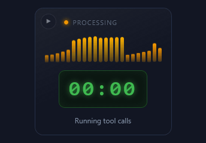</a> <b>Processing</b> <code>ai-processing</code></td></tr>
<tr><td align="center" valign="top" width="33%"><a href="../html/ai-task-queue.html">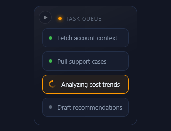</a> <b>Task queue</b> <code>ai-task-queue</code></td><td align="center" valign="top" width="33%"><a href="../html/ai-working-through-items.html">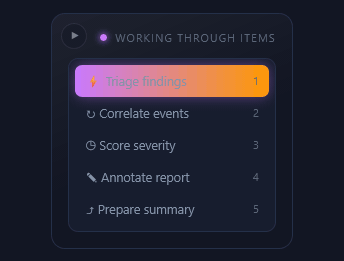</a> <b>Working through items</b> <code>ai-working-through-items</code></td><td align="center" valign="top" width="33%"><a href="../html/ai-ingesting.html">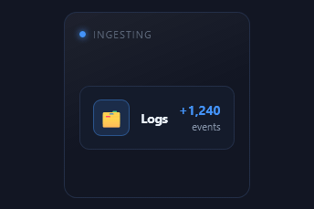</a> <b>Ingesting</b> <code>ai-ingesting</code></td></tr>
<tr><td align="center" valign="top" width="33%"><a href="../html/ai-indexing.html">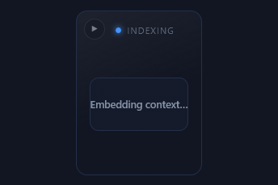</a> <b>Indexing</b> <code>ai-indexing</code></td><td align="center" valign="top" width="33%"><a href="../html/ai-synthesizing.html">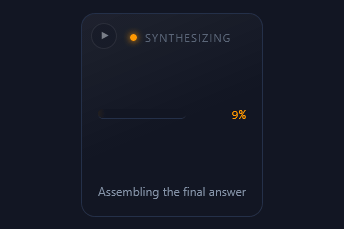</a> <b>Synthesizing</b> <code>ai-synthesizing</code></td><td align="center" valign="top" width="33%"><a href="../html/ai-text-only-minimal.html">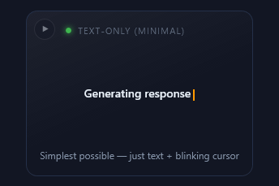</a> <b>Text-only (minimal)</b> <code>ai-text-only-minimal</code></td></tr>
<tr><td align="center" valign="top" width="33%"><a href="../html/ai-status-line.html">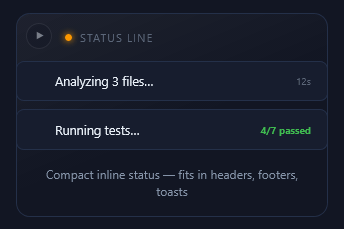</a> <b>Status Line</b> <code>ai-status-line</code></td><td align="center" valign="top" width="33%"><a href="../html/ai-service-pulse.html">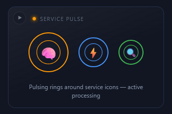</a> <b>Service Pulse</b> <code>ai-service-pulse</code></td><td align="center" valign="top" width="33%"><a href="../html/ai-dna-helix.html">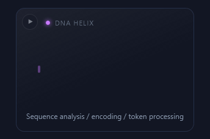</a> <b>DNA Helix</b> <code>ai-dna-helix</code></td></tr>
<tr><td align="center" valign="top" width="33%"><a href="../html/ai-neural-network.html">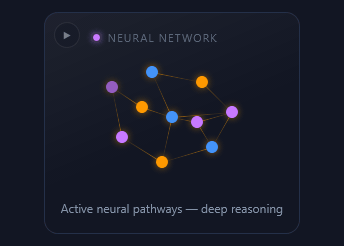</a> <b>Neural Network</b> <code>ai-neural-network</code></td><td align="center" valign="top" width="33%"><a href="../html/ai-token-stream.html">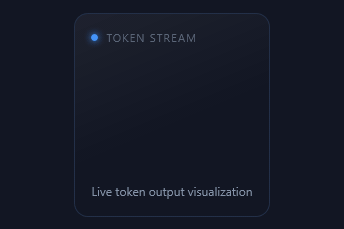</a> <b>Token Stream</b> <code>ai-token-stream</code></td><td align="center" valign="top" width="33%"><a href="../html/ai-processing-orb.html">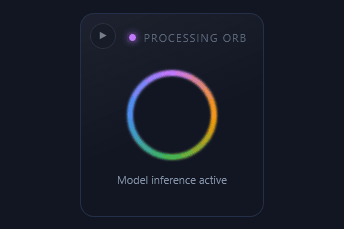</a> <b>Processing Orb</b> <code>ai-processing-orb</code></td></tr>
<tr><td align="center" valign="top" width="33%"><a href="../html/ai-audio-waveform.html">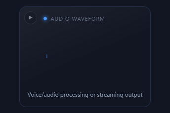</a> <b>Audio Waveform</b> <code>ai-audio-waveform</code></td><td align="center" valign="top" width="33%"><a href="../html/ai-service-pipeline.html">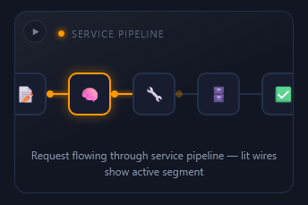</a> <b>Service Pipeline</b> <code>ai-service-pipeline</code></td><td align="center" valign="top" width="33%"><a href="../html/ai-matrix-code-rain.html">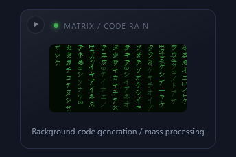</a> <b>Matrix / Code Rain</b> <code>ai-matrix-code-rain</code></td></tr>
<tr><td align="center" valign="top" width="33%"><a href="../html/ai-circular-progress.html">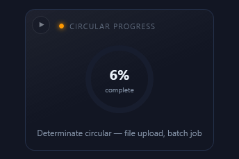</a> <b>Circular Progress</b> <code>ai-circular-progress</code></td><td align="center" valign="top" width="33%"><a href="../html/ai-multi-model-race.html">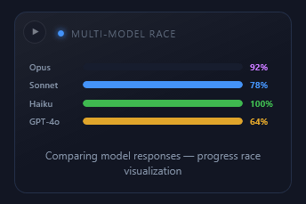</a> <b>Multi-Model Race</b> <code>ai-multi-model-race</code></td><td align="center" valign="top" width="33%"><a href="../html/ai-breathing-dots.html">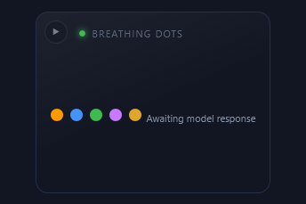</a> <b>Breathing Dots</b> <code>ai-breathing-dots</code></td></tr>
<tr><td align="center" valign="top" width="33%"><a href="../html/ai-typewriter-stats.html">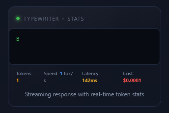</a> <b>Typewriter + Stats</b> <code>ai-typewriter-stats</code></td><td align="center" valign="top" width="33%"><a href="../html/ai-particle-burst.html">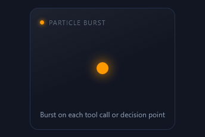</a> <b>Particle Burst</b> <code>ai-particle-burst</code></td><td align="center" valign="top" width="33%"><a href="../html/ai-aws-service-pipeline.html">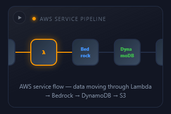</a> <b>AWS Service Pipeline</b> <code>ai-aws-service-pipeline</code></td></tr>
</table>

## Streaming & token output

<table>
<tr><td align="center" valign="top" width="33%"><a href="../html/ai-streaming-reply.html">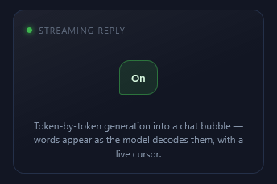</a> <b>Streaming reply</b> <code>ai-streaming-reply</code></td><td align="center" valign="top" width="33%"><a href="../html/ai-streaming-markdown.html">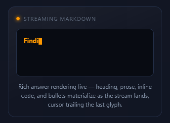</a> <b>Streaming Markdown</b> <code>ai-streaming-markdown</code></td><td align="center" valign="top" width="33%"><a href="../html/ai-structured-output-json.html">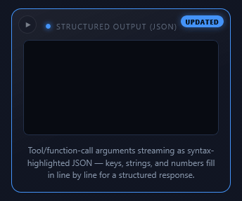</a> <b>Structured Output (JSON)</b> <code>ai-structured-output-json</code></td></tr>
<tr><td align="center" valign="top" width="33%"><a href="../html/ai-skeleton-reply.html">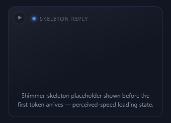</a> <b>Skeleton Reply</b> <code>ai-skeleton-reply</code></td><td align="center" valign="top" width="33%"><a href="../html/ai-chat-transcript.html">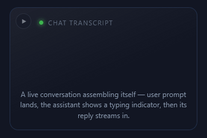</a> <b>Chat Transcript</b> <code>ai-chat-transcript</code></td><td align="center" valign="top" width="33%"><a href="../html/ai-code-diff-generation.html">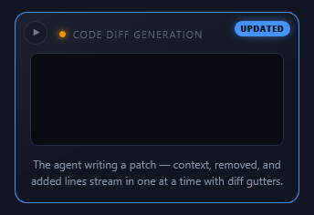</a> <b>Code Diff Generation</b> <code>ai-code-diff-generation</code></td></tr>
</table>

## Reasoning & planning

<table>
<tr><td align="center" valign="top" width="33%"><a href="../html/ai-reasoning.html">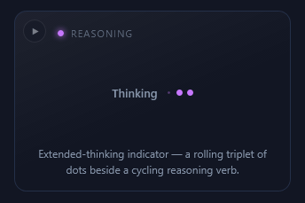</a> <b>Reasoning</b> <code>ai-reasoning</code></td><td align="center" valign="top" width="33%"> <b>Thinking Orb</b> <code>ai-thinking-orb</code></td><td align="center" valign="top" width="33%"><a href="../html/ai-agent-step-timeline.html">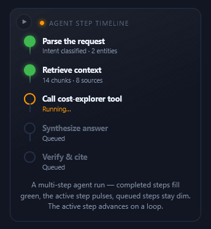</a> <b>Agent Step Timeline</b> <code>ai-agent-step-timeline</code></td></tr>
<tr><td align="center" valign="top" width="33%"><a href="../html/ai-planning-tree.html">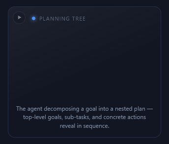</a> <b>Planning Tree</b> <code>ai-planning-tree</code></td><td align="center" valign="top" width="33%"><a href="../html/ai-self-correct-retry.html">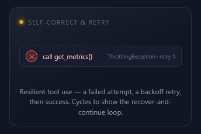</a> <b>Self-Correct &amp; Retry</b> <code>ai-self-correct-retry</code></td><td align="center" valign="top" width="33%"><a href="../html/ai-confidence-meter.html">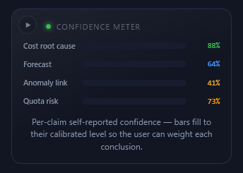</a> <b>Confidence Meter</b> <code>ai-confidence-meter</code></td></tr>
</table>

## Tools, retrieval & agents

<table>
<tr><td align="center" valign="top" width="33%"><a href="../html/ai-tool-call-chips.html">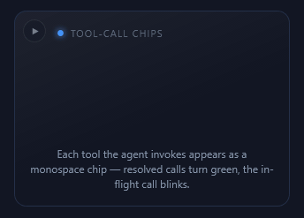</a> <b>Tool-Call Chips</b> <code>ai-tool-call-chips</code></td><td align="center" valign="top" width="33%"><a href="../html/ai-rag-citations.html">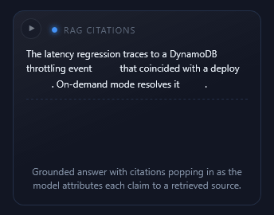</a> <b>RAG Citations</b> <code>ai-rag-citations</code></td><td align="center" valign="top" width="33%"><a href="../html/ai-multi-agent-handoff.html">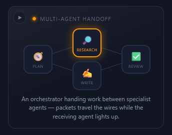</a> <b>Multi-Agent Handoff</b> <code>ai-multi-agent-handoff</code></td></tr>
<tr><td align="center" valign="top" width="33%"><a href="../html/ai-vector-retrieval.html">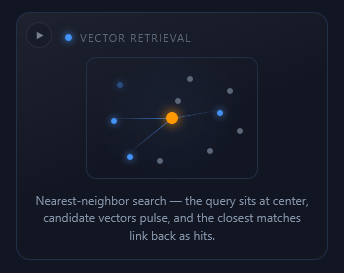</a> <b>Vector Retrieval</b> <code>ai-vector-retrieval</code></td><td align="center" valign="top" width="33%"><a href="../html/ai-knowledge-sweep.html">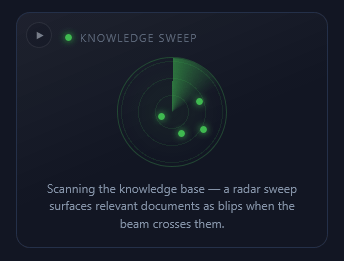</a> <b>Knowledge Sweep</b> <code>ai-knowledge-sweep</code></td><td align="center" valign="top" width="33%"><a href="../html/ai-embedding-heatmap.html">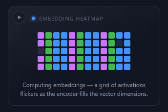</a> <b>Embedding Heatmap</b> <code>ai-embedding-heatmap</code></td></tr>
<tr><td align="center" valign="top" width="33%"><a href="../html/ai-guardrail-scan.html">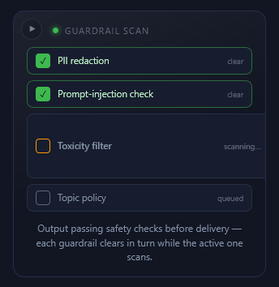</a> <b>Guardrail Scan</b> <code>ai-guardrail-scan</code></td><td align="center" valign="top" width="33%"><a href="../html/ai-context-window.html">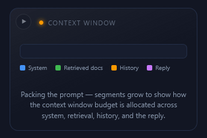</a> <b>Context Window</b> <code>ai-context-window</code></td></tr>
</table>

## Spinners, latency & media

<table>
<tr><td align="center" valign="top" width="33%"><a href="../html/ai-latency-spinners.html">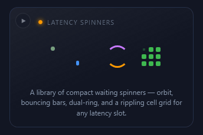</a> <b>Latency Spinners</b> <code>ai-latency-spinners</code></td><td align="center" valign="top" width="33%"><a href="../html/ai-generating-image.html">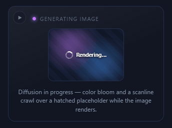</a> <b>Generating Image</b> <code>ai-generating-image</code></td></tr>
</table>

## Futuristic & next

<table>
<tr><td align="center" valign="top" width="33%"><a href="../html/ai-prism-scanner.html">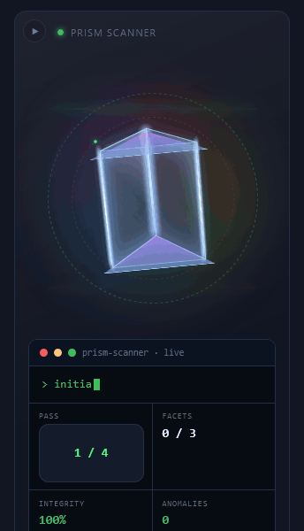</a> <b>Prism Scanner</b> <code>ai-prism-scanner</code></td><td align="center" valign="top" width="33%"><a href="../html/ai-neural-propagation.html">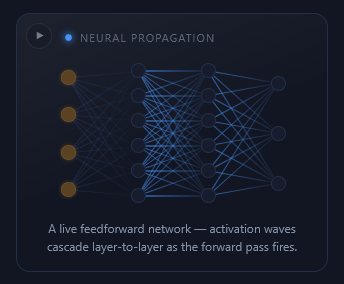</a> <b>Neural Propagation</b> <code>ai-neural-propagation</code></td><td align="center" valign="top" width="33%"><a href="../html/ai-self-attention.html">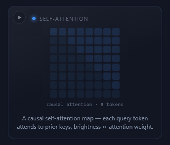</a> <b>Self-Attention</b> <code>ai-self-attention</code></td></tr>
<tr><td align="center" valign="top" width="33%"><a href="../html/ai-diffusion-denoise.html">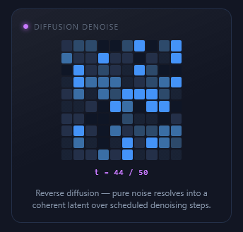</a> <b>Diffusion Denoise</b> <code>ai-diffusion-denoise</code></td><td align="center" valign="top" width="33%"><a href="../html/ai-next-token-sampling.html">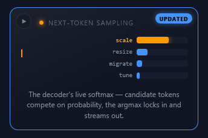</a> <b>Next-Token Sampling</b> <code>ai-next-token-sampling</code></td><td align="center" valign="top" width="33%"> <b>Data Hologram</b> <code>ai-data-hologram</code></td></tr>
<tr><td align="center" valign="top" width="33%"> <b>Beam Search</b> <code>ai-beam-search</code></td><td align="center" valign="top" width="33%"> <b>Qubit Collapse</b> <code>ai-qubit-collapse</code></td><td align="center" valign="top" width="33%"> <b>Compute Core</b> <code>ai-compute-core</code></td></tr>
<tr><td align="center" valign="top" width="33%"> <b>Mixture-of-Experts</b> <code>ai-mixture-of-experts</code></td></tr>
</table>

## New

<table>
<tr><td align="center" valign="top" width="33%"> <b>Streaming Reply</b> <code>ai-streaming-reply-2</code></td><td align="center" valign="top" width="33%"> <b>Token Waterfall</b> <code>ai-token-waterfall</code></td><td align="center" valign="top" width="33%"> <b>Context Window</b> <code>ai-context-window-2</code></td></tr>
<tr><td align="center" valign="top" width="33%"> <b>Embedding Field</b> <code>ai-embedding-field</code></td><td align="center" valign="top" width="33%"> <b>Cosine Similarity</b> <code>ai-cosine-similarity</code></td><td align="center" valign="top" width="33%"> <b>Guardrail Scan</b> <code>ai-guardrail-scan-2</code></td></tr>
<tr><td align="center" valign="top" width="33%"> <b>Fact Check</b> <code>ai-fact-check</code></td><td align="center" valign="top" width="33%"> <b>Temperature</b> <code>ai-temperature</code></td><td align="center" valign="top" width="33%"> <b>Top-p Nucleus</b> <code>ai-top-p-nucleus</code></td></tr>
<tr><td align="center" valign="top" width="33%"> <b>Chain of Thought</b> <code>ai-chain-of-thought</code></td><td align="center" valign="top" width="33%"> <b>Tool Router</b> <code>ai-tool-router</code></td><td align="center" valign="top" width="33%"> <b>Speculative Decode</b> <code>ai-speculative-decode</code></td></tr>
<tr><td align="center" valign="top" width="33%"> <b>Vector Store</b> <code>ai-vector-store</code></td><td align="center" valign="top" width="33%"> <b>Rerank</b> <code>ai-rerank</code></td><td align="center" valign="top" width="33%"> <b>Latency ECG</b> <code>ai-latency-ecg</code></td></tr>
<tr><td align="center" valign="top" width="33%"> <b>Cache Hits</b> <code>ai-cache-hits</code></td><td align="center" valign="top" width="33%"> <b>Memory Write</b> <code>ai-memory-write</code></td><td align="center" valign="top" width="33%"> <b>Confidence</b> <code>ai-confidence</code></td></tr>
<tr><td align="center" valign="top" width="33%"> <b>Model Warm-Up</b> <code>ai-model-warm-up</code></td><td align="center" valign="top" width="33%"> <b>Multimodal Fuse</b> <code>ai-multimodal-fuse</code></td><td align="center" valign="top" width="33%"> <b>Knowledge Graph</b> <code>ai-knowledge-graph</code></td></tr>
<tr><td align="center" valign="top" width="33%"> <b>Quantization</b> <code>ai-quantization</code></td><td align="center" valign="top" width="33%"> <b>Training Loss</b> <code>ai-training-loss</code></td><td align="center" valign="top" width="33%"> <b>Injection Block</b> <code>ai-injection-block</code></td></tr>
<tr><td align="center" valign="top" width="33%"> <b>Batch Inference</b> <code>ai-batch-inference</code></td><td align="center" valign="top" width="33%"> <b>Thinking Blob</b> <code>ai-thinking-blob</code></td><td align="center" valign="top" width="33%"> <b>Retrieval Funnel</b> <code>ai-retrieval-funnel</code></td></tr>
<tr><td align="center" valign="top" width="33%"> <b>Attention Beams</b> <code>ai-attention-beams</code></td><td align="center" valign="top" width="33%"> <b>Safety Sieve</b> <code>ai-safety-sieve</code></td><td align="center" valign="top" width="33%"> <b>Voice Waveform</b> <code>ai-voice-waveform</code></td></tr>
<tr><td align="center" valign="top" width="33%"> <b>Agent Handshake</b> <code>ai-agent-handshake</code></td><td align="center" valign="top" width="33%"> <b>Sentiment</b> <code>ai-sentiment</code></td></tr>
</table>

## 3D & Spatial

<table>
<tr><td align="center" valign="top" width="33%"> <b>Embedding Cube</b> <code>ai-embedding-cube</code></td><td align="center" valign="top" width="33%"> <b>Attention Layer Stack</b> <code>ai-attention-layer-stack</code></td><td align="center" valign="top" width="33%"> <b>Knowledge Globe</b> <code>ai-knowledge-globe</code></td></tr>
<tr><td align="center" valign="top" width="33%"> <b>Token Cylinder</b> <code>ai-token-cylinder</code></td><td align="center" valign="top" width="33%"> <b>Transformer Depth</b> <code>ai-transformer-depth</code></td><td align="center" valign="top" width="33%"> <b>Expert Grid (3D)</b> <code>ai-expert-grid-3d</code></td></tr>
</table>

## Model Internals & Agent Runtime

<table>
<tr><td align="center" valign="top" width="33%"> <b>MoE Expert Routing</b> <code>ai-moe-expert-routing</code></td><td align="center" valign="top" width="33%"> <b>KV-Cache Eviction</b> <code>ai-kv-cache-eviction</code></td><td align="center" valign="top" width="33%"> <b>Beam Search Tree</b> <code>ai-beam-search-tree</code></td></tr>
<tr><td align="center" valign="top" width="33%"> <b>Logit Lens</b> <code>ai-logit-lens</code></td><td align="center" valign="top" width="33%"> <b>RLHF Reward</b> <code>ai-rlhf-reward</code></td><td align="center" valign="top" width="33%"> <b>Speculative Race</b> <code>ai-speculative-race</code></td></tr>
<tr><td align="center" valign="top" width="33%"> <b>Tool-Call Handshake</b> <code>ai-tool-call-handshake</code></td><td align="center" valign="top" width="33%"> <b>Guardrail Scan</b> <code>ai-guardrail-scan-3</code></td><td align="center" valign="top" width="33%"> <b>Hallucination Check</b> <code>ai-hallucination-check</code></td></tr>
<tr><td align="center" valign="top" width="33%"> <b>Context Gauge</b> <code>ai-context-gauge</code></td><td align="center" valign="top" width="33%"> <b>Throughput</b> <code>ai-throughput</code></td><td align="center" valign="top" width="33%"> <b>GPU Utilization</b> <code>ai-gpu-utilization</code></td></tr>
<tr><td align="center" valign="top" width="33%"> <b>Diffusion Denoise</b> <code>ai-diffusion-denoise-2</code></td><td align="center" valign="top" width="33%"> <b>Agent Planning Tree</b> <code>ai-agent-planning-tree</code></td><td align="center" valign="top" width="33%"> <b>Memory Read/Write</b> <code>ai-memory-read-write</code></td></tr>
<tr><td align="center" valign="top" width="33%"> <b>Embedding Drift</b> <code>ai-embedding-drift</code></td><td align="center" valign="top" width="33%"> <b>Semantic Cache Hit</b> <code>ai-semantic-cache-hit</code></td><td align="center" valign="top" width="33%"> <b>Prefill vs Decode</b> <code>ai-prefill-vs-decode</code></td></tr>
<tr><td align="center" valign="top" width="33%"> <b>Softmax Distribution</b> <code>ai-softmax-distribution</code></td><td align="center" valign="top" width="33%"> <b>Positional Encoding</b> <code>ai-positional-encoding</code></td><td align="center" valign="top" width="33%"> <b>LoRA Merge</b> <code>ai-lora-merge</code></td></tr>
<tr><td align="center" valign="top" width="33%"> <b>Rate-Limit Bucket</b> <code>ai-rate-limit-bucket</code></td><td align="center" valign="top" width="33%"> <b>Reflection Loop</b> <code>ai-reflection-loop</code></td><td align="center" valign="top" width="33%"> <b>Grammar-Constrained Decode</b> <code>ai-grammar-constrained-decode</code></td></tr>
</table>
