# Architecture Diagrams

Every effect in Prism's **Architecture Diagrams** gallery, recorded as a looping GIF.

**62 effects** · 62 animated · 1.6 MB of GIF · click any GIF to open its standalone HTML sample (raw file; open it locally, GitHub shows source).

[← Showcase index](../README.md)

**Sections:** [SERVICE NODES](#service-nodes) · [CONNECTORS & FLOWS](#connectors-flows) · [CONTAINERS & BOUNDARIES](#containers-boundaries) · [FULL MINI](#full-mini) · [SEQUENCE & FLOW DIAGRAMS](#sequence-flow-diagrams) · [TOPOLOGY & GRAPH](#topology-graph) · [AWS REFERENCE ARCHITECTURES](#aws-reference-architectures)

## SERVICE NODES

<table>
<tr><td align="center" valign="top" width="33%"> <b>Service Node</b> <code>arch-service-node</code></td><td align="center" valign="top" width="33%"> <b>Node with Status Dot</b> <code>arch-node-with-status-dot</code></td><td align="center" valign="top" width="33%"> <b>Compute / Lambda Node</b> <code>arch-compute-lambda-node</code></td></tr>
<tr><td align="center" valign="top" width="33%"> <b>Storage / Bucket Node</b> <code>arch-storage-bucket-node</code></td><td align="center" valign="top" width="33%"> <b>Database Cylinder</b> <code>arch-database-cylinder</code></td><td align="center" valign="top" width="33%"> <b>Queue Node</b> <code>arch-queue-node</code></td></tr>
<tr><td align="center" valign="top" width="33%"> <b>CDN Node</b> <code>arch-cdn-node</code></td><td align="center" valign="top" width="33%"> <b>User / Client Node</b> <code>arch-user-client-node</code></td><td align="center" valign="top" width="33%"> <b>Internet-Gateway Node</b> <code>arch-internet-gateway-node</code></td></tr>
<tr><td align="center" valign="top" width="33%"> <b>Container Node</b> <code>arch-container-node</code></td><td align="center" valign="top" width="33%"> <b>Monitoring Node</b> <code>arch-monitoring-node</code></td></tr>
</table>

## CONNECTORS & FLOWS

<table>
<tr><td align="center" valign="top" width="33%"> <b>Flowing Connector</b> <code>arch-flowing-connector</code></td><td align="center" valign="top" width="33%"> <b>Elbow Connector</b> <code>arch-elbow-connector</code></td><td align="center" valign="top" width="33%"> <b>Bidirectional Arrow</b> <code>arch-bidirectional-arrow</code></td></tr>
<tr><td align="center" valign="top" width="33%"> <b>Labeled Connector</b> <code>arch-labeled-connector</code></td><td align="center" valign="top" width="33%"> <b>Data Packet on the Wire</b> <code>arch-data-packet-on-the-wire</code></td><td align="center" valign="top" width="33%"> <b>Branching Connector</b> <code>arch-branching-connector</code></td></tr>
<tr><td align="center" valign="top" width="33%"> <b>Request / Response Pair</b> <code>arch-request-response-pair</code></td><td align="center" valign="top" width="33%"> <b>High-Throughput Stream</b> <code>arch-high-throughput-stream</code></td><td align="center" valign="top" width="33%"> <b>Peering Link</b> <code>arch-peering-link</code></td></tr>
</table>

## CONTAINERS & BOUNDARIES

<table>
<tr><td align="center" valign="top" width="33%"> <b>VPC Boundary</b> <code>arch-vpc-boundary</code></td><td align="center" valign="top" width="33%"> <b>Public / Private Subnets</b> <code>arch-public-private-subnets</code></td><td align="center" valign="top" width="33%"> <b>Account / Region Container</b> <code>arch-account-region-container</code></td></tr>
<tr><td align="center" valign="top" width="33%"> <b>Availability-Zone Group</b> <code>arch-availability-zone-group</code></td><td align="center" valign="top" width="33%"><a href="../html/arch-security-group-ring.html">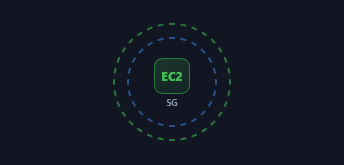</a> <b>Security-Group Ring</b> <code>arch-security-group-ring</code></td><td align="center" valign="top" width="33%"><a href="../html/arch-nested-container.html">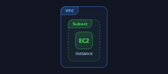</a> <b>Nested Container</b> <code>arch-nested-container</code></td></tr>
<tr><td align="center" valign="top" width="33%"><a href="../html/arch-multi-account-org.html">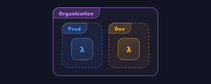</a> <b>Multi-Account Org</b> <code>arch-multi-account-org</code></td></tr>
</table>

## FULL MINI

<table>
<tr><td align="center" valign="top" width="33%"><a href="../html/arch-3-tier-web-architecture.html">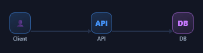</a> <b>3-Tier Web Architecture</b> <code>arch-3-tier-web-architecture</code></td><td align="center" valign="top" width="33%"><a href="../html/arch-serverless-flow.html">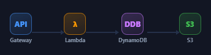</a> <b>Serverless Flow</b> <code>arch-serverless-flow</code></td><td align="center" valign="top" width="33%"><a href="../html/arch-load-balancer-fan-out.html">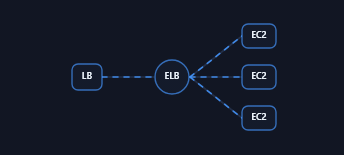</a> <b>Load Balancer Fan-out</b> <code>arch-load-balancer-fan-out</code></td></tr>
<tr><td align="center" valign="top" width="33%"><a href="../html/arch-event-driven-flow.html">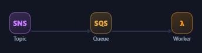</a> <b>Event-Driven Flow</b> <code>arch-event-driven-flow</code></td><td align="center" valign="top" width="33%"><a href="../html/arch-multi-az-deployment.html">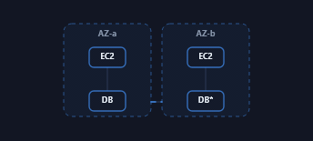</a> <b>Multi-AZ Deployment</b> <code>arch-multi-az-deployment</code></td><td align="center" valign="top" width="33%"><a href="../html/arch-ci-cd-pipeline.html">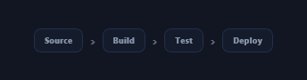</a> <b>CI/CD Pipeline</b> <code>arch-ci-cd-pipeline</code></td></tr>
<tr><td align="center" valign="top" width="33%"><a href="../html/arch-edge-cdn-path.html">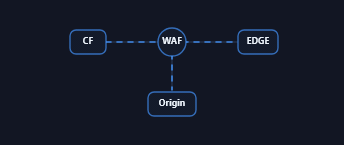</a> <b>Edge / CDN Path</b> <code>arch-edge-cdn-path</code></td><td align="center" valign="top" width="33%"><a href="../html/arch-vertical-stack-diagram.html">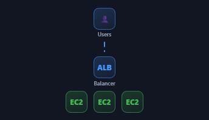</a> <b>Vertical Stack Diagram</b> <code>arch-vertical-stack-diagram</code></td><td align="center" valign="top" width="33%"><a href="../html/arch-streaming-data-pipeline.html">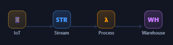</a> <b>Streaming Data Pipeline</b> <code>arch-streaming-data-pipeline</code></td></tr>
</table>

## SEQUENCE & FLOW DIAGRAMS

<table>
<tr><td align="center" valign="top" width="33%"><a href="../html/arch-sequence-diagram.html">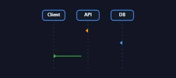</a> <b>Sequence Diagram</b> <code>arch-sequence-diagram</code></td><td align="center" valign="top" width="33%"><a href="../html/arch-decision-flowchart.html">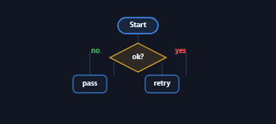</a> <b>Decision Flowchart</b> <code>arch-decision-flowchart</code></td><td align="center" valign="top" width="33%"><a href="../html/arch-state-machine.html">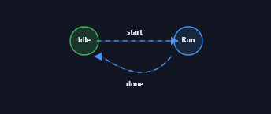</a> <b>State Machine</b> <code>arch-state-machine</code></td></tr>
<tr><td align="center" valign="top" width="33%"><a href="../html/arch-swimlane-flow.html">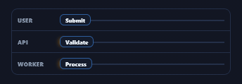</a> <b>Swimlane Flow</b> <code>arch-swimlane-flow</code></td><td align="center" valign="top" width="33%"><a href="../html/arch-branch-decision-tree.html">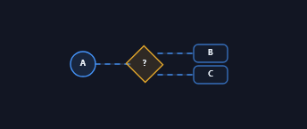</a> <b>Branch Decision Tree</b> <code>arch-branch-decision-tree</code></td><td align="center" valign="top" width="33%"><a href="../html/arch-sequence-with-activation.html">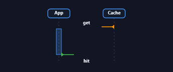</a> <b>Sequence with Activation</b> <code>arch-sequence-with-activation</code></td></tr>
<tr><td align="center" valign="top" width="33%"><a href="../html/arch-workflow-state-graph.html">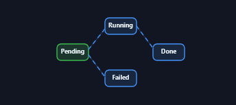</a> <b>Workflow State Graph</b> <code>arch-workflow-state-graph</code></td></tr>
</table>

## TOPOLOGY & GRAPH

<table>
<tr><td align="center" valign="top" width="33%"><a href="../html/arch-hub-spoke-topology.html">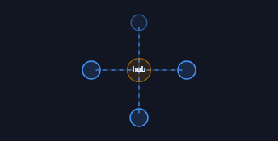</a> <b>Hub &amp; Spoke Topology</b> <code>arch-hub-spoke-topology</code></td><td align="center" valign="top" width="33%"><a href="../html/arch-mesh-network.html">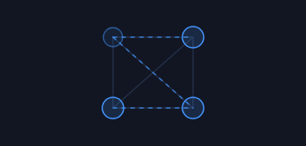</a> <b>Mesh Network</b> <code>arch-mesh-network</code></td><td align="center" valign="top" width="33%"><a href="../html/arch-dependency-graph.html">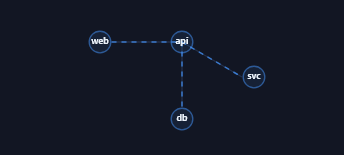</a> <b>Dependency Graph</b> <code>arch-dependency-graph</code></td></tr>
<tr><td align="center" valign="top" width="33%"><a href="../html/arch-tree-org-hierarchy.html">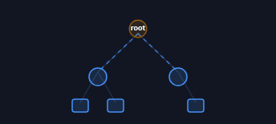</a> <b>Tree / Org Hierarchy</b> <code>arch-tree-org-hierarchy</code></td><td align="center" valign="top" width="33%"><a href="../html/arch-ring-topology.html">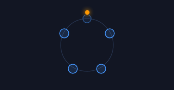</a> <b>Ring Topology</b> <code>arch-ring-topology</code></td><td align="center" valign="top" width="33%"><a href="../html/arch-star-topology.html">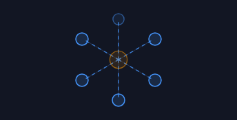</a> <b>Star Topology</b> <code>arch-star-topology</code></td></tr>
<tr><td align="center" valign="top" width="33%"><a href="../html/arch-network-segments.html">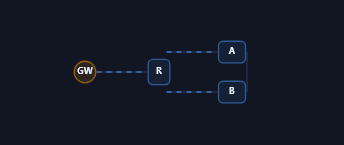</a> <b>Network Segments</b> <code>arch-network-segments</code></td></tr>
</table>

## AWS REFERENCE ARCHITECTURES

<table>
<tr><td align="center" valign="top" width="33%"><a href="../html/arch-web-hosting.html">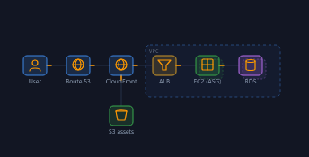</a> <b>Web Hosting</b> <code>arch-web-hosting</code></td><td align="center" valign="top" width="33%"><a href="../html/arch-serverless-api.html">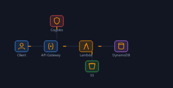</a> <b>Serverless API</b> <code>arch-serverless-api</code></td><td align="center" valign="top" width="33%"><a href="../html/arch-scheduled-job.html">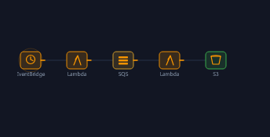</a> <b>Scheduled Job</b> <code>arch-scheduled-job</code></td></tr>
<tr><td align="center" valign="top" width="33%"><a href="../html/arch-3-tier-in-a-vpc.html">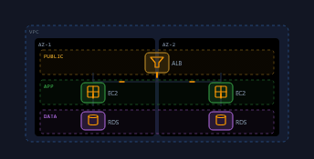</a> <b>3-Tier in a VPC</b> <code>arch-3-tier-in-a-vpc</code></td><td align="center" valign="top" width="33%"><a href="../html/arch-public-and-private-subnets.html">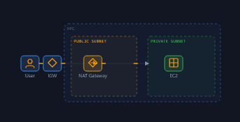</a> <b>Public and Private Subnets</b> <code>arch-public-and-private-subnets</code></td><td align="center" valign="top" width="33%"><a href="../html/arch-high-availability-multi-az.html">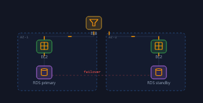</a> <b>High Availability Multi-AZ</b> <code>arch-high-availability-multi-az</code></td></tr>
<tr><td align="center" valign="top" width="33%"><a href="../html/arch-event-driven-fan-out.html">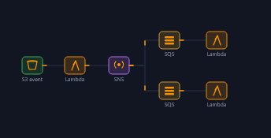</a> <b>Event-Driven Fan-Out</b> <code>arch-event-driven-fan-out</code></td><td align="center" valign="top" width="33%"><a href="../html/arch-data-lake-analytics.html">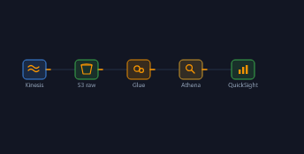</a> <b>Data Lake Analytics</b> <code>arch-data-lake-analytics</code></td><td align="center" valign="top" width="33%"><a href="../html/arch-microservices-on-ecs.html">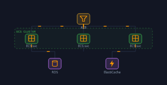</a> <b>Microservices on ECS</b> <code>arch-microservices-on-ecs</code></td></tr>
<tr><td align="center" valign="top" width="33%"><a href="../html/arch-ci-cd-pipeline-2.html">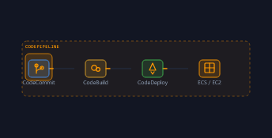</a> <b>CI/CD Pipeline</b> <code>arch-ci-cd-pipeline-2</code></td><td align="center" valign="top" width="33%"><a href="../html/arch-multi-region-dr.html">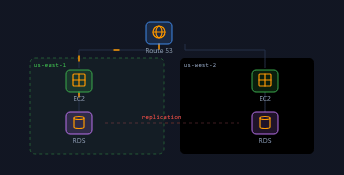</a> <b>Multi-Region DR</b> <code>arch-multi-region-dr</code></td><td align="center" valign="top" width="33%"><a href="../html/arch-hybrid-vpn-link.html">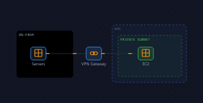</a> <b>Hybrid VPN Link</b> <code>arch-hybrid-vpn-link</code></td></tr>
</table>
