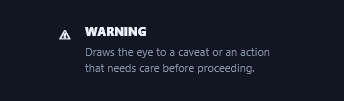
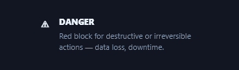
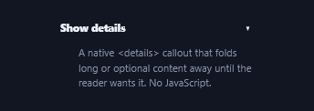
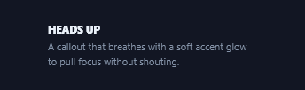
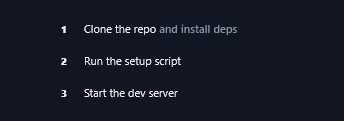
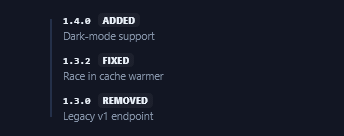
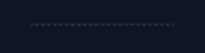
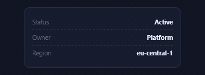
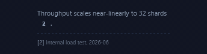

# Callouts & Annotations

Every effect in Prism's **Callouts & Annotations** gallery, recorded as a looping GIF.

**50 effects** · 15 animated · 107 KB of GIF · click any GIF to open its standalone HTML sample (raw file; open it locally, GitHub shows source).

[← Showcase index](../README.md)

**Sections:** [CALLOUT / ADMONITION BLOCKS](#callout-admonition-blocks) · [BADGES & PILLS](#badges-pills) · [TIMELINES & STEPPERS](#timelines-steppers) · [DIVIDERS & SECTION MARKS](#dividers-section-marks) · [TOOLTIPS & ANNOTATIONS](#tooltips-annotations) · [KEY](#key)

## CALLOUT / ADMONITION BLOCKS

<table>
<tr><td align="center" valign="top" width="33%"> <b>Note Callout</b> <code>callouts-note-callout</code> · static</td><td align="center" valign="top" width="33%"> <b>Tip Callout</b> <code>callouts-tip-callout</code> · static</td><td align="center" valign="top" width="33%"> <b>Info Callout</b> <code>callouts-info-callout</code> · static</td></tr>
<tr><td align="center" valign="top" width="33%"> <b>Warning Callout</b> <code>callouts-warning-callout</code> · static</td><td align="center" valign="top" width="33%"> <b>Danger Callout</b> <code>callouts-danger-callout</code> · static</td><td align="center" valign="top" width="33%"> <b>Success Callout</b> <code>callouts-success-callout</code> · static</td></tr>
<tr><td align="center" valign="top" width="33%"> <b>Collapsible Callout</b> <code>callouts-collapsible-callout</code></td><td align="center" valign="top" width="33%"> <b>Quote Callout</b> <code>callouts-quote-callout</code> · static</td><td align="center" valign="top" width="33%"> <b>Key Takeaway</b> <code>callouts-key-takeaway</code></td></tr>
<tr><td align="center" valign="top" width="33%"> <b>Glow Callout</b> <code>callouts-glow-callout</code></td></tr>
</table>

## BADGES & PILLS

<table>
<tr><td align="center" valign="top" width="33%"> <b>Status Badges</b> <code>callouts-status-badges</code> · static</td><td align="center" valign="top" width="33%"> <b>Version Pill</b> <code>callouts-version-pill</code> · static</td><td align="center" valign="top" width="33%"> <b>Count Badge</b> <code>callouts-count-badge</code> · static</td></tr>
<tr><td align="center" valign="top" width="33%"> <b>Category Tag</b> <code>callouts-category-tag</code> · static</td><td align="center" valign="top" width="33%"> <b>Dismissible Chip</b> <code>callouts-dismissible-chip</code></td><td align="center" valign="top" width="33%"> <b>Gradient Badge</b> <code>callouts-gradient-badge</code></td></tr>
<tr><td align="center" valign="top" width="33%"> <b>Live Pill</b> <code>callouts-live-pill</code></td><td align="center" valign="top" width="33%"> <b>Delta Badge</b> <code>callouts-delta-badge</code> · static</td><td align="center" valign="top" width="33%"> <b>Segmented Tags</b> <code>callouts-segmented-tags</code> · static</td></tr>
<tr><td align="center" valign="top" width="33%"> <b>Outline Pill</b> <code>callouts-outline-pill</code> · static</td></tr>
</table>

## TIMELINES & STEPPERS

<table>
<tr><td align="center" valign="top" width="33%"> <b>Vertical Timeline</b> <code>callouts-vertical-timeline</code> · static</td><td align="center" valign="top" width="33%"> <b>Horizontal Stepper</b> <code>callouts-horizontal-stepper</code></td><td align="center" valign="top" width="33%"> <b>Numbered Process</b> <code>callouts-numbered-process</code> · static</td></tr>
<tr><td align="center" valign="top" width="33%"> <b>Milestone Timeline</b> <code>callouts-milestone-timeline</code> · static</td><td align="center" valign="top" width="33%"> <b>Changelog Timeline</b> <code>callouts-changelog-timeline</code> · static</td><td align="center" valign="top" width="33%"> <b>Progress Stepper</b> <code>callouts-progress-stepper</code></td></tr>
<tr><td align="center" valign="top" width="33%"> <b>Activity Feed</b> <code>callouts-activity-feed</code> · static</td><td align="center" valign="top" width="33%"> <b>Branch Timeline</b> <code>callouts-branch-timeline</code> · static</td></tr>
</table>

## DIVIDERS & SECTION MARKS

<table>
<tr><td align="center" valign="top" width="33%"> <b>Labeled Divider</b> <code>callouts-labeled-divider</code> · static</td><td align="center" valign="top" width="33%"> <b>Gradient Rule</b> <code>callouts-gradient-rule</code></td><td align="center" valign="top" width="33%"> <b>Dotted Divider</b> <code>callouts-dotted-divider</code> · static</td></tr>
<tr><td align="center" valign="top" width="33%"> <b>Icon Divider</b> <code>callouts-icon-divider</code> · static</td><td align="center" valign="top" width="33%"> <b>&quot;Or&quot; Divider</b> <code>callouts-or-divider</code> · static</td><td align="center" valign="top" width="33%"> <b>Fade Rule</b> <code>callouts-fade-rule</code> · static</td></tr>
<tr><td align="center" valign="top" width="33%"> <b>Zigzag Rule</b> <code>callouts-zigzag-rule</code> · static</td></tr>
</table>

## TOOLTIPS & ANNOTATIONS

<table>
<tr><td align="center" valign="top" width="33%"> <b>Hover Tooltip</b> <code>callouts-hover-tooltip</code></td><td align="center" valign="top" width="33%"> <b>Pointer Annotation</b> <code>callouts-pointer-annotation</code> · static</td><td align="center" valign="top" width="33%"> <b>Footnote Popover</b> <code>callouts-footnote-popover</code></td></tr>
<tr><td align="center" valign="top" width="33%"> <b>Keyboard Hint</b> <code>callouts-keyboard-hint</code> · static</td><td align="center" valign="top" width="33%"> <b>Marker Highlight</b> <code>callouts-marker-highlight</code></td><td align="center" valign="top" width="33%"> <b>Nudge Arrow</b> <code>callouts-nudge-arrow</code></td></tr>
<tr><td align="center" valign="top" width="33%"> <b>Spotlight Annotation</b> <code>callouts-spotlight-annotation</code></td><td align="center" valign="top" width="33%"> <b>Leader-Line Caption</b> <code>callouts-leader-line-caption</code> · static</td></tr>
</table>

## KEY

<table>
<tr><td align="center" valign="top" width="33%"> <b>Key/Value Chips</b> <code>callouts-key-value-chips</code> · static</td><td align="center" valign="top" width="33%"> <b>Definition List</b> <code>callouts-definition-list</code> · static</td><td align="center" valign="top" width="33%"> <b>Stat Callout</b> <code>callouts-stat-callout</code> · static</td></tr>
<tr><td align="center" valign="top" width="33%"> <b>Metadata Bar</b> <code>callouts-metadata-bar</code> · static</td><td align="center" valign="top" width="33%"> <b>Last-Updated Stamp</b> <code>callouts-last-updated-stamp</code></td><td align="center" valign="top" width="33%"> <b>Attribution Line</b> <code>callouts-attribution-line</code> · static</td></tr>
<tr><td align="center" valign="top" width="33%"> <b>Citation Marker</b> <code>callouts-citation-marker</code> · static</td></tr>
</table>
