# Charts & Metrics

Every effect in Prism's **Charts & Metrics** gallery, recorded as a looping GIF.

**260 effects** · 196 animated · 4.7 MB of GIF · click any GIF to open its standalone HTML sample (raw file; open it locally, GitHub shows source).

[← Showcase index](../README.md)

**Sections:** [KPI & Single Value](#kpi-single-value) · [Gauges & Dials](#gauges-dials) · [Progress & Ratio](#progress-ratio) · [Trends & Time](#trends-time) · [Comparison & Distribution](#comparison-distribution) · [Status & Thresholds](#status-thresholds) · [Health Scores & RAG (red · amber · green)](#health-scores-rag-red-amber-green) · [Fleet & Large](#fleet-large) · [Log Viewers & Streams](#log-viewers-streams) · [Sessions & Timelines](#sessions-timelines) · [Traces & Linked Files](#traces-linked-files) · [Pie Charts & Donuts](#pie-charts-donuts) · [3D Charts & Graphs](#3d-charts-graphs) · [Advanced Visualizations](#advanced-visualizations) · [Density & Calendar Maps](#density-calendar-maps) · [Rank & Flow Diagrams](#rank-flow-diagrams) · [Live & Animated](#live-animated) · [More Plot Types](#more-plot-types) · [New](#new) · [3D & Perspective (2026 drop)](#3d-perspective-2026-drop) · [CORRELATION, TIME & DISTRIBUTION PLOTS](#correlation-time-distribution-plots) · [TREEMAPS & HIERARCHIES](#treemaps-hierarchies) · [LIQUID GAUGES & VARIANCE BANDS](#liquid-gauges-variance-bands)

## KPI & Single Value

<table>
<tr><td align="center" valign="top" width="33%"> <b>Big Metric + Count-Up</b> <code>charts-big-metric-count-up</code> · static</td><td align="center" valign="top" width="33%"> <b>KPI Tile + Delta</b> <code>charts-kpi-tile-delta</code> · static</td><td align="center" valign="top" width="33%"> <b>KPI + Sparkline</b> <code>charts-kpi-sparkline</code></td></tr>
<tr><td align="center" valign="top" width="33%"><a href="../html/charts-value-to-target.html">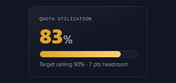</a> <b>Value to Target</b> <code>charts-value-to-target</code></td><td align="center" valign="top" width="33%"> <b>Stat Pair</b> <code>charts-stat-pair</code> · static</td><td align="center" valign="top" width="33%"><a href="../html/charts-mini-kpi-row.html">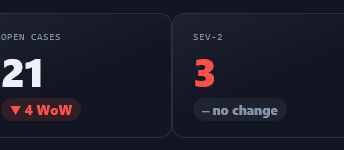</a> <b>Mini KPI Row</b> <code>charts-mini-kpi-row</code> · static</td></tr>
<tr><td align="center" valign="top" width="33%"><a href="../html/charts-kpi-delta-card-grid.html">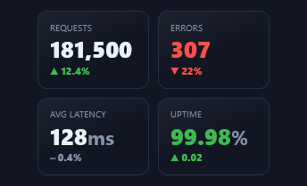</a> <b>KPI Delta Card Grid</b> <code>charts-kpi-delta-card-grid</code></td><td align="center" valign="top" width="33%"> <b>Animated Count-Up Pair</b> <code>charts-animated-count-up-pair</code> · static</td><td align="center" valign="top" width="33%"> <b>Value + Inline Trend + Delta</b> <code>charts-value-inline-trend-delta</code></td></tr>
</table>

## Gauges & Dials

<table>
<tr><td align="center" valign="top" width="33%"> <b>Semicircle Arc Gauge</b> <code>charts-semicircle-arc-gauge</code></td><td align="center" valign="top" width="33%"> <b>Donut Percentage Ring</b> <code>charts-donut-percentage-ring</code></td><td align="center" valign="top" width="33%"> <b>Score Dial + Needle</b> <code>charts-score-dial-needle</code></td></tr>
<tr><td align="center" valign="top" width="33%"> <b>Level / Battery Meter</b> <code>charts-level-battery-meter</code> · static</td><td align="center" valign="top" width="33%"> <b>Bullet Chart</b> <code>charts-bullet-chart</code> · static</td><td align="center" valign="top" width="33%"><a href="../html/charts-tachometer-ring-ticks.html">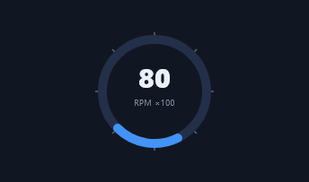</a> <b>Tachometer Ring + Ticks</b> <code>charts-tachometer-ring-ticks</code></td></tr>
<tr><td align="center" valign="top" width="33%"><a href="../html/charts-radial-progress-stack.html">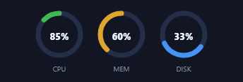</a> <b>Radial Progress Stack</b> <code>charts-radial-progress-stack</code></td><td align="center" valign="top" width="33%"><a href="../html/charts-threshold-ring-alarm.html">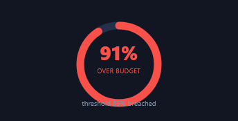</a> <b>Threshold Ring (alarm)</b> <code>charts-threshold-ring-alarm</code></td><td align="center" valign="top" width="33%"><a href="../html/charts-gradient-band-speedometer.html">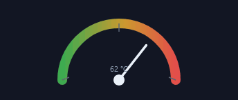</a> <b>Gradient Band Speedometer</b> <code>charts-gradient-band-speedometer</code> · static</td></tr>
</table>

## Progress & Ratio

<table>
<tr><td align="center" valign="top" width="33%"> <b>Labeled Progress Bar</b> <code>charts-labeled-progress-bar</code></td><td align="center" valign="top" width="33%"> <b>Segmented Progress</b> <code>charts-segmented-progress</code></td><td align="center" valign="top" width="33%"> <b>Stacked Ratio Bar (100%)</b> <code>charts-stacked-ratio-bar-100</code> · static</td></tr>
<tr><td align="center" valign="top" width="33%"> <b>Multi-Ring (concentric)</b> <code>charts-multi-ring-concentric</code></td><td align="center" valign="top" width="33%"><a href="../html/charts-waffle-chart.html">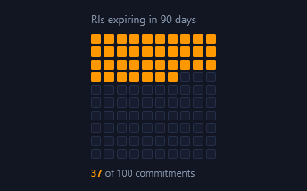</a> <b>Waffle Chart</b> <code>charts-waffle-chart</code> · static</td><td align="center" valign="top" width="33%"><a href="../html/charts-ranked-fill-ribbon.html">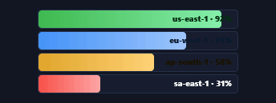</a> <b>Ranked Fill Ribbon</b> <code>charts-ranked-fill-ribbon</code></td></tr>
<tr><td align="center" valign="top" width="33%"><a href="../html/charts-bullet-chart-banded.html">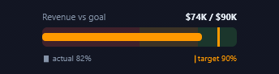</a> <b>Bullet Chart (banded)</b> <code>charts-bullet-chart-banded</code></td></tr>
</table>

## Trends & Time

<table>
<tr><td align="center" valign="top" width="33%"><a href="../html/charts-line-chart.html">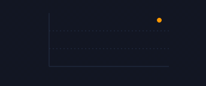</a> <b>Line Chart</b> <code>charts-line-chart</code></td><td align="center" valign="top" width="33%"> <b>Area Chart</b> <code>charts-area-chart</code></td><td align="center" valign="top" width="33%"> <b>Column / Bar Trend</b> <code>charts-column-bar-trend</code> · static</td></tr>
<tr><td align="center" valign="top" width="33%"><a href="../html/charts-range-min-max-bars.html">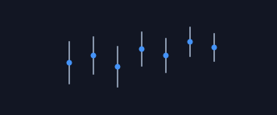</a> <b>Range / Min-Max Bars</b> <code>charts-range-min-max-bars</code> · static</td><td align="center" valign="top" width="33%"> <b>Sparkline + Figure</b> <code>charts-sparkline-figure</code> · static</td><td align="center" valign="top" width="33%"><a href="../html/charts-sparkline-grid-small-multiples.html">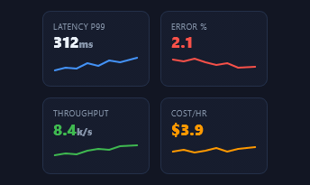</a> <b>Sparkline Grid (small multiples)</b> <code>charts-sparkline-grid-small-multiples</code> · static</td></tr>
<tr><td align="center" valign="top" width="33%"> <b>Stacked Area Chart</b> <code>charts-stacked-area-chart</code></td><td align="center" valign="top" width="33%"><a href="../html/charts-box-whisker-trend.html">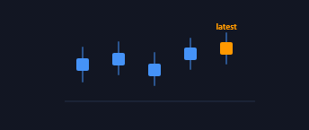</a> <b>Box / Whisker Trend</b> <code>charts-box-whisker-trend</code></td></tr>
</table>

## Comparison & Distribution

<table>
<tr><td align="center" valign="top" width="33%"><a href="../html/charts-horizontal-bar-ranking.html">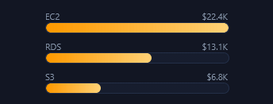</a> <b>Horizontal Bar Ranking</b> <code>charts-horizontal-bar-ranking</code></td><td align="center" valign="top" width="33%"><a href="../html/charts-heatmap-grid.html">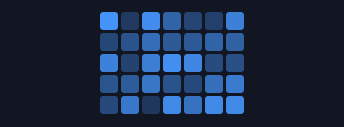</a> <b>Heatmap Grid</b> <code>charts-heatmap-grid</code> · static</td><td align="center" valign="top" width="33%"><a href="../html/charts-grouped-bars.html">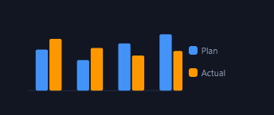</a> <b>Grouped Bars</b> <code>charts-grouped-bars</code> · static</td></tr>
<tr><td align="center" valign="top" width="33%"><a href="../html/charts-dot-lollipop-plot.html">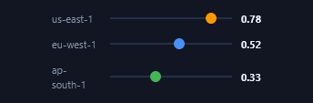</a> <b>Dot / Lollipop Plot</b> <code>charts-dot-lollipop-plot</code> · static</td><td align="center" valign="top" width="33%"><a href="../html/charts-slope-chart.html">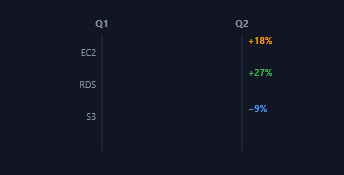</a> <b>Slope Chart</b> <code>charts-slope-chart</code></td><td align="center" valign="top" width="33%"><a href="../html/charts-diverging-bar-chart.html">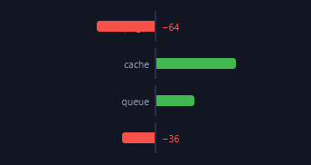</a> <b>Diverging Bar Chart</b> <code>charts-diverging-bar-chart</code></td></tr>
<tr><td align="center" valign="top" width="33%"> <b>Waterfall Chart</b> <code>charts-waterfall-chart</code></td></tr>
</table>

## Status & Thresholds

<table>
<tr><td align="center" valign="top" width="33%"> <b>Status Pills</b> <code>charts-status-pills</code> · static</td><td align="center" valign="top" width="33%"> <b>Traffic Light</b> <code>charts-traffic-light</code></td><td align="center" valign="top" width="33%"><a href="../html/charts-threshold-band-meter.html">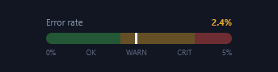</a> <b>Threshold Band Meter</b> <code>charts-threshold-band-meter</code> · static</td></tr>
<tr><td align="center" valign="top" width="33%"> <b>Live Ticker</b> <code>charts-live-ticker</code></td><td align="center" valign="top" width="33%"> <b>Uptime Status Strip</b> <code>charts-uptime-status-strip</code> · static</td><td align="center" valign="top" width="33%"> <b>Pulsing Health Beacon</b> <code>charts-pulsing-health-beacon</code></td></tr>
</table>

## Health Scores & RAG (red · amber · green)

<table>
<tr><td align="center" valign="top" width="33%"> <b>Health Score Chip — Green</b> <code>charts-health-score-chip-green</code></td><td align="center" valign="top" width="33%"> <b>Health Score Chip — Amber</b> <code>charts-health-score-chip-amber</code></td><td align="center" valign="top" width="33%"> <b>Health Score Chip — Red</b> <code>charts-health-score-chip-red</code></td></tr>
<tr><td align="center" valign="top" width="33%"><a href="../html/charts-rag-zone-meter.html">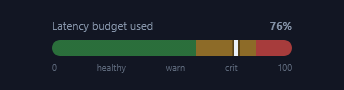</a> <b>RAG Zone Meter</b> <code>charts-rag-zone-meter</code></td><td align="center" valign="top" width="33%"><a href="../html/charts-api-gateway.html">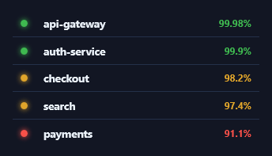</a> <b>api-gateway</b> <code>charts-api-gateway</code> · static</td><td align="center" valign="top" width="33%"><a href="../html/charts-rag-service-dot-grid.html">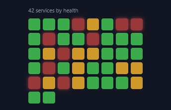</a> <b>RAG Service Dot-Grid</b> <code>charts-rag-service-dot-grid</code></td></tr>
<tr><td align="center" valign="top" width="33%"><a href="../html/charts-health-thermometer.html">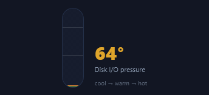</a> <b>Health Thermometer</b> <code>charts-health-thermometer</code></td><td align="center" valign="top" width="33%"> <b>Segmented Readiness</b> <code>charts-segmented-readiness</code> · static</td><td align="center" valign="top" width="33%"> <b>SLO Error-Budget Ring</b> <code>charts-slo-error-budget-ring</code></td></tr>
<tr><td align="center" valign="top" width="33%"><a href="../html/charts-letter-grade-scorecard.html">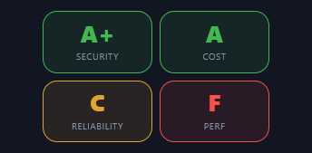</a> <b>Letter-Grade Scorecard</b> <code>charts-letter-grade-scorecard</code></td><td align="center" valign="top" width="33%"><a href="../html/charts-threshold-progress-bar.html">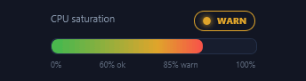</a> <b>Threshold Progress Bar</b> <code>charts-threshold-progress-bar</code></td><td align="center" valign="top" width="33%"> <b>RAG Gauge + Needle</b> <code>charts-rag-gauge-needle</code></td></tr>
</table>

## Fleet & Large

<table>
<tr><td align="center" valign="top" width="33%"><a href="../html/charts-300-vm-fleet-health-grid-hero.html">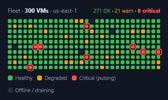</a> <b>300-VM Fleet Health Grid ★ hero</b> <code>charts-300-vm-fleet-health-grid-hero</code></td><td align="center" valign="top" width="33%"><a href="../html/charts-server-rack-view.html">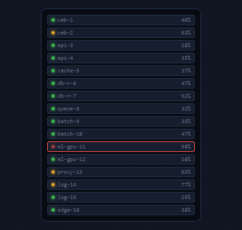</a> <b>Server Rack View</b> <code>charts-server-rack-view</code></td><td align="center" valign="top" width="33%"><a href="../html/charts-node-heat-grid-128.html">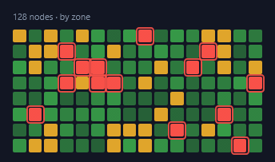</a> <b>Node Heat-Grid (128)</b> <code>charts-node-heat-grid-128</code></td></tr>
<tr><td align="center" valign="top" width="33%"> <b>Severity Bubble-Pack</b> <code>charts-severity-bubble-pack</code></td><td align="center" valign="top" width="33%"><a href="../html/charts-capacity-treemap.html">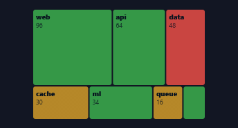</a> <b>Capacity Treemap</b> <code>charts-capacity-treemap</code> · static</td><td align="center" valign="top" width="33%"><a href="../html/charts-top-offenders-list.html">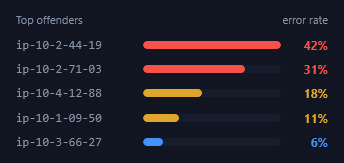</a> <b>Top Offenders List</b> <code>charts-top-offenders-list</code> · static</td></tr>
</table>

## Log Viewers & Streams

<table>
<tr><td align="center" valign="top" width="33%"><a href="../html/charts-structured-log-viewer.html">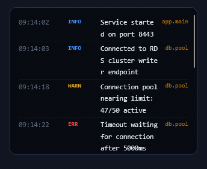</a> <b>Structured Log Viewer</b> <code>charts-structured-log-viewer</code></td><td align="center" valign="top" width="33%"><a href="../html/charts-http-access-log-colored.html">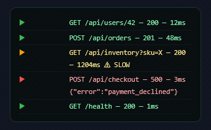</a> <b>HTTP Access Log (colored)</b> <code>charts-http-access-log-colored</code> · static</td><td align="center" valign="top" width="33%"><a href="../html/charts-log-level-summary.html">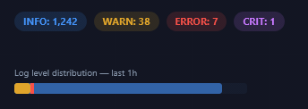</a> <b>Log Level Summary</b> <code>charts-log-level-summary</code> · static</td></tr>
<tr><td align="center" valign="top" width="33%"><a href="../html/charts-error-rate-sparkline-threshold.html">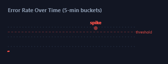</a> <b>Error Rate Sparkline + Threshold</b> <code>charts-error-rate-sparkline-threshold</code></td><td align="center" valign="top" width="33%"><a href="../html/charts-live-streaming-log-tail-f.html">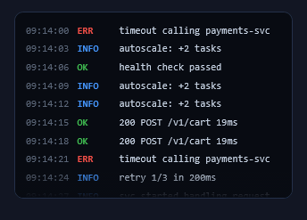</a> <b>Live Streaming Log (tail -f)</b> <code>charts-live-streaming-log-tail-f</code></td><td align="center" valign="top" width="33%"><a href="../html/charts-search-grep-highlight.html">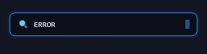</a> <b>Search + Grep Highlight</b> <code>charts-search-grep-highlight</code></td></tr>
<tr><td align="center" valign="top" width="33%"><a href="../html/charts-log-scan-beam.html">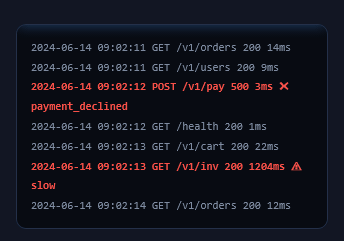</a> <b>Log Scan Beam</b> <code>charts-log-scan-beam</code></td><td align="center" valign="top" width="33%"><a href="../html/charts-search-facets.html">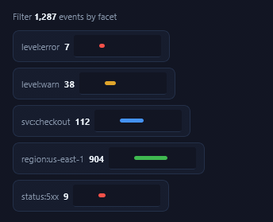</a> <b>Search Facets</b> <code>charts-search-facets</code></td></tr>
</table>

## Sessions & Timelines

<table>
<tr><td align="center" valign="top" width="33%"><a href="../html/charts-session-timeline.html">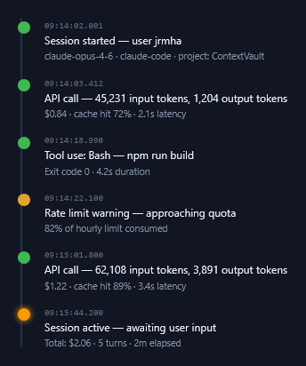</a> <b>Session Timeline</b> <code>charts-session-timeline</code> · static</td><td align="center" valign="top" width="33%"><a href="../html/charts-session-waterfall.html">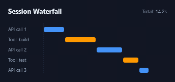</a> <b>Session Waterfall</b> <code>charts-session-waterfall</code> · static</td><td align="center" valign="top" width="33%"><a href="../html/charts-session-cost-per-turn.html">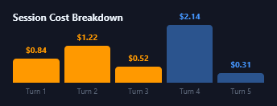</a> <b>Session Cost Per Turn</b> <code>charts-session-cost-per-turn</code> · static</td></tr>
</table>

## Traces & Linked Files

<table>
<tr><td align="center" valign="top" width="33%"><a href="../html/charts-error-trace-linked-files.html">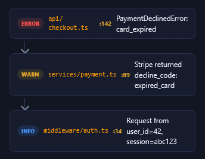</a> <b>Error Trace (Linked Files)</b> <code>charts-error-trace-linked-files</code> · static</td><td align="center" valign="top" width="33%"><a href="../html/charts-distributed-trace-span.html">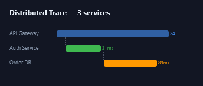</a> <b>Distributed Trace Span</b> <code>charts-distributed-trace-span</code> · static</td><td align="center" valign="top" width="33%"><a href="../html/charts-stack-trace-viewer.html">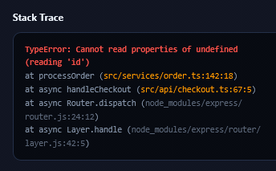</a> <b>Stack Trace Viewer</b> <code>charts-stack-trace-viewer</code> · static</td></tr>
</table>

## Pie Charts & Donuts

<table>
<tr><td align="center" valign="top" width="33%"><a href="../html/charts-donut-chart.html">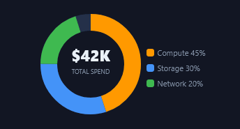</a> <b>Donut Chart</b> <code>charts-donut-chart</code> · static</td><td align="center" valign="top" width="33%"><a href="../html/charts-pie-chart-5-segments.html">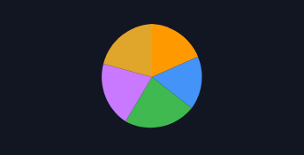</a> <b>Pie Chart (5 segments)</b> <code>charts-pie-chart-5-segments</code> · static</td><td align="center" valign="top" width="33%"> <b>Success/Fail Ring</b> <code>charts-success-fail-ring</code> · static</td></tr>
</table>

## 3D Charts & Graphs

<table>
<tr><td align="center" valign="top" width="33%"><a href="../html/charts-3d-bar-chart-isometric.html">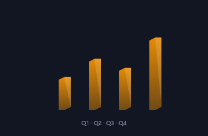</a> <b>3D Bar Chart (isometric)</b> <code>charts-3d-bar-chart-isometric</code> · static</td><td align="center" valign="top" width="33%"><a href="../html/charts-3d-pie-chart.html">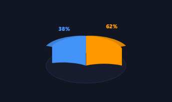</a> <b>3D Pie Chart</b> <code>charts-3d-pie-chart</code> · static</td><td align="center" valign="top" width="33%"> <b>3D Area / Mountain</b> <code>charts-3d-area-mountain</code></td></tr>
<tr><td align="center" valign="top" width="33%"> <b>3D Surface / Mesh Plot</b> <code>charts-3d-surface-mesh-plot</code> · static</td><td align="center" valign="top" width="33%"> <b>3D Scatter (depth cue)</b> <code>charts-3d-scatter-depth-cue</code> · static</td><td align="center" valign="top" width="33%"> <b>3D Stacked Bars (isometric)</b> <code>charts-3d-stacked-bars-isometric</code> · static</td></tr>
<tr><td align="center" valign="top" width="33%"> <b>3D Cylinder Bars</b> <code>charts-3d-cylinder-bars</code> · static</td><td align="center" valign="top" width="33%"> <b>3D Voxel Heatmap</b> <code>charts-3d-voxel-heatmap</code> · static</td><td align="center" valign="top" width="33%"> <b>3D Layered Ribbon Lines</b> <code>charts-3d-layered-ribbon-lines</code></td></tr>
<tr><td align="center" valign="top" width="33%"> <b>3D Globe / Edge Map</b> <code>charts-3d-globe-edge-map</code> · static</td><td align="center" valign="top" width="33%"> <b>3D Donut / Torus Gauge</b> <code>charts-3d-donut-torus-gauge</code> · static</td><td align="center" valign="top" width="33%"> <b>3D Pillars on Tilted Plane</b> <code>charts-3d-pillars-on-tilted-plane</code> · static</td></tr>
<tr><td align="center" valign="top" width="33%"> <b>3D Extruded Radar Prism</b> <code>charts-3d-extruded-radar-prism</code> · static</td><td align="center" valign="top" width="33%"> <b>3D Cylinder Bars</b> <code>charts-3d-cylinder-bars-2</code></td><td align="center" valign="top" width="33%"> <b>3D Scatter / Bubble Cloud</b> <code>charts-3d-scatter-bubble-cloud</code> · static</td></tr>
<tr><td align="center" valign="top" width="33%"> <b>3D Stacked Bars</b> <code>charts-3d-stacked-bars</code> · static</td><td align="center" valign="top" width="33%"> <b>3D Torus Donut</b> <code>charts-3d-torus-donut</code></td><td align="center" valign="top" width="33%"> <b>3D Ribbon Line</b> <code>charts-3d-ribbon-line</code></td></tr>
<tr><td align="center" valign="top" width="33%"> <b>3D Globe (regions)</b> <code>charts-3d-globe-regions</code></td><td align="center" valign="top" width="33%"> <b>3D Column Matrix</b> <code>charts-3d-column-matrix</code> · static</td><td align="center" valign="top" width="33%"> <b>3D Funnel</b> <code>charts-3d-funnel</code> · static</td></tr>
</table>

## Advanced Visualizations

<table>
<tr><td align="center" valign="top" width="33%"> <b>Radar / Spider Chart</b> <code>charts-radar-spider-chart</code> · static</td><td align="center" valign="top" width="33%"> <b>Funnel Chart</b> <code>charts-funnel-chart</code></td><td align="center" valign="top" width="33%"> <b>Flame Chart</b> <code>charts-flame-chart</code> · static</td></tr>
<tr><td align="center" valign="top" width="33%"> <b>Sankey / Flow Diagram</b> <code>charts-sankey-flow-diagram</code> · static</td><td align="center" valign="top" width="33%"> <b>Treemap</b> <code>charts-treemap</code> · static</td><td align="center" valign="top" width="33%"> <b>Multi-Line Comparison</b> <code>charts-multi-line-comparison</code></td></tr>
<tr><td align="center" valign="top" width="33%"> <b>Scatter Plot + Trend Line</b> <code>charts-scatter-plot-trend-line</code> · static</td><td align="center" valign="top" width="33%"> <b>Candlestick Chart</b> <code>charts-candlestick-chart</code> · static</td></tr>
</table>

## Density & Calendar Maps

<table>
<tr><td align="center" valign="top" width="33%"> <b>Calendar Heatmap</b> <code>charts-calendar-heatmap</code> · static</td><td align="center" valign="top" width="33%"> <b>Hour × Day Matrix Heatmap</b> <code>charts-hour-day-matrix-heatmap</code> · static</td><td align="center" valign="top" width="33%"> <b>Histogram + Density Curve</b> <code>charts-histogram-density-curve</code></td></tr>
<tr><td align="center" valign="top" width="33%"> <b>Overlapping Density (KDE)</b> <code>charts-overlapping-density-kde</code> · static</td></tr>
</table>

## Rank & Flow Diagrams

<table>
<tr><td align="center" valign="top" width="33%"> <b>Bump Chart (rank over time)</b> <code>charts-bump-chart-rank-over-time</code></td><td align="center" valign="top" width="33%"> <b>Chord / Arc Diagram</b> <code>charts-chord-arc-diagram</code></td><td align="center" valign="top" width="33%"> <b>Arc Connection Diagram</b> <code>charts-arc-connection-diagram</code> · static</td></tr>
<tr><td align="center" valign="top" width="33%"> <b>Squarified Treemap</b> <code>charts-squarified-treemap</code> · static</td></tr>
</table>

## Live & Animated

<table>
<tr><td align="center" valign="top" width="33%"> <b>Live ECG Monitor</b> <code>charts-live-ecg-monitor</code></td><td align="center" valign="top" width="33%"> <b>Streaming Equalizer</b> <code>charts-streaming-equalizer</code></td><td align="center" valign="top" width="33%"> <b>Live Gauge + Needle</b> <code>charts-live-gauge-needle</code></td></tr>
<tr><td align="center" valign="top" width="33%"> <b>Live Leaderboard</b> <code>charts-live-leaderboard</code></td><td align="center" valign="top" width="33%"> <b>Live Donut Ring</b> <code>charts-live-donut-ring</code></td><td align="center" valign="top" width="33%"> <b>Scrolling Area Stream</b> <code>charts-scrolling-area-stream</code> · static</td></tr>
<tr><td align="center" valign="top" width="33%"> <b>Live Progress + ETA</b> <code>charts-live-progress-eta</code></td><td align="center" valign="top" width="33%"> <b>Radar Sweep</b> <code>charts-radar-sweep</code></td><td align="center" valign="top" width="33%"> <b>Live Stacked Bars</b> <code>charts-live-stacked-bars</code></td></tr>
</table>

## More Plot Types

<table>
<tr><td align="center" valign="top" width="33%"> <b>Rose / Nightingale (polar area)</b> <code>charts-rose-nightingale-polar-area</code></td><td align="center" valign="top" width="33%"> <b>Radial Bar Chart</b> <code>charts-radial-bar-chart</code></td><td align="center" valign="top" width="33%"> <b>Pyramid Chart</b> <code>charts-pyramid-chart</code></td></tr>
<tr><td align="center" valign="top" width="33%"> <b>Population Pyramid / Tornado</b> <code>charts-population-pyramid-tornado</code></td><td align="center" valign="top" width="33%"> <b>Venn / Set Overlap</b> <code>charts-venn-set-overlap</code></td><td align="center" valign="top" width="33%"> <b>Connected Bubble Callouts</b> <code>charts-connected-bubble-callouts</code></td></tr>
<tr><td align="center" valign="top" width="33%"> <b>Pictograph / Unit Chart</b> <code>charts-pictograph-unit-chart</code></td><td align="center" valign="top" width="33%"> <b>Streamgraph (wiggle)</b> <code>charts-streamgraph-wiggle</code></td><td align="center" valign="top" width="33%"> <b>Network / Node-Link Graph</b> <code>charts-network-node-link-graph</code></td></tr>
<tr><td align="center" valign="top" width="33%"> <b>Spiral Chart</b> <code>charts-spiral-chart</code></td><td align="center" valign="top" width="33%"> <b>Marimekko / Mekko</b> <code>charts-marimekko-mekko</code></td><td align="center" valign="top" width="33%"> <b>Bar + Line Combo (dual-axis)</b> <code>charts-bar-line-combo-dual-axis</code></td></tr>
<tr><td align="center" valign="top" width="33%"> <b>Chernoff Faces</b> <code>charts-chernoff-faces</code></td><td align="center" valign="top" width="33%"> <b>Cycle Plot</b> <code>charts-cycle-plot</code></td><td align="center" valign="top" width="33%"> <b>Nested Treemap</b> <code>charts-nested-treemap</code></td></tr>
</table>

## New

<table>
<tr><td align="center" valign="top" width="33%"> <b>Radar Chart</b> <code>charts-radar-chart</code></td><td align="center" valign="top" width="33%"> <b>Bubble Chart</b> <code>charts-bubble-chart</code></td><td align="center" valign="top" width="33%"> <b>Candlestick</b> <code>charts-candlestick</code></td></tr>
<tr><td align="center" valign="top" width="33%"> <b>Gantt Timeline</b> <code>charts-gantt-timeline</code></td><td align="center" valign="top" width="33%"> <b>Funnel Chart</b> <code>charts-funnel-chart-2</code></td><td align="center" valign="top" width="33%"> <b>Radial Progress</b> <code>charts-radial-progress</code></td></tr>
<tr><td align="center" valign="top" width="33%"> <b>Polar Area</b> <code>charts-polar-area</code></td><td align="center" valign="top" width="33%"> <b>Calendar Heat</b> <code>charts-calendar-heat</code></td><td align="center" valign="top" width="33%"> <b>Step Line</b> <code>charts-step-line</code></td></tr>
<tr><td align="center" valign="top" width="33%"> <b>Beeswarm</b> <code>charts-beeswarm</code></td><td align="center" valign="top" width="33%"> <b>Dumbbell Plot</b> <code>charts-dumbbell-plot</code></td><td align="center" valign="top" width="33%"> <b>Progress Ring Set</b> <code>charts-progress-ring-set</code></td></tr>
<tr><td align="center" valign="top" width="33%"> <b>Heat Matrix</b> <code>charts-heat-matrix</code></td><td align="center" valign="top" width="33%"> <b>Histogram</b> <code>charts-histogram</code></td><td align="center" valign="top" width="33%"> <b>Error Budget</b> <code>charts-error-budget</code></td></tr>
<tr><td align="center" valign="top" width="33%"> <b>Percentile Band</b> <code>charts-percentile-band</code></td><td align="center" valign="top" width="33%"> <b>Cohort Retention</b> <code>charts-cohort-retention</code></td><td align="center" valign="top" width="33%"> <b>Sunburst</b> <code>charts-sunburst</code></td></tr>
<tr><td align="center" valign="top" width="33%"> <b>Network Graph</b> <code>charts-network-graph</code></td><td align="center" valign="top" width="33%"> <b>Streamgraph</b> <code>charts-streamgraph</code></td><td align="center" valign="top" width="33%"> <b>Ridgeline</b> <code>charts-ridgeline</code> · static</td></tr>
<tr><td align="center" valign="top" width="33%"> <b>Marimekko</b> <code>charts-marimekko</code></td><td align="center" valign="top" width="33%"> <b>Live Pulse Line</b> <code>charts-live-pulse-line</code></td><td align="center" valign="top" width="33%"> <b>Waterfall Bridge</b> <code>charts-waterfall-bridge</code></td></tr>
<tr><td align="center" valign="top" width="33%"> <b>Sparkbar Rows</b> <code>charts-sparkbar-rows</code></td><td align="center" valign="top" width="33%"> <b>Gauge Cluster</b> <code>charts-gauge-cluster</code></td><td align="center" valign="top" width="33%"> <b>Labelled Donut</b> <code>charts-labelled-donut</code> · static</td></tr>
<tr><td align="center" valign="top" width="33%"> <b>Horizon Bands</b> <code>charts-horizon-bands</code></td><td align="center" valign="top" width="33%"> <b>Strip Plot</b> <code>charts-strip-plot</code></td><td align="center" valign="top" width="33%"> <b>Slope Chart</b> <code>charts-slope-chart-2</code></td></tr>
<tr><td align="center" valign="top" width="33%"> <b>Area Chart</b> <code>charts-area-chart-2</code></td><td align="center" valign="top" width="33%"> <b>Pie (3-slice)</b> <code>charts-pie-3-slice</code></td><td align="center" valign="top" width="33%"> <b>Violin Plot</b> <code>charts-violin-plot</code></td></tr>
<tr><td align="center" valign="top" width="33%"> <b>Box &amp; Whisker</b> <code>charts-box-whisker</code></td><td align="center" valign="top" width="33%"> <b>Bullet Chart</b> <code>charts-bullet-chart-2</code></td><td align="center" valign="top" width="33%"> <b>Sankey Mini</b> <code>charts-sankey-mini</code></td></tr>
<tr><td align="center" valign="top" width="33%"> <b>Chord Diagram</b> <code>charts-chord-diagram</code></td><td align="center" valign="top" width="33%"> <b>Radial Bar Race</b> <code>charts-radial-bar-race</code></td><td align="center" valign="top" width="33%"> <b>Treemap</b> <code>charts-treemap-2</code></td></tr>
<tr><td align="center" valign="top" width="33%"> <b>Waffle Chart</b> <code>charts-waffle-chart-2</code></td><td align="center" valign="top" width="33%"> <b>Sparkline Matrix</b> <code>charts-sparkline-matrix</code></td><td align="center" valign="top" width="33%"> <b>Contribution Stream</b> <code>charts-contribution-stream</code></td></tr>
<tr><td align="center" valign="top" width="33%"> <b>Bump Chart</b> <code>charts-bump-chart</code></td><td align="center" valign="top" width="33%"> <b>Lollipop Chart</b> <code>charts-lollipop-chart</code></td><td align="center" valign="top" width="33%"> <b>Q–Q / Regression Plot</b> <code>charts-q-q-regression-plot</code></td></tr>
<tr><td align="center" valign="top" width="33%"> <b>Segmented Arc Gauge</b> <code>charts-segmented-arc-gauge</code></td><td align="center" valign="top" width="33%"> <b>Live Pulse Area</b> <code>charts-live-pulse-area</code></td></tr>
</table>

## 3D & Perspective (2026 drop)

<table>
<tr><td align="center" valign="top" width="33%"> <b>Isometric 3D Bars</b> <code>charts-isometric-3d-bars</code></td><td align="center" valign="top" width="33%"> <b>Extruded Pie Cylinder</b> <code>charts-extruded-pie-cylinder</code></td><td align="center" valign="top" width="33%"> <b>3D Scatter Cube</b> <code>charts-3d-scatter-cube</code></td></tr>
<tr><td align="center" valign="top" width="33%"> <b>Layered Depth Area</b> <code>charts-layered-depth-area</code></td><td align="center" valign="top" width="33%"> <b>3D Dot Globe</b> <code>charts-3d-dot-globe</code></td><td align="center" valign="top" width="33%"> <b>Prism KPI</b> <code>charts-prism-kpi</code></td></tr>
<tr><td align="center" valign="top" width="33%"> <b>Tilted Card Stack</b> <code>charts-tilted-card-stack</code></td><td align="center" valign="top" width="33%"> <b>Extruded 3D Donut</b> <code>charts-extruded-3d-donut</code></td><td align="center" valign="top" width="33%"> <b>3D Stacked Columns</b> <code>charts-3d-stacked-columns</code></td></tr>
<tr><td align="center" valign="top" width="33%"> <b>3D Heat Voxels</b> <code>charts-3d-heat-voxels</code></td><td align="center" valign="top" width="33%"> <b>3D Radar Plane</b> <code>charts-3d-radar-plane</code></td><td align="center" valign="top" width="33%"> <b>3D Funnel Cone</b> <code>charts-3d-funnel-cone</code></td></tr>
<tr><td align="center" valign="top" width="33%"> <b>KPI Carousel</b> <code>charts-kpi-carousel</code></td><td align="center" valign="top" width="33%"> <b>effect</b> <code>charts-effect</code></td><td align="center" valign="top" width="33%"> <b>effect</b> <code>charts-effect-2</code></td></tr>
<tr><td align="center" valign="top" width="33%"> <b>effect</b> <code>charts-effect-3</code></td><td align="center" valign="top" width="33%"> <b>effect</b> <code>charts-effect-4</code></td><td align="center" valign="top" width="33%"> <b>effect</b> <code>charts-effect-5</code></td></tr>
<tr><td align="center" valign="top" width="33%"> <b>3D Surface Mesh</b> <code>charts-3d-surface-mesh</code></td><td align="center" valign="top" width="33%"> <b>3D Ribbon Trend</b> <code>charts-3d-ribbon-trend</code></td></tr>
</table>

## CORRELATION, TIME & DISTRIBUTION PLOTS

<table>
<tr><td align="center" valign="top" width="33%"> <b>Parallel Coordinates</b> <code>charts-parallel-coordinates</code></td><td align="center" valign="top" width="33%"> <b>Quadrant Chart</b> <code>charts-quadrant-chart</code></td><td align="center" valign="top" width="33%"> <b>Connected Scatter</b> <code>charts-connected-scatter</code></td></tr>
<tr><td align="center" valign="top" width="33%"> <b>Hexagonal Binning</b> <code>charts-hexagonal-binning</code></td><td align="center" valign="top" width="33%"> <b>Contour Plot</b> <code>charts-contour-plot</code></td><td align="center" valign="top" width="33%"> <b>Barcode Chart</b> <code>charts-barcode-chart</code></td></tr>
<tr><td align="center" valign="top" width="33%"> <b>Bump Area Chart</b> <code>charts-bump-area-chart</code></td><td align="center" valign="top" width="33%"> <b>Radial Histogram</b> <code>charts-radial-histogram</code></td><td align="center" valign="top" width="33%"> <b>One Dimensional Heatmap Strip</b> <code>charts-one-dimensional-heatmap-strip</code></td></tr>
<tr><td align="center" valign="top" width="33%"> <b>Word Cloud</b> <code>charts-word-cloud</code></td><td align="center" valign="top" width="33%"> <b>Range Plot</b> <code>charts-range-plot</code></td><td align="center" valign="top" width="33%"> <b>Matrix Chart</b> <code>charts-matrix-chart</code></td></tr>
<tr><td align="center" valign="top" width="33%"> <b>Small Multiples</b> <code>charts-small-multiples</code></td><td align="center" valign="top" width="33%"> <b>Jittered Categorical Scatter</b> <code>charts-jittered-categorical-scatter</code></td><td align="center" valign="top" width="33%"> <b>OHLC Chart</b> <code>charts-ohlc-chart</code></td></tr>
<tr><td align="center" valign="top" width="33%"> <b>Spline Versus Straight Overlay</b> <code>charts-spline-versus-straight-overlay</code></td><td align="center" valign="top" width="33%"> <b>Tile Map</b> <code>charts-tile-map</code></td><td align="center" valign="top" width="33%"> <b>Density Heat Strip</b> <code>charts-density-heat-strip</code></td></tr>
</table>

## TREEMAPS & HIERARCHIES

<table>
<tr><td align="center" valign="top" width="33%"> <b>Circle Packing</b> <code>charts-circle-packing</code></td><td align="center" valign="top" width="33%"> <b>Voronoi Treemap</b> <code>charts-voronoi-treemap</code></td><td align="center" valign="top" width="33%"> <b>Icicle Chart</b> <code>charts-icicle-chart</code></td></tr>
<tr><td align="center" valign="top" width="33%"> <b>Radial Icicle</b> <code>charts-radial-icicle</code></td><td align="center" valign="top" width="33%"> <b>Treemap Drill-In</b> <code>charts-treemap-drill-in</code></td><td align="center" valign="top" width="33%"> <b>Treemap Delta</b> <code>charts-treemap-delta</code></td></tr>
<tr><td align="center" valign="top" width="33%"> <b>Treemap Heat</b> <code>charts-treemap-heat</code></td><td align="center" valign="top" width="33%"> <b>Treemap Sparklines</b> <code>charts-treemap-sparklines</code></td><td align="center" valign="top" width="33%"> <b>Hierarchical Bar</b> <code>charts-hierarchical-bar</code></td></tr>
<tr><td align="center" valign="top" width="33%"> <b>Dendrogram to Bar</b> <code>charts-dendrogram-to-bar</code></td><td align="center" valign="top" width="33%"> <b>Euler Diagram</b> <code>charts-euler-diagram</code></td><td align="center" valign="top" width="33%"> <b>Icon Array</b> <code>charts-icon-array</code></td></tr>
<tr><td align="center" valign="top" width="33%"> <b>Diverging Likert Bar</b> <code>charts-diverging-likert-bar</code></td><td align="center" valign="top" width="33%"> <b>Semi Donut Needle</b> <code>charts-semi-donut-needle</code></td><td align="center" valign="top" width="33%"> <b>Tree Ring Chart</b> <code>charts-tree-ring-chart</code></td></tr>
<tr><td align="center" valign="top" width="33%"> <b>Nested Donuts</b> <code>charts-nested-donuts</code></td><td align="center" valign="top" width="33%"> <b>Pyramid Stack</b> <code>charts-pyramid-stack</code></td></tr>
</table>

## LIQUID GAUGES & VARIANCE BANDS

<table>
<tr><td align="center" valign="top" width="33%"> <b>Pipe Cross Section</b> <code>charts-pipe-cross-section</code></td><td align="center" valign="top" width="33%"> <b>Liquid Tank</b> <code>charts-liquid-tank</code></td><td align="center" valign="top" width="33%"> <b>Liquid Ring</b> <code>charts-liquid-ring</code></td></tr>
<tr><td align="center" valign="top" width="33%"> <b>Liquid Pipe Run</b> <code>charts-liquid-pipe-run</code></td><td align="center" valign="top" width="33%"> <b>Liquid Drop Gauge</b> <code>charts-liquid-drop-gauge</code></td><td align="center" valign="top" width="33%"> <b>Liquid Battery</b> <code>charts-liquid-battery</code></td></tr>
<tr><td align="center" valign="top" width="33%"> <b>Dual Tank Compare</b> <code>charts-dual-tank-compare</code></td><td align="center" valign="top" width="33%"> <b>Liquid Thermometer</b> <code>charts-liquid-thermometer</code></td><td align="center" valign="top" width="33%"> <b>Range Area Band</b> <code>charts-range-area-band</code></td></tr>
<tr><td align="center" valign="top" width="33%"> <b>Fan Chart</b> <code>charts-fan-chart</code></td><td align="center" valign="top" width="33%"> <b>Sigma Band Outliers</b> <code>charts-sigma-band-outliers</code></td><td align="center" valign="top" width="33%"> <b>Error Bars On Columns</b> <code>charts-error-bars-on-columns</code></td></tr>
<tr><td align="center" valign="top" width="33%"> <b>Deviation Area</b> <code>charts-deviation-area</code></td><td align="center" valign="top" width="33%"> <b>Variance To Plan</b> <code>charts-variance-to-plan</code></td><td align="center" valign="top" width="33%"> <b>Bollinger Envelope</b> <code>charts-bollinger-envelope</code></td></tr>
<tr><td align="center" valign="top" width="33%"> <b>Control Limits Band</b> <code>charts-control-limits-band</code></td></tr>
</table>
