# Diagrams & Frameworks

Every effect in Prism's **Diagrams & Frameworks** gallery, recorded as a looping GIF.

**58 effects** · 58 animated · 1.8 MB of GIF · click any GIF to open its standalone HTML sample (raw file; open it locally, GitHub shows source).

[← Showcase index](../README.md)

**Sections:** [FISHBONE (ISHIKAWA)](#fishbone-ishikawa) · [FLOW & LOGIC](#flow-logic) · [HIERARCHY & STRUCTURE](#hierarchy-structure) · [COMPARISON & MATRIX](#comparison-matrix) · [TIMELINE & PLANNING](#timeline-planning) · [NETWORK & RELATIONSHIPS](#network-relationships) · [SANKEY & FLOW](#sankey-flow) · [FRAMEWORKS](#frameworks) · [FLYWHEELS](#flywheels)

## FISHBONE (ISHIKAWA)

<table>
<tr><td align="center" valign="top" width="33%"> <b>Simple Fishbone</b> <code>diagrams-simple-fishbone</code></td><td align="center" valign="top" width="33%"> <b>6M Fishbone</b> <code>diagrams-6m-fishbone</code></td><td align="center" valign="top" width="33%"> <b>4S Fishbone</b> <code>diagrams-4s-fishbone</code></td></tr>
<tr><td align="center" valign="top" width="33%"> <b>8P Fishbone</b> <code>diagrams-8p-fishbone</code></td><td align="center" valign="top" width="33%"> <b>5M + E Fishbone</b> <code>diagrams-5m-e-fishbone</code></td><td align="center" valign="top" width="33%"> <b>Process Fishbone</b> <code>diagrams-process-fishbone</code></td></tr>
<tr><td align="center" valign="top" width="33%"> <b>Service Fishbone</b> <code>diagrams-service-fishbone</code></td><td align="center" valign="top" width="33%"><a href="../html/diagrams-healthcare-fishbone.html">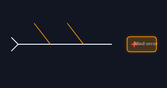</a> <b>Healthcare Fishbone</b> <code>diagrams-healthcare-fishbone</code></td><td align="center" valign="top" width="33%"><a href="../html/diagrams-root-cause-trace.html">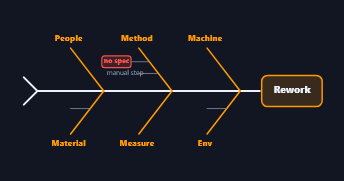</a> <b>Root Cause Trace</b> <code>diagrams-root-cause-trace</code></td></tr>
</table>

## FLOW & LOGIC

<table>
<tr><td align="center" valign="top" width="33%"><a href="../html/diagrams-flowchart.html">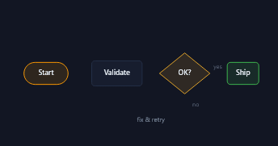</a> <b>Flowchart</b> <code>diagrams-flowchart</code></td><td align="center" valign="top" width="33%"><a href="../html/diagrams-feedback-loop.html">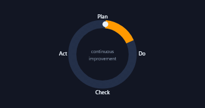</a> <b>Feedback Loop</b> <code>diagrams-feedback-loop</code></td><td align="center" valign="top" width="33%"><a href="../html/diagrams-decision-tree.html">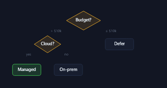</a> <b>Decision Tree</b> <code>diagrams-decision-tree</code></td></tr>
<tr><td align="center" valign="top" width="33%"><a href="../html/diagrams-swimlane-flow.html">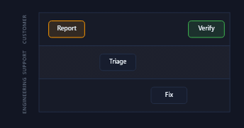</a> <b>Swimlane Flow</b> <code>diagrams-swimlane-flow</code></td><td align="center" valign="top" width="33%"><a href="../html/diagrams-cycle-diagram.html">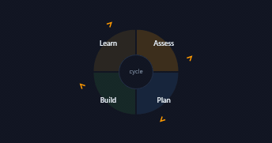</a> <b>Cycle Diagram</b> <code>diagrams-cycle-diagram</code></td><td align="center" valign="top" width="33%"><a href="../html/diagrams-state-machine.html">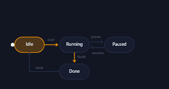</a> <b>State Machine</b> <code>diagrams-state-machine</code></td></tr>
<tr><td align="center" valign="top" width="33%"><a href="../html/diagrams-chevron-process.html">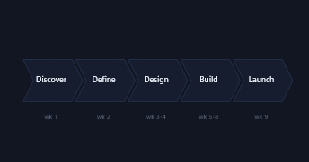</a> <b>Chevron Process</b> <code>diagrams-chevron-process</code></td><td align="center" valign="top" width="33%"><a href="../html/diagrams-sipoc.html">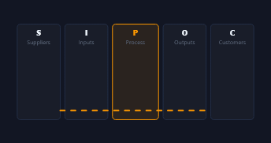</a> <b>SIPOC</b> <code>diagrams-sipoc</code></td></tr>
</table>

## HIERARCHY & STRUCTURE

<table>
<tr><td align="center" valign="top" width="33%"> <b>Mind Map</b> <code>diagrams-mind-map</code></td><td align="center" valign="top" width="33%"> <b>Tree / Dendrogram</b> <code>diagrams-tree-dendrogram</code></td><td align="center" valign="top" width="33%"> <b>Org Chart (horizontal)</b> <code>diagrams-org-chart-horizontal</code></td></tr>
<tr><td align="center" valign="top" width="33%"><a href="../html/diagrams-pyramid-chart.html">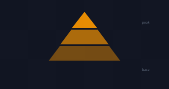</a> <b>Pyramid Chart</b> <code>diagrams-pyramid-chart</code></td><td align="center" valign="top" width="33%"><a href="../html/diagrams-funnel-chart.html">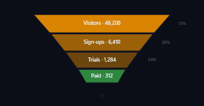</a> <b>Funnel Chart</b> <code>diagrams-funnel-chart</code></td><td align="center" valign="top" width="33%"><a href="../html/diagrams-concentric-circles.html">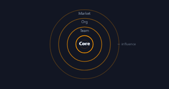</a> <b>Concentric Circles</b> <code>diagrams-concentric-circles</code></td></tr>
<tr><td align="center" valign="top" width="33%"><a href="../html/diagrams-circle-of-parts.html">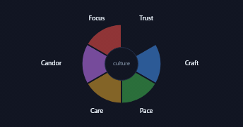</a> <b>Circle of Parts</b> <code>diagrams-circle-of-parts</code></td><td align="center" valign="top" width="33%"><a href="../html/diagrams-nested-containers.html">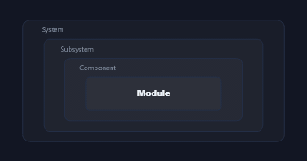</a> <b>Nested Containers</b> <code>diagrams-nested-containers</code></td></tr>
</table>

## COMPARISON & MATRIX

<table>
<tr><td align="center" valign="top" width="33%"><a href="../html/diagrams-venn-2-sets.html">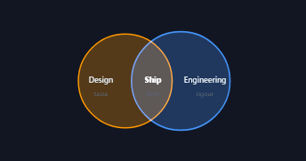</a> <b>Venn (2 sets)</b> <code>diagrams-venn-2-sets</code></td><td align="center" valign="top" width="33%"><a href="../html/diagrams-venn-3-sets.html">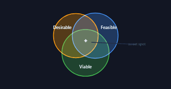</a> <b>Venn (3 sets)</b> <code>diagrams-venn-3-sets</code></td><td align="center" valign="top" width="33%"> <b>SWOT Grid</b> <code>diagrams-swot-grid</code></td></tr>
<tr><td align="center" valign="top" width="33%"><a href="../html/diagrams-priority-quadrant.html">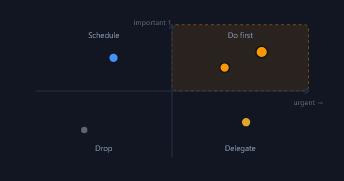</a> <b>Priority Quadrant</b> <code>diagrams-priority-quadrant</code></td><td align="center" valign="top" width="33%"><a href="../html/diagrams-pest-columns.html">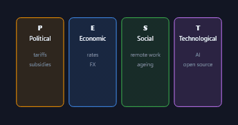</a> <b>PEST Columns</b> <code>diagrams-pest-columns</code></td><td align="center" valign="top" width="33%"><a href="../html/diagrams-balance-scale.html">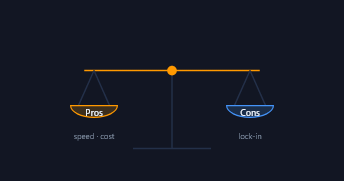</a> <b>Balance Scale</b> <code>diagrams-balance-scale</code></td></tr>
<tr><td align="center" valign="top" width="33%"><a href="../html/diagrams-continuum-slider.html">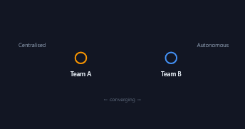</a> <b>Continuum Slider</b> <code>diagrams-continuum-slider</code></td></tr>
</table>

## TIMELINE & PLANNING

<table>
<tr><td align="center" valign="top" width="33%"><a href="../html/diagrams-journey-map.html">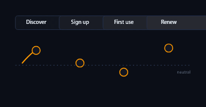</a> <b>Journey Map</b> <code>diagrams-journey-map</code></td><td align="center" valign="top" width="33%"><a href="../html/diagrams-roadmap.html">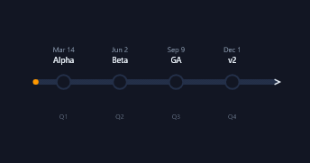</a> <b>Roadmap</b> <code>diagrams-roadmap</code></td><td align="center" valign="top" width="33%"> <b>Vertical Timeline</b> <code>diagrams-vertical-timeline</code></td></tr>
<tr><td align="center" valign="top" width="33%"><a href="../html/diagrams-gantt-dependencies.html">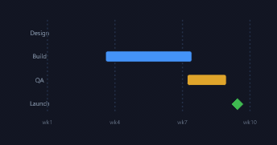</a> <b>Gantt + Dependencies</b> <code>diagrams-gantt-dependencies</code></td><td align="center" valign="top" width="33%"><a href="../html/diagrams-milestone-track.html">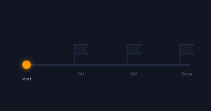</a> <b>Milestone Track</b> <code>diagrams-milestone-track</code></td><td align="center" valign="top" width="33%"><a href="../html/diagrams-pert-critical-path.html">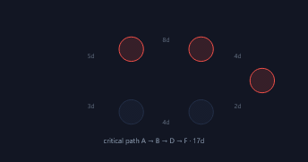</a> <b>PERT / Critical Path</b> <code>diagrams-pert-critical-path</code></td></tr>
<tr><td align="center" valign="top" width="33%"><a href="../html/diagrams-value-stream-map.html">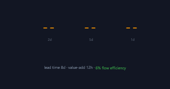</a> <b>Value Stream Map</b> <code>diagrams-value-stream-map</code></td></tr>
</table>

## NETWORK & RELATIONSHIPS

<table>
<tr><td align="center" valign="top" width="33%"><a href="../html/diagrams-network-graph.html">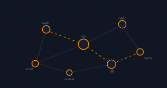</a> <b>Network Graph</b> <code>diagrams-network-graph</code></td><td align="center" valign="top" width="33%"><a href="../html/diagrams-hub-spoke.html">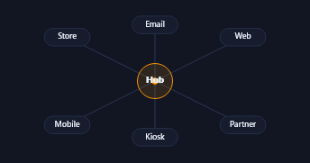</a> <b>Hub &amp; Spoke</b> <code>diagrams-hub-spoke</code></td><td align="center" valign="top" width="33%"><a href="../html/diagrams-er-diagram.html">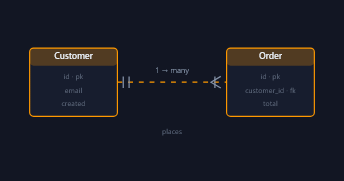</a> <b>ER Diagram</b> <code>diagrams-er-diagram</code></td></tr>
<tr><td align="center" valign="top" width="33%"><a href="../html/diagrams-chord-diagram.html">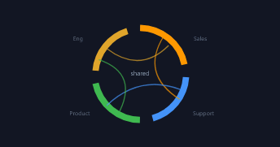</a> <b>Chord Diagram</b> <code>diagrams-chord-diagram</code></td><td align="center" valign="top" width="33%"><a href="../html/diagrams-stakeholder-map.html">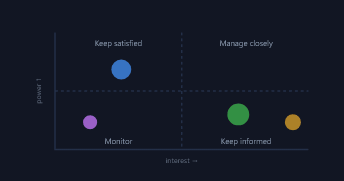</a> <b>Stakeholder Map</b> <code>diagrams-stakeholder-map</code></td></tr>
</table>

## SANKEY & FLOW

<table>
<tr><td align="center" valign="top" width="33%"><a href="../html/diagrams-sankey-flow.html">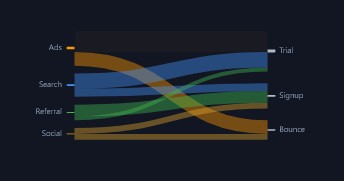</a> <b>Sankey Flow</b> <code>diagrams-sankey-flow</code></td><td align="center" valign="top" width="33%"><a href="../html/diagrams-particle-sankey.html">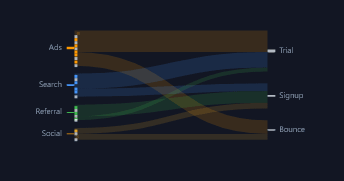</a> <b>Particle Sankey</b> <code>diagrams-particle-sankey</code></td><td align="center" valign="top" width="33%"><a href="../html/diagrams-gradient-sankey.html">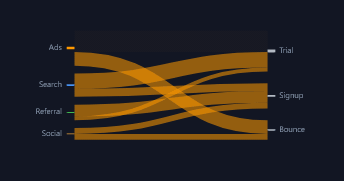</a> <b>Gradient Sankey</b> <code>diagrams-gradient-sankey</code></td></tr>
<tr><td align="center" valign="top" width="33%"><a href="../html/diagrams-focus-freeze-sankey.html">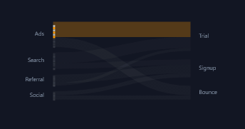</a> <b>Focus + Freeze Sankey</b> <code>diagrams-focus-freeze-sankey</code></td><td align="center" valign="top" width="33%"><a href="../html/diagrams-dim-glow-sankey.html">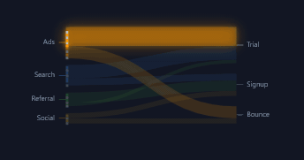</a> <b>Dim + Glow Sankey</b> <code>diagrams-dim-glow-sankey</code></td><td align="center" valign="top" width="33%"><a href="../html/diagrams-neon-sankey.html">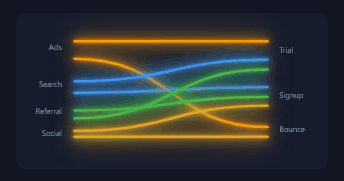</a> <b>Neon Sankey</b> <code>diagrams-neon-sankey</code></td></tr>
</table>

## FRAMEWORKS

<table>
<tr><td align="center" valign="top" width="33%"><a href="../html/diagrams-business-model-canvas.html">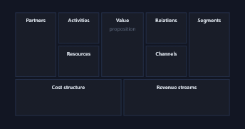</a> <b>Business Model Canvas</b> <code>diagrams-business-model-canvas</code></td><td align="center" valign="top" width="33%"><a href="../html/diagrams-okr-tree.html">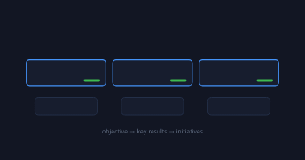</a> <b>OKR Tree</b> <code>diagrams-okr-tree</code></td><td align="center" valign="top" width="33%"> <b>5 Whys Chain</b> <code>diagrams-5-whys-chain</code></td></tr>
<tr><td align="center" valign="top" width="33%"><a href="../html/diagrams-raci-matrix.html">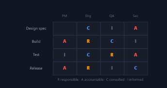</a> <b>RACI Matrix</b> <code>diagrams-raci-matrix</code></td><td align="center" valign="top" width="33%"><a href="../html/diagrams-five-forces.html">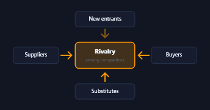</a> <b>Five Forces</b> <code>diagrams-five-forces</code></td></tr>
</table>

## FLYWHEELS

<table>
<tr><td align="center" valign="top" width="33%"><a href="../html/diagrams-amazon-flywheel.html">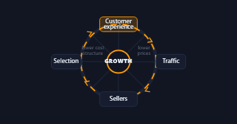</a> <b>Amazon Flywheel</b> <code>diagrams-amazon-flywheel</code></td><td align="center" valign="top" width="33%"><a href="../html/diagrams-data-flywheel.html">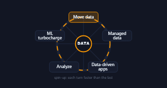</a> <b>Data Flywheel</b> <code>diagrams-data-flywheel</code></td><td align="center" valign="top" width="33%"><a href="../html/diagrams-growth-flywheel-attract-engage-delight.html">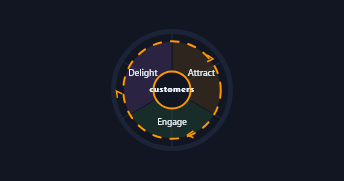</a> <b>Growth Flywheel (Attract, Engage, Delight)</b> <code>diagrams-growth-flywheel-attract-engage-delight</code></td></tr>
</table>
