# FX Store

Every effect in Prism's **FX Store** gallery, recorded as a looping GIF.

**252 effects** · 235 animated · 15.7 MB of GIF · click any GIF to open its standalone HTML sample (raw file; open it locally, GitHub shows source).

[← Showcase index](../README.md)

**Sections:** [Glow & Light](#glow-light) · [Border & Edge](#border-edge) · [Text & Inline](#text-inline) · [Motion & Attention](#motion-attention) · [Particles & Sparks](#particles-sparks) · [Glass & Material](#glass-material) · [Shadows & Depth](#shadows-depth) · [Backgrounds & Patterns](#backgrounds-patterns) · [Overlays & Decorators](#overlays-decorators) · [Cyberpunk & Glitch](#cyberpunk-glitch) · [Liquid & Organic](#liquid-organic) · [Electric & Energy](#electric-energy) · [Physics & Motion](#physics-motion) · [Holographic & Iridescent](#holographic-iridescent) · [Neon Sign, Scanline & CRT](#neon-sign-scanline-crt) · [Frost, Magma & Aurora](#frost-magma-aurora) · [Comet](#comet) · [Grain, Parallax & Pointer](#grain-parallax-pointer) · [New](#new) · [3D & Depth FX](#3d-depth-fx) · [Glow, Border & Holographic FX](#glow-border-holographic-fx) · [Glass, Glitch, Liquid & Energy FX](#glass-glitch-liquid-energy-fx) · [Pokémon Battle](#pok-mon-battle) · [Elemental Base](#elemental-base) · [GLOW SYSTEM](#glow-system) · [HOVER & REVEAL](#hover-reveal) · [DECK & HAND](#deck-hand) · [CARD MOTION & FOIL](#card-motion-foil) · [TCG FOIL STYLES](#tcg-foil-styles)

## Glow & Light

<table>
<tr><td align="center" valign="top" width="33%"> <b>Pulse-Glow ★ winner</b> <code>fx-pulse-glow-winner</code></td><td align="center" valign="top" width="33%"> <b>Halo-Ping</b> <code>fx-halo-ping</code></td><td align="center" valign="top" width="33%"> <b>Ember</b> <code>fx-ember</code></td></tr>
<tr><td align="center" valign="top" width="33%"> <b>Breathe</b> <code>fx-breathe</code></td><td align="center" valign="top" width="33%"> <b>Alert-Strobe</b> <code>fx-alert-strobe</code></td><td align="center" valign="top" width="33%"> <b>Spotlight-Sweep</b> <code>fx-spotlight-sweep</code></td></tr>
<tr><td align="center" valign="top" width="33%"> <b>Sonar</b> <code>fx-sonar</code></td><td align="center" valign="top" width="33%"> <b>Aurora</b> <code>fx-aurora</code></td></tr>
</table>

## Border & Edge

<table>
<tr><td align="center" valign="top" width="33%"> <b>Edge-Trace</b> <code>fx-edge-trace</code></td><td align="center" valign="top" width="33%"> <b>Conic-Ring</b> <code>fx-conic-ring</code></td><td align="center" valign="top" width="33%"> <b>Reticle</b> <code>fx-reticle</code></td></tr>
<tr><td align="center" valign="top" width="33%"> <b>Scanline</b> <code>fx-scanline</code></td><td align="center" valign="top" width="33%"><a href="../html/fx-marching-ants.html">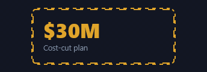</a> <b>Marching-Ants</b> <code>fx-marching-ants</code></td><td align="center" valign="top" width="33%"> <b>Radar-Sweep</b> <code>fx-radar-sweep</code></td></tr>
<tr><td align="center" valign="top" width="33%"> <b>Corner-Lock</b> <code>fx-corner-lock</code></td><td align="center" valign="top" width="33%"> <b>Comet-Border</b> <code>fx-comet-border</code></td><td align="center" valign="top" width="33%"> <b>Back'n'Forth</b> <code>fx-back-n-forth</code></td></tr>
</table>

## Text & Inline

<table>
<tr><td align="center" valign="top" width="33%"> <b>Neon-Flicker</b> <code>fx-neon-flicker</code></td><td align="center" valign="top" width="33%"> <b>Data-Blink</b> <code>fx-data-blink</code></td><td align="center" valign="top" width="33%"> <b>Grow-Underline</b> <code>fx-grow-underline</code></td></tr>
<tr><td align="center" valign="top" width="33%"> <b>Glitch</b> <code>fx-glitch</code></td><td align="center" valign="top" width="33%"> <b>Text-Shine</b> <code>fx-text-shine</code></td><td align="center" valign="top" width="33%"> <b>Color-Pulse</b> <code>fx-color-pulse</code></td></tr>
</table>

## Motion & Attention

<table>
<tr><td align="center" valign="top" width="33%"> <b>Float</b> <code>fx-float</code></td><td align="center" valign="top" width="33%"> <b>Wobble</b> <code>fx-wobble</code></td><td align="center" valign="top" width="33%"> <b>Pop</b> <code>fx-pop</code></td></tr>
<tr><td align="center" valign="top" width="33%"> <b>Flash</b> <code>fx-flash</code></td></tr>
</table>

## Particles & Sparks

<table>
<tr><td align="center" valign="top" width="33%"> <b>Sparkle</b> <code>fx-sparkle</code></td><td align="center" valign="top" width="33%"> <b>Firefly</b> <code>fx-firefly</code></td><td align="center" valign="top" width="33%"> <b>Comet</b> <code>fx-comet</code></td></tr>
</table>

## Glass & Material

<table>
<tr><td align="center" valign="top" width="33%"> <b>Glass</b> <code>fx-glass</code> · static</td><td align="center" valign="top" width="33%"> <b>Frost</b> <code>fx-frost</code> · static</td><td align="center" valign="top" width="33%"> <b>Hologram</b> <code>fx-hologram</code></td></tr>
</table>

## Shadows & Depth

<table>
<tr><td align="center" valign="top" width="33%"> <b>Soft Shadow</b> <code>fx-soft-shadow</code> · static</td><td align="center" valign="top" width="33%"> <b>Color Shadow</b> <code>fx-color-shadow</code> · static</td><td align="center" valign="top" width="33%"> <b>Neon Shadow</b> <code>fx-neon-shadow</code> · static</td></tr>
<tr><td align="center" valign="top" width="33%"> <b>Inner Shadow</b> <code>fx-inner-shadow</code> · static</td><td align="center" valign="top" width="33%"> <b>Elevate</b> <code>fx-elevate</code> · static</td><td align="center" valign="top" width="33%"> <b>Multi Shadow</b> <code>fx-multi-shadow</code> · static</td></tr>
</table>

## Backgrounds & Patterns

<table>
<tr><td align="center" valign="top" width="33%"><a href="../html/fx-dot-grid.html">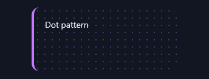</a> <b>Dot Grid</b> <code>fx-dot-grid</code> · static</td><td align="center" valign="top" width="33%"><a href="../html/fx-grid-lines.html">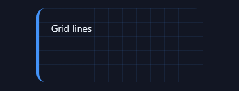</a> <b>Grid Lines</b> <code>fx-grid-lines</code> · static</td><td align="center" valign="top" width="33%"> <b>Diagonal</b> <code>fx-diagonal</code> · static</td></tr>
<tr><td align="center" valign="top" width="33%"> <b>Noise</b> <code>fx-noise</code> · static</td></tr>
</table>

## Overlays & Decorators

<table>
<tr><td align="center" valign="top" width="33%"> <b>Ribbon</b> <code>fx-ribbon</code> · static</td><td align="center" valign="top" width="33%"> <b>Corner Badge</b> <code>fx-corner-badge</code> · static</td><td align="center" valign="top" width="33%"> <b>Glow Border</b> <code>fx-glow-border</code> · static</td></tr>
</table>

## Cyberpunk & Glitch

<table>
<tr><td align="center" valign="top" width="33%"> <b>RGB Glitch</b> <code>fx-rgb-glitch</code></td><td align="center" valign="top" width="33%"> <b>CRT Scanlines</b> <code>fx-crt-scanlines</code></td><td align="center" valign="top" width="33%"><a href="../html/fx-chromatic-aberration.html">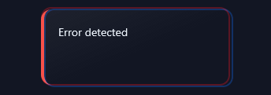</a> <b>Chromatic Aberration</b> <code>fx-chromatic-aberration</code></td></tr>
<tr><td align="center" valign="top" width="33%"> <b>Matrix Background</b> <code>fx-matrix-background</code></td></tr>
</table>

## Liquid & Organic

<table>
<tr><td align="center" valign="top" width="33%"> <b>Blob Morph</b> <code>fx-blob-morph</code></td><td align="center" valign="top" width="33%"> <b>Ripple</b> <code>fx-ripple</code></td><td align="center" valign="top" width="33%"> <b>Lava Flow</b> <code>fx-lava-flow</code></td></tr>
<tr><td align="center" valign="top" width="33%"> <b>Liquid Fill</b> <code>fx-liquid-fill</code></td><td align="center" valign="top" width="33%"> <b>Squish</b> <code>fx-squish</code></td></tr>
</table>

## Electric & Energy

<table>
<tr><td align="center" valign="top" width="33%"> <b>Electric Border</b> <code>fx-electric-border</code></td><td align="center" valign="top" width="33%"><a href="../html/fx-plasma.html">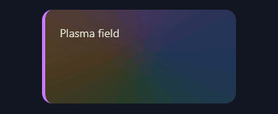</a> <b>Plasma</b> <code>fx-plasma</code></td><td align="center" valign="top" width="33%"> <b>Lightning Flash</b> <code>fx-lightning-flash</code></td></tr>
<tr><td align="center" valign="top" width="33%"> <b>Confetti</b> <code>fx-confetti</code></td></tr>
</table>

## Physics & Motion

<table>
<tr><td align="center" valign="top" width="33%"> <b>Spring Bounce</b> <code>fx-spring-bounce</code></td><td align="center" valign="top" width="33%"> <b>Gravity Drop</b> <code>fx-gravity-drop</code></td><td align="center" valign="top" width="33%"> <b>3D Tilt (hover)</b> <code>fx-3d-tilt-hover</code></td></tr>
<tr><td align="center" valign="top" width="33%"> <b>Spotlight (hover)</b> <code>fx-spotlight-hover</code></td><td align="center" valign="top" width="33%"> <b>Border Draw (hover)</b> <code>fx-border-draw-hover</code></td><td align="center" valign="top" width="33%"> <b>Morph Star</b> <code>fx-morph-star</code></td></tr>
<tr><td align="center" valign="top" width="33%"> <b>Breathe Border</b> <code>fx-breathe-border</code></td></tr>
</table>

## Holographic & Iridescent

<table>
<tr><td align="center" valign="top" width="33%"><a href="../html/fx-holo-shift.html">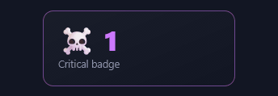</a> <b>Holo-Shift</b> <code>fx-holo-shift</code></td><td align="center" valign="top" width="33%"><a href="../html/fx-iridescent.html">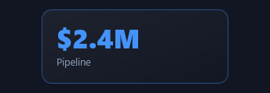</a> <b>Iridescent</b> <code>fx-iridescent</code></td><td align="center" valign="top" width="33%"> <b>Foil-Brush</b> <code>fx-foil-brush</code></td></tr>
<tr><td align="center" valign="top" width="33%"> <b>Pearl-Sheen</b> <code>fx-pearl-sheen</code></td></tr>
</table>

## Neon Sign, Scanline & CRT

<table>
<tr><td align="center" valign="top" width="33%"> <b>Neon-Sign</b> <code>fx-neon-sign</code></td><td align="center" valign="top" width="33%"> <b>Scanline-Roll</b> <code>fx-scanline-roll</code></td><td align="center" valign="top" width="33%"> <b>Scan-Beam</b> <code>fx-scan-beam</code></td></tr>
<tr><td align="center" valign="top" width="33%"> <b>CRT Power-On</b> <code>fx-crt-power-on</code></td></tr>
</table>

## Frost, Magma & Aurora

<table>
<tr><td align="center" valign="top" width="33%"><a href="../html/fx-frost-edge.html">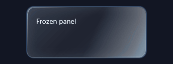</a> <b>Frost-Edge</b> <code>fx-frost-edge</code></td><td align="center" valign="top" width="33%"><a href="../html/fx-magma-flow.html">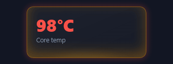</a> <b>Magma-Flow</b> <code>fx-magma-flow</code></td><td align="center" valign="top" width="33%"> <b>Aurora-Border</b> <code>fx-aurora-border</code></td></tr>
</table>

## Comet

<table>
<tr><td align="center" valign="top" width="33%"> <b>Comet-Trail</b> <code>fx-comet-trail</code></td><td align="center" valign="top" width="33%"><a href="../html/fx-conic-gradient-border.html">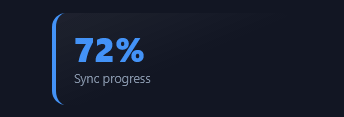</a> <b>Conic-Gradient-Border</b> <code>fx-conic-gradient-border</code></td><td align="center" valign="top" width="33%"> <b>Sheen-Sweep</b> <code>fx-sheen-sweep</code></td></tr>
</table>

## Grain, Parallax & Pointer

<table>
<tr><td align="center" valign="top" width="33%"> <b>Noise-Grain</b> <code>fx-noise-grain</code></td><td align="center" valign="top" width="33%"> <b>Depth-Parallax</b> <code>fx-depth-parallax</code></td><td align="center" valign="top" width="33%"> <b>Ripple-on-Hover</b> <code>fx-ripple-on-hover</code></td></tr>
<tr><td align="center" valign="top" width="33%"> <b>Spotlight-Follow</b> <code>fx-spotlight-follow</code></td></tr>
</table>

## New

<table>
<tr><td align="center" valign="top" width="33%"> <b>Heartbeat</b> <code>fx-heartbeat</code></td><td align="center" valign="top" width="33%"> <b>Jelly</b> <code>fx-jelly</code></td><td align="center" valign="top" width="33%"> <b>Neon Flicker</b> <code>fx-neon-flicker-2</code></td></tr>
<tr><td align="center" valign="top" width="33%"> <b>Vertical Scan</b> <code>fx-vertical-scan</code></td><td align="center" valign="top" width="33%"> <b>Hologram</b> <code>fx-hologram-2</code></td><td align="center" valign="top" width="33%"><a href="../html/fx-frost-2.html">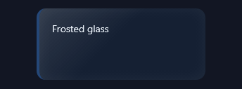</a> <b>Frost</b> <code>fx-frost-2</code> · static</td></tr>
<tr><td align="center" valign="top" width="33%"> <b>Ember Rise</b> <code>fx-ember-rise</code></td><td align="center" valign="top" width="33%"> <b>Glint</b> <code>fx-glint</code></td><td align="center" valign="top" width="33%"> <b>Orbit Dot</b> <code>fx-orbit-dot</code></td></tr>
<tr><td align="center" valign="top" width="33%"> <b>Underline Grow</b> <code>fx-underline-grow</code></td><td align="center" valign="top" width="33%"> <b>RGB Split</b> <code>fx-rgb-split</code></td><td align="center" valign="top" width="33%"><a href="../html/fx-warp.html">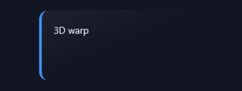</a> <b>Warp</b> <code>fx-warp</code></td></tr>
<tr><td align="center" valign="top" width="33%"> <b>Dashed Spin</b> <code>fx-dashed-spin</code></td><td align="center" valign="top" width="33%"> <b>Corner Cut</b> <code>fx-corner-cut</code> · static</td><td align="center" valign="top" width="33%"><a href="../html/fx-scan-grid.html">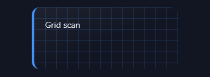</a> <b>Scan Grid</b> <code>fx-scan-grid</code></td></tr>
<tr><td align="center" valign="top" width="33%"><a href="../html/fx-light-sweep.html">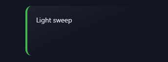</a> <b>Light Sweep</b> <code>fx-light-sweep</code></td><td align="center" valign="top" width="33%"> <b>Float</b> <code>fx-float-2</code></td><td align="center" valign="top" width="33%"><a href="../html/fx-radar-sweep-2.html">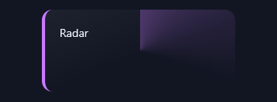</a> <b>Radar Sweep</b> <code>fx-radar-sweep-2</code></td></tr>
<tr><td align="center" valign="top" width="33%"><a href="../html/fx-aurora-drift.html">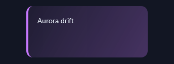</a> <b>Aurora Drift</b> <code>fx-aurora-drift</code></td><td align="center" valign="top" width="33%"> <b>Spark Corners</b> <code>fx-spark-corners</code></td><td align="center" valign="top" width="33%"> <b>Depth Stack</b> <code>fx-depth-stack</code></td></tr>
<tr><td align="center" valign="top" width="33%"><a href="../html/fx-liquid-border.html">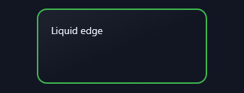</a> <b>Liquid Border</b> <code>fx-liquid-border</code></td><td align="center" valign="top" width="33%"> <b>VHS Tracking</b> <code>fx-vhs-tracking</code></td><td align="center" valign="top" width="33%"> <b>Halo Rotate</b> <code>fx-halo-rotate</code></td></tr>
<tr><td align="center" valign="top" width="33%"><a href="../html/fx-breathe-glow.html">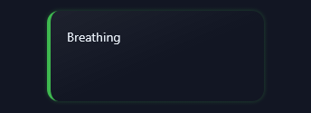</a> <b>Breathe Glow</b> <code>fx-breathe-glow</code></td><td align="center" valign="top" width="33%"> <b>Scan Dot</b> <code>fx-scan-dot</code></td><td align="center" valign="top" width="33%"><a href="../html/fx-gradient-border.html">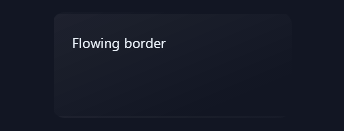</a> <b>Gradient Border</b> <code>fx-gradient-border</code></td></tr>
<tr><td align="center" valign="top" width="33%"> <b>Glow Text</b> <code>fx-glow-text</code></td><td align="center" valign="top" width="33%"><a href="../html/fx-shimmer.html">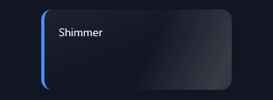</a> <b>Shimmer</b> <code>fx-shimmer</code></td><td align="center" valign="top" width="33%"> <b>Pop</b> <code>fx-pop-2</code></td></tr>
<tr><td align="center" valign="top" width="33%"> <b>Wobble</b> <code>fx-wobble-2</code></td><td align="center" valign="top" width="33%"> <b>Tilt 3D (hover)</b> <code>fx-tilt-3d-hover</code></td></tr>
</table>

## 3D & Depth FX

<table>
<tr><td align="center" valign="top" width="33%"> <b>Lift</b> <code>fx-lift</code></td><td align="center" valign="top" width="33%"> <b>Flip-Glow</b> <code>fx-flip-glow</code></td><td align="center" valign="top" width="33%"> <b>Extrude</b> <code>fx-extrude</code></td></tr>
<tr><td align="center" valign="top" width="33%"> <b>Isometric</b> <code>fx-isometric</code></td><td align="center" valign="top" width="33%"> <b>Parallax Layers</b> <code>fx-parallax-layers</code></td><td align="center" valign="top" width="33%"> <b>Perspective Shimmer</b> <code>fx-perspective-shimmer</code></td></tr>
<tr><td align="center" valign="top" width="33%"> <b>Swing-3D</b> <code>fx-swing-3d</code></td><td align="center" valign="top" width="33%"> <b>Depth-Pop</b> <code>fx-depth-pop</code></td></tr>
</table>

## Glow, Border & Holographic FX

<table>
<tr><td align="center" valign="top" width="33%"> <b>Plasma-Ring</b> <code>fx-plasma-ring</code></td><td align="center" valign="top" width="33%"> <b>Laser-Border</b> <code>fx-laser-border</code></td><td align="center" valign="top" width="33%"> <b>Prism-Edge</b> <code>fx-prism-edge</code></td></tr>
<tr><td align="center" valign="top" width="33%"> <b>Edge-Cycle</b> <code>fx-edge-cycle</code></td><td align="center" valign="top" width="33%"><a href="../html/fx-holo-grid.html">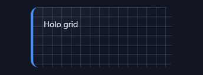</a> <b>Holo-Grid</b> <code>fx-holo-grid</code></td><td align="center" valign="top" width="33%"><a href="../html/fx-oil-slick.html">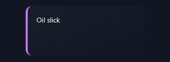</a> <b>Oil-Slick</b> <code>fx-oil-slick</code></td></tr>
<tr><td align="center" valign="top" width="33%"> <b>Nebula</b> <code>fx-nebula</code></td><td align="center" valign="top" width="33%"> <b>Vortex</b> <code>fx-vortex</code></td><td align="center" valign="top" width="33%"> <b>Magnetic-Pulse</b> <code>fx-magnetic-pulse</code></td></tr>
<tr><td align="center" valign="top" width="33%"> <b>Spark-Burst</b> <code>fx-spark-burst</code></td><td align="center" valign="top" width="33%"> <b>Star-Field</b> <code>fx-star-field</code></td></tr>
</table>

## Glass, Glitch, Liquid & Energy FX

<table>
<tr><td align="center" valign="top" width="33%"> <b>Glass-Sheen</b> <code>fx-glass-sheen</code></td><td align="center" valign="top" width="33%"><a href="../html/fx-frost-crack.html">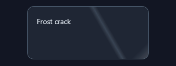</a> <b>Frost-Crack</b> <code>fx-frost-crack</code></td><td align="center" valign="top" width="33%"> <b>Glitch-Slice</b> <code>fx-glitch-slice</code></td></tr>
<tr><td align="center" valign="top" width="33%"><a href="../html/fx-shatter.html">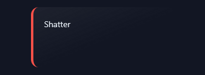</a> <b>Shatter</b> <code>fx-shatter</code></td><td align="center" valign="top" width="33%"> <b>Liquid-Rise</b> <code>fx-liquid-rise</code></td><td align="center" valign="top" width="33%"> <b>Ripple-Out</b> <code>fx-ripple-out</code></td></tr>
<tr><td align="center" valign="top" width="33%"> <b>Electric-Arc</b> <code>fx-electric-arc</code></td><td align="center" valign="top" width="33%"> <b>Beam-Cross</b> <code>fx-beam-cross</code></td><td align="center" valign="top" width="33%"> <b>Data-Rain</b> <code>fx-data-rain</code></td></tr>
<tr><td align="center" valign="top" width="33%"> <b>HUD-Brackets</b> <code>fx-hud-brackets</code></td><td align="center" valign="top" width="33%"><a href="../html/fx-pulse-grid.html">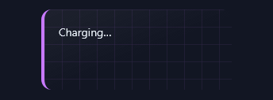</a> <b>Pulse-Grid</b> <code>fx-pulse-grid</code></td></tr>
</table>

## Pokémon Battle

<table>
<tr><td align="center" valign="top" width="33%"><a href="../html/fx-pkmn-mega-brave.html">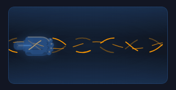</a> <b>Mega Brave</b> <code>fx-pkmn-mega-brave</code></td><td align="center" valign="top" width="33%"> <b>Aura Jab</b> <code>fx-pkmn-aura-jab</code></td><td align="center" valign="top" width="33%"><a href="../html/fx-pkmn-phantom-dive.html">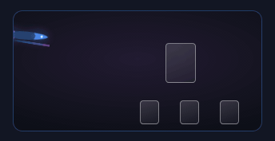</a> <b>Phantom Dive</b> <code>fx-pkmn-phantom-dive</code></td></tr>
<tr><td align="center" valign="top" width="33%"><a href="../html/fx-pkmn-powerful-hand.html">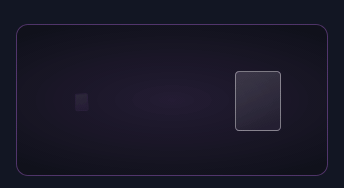</a> <b>Powerful Hand</b> <code>fx-pkmn-powerful-hand</code></td><td align="center" valign="top" width="33%"> <b>Superb Scissors</b> <code>fx-pkmn-superb-scissors</code></td><td align="center" valign="top" width="33%"><a href="../html/fx-pkmn-wild-press.html">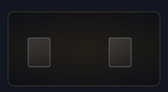</a> <b>Wild Press</b> <code>fx-pkmn-wild-press</code></td></tr>
<tr><td align="center" valign="top" width="33%"> <b>Shooting Moons</b> <code>fx-pkmn-shooting-moons</code></td><td align="center" valign="top" width="33%"> <b>Night Joker</b> <code>fx-pkmn-night-joker</code></td><td align="center" valign="top" width="33%"><a href="../html/fx-pkmn-corridor-prism-eevee.html">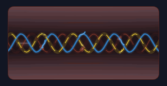</a> <b>Prismatic Corridor (tri-type)</b> <code>fx-pkmn-corridor-prism-eevee</code></td></tr>
<tr><td align="center" valign="top" width="33%"><a href="../html/fx-pkmn-corridor-aquamarine.html">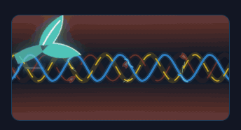</a> <b>Aquamarine Corridor (Vaporeon ex)</b> <code>fx-pkmn-corridor-aquamarine</code></td><td align="center" valign="top" width="33%"><a href="../html/fx-pkmn-corridor-dravite.html">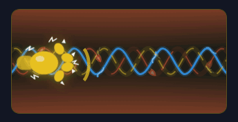</a> <b>Dravite Corridor (Jolteon ex)</b> <code>fx-pkmn-corridor-dravite</code></td><td align="center" valign="top" width="33%"><a href="../html/fx-pkmn-corridor-carnelian.html">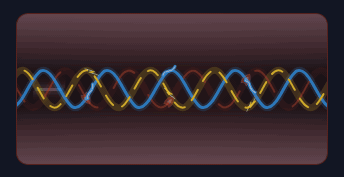</a> <b>Carnelian Corridor (Flareon ex)</b> <code>fx-pkmn-corridor-carnelian</code></td></tr>
<tr><td align="center" valign="top" width="33%"><a href="../html/fx-pkmn-corridor-fighting-fist.html">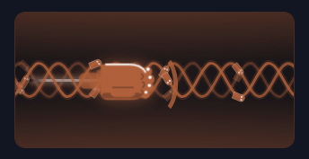</a> <b>Fighting Corridor (Impact Blow)</b> <code>fx-pkmn-corridor-fighting-fist</code></td><td align="center" valign="top" width="33%"><a href="../html/fx-pkmn-corridor-fire-dive.html">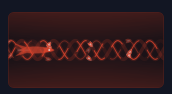</a> <b>Fire Corridor (Fighting Wings)</b> <code>fx-pkmn-corridor-fire-dive</code></td><td align="center" valign="top" width="33%"><a href="../html/fx-pkmn-corridor-water-crescent.html">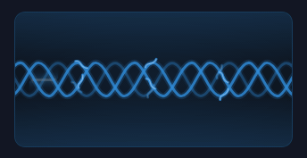</a> <b>Water Corridor (Hypno Splash)</b> <code>fx-pkmn-corridor-water-crescent</code></td></tr>
<tr><td align="center" valign="top" width="33%"><a href="../html/fx-pkmn-corridor-lightning-beam.html">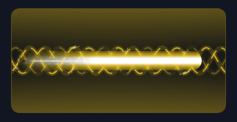</a> <b>Lightning Corridor (Thunder Raid)</b> <code>fx-pkmn-corridor-lightning-beam</code></td><td align="center" valign="top" width="33%"><a href="../html/fx-pkmn-corridor-grass-blade.html">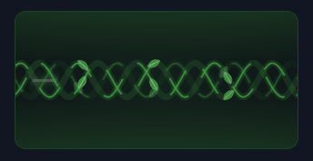</a> <b>Grass Corridor (Prism Edge)</b> <code>fx-pkmn-corridor-grass-blade</code></td><td align="center" valign="top" width="33%"><a href="../html/fx-pkmn-corridor-psychic-orb.html">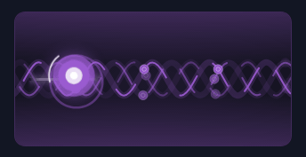</a> <b>Psychic Corridor (Miracle Force)</b> <code>fx-pkmn-corridor-psychic-orb</code></td></tr>
<tr><td align="center" valign="top" width="33%"><a href="../html/fx-pkmn-corridor-darkness-orb.html">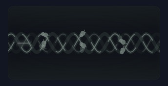</a> <b>Darkness Corridor (Shadow Bullet)</b> <code>fx-pkmn-corridor-darkness-orb</code></td><td align="center" valign="top" width="33%"><a href="../html/fx-pkmn-corridor-metal-palm.html">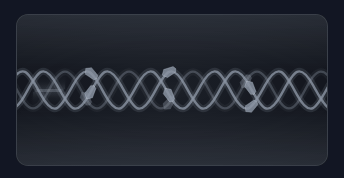</a> <b>Metal Corridor (Metallic Hammer)</b> <code>fx-pkmn-corridor-metal-palm</code></td><td align="center" valign="top" width="33%"><a href="../html/fx-pkmn-corridor-colorless-combo.html">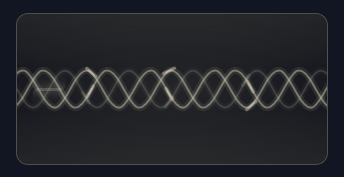</a> <b>Colorless Corridor (Rapid-Fire Combo)</b> <code>fx-pkmn-corridor-colorless-combo</code></td></tr>
</table>

## Elemental Base

<table>
<tr><td align="center" valign="top" width="33%"><a href="../html/fx-elem-spray.html">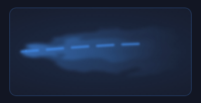</a> <b>Elemental Spray</b> <code>fx-elem-spray</code></td><td align="center" valign="top" width="33%"> <b>Elemental Bolt</b> <code>fx-elem-bolt</code></td><td align="center" valign="top" width="33%"> <b>Elemental Streak</b> <code>fx-elem-streak</code></td></tr>
<tr><td align="center" valign="top" width="33%"><a href="../html/fx-elem-burst.html">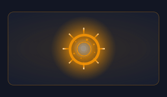</a> <b>Elemental Burst</b> <code>fx-elem-burst</code></td><td align="center" valign="top" width="33%"><a href="../html/fx-elem-aura.html">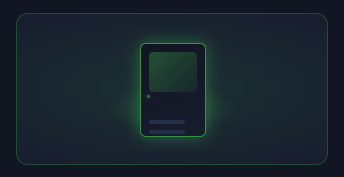</a> <b>Elemental Aura</b> <code>fx-elem-aura</code></td><td align="center" valign="top" width="33%"> <b>Elemental Volley</b> <code>fx-elem-volley</code></td></tr>
</table>

## GLOW SYSTEM

<table>
<tr><td align="center" valign="top" width="33%"> <b>Glow Ring</b> <code>fx-glow-ring</code></td><td align="center" valign="top" width="33%"> <b>Glow Button</b> <code>fx-glow-button</code></td><td align="center" valign="top" width="33%"><a href="../html/fx-glow-card-edge.html">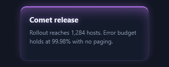</a> <b>Glow Card Edge</b> <code>fx-glow-card-edge</code></td></tr>
<tr><td align="center" valign="top" width="33%"> <b>Glow Trail</b> <code>fx-glow-trail</code></td><td align="center" valign="top" width="33%"> <b>Glow Divider</b> <code>fx-glow-divider</code></td><td align="center" valign="top" width="33%"> <b>Glow Badge</b> <code>fx-glow-badge</code></td></tr>
<tr><td align="center" valign="top" width="33%"> <b>Glow Input Focus</b> <code>fx-glow-input-focus</code></td><td align="center" valign="top" width="33%"><a href="../html/fx-glow-toggle.html">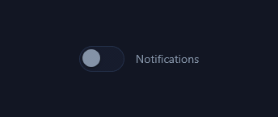</a> <b>Glow Toggle</b> <code>fx-glow-toggle</code></td><td align="center" valign="top" width="33%"><a href="../html/fx-glow-progress.html">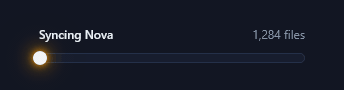</a> <b>Glow Progress</b> <code>fx-glow-progress</code></td></tr>
<tr><td align="center" valign="top" width="33%"><a href="../html/fx-glow-chip.html">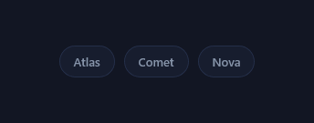</a> <b>Glow Chip</b> <code>fx-glow-chip</code></td><td align="center" valign="top" width="33%"> <b>Glow Tooltip Pointer</b> <code>fx-glow-tooltip-pointer</code></td><td align="center" valign="top" width="33%"><a href="../html/fx-glow-hover-lift.html">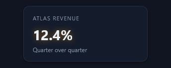</a> <b>Glow Hover Lift</b> <code>fx-glow-hover-lift</code></td></tr>
<tr><td align="center" valign="top" width="33%"> <b>Glow Underline</b> <code>fx-glow-underline</code></td><td align="center" valign="top" width="33%"> <b>Glow Avatar Ring</b> <code>fx-glow-avatar-ring</code></td><td align="center" valign="top" width="33%"> <b>Glow Marker on a Line</b> <code>fx-glow-marker-on-a-line</code></td></tr>
<tr><td align="center" valign="top" width="33%"> <b>Glow Status Dot Set</b> <code>fx-glow-status-dot-set</code></td><td align="center" valign="top" width="33%"> <b>Glow Keyboard Key</b> <code>fx-glow-keyboard-key</code></td><td align="center" valign="top" width="33%"> <b>Glow Slider Thumb</b> <code>fx-glow-slider-thumb</code></td></tr>
<tr><td align="center" valign="top" width="33%"> <b>Glow Focus Corners</b> <code>fx-glow-focus-corners</code></td><td align="center" valign="top" width="33%"> <b>Glow Checkbox</b> <code>fx-glow-checkbox</code></td></tr>
</table>

## HOVER & REVEAL

<table>
<tr><td align="center" valign="top" width="33%"> <b>Tilt Gloss</b> <code>fx-tilt-gloss</code></td><td align="center" valign="top" width="33%"> <b>Perimeter Draw</b> <code>fx-perimeter-draw</code></td><td align="center" valign="top" width="33%"> <b>Bracket Snap</b> <code>fx-bracket-snap</code></td></tr>
<tr><td align="center" valign="top" width="33%"> <b>Zoom Caption</b> <code>fx-zoom-caption</code></td><td align="center" valign="top" width="33%"> <b>Diagonal Wipe</b> <code>fx-diagonal-wipe</code></td><td align="center" valign="top" width="33%"> <b>Split Reveal</b> <code>fx-split-reveal</code></td></tr>
<tr><td align="center" valign="top" width="33%"> <b>Icon Nudge</b> <code>fx-icon-nudge</code></td><td align="center" valign="top" width="33%"> <b>Fan Lift</b> <code>fx-fan-lift</code></td><td align="center" valign="top" width="33%"> <b>Shadow Stack</b> <code>fx-shadow-stack</code></td></tr>
<tr><td align="center" valign="top" width="33%"> <b>Colour Flood</b> <code>fx-colour-flood</code></td><td align="center" valign="top" width="33%"> <b>Blur Focus</b> <code>fx-blur-focus</code></td><td align="center" valign="top" width="33%"> <b>Flip Card</b> <code>fx-flip-card</code></td></tr>
<tr><td align="center" valign="top" width="33%"> <b>Magnetic Label</b> <code>fx-magnetic-label</code></td><td align="center" valign="top" width="33%"> <b>Ripple Press</b> <code>fx-ripple-press</code></td><td align="center" valign="top" width="33%"> <b>Scramble Clear</b> <code>fx-scramble-clear</code></td></tr>
<tr><td align="center" valign="top" width="33%"> <b>Curtain Part</b> <code>fx-curtain-part</code></td><td align="center" valign="top" width="33%"> <b>Zoom Out Reveal</b> <code>fx-zoom-out-reveal</code></td><td align="center" valign="top" width="33%"> <b>Outline Pulse</b> <code>fx-outline-pulse</code></td></tr>
<tr><td align="center" valign="top" width="33%"> <b>Shutter Reveal</b> <code>fx-shutter-reveal</code></td><td align="center" valign="top" width="33%"> <b>Peel Corner</b> <code>fx-peel-corner</code></td></tr>
</table>

## DECK & HAND

<table>
<tr><td align="center" valign="top" width="33%"> <b>Draw from Deck</b> <code>fx-draw-from-deck</code></td><td align="center" valign="top" width="33%"> <b>Draw from Discard</b> <code>fx-draw-from-discard</code></td><td align="center" valign="top" width="33%"> <b>Deal Out</b> <code>fx-deal-out</code></td></tr>
<tr><td align="center" valign="top" width="33%"> <b>Fan a Hand</b> <code>fx-fan-a-hand</code></td><td align="center" valign="top" width="33%"> <b>Riffle &amp; Bridge</b> <code>fx-riffle-bridge</code></td><td align="center" valign="top" width="33%"> <b>Overhand Shuffle</b> <code>fx-overhand-shuffle</code></td></tr>
<tr><td align="center" valign="top" width="33%"> <b>Table Wash</b> <code>fx-table-wash</code></td></tr>
</table>

## CARD MOTION & FOIL

<table>
<tr><td align="center" valign="top" width="33%"> <b>Rainbow Holo</b> <code>fx-rainbow-holo</code></td><td align="center" valign="top" width="33%"> <b>Cosmos Holo</b> <code>fx-cosmos-holo</code></td><td align="center" valign="top" width="33%"> <b>Shine</b> <code>fx-shine</code></td></tr>
<tr><td align="center" valign="top" width="33%"> <b>Linear Foil</b> <code>fx-linear-foil</code></td><td align="center" valign="top" width="33%"> <b>Reverse Holo</b> <code>fx-reverse-holo</code></td><td align="center" valign="top" width="33%"> <b>Etched Foil</b> <code>fx-etched-foil</code></td></tr>
<tr><td align="center" valign="top" width="33%"> <b>Prismatic</b> <code>fx-prismatic</code></td><td align="center" valign="top" width="33%"> <b>Gold Foil</b> <code>fx-gold-foil</code></td><td align="center" valign="top" width="33%"> <b>Flip Over</b> <code>fx-flip-over</code></td></tr>
<tr><td align="center" valign="top" width="33%"> <b>Flip Up</b> <code>fx-flip-up</code></td><td align="center" valign="top" width="33%"> <b>Tap</b> <code>fx-tap</code></td><td align="center" valign="top" width="33%"> <b>Upside Down</b> <code>fx-upside-down</code></td></tr>
<tr><td align="center" valign="top" width="33%"> <b>Deal In</b> <code>fx-deal-in</code></td><td align="center" valign="top" width="33%"> <b>Toss Spin</b> <code>fx-toss-spin</code></td><td align="center" valign="top" width="33%"> <b>Peek</b> <code>fx-peek</code></td></tr>
<tr><td align="center" valign="top" width="33%"> <b>Flip + Holo</b> <code>fx-flip-holo</code></td><td align="center" valign="top" width="33%"> <b>Tap + Etched</b> <code>fx-tap-etched</code></td><td align="center" valign="top" width="33%"> <b>Live Holo Tilt</b> <code>fx-live-holo-tilt</code></td></tr>
</table>

## TCG FOIL STYLES

<table>
<tr><td align="center" valign="top" width="33%"> <b>Cracked Ice</b> <code>fx-cracked-ice</code></td><td align="center" valign="top" width="33%"> <b>Tinsel</b> <code>fx-tinsel</code></td><td align="center" valign="top" width="33%"> <b>Water Web</b> <code>fx-water-web</code></td></tr>
<tr><td align="center" valign="top" width="33%"> <b>Starlight</b> <code>fx-starlight</code></td><td align="center" valign="top" width="33%"> <b>Stamped Orbs</b> <code>fx-stamped-orbs</code></td><td align="center" valign="top" width="33%"> <b>Honeycomb</b> <code>fx-honeycomb</code></td></tr>
<tr><td align="center" valign="top" width="33%"> <b>Surge Foil</b> <code>fx-surge-foil</code></td><td align="center" valign="top" width="33%"> <b>Halo Foil</b> <code>fx-halo-foil</code></td><td align="center" valign="top" width="33%"> <b>Confetti Foil</b> <code>fx-confetti-foil</code></td></tr>
<tr><td align="center" valign="top" width="33%"> <b>Oil Slick</b> <code>fx-oil-slick-2</code></td><td align="center" valign="top" width="33%"> <b>Glyph Stamp</b> <code>fx-glyph-stamp</code></td><td align="center" valign="top" width="33%"> <b>Dragon-Scale</b> <code>fx-dragon-scale</code></td></tr>
<tr><td align="center" valign="top" width="33%"> <b>Cold Foil</b> <code>fx-cold-foil</code></td><td align="center" valign="top" width="33%"> <b>Enchanted</b> <code>fx-enchanted</code></td></tr>
</table>
