# Input Methods

Every effect in Prism's **Input Methods** gallery, recorded as a looping GIF.

**116 effects** · 100 animated · 725 KB of GIF · click any GIF to open its standalone HTML sample (raw file; open it locally, GitHub shows source).

[← Showcase index](../README.md)

**Sections:** [Text Inputs](#text-inputs) · [Search & Command Line](#search-command-line) · [Selection & Choice](#selection-choice) · [Range, Number & Rating](#range-number-rating) · [Auth & Secure Inputs](#auth-secure-inputs) · [Survey & Ordering](#survey-ordering) · [File Upload & Processing](#file-upload-processing) · [Buttons & Actions](#buttons-actions) · [Composite Inputs](#composite-inputs) · [Date & Time](#date-time) · [Voice & Media Capture](#voice-media-capture) · [Drawing & Signature](#drawing-signature) · [Location & Region](#location-region) · [Structured & Matrix Inputs](#structured-matrix-inputs) · [3D & Depth Controls](#3d-depth-controls) · [Fields, Pickers & Actions](#fields-pickers-actions) · [BUTTON HOVER EFFECTS](#button-hover-effects)

## Text Inputs

<table>
<tr><td align="center" valign="top" width="33%"><a href="../html/input-basic-text-input.html">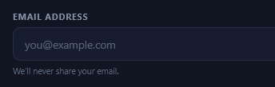</a> <b>Basic Text Input</b> <code>input-basic-text-input</code></td><td align="center" valign="top" width="33%"><a href="../html/input-validation-states.html">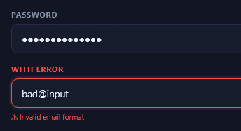</a> <b>Validation States</b> <code>input-validation-states</code></td><td align="center" valign="top" width="33%"><a href="../html/input-textarea-multi-line.html">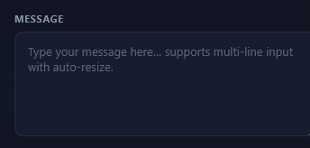</a> <b>Textarea / Multi-line</b> <code>input-textarea-multi-line</code></td></tr>
<tr><td align="center" valign="top" width="33%"><a href="../html/input-tag-token-input.html">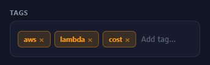</a> <b>Tag / Token Input</b> <code>input-tag-token-input</code></td><td align="center" valign="top" width="33%"><a href="../html/input-floating-label-fields.html">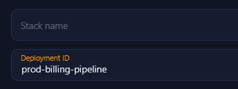</a> <b>Floating-Label Fields</b> <code>input-floating-label-fields</code></td><td align="center" valign="top" width="33%"><a href="../html/input-character-count-textarea.html">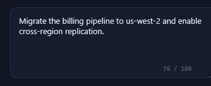</a> <b>Character-Count Textarea</b> <code>input-character-count-textarea</code></td></tr>
<tr><td align="center" valign="top" width="33%"> <b>Inline Edit / Rename</b> <code>input-inline-edit-rename</code></td><td align="center" valign="top" width="33%"><a href="../html/input-formatted-phone-input.html">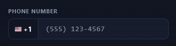</a> <b>Formatted Phone Input</b> <code>input-formatted-phone-input</code></td></tr>
</table>

## Search & Command Line

<table>
<tr><td align="center" valign="top" width="33%"><a href="../html/input-search-bar.html">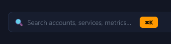</a> <b>Search Bar</b> <code>input-search-bar</code></td><td align="center" valign="top" width="33%"><a href="../html/input-command-line-input.html">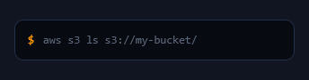</a> <b>Command Line Input</b> <code>input-command-line-input</code> · static</td><td align="center" valign="top" width="33%"><a href="../html/input-command-line-history.html">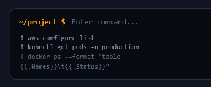</a> <b>Command Line + History</b> <code>input-command-line-history</code> · static</td></tr>
<tr><td align="center" valign="top" width="33%"><a href="../html/input-ai-prompt-suggestions.html">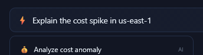</a> <b>AI Prompt + Suggestions</b> <code>input-ai-prompt-suggestions</code></td><td align="center" valign="top" width="33%"><a href="../html/input-command-palette.html">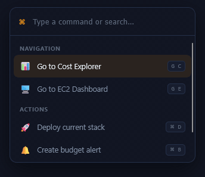</a> <b>Command Palette</b> <code>input-command-palette</code></td><td align="center" valign="top" width="33%"><a href="../html/input-autocomplete-dropdown.html">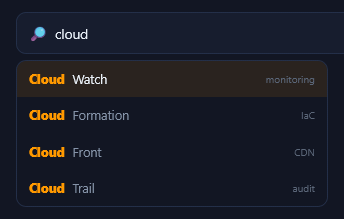</a> <b>Autocomplete Dropdown</b> <code>input-autocomplete-dropdown</code></td></tr>
</table>

## Selection & Choice

<table>
<tr><td align="center" valign="top" width="33%"><a href="../html/input-radio-group.html">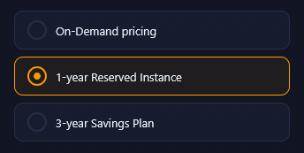</a> <b>Radio Group</b> <code>input-radio-group</code></td><td align="center" valign="top" width="33%"><a href="../html/input-checkbox-group.html">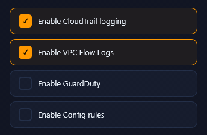</a> <b>Checkbox Group</b> <code>input-checkbox-group</code></td><td align="center" valign="top" width="33%"> <b>Dropdown Select</b> <code>input-dropdown-select</code> · static</td></tr>
<tr><td align="center" valign="top" width="33%"><a href="../html/input-chip-pill-select.html">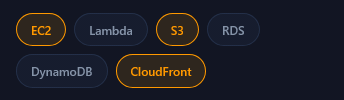</a> <b>Chip / Pill Select</b> <code>input-chip-pill-select</code></td><td align="center" valign="top" width="33%"> <b>Toggle Switches</b> <code>input-toggle-switches</code></td><td align="center" valign="top" width="33%"> <b>Segmented Control (sliding thumb)</b> <code>input-segmented-control-sliding-thumb</code></td></tr>
<tr><td align="center" valign="top" width="33%"><a href="../html/input-toggle-variants.html">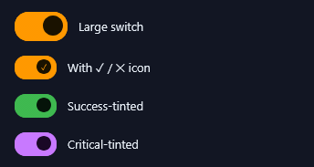</a> <b>Toggle Variants</b> <code>input-toggle-variants</code></td><td align="center" valign="top" width="33%"><a href="../html/input-multi-select-combobox.html">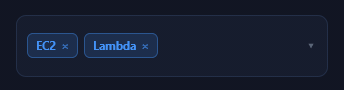</a> <b>Multi-Select Combobox</b> <code>input-multi-select-combobox</code></td><td align="center" valign="top" width="33%"> <b>Radio Pills</b> <code>input-radio-pills</code></td></tr>
</table>

## Range, Number & Rating

<table>
<tr><td align="center" valign="top" width="33%"><a href="../html/input-range-slider.html">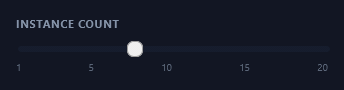</a> <b>Range Slider</b> <code>input-range-slider</code> · static</td><td align="center" valign="top" width="33%"> <b>Number Stepper</b> <code>input-number-stepper</code></td><td align="center" valign="top" width="33%"> <b>Star Rating</b> <code>input-star-rating</code></td></tr>
<tr><td align="center" valign="top" width="33%"><a href="../html/input-otp-verification-code.html">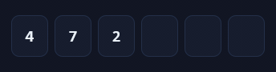</a> <b>OTP / Verification Code</b> <code>input-otp-verification-code</code></td><td align="center" valign="top" width="33%"><a href="../html/input-date-range-input.html">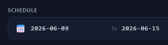</a> <b>Date Range Input</b> <code>input-date-range-input</code> · static</td><td align="center" valign="top" width="33%"><a href="../html/input-color-picker-swatch.html">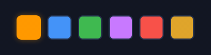</a> <b>Color Picker (swatch)</b> <code>input-color-picker-swatch</code></td></tr>
<tr><td align="center" valign="top" width="33%"><a href="../html/input-slider-with-floating-tooltip.html">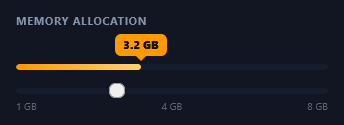</a> <b>Slider with Floating Tooltip</b> <code>input-slider-with-floating-tooltip</code></td><td align="center" valign="top" width="33%"><a href="../html/input-dual-handle-range-slider.html">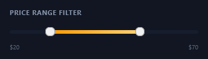</a> <b>Dual-Handle Range Slider</b> <code>input-dual-handle-range-slider</code> · static</td><td align="center" valign="top" width="33%"><a href="../html/input-native-color-hex-field.html">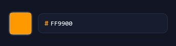</a> <b>Native Color + Hex Field</b> <code>input-native-color-hex-field</code> · static</td></tr>
<tr><td align="center" valign="top" width="33%"> <b>Emoji / Mood Rating</b> <code>input-emoji-mood-rating</code></td><td align="center" valign="top" width="33%"> <b>Thumbs / Reaction Vote</b> <code>input-thumbs-reaction-vote</code></td><td align="center" valign="top" width="33%"><a href="../html/input-time-spinner-field.html">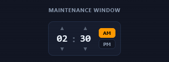</a> <b>Time Spinner Field</b> <code>input-time-spinner-field</code></td></tr>
<tr><td align="center" valign="top" width="33%"> <b>Circular Knob Input</b> <code>input-circular-knob-input</code></td></tr>
</table>

## Auth & Secure Inputs

<table>
<tr><td align="center" valign="top" width="33%"><a href="../html/input-password-strength-meter.html">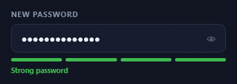</a> <b>Password Strength Meter</b> <code>input-password-strength-meter</code></td><td align="center" valign="top" width="33%"><a href="../html/input-pin-pad-dots.html">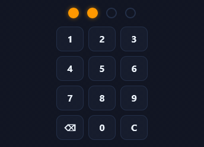</a> <b>PIN Pad + Dots</b> <code>input-pin-pad-dots</code></td><td align="center" valign="top" width="33%"><a href="../html/input-copy-to-clipboard-field.html">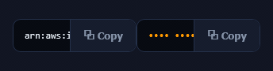</a> <b>Copy-to-Clipboard Field</b> <code>input-copy-to-clipboard-field</code></td></tr>
</table>

## Survey & Ordering

<table>
<tr><td align="center" valign="top" width="33%"><a href="../html/input-nps-0-10-scale.html">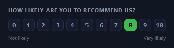</a> <b>NPS / 0–10 Scale</b> <code>input-nps-0-10-scale</code></td><td align="center" valign="top" width="33%"><a href="../html/input-drag-to-reorder-list.html">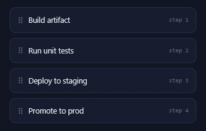</a> <b>Drag-to-Reorder List</b> <code>input-drag-to-reorder-list</code></td></tr>
</table>

## File Upload & Processing

<table>
<tr><td align="center" valign="top" width="33%"> <b>Drag &amp; Drop Zone</b> <code>input-drag-drop-zone</code></td><td align="center" valign="top" width="33%"><a href="../html/input-file-upload-progress.html">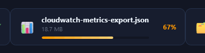</a> <b>File Upload Progress</b> <code>input-file-upload-progress</code></td><td align="center" valign="top" width="33%"><a href="../html/input-upload-pipeline-states.html">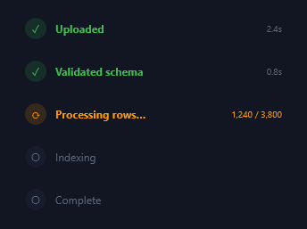</a> <b>Upload Pipeline States</b> <code>input-upload-pipeline-states</code></td></tr>
<tr><td align="center" valign="top" width="33%"><a href="../html/input-uploaded-file-card.html">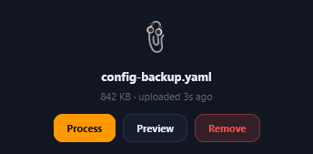</a> <b>Uploaded File Card</b> <code>input-uploaded-file-card</code></td></tr>
</table>

## Buttons & Actions

<table>
<tr><td align="center" valign="top" width="33%"><a href="../html/input-button-variants.html">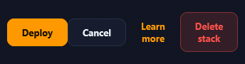</a> <b>Button Variants</b> <code>input-button-variants</code></td><td align="center" valign="top" width="33%"> <b>Icon Buttons</b> <code>input-icon-buttons</code></td><td align="center" valign="top" width="33%"> <b>Segmented Control / Button Group</b> <code>input-segmented-control-button-group</code> · static</td></tr>
<tr><td align="center" valign="top" width="33%"><a href="../html/input-loading-success-states.html">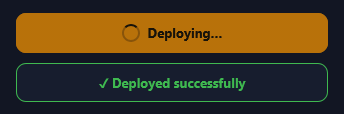</a> <b>Loading &amp; Success States</b> <code>input-loading-success-states</code></td></tr>
</table>

## Composite Inputs

<table>
<tr><td align="center" valign="top" width="33%"> <b>Input + Button Combo</b> <code>input-input-button-combo</code></td><td align="center" valign="top" width="33%"> <b>Prefix + Suffix Input</b> <code>input-prefix-suffix-input</code> · static</td><td align="center" valign="top" width="33%"> <b>Multi-Select Row</b> <code>input-multi-select-row</code></td></tr>
<tr><td align="center" valign="top" width="33%"><a href="../html/input-structured-expression-input.html">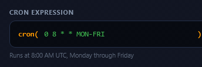</a> <b>Structured Expression Input</b> <code>input-structured-expression-input</code> · static</td><td align="center" valign="top" width="33%"><a href="../html/input-action-grid.html">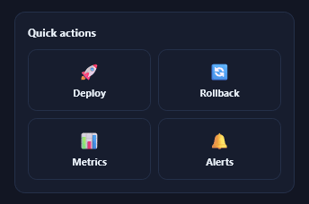</a> <b>Action Grid</b> <code>input-action-grid</code></td><td align="center" valign="top" width="33%"><a href="../html/input-code-json-editor.html">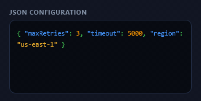</a> <b>Code / JSON Editor</b> <code>input-code-json-editor</code> · static</td></tr>
</table>

## Date & Time

<table>
<tr><td align="center" valign="top" width="33%"><a href="../html/input-inline-calendar-picker.html">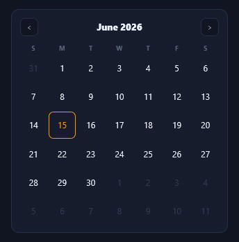</a> <b>Inline Calendar Picker</b> <code>input-inline-calendar-picker</code></td><td align="center" valign="top" width="33%"> <b>Date-Range Picker</b> <code>input-date-range-picker</code></td><td align="center" valign="top" width="33%"><a href="../html/input-month-quarter-grid.html">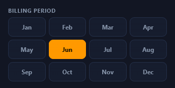</a> <b>Month / Quarter Grid</b> <code>input-month-quarter-grid</code></td></tr>
<tr><td align="center" valign="top" width="33%"><a href="../html/input-relative-time-presets.html">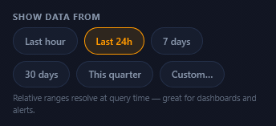</a> <b>Relative-Time Presets</b> <code>input-relative-time-presets</code></td></tr>
</table>

## Voice & Media Capture

<table>
<tr><td align="center" valign="top" width="33%"><a href="../html/input-voice-recorder.html">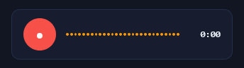</a> <b>Voice Recorder</b> <code>input-voice-recorder</code></td><td align="center" valign="top" width="33%"><a href="../html/input-audio-scrubber.html">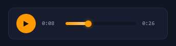</a> <b>Audio Scrubber</b> <code>input-audio-scrubber</code> · static</td><td align="center" valign="top" width="33%"><a href="../html/input-media-capture-dropzone.html">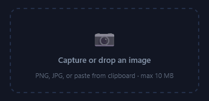</a> <b>Media Capture Dropzone</b> <code>input-media-capture-dropzone</code></td></tr>
</table>

## Drawing & Signature

<table>
<tr><td align="center" valign="top" width="33%"><a href="../html/input-signature-sketch-pad.html">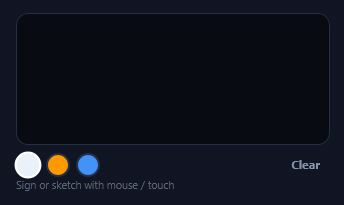</a> <b>Signature / Sketch Pad</b> <code>input-signature-sketch-pad</code></td><td align="center" valign="top" width="33%"><a href="../html/input-sign-off-consent.html">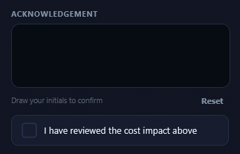</a> <b>Sign-off + Consent</b> <code>input-sign-off-consent</code></td></tr>
</table>

## Location & Region

<table>
<tr><td align="center" valign="top" width="33%"><a href="../html/input-map-pin-selector.html">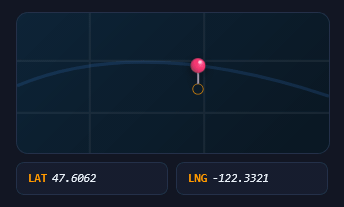</a> <b>Map Pin Selector</b> <code>input-map-pin-selector</code></td><td align="center" valign="top" width="33%"><a href="../html/input-region-selector-grid.html">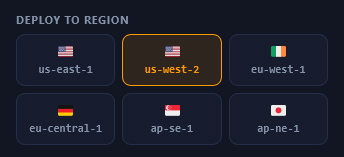</a> <b>Region Selector Grid</b> <code>input-region-selector-grid</code></td><td align="center" valign="top" width="33%"><a href="../html/input-place-address-search.html">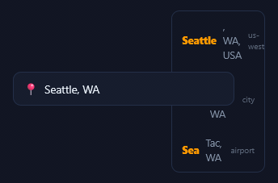</a> <b>Place / Address Search</b> <code>input-place-address-search</code></td></tr>
</table>

## Structured & Matrix Inputs

<table>
<tr><td align="center" valign="top" width="33%"> <b>Key-Value Editor</b> <code>input-key-value-editor</code></td><td align="center" valign="top" width="33%"> <b>Likert Matrix</b> <code>input-likert-matrix</code></td><td align="center" valign="top" width="33%"> <b>Budget Allocation Split</b> <code>input-budget-allocation-split</code></td></tr>
<tr><td align="center" valign="top" width="33%"> <b>XY Trade-off Pad</b> <code>input-xy-trade-off-pad</code> · static</td></tr>
</table>

## 3D & Depth Controls

<table>
<tr><td align="center" valign="top" width="33%"> <b>3D Flip Toggle</b> <code>input-3d-flip-toggle</code></td><td align="center" valign="top" width="33%"> <b>Tactile Push Button</b> <code>input-tactile-push-button</code></td><td align="center" valign="top" width="33%"> <b>3D Dial / Knob</b> <code>input-3d-dial-knob</code></td></tr>
<tr><td align="center" valign="top" width="33%"> <b>Perspective Segmented Control</b> <code>input-perspective-segmented-control</code></td><td align="center" valign="top" width="33%"> <b>Tilting Card Selector</b> <code>input-tilting-card-selector</code></td><td align="center" valign="top" width="33%"> <b>3D Flip-Number Stepper</b> <code>input-3d-flip-number-stepper</code></td></tr>
</table>

## Fields, Pickers & Actions

<table>
<tr><td align="center" valign="top" width="33%"> <b>Floating-Label Field</b> <code>input-floating-label-field</code></td><td align="center" valign="top" width="33%"> <b>OTP / Verification Boxes</b> <code>input-otp-verification-boxes</code></td><td align="center" valign="top" width="33%"> <b>Tag / Chip Input</b> <code>input-tag-chip-input</code></td></tr>
<tr><td align="center" valign="top" width="33%"> <b>Dual-Handle Range Slider</b> <code>input-dual-handle-range-slider-2</code></td><td align="center" valign="top" width="33%"> <b>Color Swatch Picker</b> <code>input-color-swatch-picker</code></td><td align="center" valign="top" width="33%"> <b>Star Rating</b> <code>input-star-rating-2</code></td></tr>
<tr><td align="center" valign="top" width="33%"> <b>Emoji / Mood Rating</b> <code>input-emoji-mood-rating-2</code></td><td align="center" valign="top" width="33%"> <b>Segmented Toggle (sliding)</b> <code>input-segmented-toggle-sliding</code></td><td align="center" valign="top" width="33%"> <b>Switch Variants</b> <code>input-switch-variants</code></td></tr>
<tr><td align="center" valign="top" width="33%"> <b>Number Stepper</b> <code>input-number-stepper-2</code></td><td align="center" valign="top" width="33%"> <b>Search + Suggestions</b> <code>input-search-suggestions</code></td><td align="center" valign="top" width="33%"> <b>Password Strength Meter</b> <code>input-password-strength-meter-2</code></td></tr>
<tr><td align="center" valign="top" width="33%"> <b>File Drop Zone</b> <code>input-file-drop-zone</code></td><td align="center" valign="top" width="33%"> <b>Icon Toggle Group</b> <code>input-icon-toggle-group</code></td><td align="center" valign="top" width="33%"> <b>Combobox / Dropdown</b> <code>input-combobox-dropdown</code></td></tr>
<tr><td align="center" valign="top" width="33%"> <b>Slider with Tooltip</b> <code>input-slider-with-tooltip</code> · static</td><td align="center" valign="top" width="33%"> <b>Quantity Spinner</b> <code>input-quantity-spinner</code></td><td align="center" valign="top" width="33%"> <b>Like / Heart Burst</b> <code>input-like-heart-burst</code></td></tr>
<tr><td align="center" valign="top" width="33%"> <b>Copy-to-Clipboard Field</b> <code>input-copy-to-clipboard-field-2</code></td><td align="center" valign="top" width="33%"> <b>Autosize Textarea</b> <code>input-autosize-textarea</code></td><td align="center" valign="top" width="33%"> <b>Formatted Phone Input</b> <code>input-formatted-phone-input-2</code> · static</td></tr>
<tr><td align="center" valign="top" width="33%"> <b>Checkbox Morph</b> <code>input-checkbox-morph</code></td><td align="center" valign="top" width="33%"> <b>Radio Card Group</b> <code>input-radio-card-group</code></td><td align="center" valign="top" width="33%"> <b>Date Scrubber</b> <code>input-date-scrubber</code> · static</td></tr>
</table>

## BUTTON HOVER EFFECTS

<table>
<tr><td align="center" valign="top" width="33%"> <b>Rainbow Border Sweep</b> <code>input-rainbow-border-sweep</code></td><td align="center" valign="top" width="33%"> <b>Conic Rainbow Ring</b> <code>input-conic-rainbow-ring</code></td><td align="center" valign="top" width="33%"> <b>Fill From Center</b> <code>input-fill-from-center</code></td></tr>
<tr><td align="center" valign="top" width="33%"> <b>Fill From Left</b> <code>input-fill-from-left</code></td><td align="center" valign="top" width="33%"> <b>Fill From Bottom</b> <code>input-fill-from-bottom</code></td><td align="center" valign="top" width="33%"> <b>Diagonal Fill</b> <code>input-diagonal-fill</code></td></tr>
<tr><td align="center" valign="top" width="33%"> <b>Split Fill</b> <code>input-split-fill</code></td><td align="center" valign="top" width="33%"> <b>Glow Pulse</b> <code>input-glow-pulse</code></td><td align="center" valign="top" width="33%"> <b>Shine Sweep</b> <code>input-shine-sweep</code></td></tr>
<tr><td align="center" valign="top" width="33%"> <b>Gradient Text</b> <code>input-gradient-text</code></td><td align="center" valign="top" width="33%"> <b>Neon Outline</b> <code>input-neon-outline</code></td><td align="center" valign="top" width="33%"> <b>Lift and Glow</b> <code>input-lift-and-glow</code></td></tr>
<tr><td align="center" valign="top" width="33%"> <b>CTA Arrow Slide</b> <code>input-cta-arrow-slide</code></td><td align="center" valign="top" width="33%"> <b>Gradient Shift</b> <code>input-gradient-shift</code></td><td align="center" valign="top" width="33%"> <b>Ripple Expand</b> <code>input-ripple-expand</code></td></tr>
</table>
