# Animation Lab

Every effect in Prism's **Animation Lab** gallery, recorded as a looping GIF.

**260 effects** · 248 animated · 3.1 MB of GIF · click any GIF to open its standalone HTML sample (raw file; open it locally, GitHub shows source).

[← Showcase index](../README.md)

**Sections:** [Entrance Animations](#entrance-animations) · [Attention Seekers](#attention-seekers) · [Continuous / Looping](#continuous-looping) · [Border & Glow Effects](#border-glow-effects) · [Text Animations](#text-animations) · [Hover Effects](#hover-effects) · [Loading & Skeleton](#loading-skeleton) · [Exit Animations](#exit-animations) · [3D Card Flips](#3d-card-flips) · [Parallax Tilt](#parallax-tilt) · [Morphing SVG Paths](#morphing-svg-paths) · [Staggered List Reveals](#staggered-list-reveals) · [Page Transition Wipes](#page-transition-wipes) · [Elastic & Overshoot Easing](#elastic-overshoot-easing) · [Scroll Cue Indicators](#scroll-cue-indicators) · [Creative & Advanced](#creative-advanced) · [Micro](#micro) · [LOADERS & WAITING STATES](#loaders-waiting-states) · [Liquid & Fluid](#liquid-fluid) · [Particles & Celebration](#particles-celebration) · [Gradient Mesh & Aurora](#gradient-mesh-aurora) · [Counters & Flip Clocks](#counters-flip-clocks) · [Spring & Physics](#spring-physics) · [Vitals](#vitals) · [Time](#time) · [3D Motion & Perspective](#3d-motion-perspective) · [Easing, Physics & Motion Studies](#easing-physics-motion-studies) · [REVEAL & SCROLL CHOREOGRAPHY](#reveal-scroll-choreography)

## Entrance Animations

<table>
<tr><td align="center" valign="top" width="33%"> <b>Fade In</b> <code>lab-fade-in</code></td><td align="center" valign="top" width="33%"> <b>Fade In Up</b> <code>lab-fade-in-up</code></td><td align="center" valign="top" width="33%"> <b>Fade In Down</b> <code>lab-fade-in-down</code></td></tr>
<tr><td align="center" valign="top" width="33%"> <b>Fade In Left</b> <code>lab-fade-in-left</code></td><td align="center" valign="top" width="33%"> <b>Fade In Right</b> <code>lab-fade-in-right</code></td><td align="center" valign="top" width="33%"> <b>Scale In</b> <code>lab-scale-in</code></td></tr>
<tr><td align="center" valign="top" width="33%"> <b>Scale In Bounce</b> <code>lab-scale-in-bounce</code></td><td align="center" valign="top" width="33%"> <b>Slide In + Rotate</b> <code>lab-slide-in-rotate</code></td><td align="center" valign="top" width="33%"> <b>Flip In</b> <code>lab-flip-in</code></td></tr>
<tr><td align="center" valign="top" width="33%"> <b>Drop In (elastic)</b> <code>lab-drop-in-elastic</code></td><td align="center" valign="top" width="33%"> <b>Expand In</b> <code>lab-expand-in</code></td><td align="center" valign="top" width="33%"> <b>Roll In</b> <code>lab-roll-in</code></td></tr>
<tr><td align="center" valign="top" width="33%"> <b>Zoom In + Rotate</b> <code>lab-zoom-in-rotate</code></td><td align="center" valign="top" width="33%"> <b>Unfold In</b> <code>lab-unfold-in</code></td><td align="center" valign="top" width="33%"> <b>Blur In</b> <code>lab-blur-in</code></td></tr>
<tr><td align="center" valign="top" width="33%"> <b>Slide In + Blur</b> <code>lab-slide-in-blur</code></td><td align="center" valign="top" width="33%"> <b>Iris In</b> <code>lab-iris-in</code></td><td align="center" valign="top" width="33%"> <b>Swing In (top)</b> <code>lab-swing-in-top</code></td></tr>
<tr><td align="center" valign="top" width="33%"> <b>Pop Puff</b> <code>lab-pop-puff</code></td></tr>
</table>

## Attention Seekers

<table>
<tr><td align="center" valign="top" width="33%"> <b>Pulse</b> <code>lab-pulse</code></td><td align="center" valign="top" width="33%"> <b>Pulse Glow</b> <code>lab-pulse-glow</code></td><td align="center" valign="top" width="33%"> <b>Shake</b> <code>lab-shake</code></td></tr>
<tr><td align="center" valign="top" width="33%"> <b>Bounce</b> <code>lab-bounce</code></td><td align="center" valign="top" width="33%"> <b>Swing</b> <code>lab-swing</code></td><td align="center" valign="top" width="33%"> <b>Jello</b> <code>lab-jello</code></td></tr>
<tr><td align="center" valign="top" width="33%"> <b>Rubber Band</b> <code>lab-rubber-band</code></td><td align="center" valign="top" width="33%"> <b>Tada</b> <code>lab-tada</code></td><td align="center" valign="top" width="33%"> <b>Head Shake</b> <code>lab-head-shake</code></td></tr>
<tr><td align="center" valign="top" width="33%"> <b>Heartbeat</b> <code>lab-heartbeat</code></td><td align="center" valign="top" width="33%"> <b>Ring</b> <code>lab-ring</code></td><td align="center" valign="top" width="33%"> <b>Wobble</b> <code>lab-wobble</code></td></tr>
<tr><td align="center" valign="top" width="33%"> <b>Flash</b> <code>lab-flash</code></td><td align="center" valign="top" width="33%"> <b>Pop</b> <code>lab-pop</code></td><td align="center" valign="top" width="33%"> <b>Nudge</b> <code>lab-nudge</code></td></tr>
<tr><td align="center" valign="top" width="33%"> <b>Squash &amp; Stretch</b> <code>lab-squash-stretch</code></td><td align="center" valign="top" width="33%"> <b>Vibrate</b> <code>lab-vibrate</code></td></tr>
</table>

## Continuous / Looping

<table>
<tr><td align="center" valign="top" width="33%"> <b>Spin</b> <code>lab-spin</code></td><td align="center" valign="top" width="33%"> <b>Slow Spin</b> <code>lab-slow-spin</code></td><td align="center" valign="top" width="33%"> <b>Float</b> <code>lab-float</code></td></tr>
<tr><td align="center" valign="top" width="33%"> <b>Breathe</b> <code>lab-breathe</code></td><td align="center" valign="top" width="33%"> <b>Orbit</b> <code>lab-orbit</code></td><td align="center" valign="top" width="33%"> <b>Ping</b> <code>lab-ping</code></td></tr>
<tr><td align="center" valign="top" width="33%"> <b>Morph</b> <code>lab-morph</code></td><td align="center" valign="top" width="33%"> <b>Color Cycle</b> <code>lab-color-cycle</code></td><td align="center" valign="top" width="33%"> <b>Glitch</b> <code>lab-glitch</code></td></tr>
<tr><td align="center" valign="top" width="33%"> <b>Pendulum</b> <code>lab-pendulum</code></td><td align="center" valign="top" width="33%"> <b>3D Wave</b> <code>lab-3d-wave</code></td><td align="center" valign="top" width="33%"> <b>Hue Rotate</b> <code>lab-hue-rotate</code></td></tr>
<tr><td align="center" valign="top" width="33%"> <b>Bob &amp; Tilt</b> <code>lab-bob-tilt</code></td><td align="center" valign="top" width="33%"> <b>Coin Spin</b> <code>lab-coin-spin</code></td><td align="center" valign="top" width="33%"> <b>Drift</b> <code>lab-drift</code></td></tr>
</table>

## Border & Glow Effects

<table>
<tr><td align="center" valign="top" width="33%"> <b>Sonar Ring</b> <code>lab-sonar-ring</code></td><td align="center" valign="top" width="33%"> <b>Shimmer Sweep</b> <code>lab-shimmer-sweep</code></td><td align="center" valign="top" width="33%"> <b>Scanline</b> <code>lab-scanline</code></td></tr>
<tr><td align="center" valign="top" width="33%"> <b>Gradient Border</b> <code>lab-gradient-border</code></td><td align="center" valign="top" width="33%"> <b>Neon Flicker</b> <code>lab-neon-flicker</code></td><td align="center" valign="top" width="33%"> <b>Radar Sweep</b> <code>lab-radar-sweep</code></td></tr>
<tr><td align="center" valign="top" width="33%"> <b>Marching Ants Border</b> <code>lab-marching-ants-border</code></td><td align="center" valign="top" width="33%"> <b>Glow Pulse Box</b> <code>lab-glow-pulse-box</code></td><td align="center" valign="top" width="33%"> <b>Spotlight Sweep</b> <code>lab-spotlight-sweep</code></td></tr>
<tr><td align="center" valign="top" width="33%"> <b>Conic Rim</b> <code>lab-conic-rim</code></td></tr>
</table>

## Text Animations

<table>
<tr><td align="center" valign="top" width="33%"> <b>Typewriter</b> <code>lab-typewriter</code></td><td align="center" valign="top" width="33%"> <b>Text Glow</b> <code>lab-text-glow</code></td><td align="center" valign="top" width="33%"> <b>Text Reveal</b> <code>lab-text-reveal</code></td></tr>
<tr><td align="center" valign="top" width="33%"> <b>Text Wave</b> <code>lab-text-wave</code></td><td align="center" valign="top" width="33%"> <b>Gradient Text</b> <code>lab-gradient-text</code></td><td align="center" valign="top" width="33%"> <b>Letter Drop</b> <code>lab-letter-drop</code></td></tr>
<tr><td align="center" valign="top" width="33%"> <b>Flicker Text</b> <code>lab-flicker-text</code></td><td align="center" valign="top" width="33%"> <b>Spectrum Flow</b> <code>lab-spectrum-flow</code></td><td align="center" valign="top" width="33%"> <b>Focus Blur</b> <code>lab-focus-blur</code></td></tr>
</table>

## Hover Effects

<table>
<tr><td align="center" valign="top" width="33%"> <b>Lift</b> <code>lab-lift</code></td><td align="center" valign="top" width="33%"> <b>Grow</b> <code>lab-grow</code></td><td align="center" valign="top" width="33%"> <b>Glow</b> <code>lab-glow</code></td></tr>
<tr><td align="center" valign="top" width="33%"> <b>Rotate</b> <code>lab-rotate</code></td><td align="center" valign="top" width="33%"> <b>Shake</b> <code>lab-shake-2</code></td><td align="center" valign="top" width="33%"> <b>Flip</b> <code>lab-flip</code></td></tr>
<tr><td align="center" valign="top" width="33%"> <b>Color Swap</b> <code>lab-color-swap</code></td><td align="center" valign="top" width="33%"> <b>Border In</b> <code>lab-border-in</code></td><td align="center" valign="top" width="33%"> <b>Skew</b> <code>lab-skew</code></td></tr>
<tr><td align="center" valign="top" width="33%"> <b>3D Tilt Back</b> <code>lab-3d-tilt-back</code></td><td align="center" valign="top" width="33%"> <b>3D Press</b> <code>lab-3d-press</code></td><td align="center" valign="top" width="33%"> <b>Jelly Hover</b> <code>lab-jelly-hover</code></td></tr>
<tr><td align="center" valign="top" width="33%"> <b>Slide-Up Caption</b> <code>lab-slide-up-caption</code></td><td align="center" valign="top" width="33%"> <b>Spotlight</b> <code>lab-spotlight</code></td></tr>
</table>

## Loading & Skeleton

<table>
<tr><td align="center" valign="top" width="33%"> <b>Dot Pulse</b> <code>lab-dot-pulse</code></td><td align="center" valign="top" width="33%"> <b>Spinner</b> <code>lab-spinner</code></td><td align="center" valign="top" width="33%"> <b>Skeleton Shimmer</b> <code>lab-skeleton-shimmer</code></td></tr>
<tr><td align="center" valign="top" width="33%"> <b>Bar Load</b> <code>lab-bar-load</code></td><td align="center" valign="top" width="33%"> <b>Spin Dots</b> <code>lab-spin-dots</code></td><td align="center" valign="top" width="33%"> <b>Conic Spinner</b> <code>lab-conic-spinner</code></td></tr>
<tr><td align="center" valign="top" width="33%"> <b>Bar Wave Loader</b> <code>lab-bar-wave-loader</code></td><td align="center" valign="top" width="33%"> <b>Grid Pulse Loader</b> <code>lab-grid-pulse-loader</code></td><td align="center" valign="top" width="33%"> <b>Infinity Trace</b> <code>lab-infinity-trace</code></td></tr>
</table>

## Exit Animations

<table>
<tr><td align="center" valign="top" width="33%"> <b>Fade Out</b> <code>lab-fade-out</code></td><td align="center" valign="top" width="33%"> <b>Fade Out Down</b> <code>lab-fade-out-down</code></td><td align="center" valign="top" width="33%"> <b>Scale Out</b> <code>lab-scale-out</code></td></tr>
<tr><td align="center" valign="top" width="33%"> <b>Slide Out Left</b> <code>lab-slide-out-left</code></td><td align="center" valign="top" width="33%"> <b>Flip Out</b> <code>lab-flip-out</code></td><td align="center" valign="top" width="33%"> <b>Shrink Out</b> <code>lab-shrink-out</code></td></tr>
<tr><td align="center" valign="top" width="33%"> <b>Hinge Out</b> <code>lab-hinge-out</code></td><td align="center" valign="top" width="33%"> <b>Roll Out</b> <code>lab-roll-out</code></td><td align="center" valign="top" width="33%"> <b>Puff Out</b> <code>lab-puff-out</code></td></tr>
<tr><td align="center" valign="top" width="33%"> <b>Drop Out (gravity)</b> <code>lab-drop-out-gravity</code></td></tr>
</table>

## 3D Card Flips

<table>
<tr><td align="center" valign="top" width="33%"> <b>Y-Axis Flip</b> <code>lab-y-axis-flip</code></td><td align="center" valign="top" width="33%"> <b>X-Axis Flip</b> <code>lab-x-axis-flip</code></td><td align="center" valign="top" width="33%"> <b>Rotating Cube</b> <code>lab-rotating-cube</code></td></tr>
<tr><td align="center" valign="top" width="33%"> <b>Coin Flip</b> <code>lab-coin-flip</code></td></tr>
</table>

## Parallax Tilt

<table>
<tr><td align="center" valign="top" width="33%"> <b>Auto Tilt</b> <code>lab-auto-tilt</code></td><td align="center" valign="top" width="33%"> <b>Pointer Tilt + Shine</b> <code>lab-pointer-tilt-shine</code></td><td align="center" valign="top" width="33%"> <b>Layered Parallax</b> <code>lab-layered-parallax</code> · static</td></tr>
</table>

## Morphing SVG Paths

<table>
<tr><td align="center" valign="top" width="33%"> <b>Blob Path Morph</b> <code>lab-blob-path-morph</code></td><td align="center" valign="top" width="33%"> <b>Path Self-Draw</b> <code>lab-path-self-draw</code></td><td align="center" valign="top" width="33%"> <b>Animated Checkmark</b> <code>lab-animated-checkmark</code></td></tr>
<tr><td align="center" valign="top" width="33%"> <b>Flowing Wave Path</b> <code>lab-flowing-wave-path</code></td></tr>
</table>

## Staggered List Reveals

<table>
<tr><td align="center" valign="top" width="33%"> <b>Rise Stagger</b> <code>lab-rise-stagger</code></td><td align="center" valign="top" width="33%"> <b>Slide-In Stagger</b> <code>lab-slide-in-stagger</code></td><td align="center" valign="top" width="33%"><a href="../html/lab-chip-pop-in.html">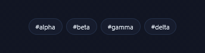</a> <b>Chip Pop-In</b> <code>lab-chip-pop-in</code></td></tr>
</table>

## Page Transition Wipes

<table>
<tr><td align="center" valign="top" width="33%"> <b>Horizontal Wipe</b> <code>lab-horizontal-wipe</code></td><td align="center" valign="top" width="33%"> <b>Circle Reveal</b> <code>lab-circle-reveal</code></td><td align="center" valign="top" width="33%"> <b>Diagonal Wipe</b> <code>lab-diagonal-wipe</code></td></tr>
<tr><td align="center" valign="top" width="33%"> <b>Curtain Split</b> <code>lab-curtain-split</code></td><td align="center" valign="top" width="33%"> <b>Slat Blinds</b> <code>lab-slat-blinds</code></td></tr>
</table>

## Elastic & Overshoot Easing

<table>
<tr><td align="center" valign="top" width="33%"> <b>Elastic Scale</b> <code>lab-elastic-scale</code></td><td align="center" valign="top" width="33%"> <b>Overshoot Slide</b> <code>lab-overshoot-slide</code></td><td align="center" valign="top" width="33%"> <b>Anticipate &amp; Launch</b> <code>lab-anticipate-launch</code></td></tr>
<tr><td align="center" valign="top" width="33%"> <b>Back In Down</b> <code>lab-back-in-down</code></td><td align="center" valign="top" width="33%"> <b>Settle Spin</b> <code>lab-settle-spin</code></td></tr>
</table>

## Scroll Cue Indicators

<table>
<tr><td align="center" valign="top" width="33%"> <b>Scroll Mouse</b> <code>lab-scroll-mouse</code></td><td align="center" valign="top" width="33%"> <b>Chevron Cascade</b> <code>lab-chevron-cascade</code></td><td align="center" valign="top" width="33%"> <b>Bobbing Arrow</b> <code>lab-bobbing-arrow</code></td></tr>
<tr><td align="center" valign="top" width="33%"> <b>Scroll Line</b> <code>lab-scroll-line</code></td></tr>
</table>

## Creative & Advanced

<table>
<tr><td align="center" valign="top" width="33%"> <b>Morph + Color</b> <code>lab-morph-color</code></td><td align="center" valign="top" width="33%"> <b>Conic Gradient Spin</b> <code>lab-conic-gradient-spin</code></td><td align="center" valign="top" width="33%"> <b>Blob</b> <code>lab-blob</code></td></tr>
<tr><td align="center" valign="top" width="33%"> <b>Triple Ring Spinner</b> <code>lab-triple-ring-spinner</code></td><td align="center" valign="top" width="33%"> <b>Equalizer Bars</b> <code>lab-equalizer-bars</code></td><td align="center" valign="top" width="33%"> <b>Staggered Bounce</b> <code>lab-staggered-bounce</code></td></tr>
<tr><td align="center" valign="top" width="33%"> <b>Floating Orb</b> <code>lab-floating-orb</code></td><td align="center" valign="top" width="33%"> <b>Orbital System</b> <code>lab-orbital-system</code></td><td align="center" valign="top" width="33%"> <b>SVG Line Draw</b> <code>lab-svg-line-draw</code></td></tr>
<tr><td align="center" valign="top" width="33%"> <b>Gradient Shimmer Bar</b> <code>lab-gradient-shimmer-bar</code></td><td align="center" valign="top" width="33%"> <b>Rocket Launch</b> <code>lab-rocket-launch</code></td><td align="center" valign="top" width="33%"> <b>Ripple Pulse</b> <code>lab-ripple-pulse</code></td></tr>
<tr><td align="center" valign="top" width="33%"> <b>Progress Donut</b> <code>lab-progress-donut</code></td><td align="center" valign="top" width="33%"> <b>Atom Orbits</b> <code>lab-atom-orbits</code></td></tr>
</table>

## Micro

<table>
<tr><td align="center" valign="top" width="33%"> <b>Elastic Toggle</b> <code>lab-elastic-toggle</code> · static</td><td align="center" valign="top" width="33%"> <b>Button Press</b> <code>lab-button-press</code> · static</td><td align="center" valign="top" width="33%"> <b>Checkbox Bounce</b> <code>lab-checkbox-bounce</code> · static</td></tr>
<tr><td align="center" valign="top" width="33%"> <b>Fill Hover</b> <code>lab-fill-hover</code> · static</td><td align="center" valign="top" width="33%"> <b>Star Rating Pop</b> <code>lab-star-rating-pop</code> · static</td><td align="center" valign="top" width="33%"> <b>Elastic Progress</b> <code>lab-elastic-progress</code> · static</td></tr>
</table>

## LOADERS & WAITING STATES

<table>
<tr><td align="center" valign="top" width="33%"> <b>Skeleton Card</b> <code>lab-skeleton-card</code></td><td align="center" valign="top" width="33%"> <b>Skeleton List Resolve</b> <code>lab-skeleton-list-resolve</code></td><td align="center" valign="top" width="33%"> <b>Skeleton Table</b> <code>lab-skeleton-table</code></td></tr>
<tr><td align="center" valign="top" width="33%"> <b>Skeleton Profile Scan</b> <code>lab-skeleton-profile-scan</code></td><td align="center" valign="top" width="33%"> <b>Ellipsis Loader</b> <code>lab-ellipsis-loader</code></td><td align="center" valign="top" width="33%"> <b>Segmented Ring Count</b> <code>lab-segmented-ring-count</code></td></tr>
<tr><td align="center" valign="top" width="33%"> <b>Dots to Check</b> <code>lab-dots-to-check</code></td><td align="center" valign="top" width="33%"> <b>Chasing Squares</b> <code>lab-chasing-squares</code></td><td align="center" valign="top" width="33%"> <b>Striped Progress Bar</b> <code>lab-striped-progress-bar</code></td></tr>
<tr><td align="center" valign="top" width="33%"> <b>Card Stack Shuffle</b> <code>lab-card-stack-shuffle</code></td><td align="center" valign="top" width="33%"> <b>Staged Progress</b> <code>lab-staged-progress</code></td><td align="center" valign="top" width="33%"> <b>Rolling Square</b> <code>lab-rolling-square</code></td></tr>
<tr><td align="center" valign="top" width="33%"><a href="../html/lab-log-tail-loader.html">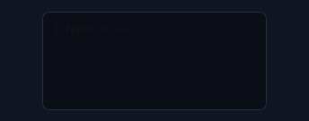</a> <b>Log Tail Loader</b> <code>lab-log-tail-loader</code></td><td align="center" valign="top" width="33%"> <b>Text Fill Loader</b> <code>lab-text-fill-loader</code></td><td align="center" valign="top" width="33%"> <b>Flip Tiles</b> <code>lab-flip-tiles</code></td></tr>
<tr><td align="center" valign="top" width="33%"> <b>Diamond Ripple</b> <code>lab-diamond-ripple</code></td><td align="center" valign="top" width="33%"> <b>Chomp Loader</b> <code>lab-chomp-loader</code></td><td align="center" valign="top" width="33%"> <b>Upload Cloud</b> <code>lab-upload-cloud</code></td></tr>
<tr><td align="center" valign="top" width="33%"> <b>Counting Percent</b> <code>lab-counting-percent</code></td><td align="center" valign="top" width="33%"> <b>Caterpillar Pills</b> <code>lab-caterpillar-pills</code></td><td align="center" valign="top" width="33%"> <b>Hex Map</b> <code>lab-hex-map</code></td></tr>
<tr><td align="center" valign="top" width="33%"> <b>Hex Orbit</b> <code>lab-hex-orbit</code></td></tr>
</table>

## Liquid & Fluid

<table>
<tr><td align="center" valign="top" width="33%"> <b>Liquid Loader</b> <code>lab-liquid-loader</code></td><td align="center" valign="top" width="33%"><a href="../html/lab-liquid-fill-gauge.html">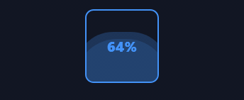</a> <b>Liquid Fill Gauge</b> <code>lab-liquid-fill-gauge</code></td><td align="center" valign="top" width="33%"> <b>Rotating Liquid</b> <code>lab-rotating-liquid</code></td></tr>
<tr><td align="center" valign="top" width="33%"> <b>Dripping</b> <code>lab-dripping</code></td><td align="center" valign="top" width="33%"> <b>Multi-Ring Ripple</b> <code>lab-multi-ring-ripple</code></td></tr>
</table>

## Particles & Celebration

<table>
<tr><td align="center" valign="top" width="33%"><a href="../html/lab-firework-burst.html">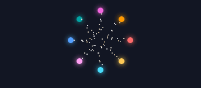</a> <b>Firework Burst</b> <code>lab-firework-burst</code> · static</td><td align="center" valign="top" width="33%"> <b>Confetti Fall</b> <code>lab-confetti-fall</code></td><td align="center" valign="top" width="33%"> <b>Snowfall</b> <code>lab-snowfall</code></td></tr>
<tr><td align="center" valign="top" width="33%"> <b>DNA Helix</b> <code>lab-dna-helix</code></td><td align="center" valign="top" width="33%"> <b>Firework Rocket</b> <code>lab-firework-rocket</code></td></tr>
</table>

## Gradient Mesh & Aurora

<table>
<tr><td align="center" valign="top" width="33%"> <b>Gradient Mesh</b> <code>lab-gradient-mesh</code></td><td align="center" valign="top" width="33%"> <b>Aurora Glass</b> <code>lab-aurora-glass</code></td><td align="center" valign="top" width="33%"> <b>Conic Glow Border</b> <code>lab-conic-glow-border</code></td></tr>
<tr><td align="center" valign="top" width="33%"> <b>Crystal Refraction</b> <code>lab-crystal-refraction</code></td></tr>
</table>

## Counters & Flip Clocks

<table>
<tr><td align="center" valign="top" width="33%"> <b>Flip Clock Digits</b> <code>lab-flip-clock-digits</code> · static</td><td align="center" valign="top" width="33%"> <b>Odometer Scroll</b> <code>lab-odometer-scroll</code> · static</td><td align="center" valign="top" width="33%"> <b>Count-Up Number</b> <code>lab-count-up-number</code> · static</td></tr>
<tr><td align="center" valign="top" width="33%"> <b>Timer Display</b> <code>lab-timer-display</code> · static</td></tr>
</table>

## Spring & Physics

<table>
<tr><td align="center" valign="top" width="33%"> <b>Spring In</b> <code>lab-spring-in</code></td><td align="center" valign="top" width="33%"> <b>Elastic Enter</b> <code>lab-elastic-enter</code></td><td align="center" valign="top" width="33%"> <b>Gravity Drop</b> <code>lab-gravity-drop</code></td></tr>
<tr><td align="center" valign="top" width="33%"> <b>Staggered Rubber</b> <code>lab-staggered-rubber</code></td><td align="center" valign="top" width="33%"> <b>Wobble Physics</b> <code>lab-wobble-physics</code></td><td align="center" valign="top" width="33%"> <b>Pop In (elastic)</b> <code>lab-pop-in-elastic</code></td></tr>
<tr><td align="center" valign="top" width="33%"> <b>Ball Bounce</b> <code>lab-ball-bounce</code></td><td align="center" valign="top" width="33%"> <b>Spring Cascade</b> <code>lab-spring-cascade</code></td></tr>
</table>

## Vitals

<table>
<tr><td align="center" valign="top" width="33%"> <b>EKG / Heartbeat</b> <code>lab-ekg-heartbeat</code></td><td align="center" valign="top" width="33%"> <b>EEG / Brainwave</b> <code>lab-eeg-brainwave</code></td><td align="center" valign="top" width="33%"> <b>Pulse Monitor (fast)</b> <code>lab-pulse-monitor-fast</code></td></tr>
</table>

## Time

<table>
<tr><td align="center" valign="top" width="33%"> <b>Countdown Ring</b> <code>lab-countdown-ring</code></td><td align="center" valign="top" width="33%"> <b>Custom Countdown (MM:SS)</b> <code>lab-custom-countdown-mm-ss</code></td><td align="center" valign="top" width="33%"> <b>Stopwatch (count up)</b> <code>lab-stopwatch-count-up</code></td></tr>
<tr><td align="center" valign="top" width="33%"> <b>Deadline Bar</b> <code>lab-deadline-bar</code></td><td align="center" valign="top" width="33%"> <b>Analog Clock</b> <code>lab-analog-clock</code></td><td align="center" valign="top" width="33%"> <b>Flip Clock</b> <code>lab-flip-clock</code></td></tr>
<tr><td align="center" valign="top" width="33%"> <b>Hourglass</b> <code>lab-hourglass</code></td></tr>
</table>

## 3D Motion & Perspective

<table>
<tr><td align="center" valign="top" width="33%"> <b>3D Coin Flip</b> <code>lab-3d-coin-flip</code></td><td align="center" valign="top" width="33%"> <b>Cube Tumble</b> <code>lab-cube-tumble</code></td><td align="center" valign="top" width="33%"> <b>Card Deal-In (depth)</b> <code>lab-card-deal-in-depth</code></td></tr>
<tr><td align="center" valign="top" width="33%"> <b>Folding Reveal</b> <code>lab-folding-reveal</code></td><td align="center" valign="top" width="33%"> <b>Orbiting Element</b> <code>lab-orbiting-element</code></td><td align="center" valign="top" width="33%"> <b>Perspective Swing</b> <code>lab-perspective-swing</code></td></tr>
<tr><td align="center" valign="top" width="33%"> <b>Flip-Clock Digit</b> <code>lab-flip-clock-digit</code></td><td align="center" valign="top" width="33%"> <b>3D Bounce + Shadow</b> <code>lab-3d-bounce-shadow</code></td></tr>
</table>

## Easing, Physics & Motion Studies

<table>
<tr><td align="center" valign="top" width="33%"> <b>Spring Overshoot</b> <code>lab-spring-overshoot</code></td><td align="center" valign="top" width="33%"> <b>Elastic Scale</b> <code>lab-elastic-scale-2</code></td><td align="center" valign="top" width="33%"> <b>Jelly Wobble</b> <code>lab-jelly-wobble</code></td></tr>
<tr><td align="center" valign="top" width="33%"> <b>Magnetic Snap</b> <code>lab-magnetic-snap</code></td><td align="center" valign="top" width="33%"> <b>Blur-In Focus</b> <code>lab-blur-in-focus</code></td><td align="center" valign="top" width="33%"> <b>Clip-Path Wipe</b> <code>lab-clip-path-wipe</code></td></tr>
<tr><td align="center" valign="top" width="33%"> <b>Iris Reveal</b> <code>lab-iris-reveal</code></td><td align="center" valign="top" width="33%"> <b>Morphing Loader</b> <code>lab-morphing-loader</code></td><td align="center" valign="top" width="33%"> <b>Staggered Dots</b> <code>lab-staggered-dots</code></td></tr>
<tr><td align="center" valign="top" width="33%"> <b>Gooey Merge</b> <code>lab-gooey-merge</code></td><td align="center" valign="top" width="33%"> <b>Rubber Band</b> <code>lab-rubber-band-2</code></td><td align="center" valign="top" width="33%"> <b>Anticipation Wind-Up</b> <code>lab-anticipation-wind-up</code></td></tr>
<tr><td align="center" valign="top" width="33%"> <b>Bounce Settle (physics)</b> <code>lab-bounce-settle-physics</code></td><td align="center" valign="top" width="33%"> <b>Pendulum Swing</b> <code>lab-pendulum-swing</code></td><td align="center" valign="top" width="33%"> <b>Squash &amp; Stretch</b> <code>lab-squash-stretch-2</code></td></tr>
<tr><td align="center" valign="top" width="33%"> <b>Rotate &amp; Settle</b> <code>lab-rotate-settle</code></td><td align="center" valign="top" width="33%"> <b>Gradient Text Shimmer</b> <code>lab-gradient-text-shimmer</code></td><td align="center" valign="top" width="33%"> <b>Text Wave</b> <code>lab-text-wave-2</code></td></tr>
<tr><td align="center" valign="top" width="33%"> <b>Equalizer Bars</b> <code>lab-equalizer-bars-2</code></td><td align="center" valign="top" width="33%"> <b>Dual-Ring Spinner</b> <code>lab-dual-ring-spinner</code></td><td align="center" valign="top" width="33%"> <b>Particle Burst</b> <code>lab-particle-burst</code></td></tr>
<tr><td align="center" valign="top" width="33%"> <b>Heartbeat Pulse</b> <code>lab-heartbeat-pulse</code></td></tr>
</table>

## REVEAL & SCROLL CHOREOGRAPHY

<table>
<tr><td align="center" valign="top" width="33%"><a href="../html/lab-alternate-slide-list.html">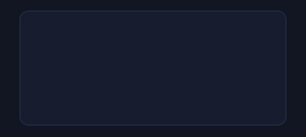</a> <b>Alternate Slide List</b> <code>lab-alternate-slide-list</code></td><td align="center" valign="top" width="33%"><a href="../html/lab-scale-in-card-row.html">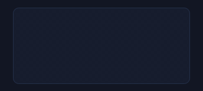</a> <b>Scale-In Card Row</b> <code>lab-scale-in-card-row</code></td><td align="center" valign="top" width="33%"><a href="../html/lab-clip-rise-hero.html">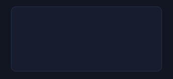</a> <b>Clip Rise Hero</b> <code>lab-clip-rise-hero</code></td></tr>
<tr><td align="center" valign="top" width="33%"> <b>Line by Line Text</b> <code>lab-line-by-line-text</code></td><td align="center" valign="top" width="33%"><a href="../html/lab-stat-roll-up.html">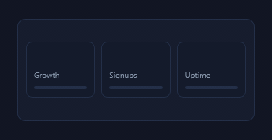</a> <b>Stat Roll-Up</b> <code>lab-stat-roll-up</code></td><td align="center" valign="top" width="33%"><a href="../html/lab-parallax-scroll-scene.html">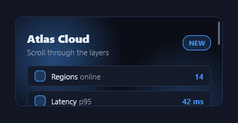</a> <b>Parallax Scroll Scene</b> <code>lab-parallax-scroll-scene</code></td></tr>
<tr><td align="center" valign="top" width="33%"> <b>Sticky Header Shrink</b> <code>lab-sticky-header-shrink</code></td><td align="center" valign="top" width="33%"><a href="../html/lab-block-sweep-reveal.html">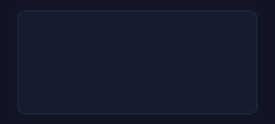</a> <b>Block Sweep Reveal</b> <code>lab-block-sweep-reveal</code></td><td align="center" valign="top" width="33%"><a href="../html/lab-keyhole-pan-reveal.html">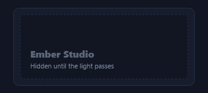</a> <b>Keyhole Pan Reveal</b> <code>lab-keyhole-pan-reveal</code></td></tr>
<tr><td align="center" valign="top" width="33%"><a href="../html/lab-timeline-draw.html">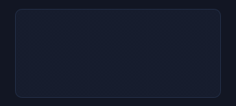</a> <b>Timeline Draw</b> <code>lab-timeline-draw</code></td><td align="center" valign="top" width="33%"><a href="../html/lab-scroll-progress-bar.html">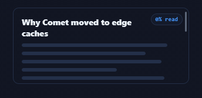</a> <b>Scroll Progress Bar</b> <code>lab-scroll-progress-bar</code></td><td align="center" valign="top" width="33%"><a href="../html/lab-pin-then-release.html">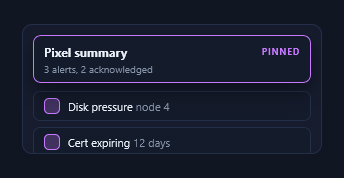</a> <b>Pin Then Release</b> <code>lab-pin-then-release</code></td></tr>
<tr><td align="center" valign="top" width="33%"><a href="../html/lab-word-cascade.html">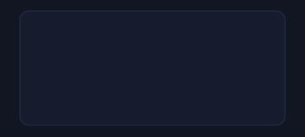</a> <b>Word Cascade</b> <code>lab-word-cascade</code></td><td align="center" valign="top" width="33%"><a href="../html/lab-focus-pull-grid.html">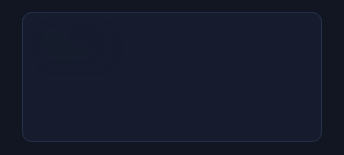</a> <b>Focus Pull Grid</b> <code>lab-focus-pull-grid</code></td><td align="center" valign="top" width="33%"><a href="../html/lab-stand-up-cards.html">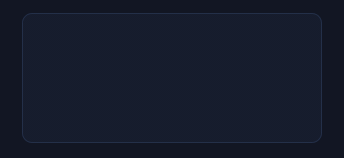</a> <b>Stand-Up Cards</b> <code>lab-stand-up-cards</code></td></tr>
<tr><td align="center" valign="top" width="33%"><a href="../html/lab-route-draw.html">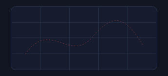</a> <b>Route Draw</b> <code>lab-route-draw</code></td><td align="center" valign="top" width="33%"><a href="../html/lab-split-screen-reveal.html">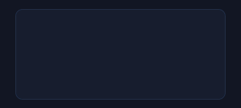</a> <b>Split Screen Reveal</b> <code>lab-split-screen-reveal</code></td><td align="center" valign="top" width="33%"><a href="../html/lab-snap-deck.html">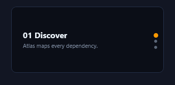</a> <b>Snap Deck</b> <code>lab-snap-deck</code></td></tr>
<tr><td align="center" valign="top" width="33%"><a href="../html/lab-zoom-out-hero.html">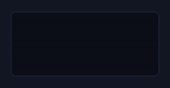</a> <b>Zoom-Out Hero</b> <code>lab-zoom-out-hero</code></td><td align="center" valign="top" width="33%"><a href="../html/lab-velocity-skew-scroll.html">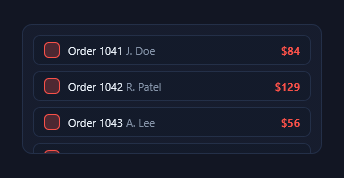</a> <b>Velocity Skew Scroll</b> <code>lab-velocity-skew-scroll</code></td><td align="center" valign="top" width="33%"><a href="../html/lab-marker-sweep.html">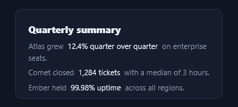</a> <b>Marker Sweep</b> <code>lab-marker-sweep</code></td></tr>
</table>
