# Maps & Geo

Every effect in Prism's **Maps & Geo** gallery, recorded as a looping GIF.

**50 effects** · 49 animated · 2.5 MB of GIF · click any GIF to open its standalone HTML sample (raw file; open it locally, GitHub shows source).

[← Showcase index](../README.md)

**Sections:** [WORLD & REGION MAPS](#world-region-maps) · [MARKERS & PINS](#markers-pins) · [ROUTES & ARCS](#routes-arcs) · [REGIONS & CHOROPLETH](#regions-choropleth) · [COORDINATES & RADAR](#coordinates-radar) · [LIVE & TELEMETRY](#live-telemetry)

## WORLD & REGION MAPS

<table>
<tr><td align="center" valign="top" width="33%"> <b>World Pulse Map</b> <code>maps-world-pulse-map</code></td><td align="center" valign="top" width="33%"><a href="../html/maps-us-map.html">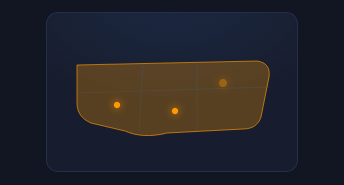</a> <b>US Map</b> <code>maps-us-map</code></td><td align="center" valign="top" width="33%"> <b>Europe Blob</b> <code>maps-europe-blob</code> · static</td></tr>
<tr><td align="center" valign="top" width="33%"> <b>Dotted-Grid World</b> <code>maps-dotted-grid-world</code></td><td align="center" valign="top" width="33%"> <b>Rotating Globe</b> <code>maps-rotating-globe</code></td><td align="center" valign="top" width="33%"> <b>Hex-Tile Map</b> <code>maps-hex-tile-map</code></td></tr>
<tr><td align="center" valign="top" width="33%"><a href="../html/maps-topographic-relief.html">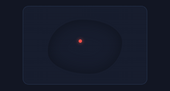</a> <b>Topographic Relief</b> <code>maps-topographic-relief</code></td><td align="center" valign="top" width="33%"><a href="../html/maps-day-night-terminator.html">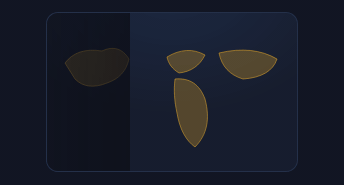</a> <b>Day/Night Terminator</b> <code>maps-day-night-terminator</code></td></tr>
</table>

## MARKERS & PINS

<table>
<tr><td align="center" valign="top" width="33%"><a href="../html/maps-drop-pins.html">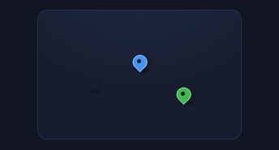</a> <b>Drop Pins</b> <code>maps-drop-pins</code></td><td align="center" valign="top" width="33%"> <b>Ping Marker</b> <code>maps-ping-marker</code></td><td align="center" valign="top" width="33%"> <b>Clustered Markers</b> <code>maps-clustered-markers</code></td></tr>
<tr><td align="center" valign="top" width="33%"> <b>Accuracy Radius</b> <code>maps-accuracy-radius</code></td><td align="center" valign="top" width="33%"><a href="../html/maps-numbered-markers.html">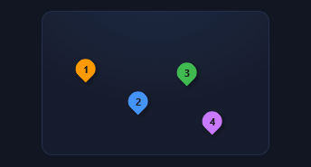</a> <b>Numbered Markers</b> <code>maps-numbered-markers</code></td><td align="center" valign="top" width="33%"> <b>You-Are-Here Beacon</b> <code>maps-you-are-here-beacon</code></td></tr>
<tr><td align="center" valign="top" width="33%"><a href="../html/maps-pin-with-popup.html">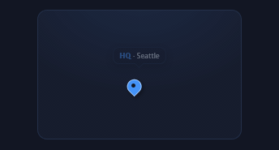</a> <b>Pin with Popup</b> <code>maps-pin-with-popup</code></td><td align="center" valign="top" width="33%"> <b>Flag Marker</b> <code>maps-flag-marker</code></td></tr>
</table>

## ROUTES & ARCS

<table>
<tr><td align="center" valign="top" width="33%"> <b>Great-Circle Arc</b> <code>maps-great-circle-arc</code></td><td align="center" valign="top" width="33%"><a href="../html/maps-multi-hop-flight-path.html">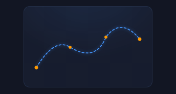</a> <b>Multi-Hop Flight Path</b> <code>maps-multi-hop-flight-path</code></td><td align="center" valign="top" width="33%"><a href="../html/maps-moving-dot-route.html">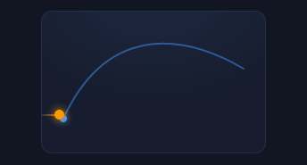</a> <b>Moving Dot Route</b> <code>maps-moving-dot-route</code></td></tr>
<tr><td align="center" valign="top" width="33%"><a href="../html/maps-shipping-lane.html">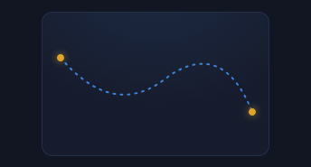</a> <b>Shipping Lane</b> <code>maps-shipping-lane</code></td><td align="center" valign="top" width="33%"><a href="../html/maps-delivery-progress.html">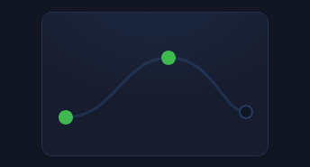</a> <b>Delivery Progress</b> <code>maps-delivery-progress</code></td><td align="center" valign="top" width="33%"> <b>City Route Web</b> <code>maps-city-route-web</code></td></tr>
<tr><td align="center" valign="top" width="33%"><a href="../html/maps-round-trip-arcs.html">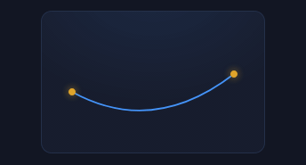</a> <b>Round-Trip Arcs</b> <code>maps-round-trip-arcs</code></td><td align="center" valign="top" width="33%"><a href="../html/maps-waypoint-route.html">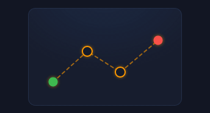</a> <b>Waypoint Route</b> <code>maps-waypoint-route</code></td></tr>
</table>

## REGIONS & CHOROPLETH

<table>
<tr><td align="center" valign="top" width="33%"> <b>Choropleth</b> <code>maps-choropleth</code></td><td align="center" valign="top" width="33%"> <b>Heat Region</b> <code>maps-heat-region</code></td><td align="center" valign="top" width="33%"> <b>Selected Region Glow</b> <code>maps-selected-region-glow</code></td></tr>
<tr><td align="center" valign="top" width="33%"><a href="../html/maps-region-fill-sweep.html">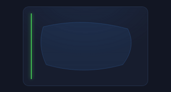</a> <b>Region Fill Sweep</b> <code>maps-region-fill-sweep</code></td><td align="center" valign="top" width="33%"><a href="../html/maps-map-legend.html">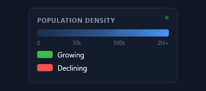</a> <b>Map Legend</b> <code>maps-map-legend</code></td><td align="center" valign="top" width="33%"> <b>Animated Border</b> <code>maps-animated-border</code></td></tr>
<tr><td align="center" valign="top" width="33%"> <b>Density Tiers</b> <code>maps-density-tiers</code></td><td align="center" valign="top" width="33%"><a href="../html/maps-two-region-compare.html">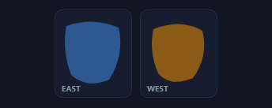</a> <b>Two-Region Compare</b> <code>maps-two-region-compare</code></td></tr>
</table>

## COORDINATES & RADAR

<table>
<tr><td align="center" valign="top" width="33%"><a href="../html/maps-lat-long-grid.html">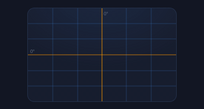</a> <b>Lat/Long Grid</b> <code>maps-lat-long-grid</code></td><td align="center" valign="top" width="33%"><a href="../html/maps-radar-sweep.html">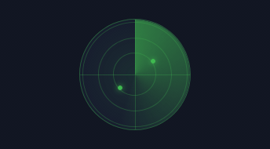</a> <b>Radar Sweep</b> <code>maps-radar-sweep</code></td><td align="center" valign="top" width="33%"> <b>Compass Rose</b> <code>maps-compass-rose</code></td></tr>
<tr><td align="center" valign="top" width="33%"><a href="../html/maps-coordinate-hud.html">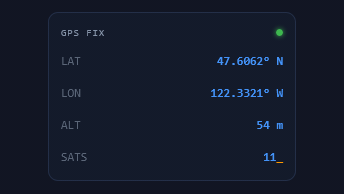</a> <b>Coordinate HUD</b> <code>maps-coordinate-hud</code></td><td align="center" valign="top" width="33%"><a href="../html/maps-scanning-grid.html">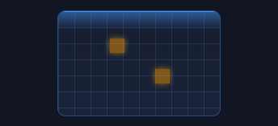</a> <b>Scanning Grid</b> <code>maps-scanning-grid</code></td><td align="center" valign="top" width="33%"> <b>Scanning for Signal</b> <code>maps-scanning-for-signal</code></td></tr>
<tr><td align="center" valign="top" width="33%"><a href="../html/maps-targeting-crosshair.html">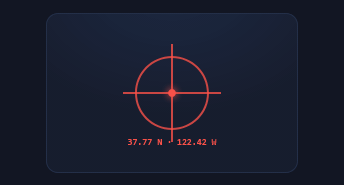</a> <b>Targeting Crosshair</b> <code>maps-targeting-crosshair</code></td><td align="center" valign="top" width="33%"><a href="../html/maps-projection-graticule.html">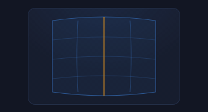</a> <b>Projection Graticule</b> <code>maps-projection-graticule</code></td><td align="center" valign="top" width="33%"><a href="../html/maps-scale-ruler.html">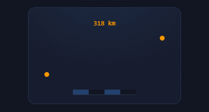</a> <b>Scale Ruler</b> <code>maps-scale-ruler</code></td></tr>
</table>

## LIVE & TELEMETRY

<table>
<tr><td align="center" valign="top" width="33%"> <b>Live Location Dots</b> <code>maps-live-location-dots</code></td><td align="center" valign="top" width="33%"><a href="../html/maps-traffic-flow.html">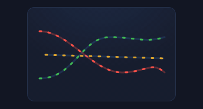</a> <b>Traffic Flow</b> <code>maps-traffic-flow</code></td><td align="center" valign="top" width="33%"><a href="../html/maps-satellite-ground-track.html">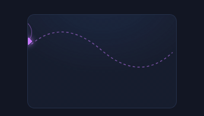</a> <b>Satellite Ground-Track</b> <code>maps-satellite-ground-track</code></td></tr>
<tr><td align="center" valign="top" width="33%"><a href="../html/maps-outage-ripple.html">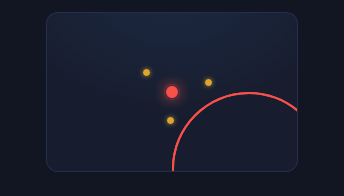</a> <b>Outage Ripple</b> <code>maps-outage-ripple</code></td><td align="center" valign="top" width="33%"><a href="../html/maps-data-center-map.html">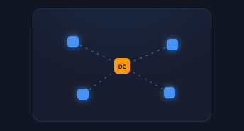</a> <b>Data-Center Map</b> <code>maps-data-center-map</code></td><td align="center" valign="top" width="33%"> <b>Moving Fleet</b> <code>maps-moving-fleet</code></td></tr>
<tr><td align="center" valign="top" width="33%"> <b>Global Request Pulse</b> <code>maps-global-request-pulse</code></td><td align="center" valign="top" width="33%"><a href="../html/maps-weather-front.html">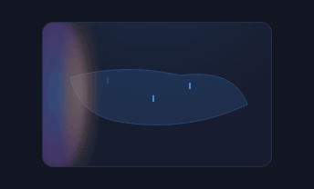</a> <b>Weather Front</b> <code>maps-weather-front</code></td><td align="center" valign="top" width="33%"><a href="../html/maps-seismic-monitor.html">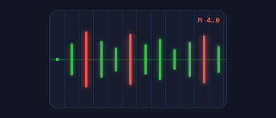</a> <b>Seismic Monitor</b> <code>maps-seismic-monitor</code></td></tr>
</table>
