# Menus & Actions

Every effect in Prism's **Menus & Actions** gallery, recorded as a looping GIF.

**37 effects** · 36 animated · 447 KB of GIF · click any GIF to open its standalone HTML sample (raw file; open it locally, GitHub shows source).

[← Showcase index](../README.md)

**Sections:** [DROPDOWN MENUS](#dropdown-menus) · [CONTEXT MENUS](#context-menus) · [NAVIGATION MENUS](#navigation-menus) · [COMMAND PALETTES](#command-palettes) · [ACTION BARS, TOOLBARS & FABs](#action-bars-toolbars-fabs) · [TAB BARS & SEGMENTED CONTROLS](#tab-bars-segmented-controls) · [RADIAL & GESTURE MENUS](#radial-gesture-menus) · [STATIC MENU REFERENCES](#static-menu-references)

## DROPDOWN MENUS

<table>
<tr><td align="center" valign="top" width="33%"> <b>Stagger-in Dropdown</b> <code>menus-stagger-in-dropdown</code></td><td align="center" valign="top" width="33%"> <b>Icons + Shortcut Hints</b> <code>menus-icons-shortcut-hints</code></td><td align="center" valign="top" width="33%"><a href="../html/menus-searchable-filterable-dropdown.html">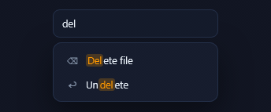</a> <b>Searchable / Filterable Dropdown</b> <code>menus-searchable-filterable-dropdown</code></td></tr>
<tr><td align="center" valign="top" width="33%"><a href="../html/menus-multi-level-flyout-dropdown.html">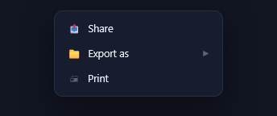</a> <b>Multi-level Flyout Dropdown</b> <code>menus-multi-level-flyout-dropdown</code></td><td align="center" valign="top" width="33%"><a href="../html/menus-checkmark-active-item-dropdown.html">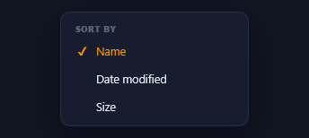</a> <b>Checkmark Active-item Dropdown</b> <code>menus-checkmark-active-item-dropdown</code></td><td align="center" valign="top" width="33%"> <b>Click-to-open Select Trigger</b> <code>menus-click-to-open-select-trigger</code></td></tr>
</table>

## CONTEXT MENUS

<table>
<tr><td align="center" valign="top" width="33%"> <b>Right-click Menu (scale from cursor)</b> <code>menus-right-click-menu-scale-from-cursor</code></td><td align="center" valign="top" width="33%"><a href="../html/menus-destructive-item-highlighted.html">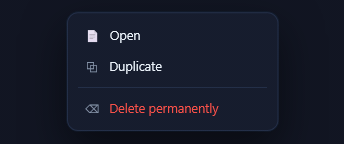</a> <b>Destructive Item Highlighted</b> <code>menus-destructive-item-highlighted</code></td><td align="center" valign="top" width="33%"><a href="../html/menus-context-menu-with-nested-submenus.html">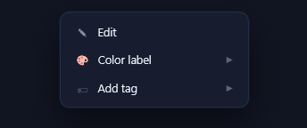</a> <b>Context Menu with Nested Submenus</b> <code>menus-context-menu-with-nested-submenus</code></td></tr>
<tr><td align="center" valign="top" width="33%"><a href="../html/menus-icons-shortcut-column.html">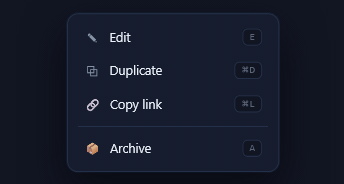</a> <b>Icons + Shortcut Column</b> <code>menus-icons-shortcut-column</code></td></tr>
</table>

## NAVIGATION MENUS

<table>
<tr><td align="center" valign="top" width="33%"> <b>Sliding-underline Nav</b> <code>menus-sliding-underline-nav</code></td><td align="center" valign="top" width="33%"> <b>Mega Menu Panel</b> <code>menus-mega-menu-panel</code></td><td align="center" valign="top" width="33%"> <b>Animated Breadcrumb Trail</b> <code>menus-animated-breadcrumb-trail</code></td></tr>
<tr><td align="center" valign="top" width="33%"><a href="../html/menus-vertical-sidebar-nav.html">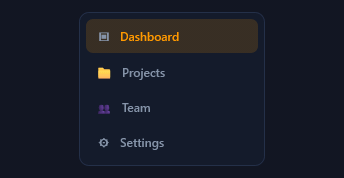</a> <b>Vertical Sidebar Nav</b> <code>menus-vertical-sidebar-nav</code></td><td align="center" valign="top" width="33%"><a href="../html/menus-hamburger-x-slide-out-panel.html">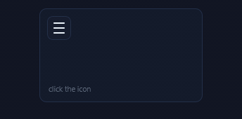</a> <b>Hamburger → X Slide-out Panel</b> <code>menus-hamburger-x-slide-out-panel</code></td><td align="center" valign="top" width="33%"> <b>Sliding Pill Nav</b> <code>menus-sliding-pill-nav</code></td></tr>
<tr><td align="center" valign="top" width="33%"> <b>Collapsible Tree Nav</b> <code>menus-collapsible-tree-nav</code></td></tr>
</table>

## COMMAND PALETTES

<table>
<tr><td align="center" valign="top" width="33%"> <b>Compact Cmd+K Palette</b> <code>menus-compact-cmd-k-palette</code></td><td align="center" valign="top" width="33%"> <b>Rich Palette with Descriptions</b> <code>menus-rich-palette-with-descriptions</code></td><td align="center" valign="top" width="33%"><a href="../html/menus-grouped-category-palette.html">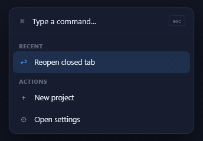</a> <b>Grouped-category Palette</b> <code>menus-grouped-category-palette</code></td></tr>
</table>

## ACTION BARS, TOOLBARS & FABs

<table>
<tr><td align="center" valign="top" width="33%"><a href="../html/menus-floating-selection-toolbar.html">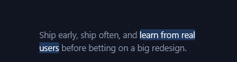</a> <b>Floating Selection Toolbar</b> <code>menus-floating-selection-toolbar</code></td><td align="center" valign="top" width="33%"> <b>Bottom Icon Action Bar</b> <code>menus-bottom-icon-action-bar</code></td><td align="center" valign="top" width="33%"> <b>Toolbar with Color-picker Popover</b> <code>menus-toolbar-with-color-picker-popover</code></td></tr>
<tr><td align="center" valign="top" width="33%"> <b>Toolbar with Emoji-picker Popover</b> <code>menus-toolbar-with-emoji-picker-popover</code></td><td align="center" valign="top" width="33%"> <b>Radial Speed-dial FAB</b> <code>menus-radial-speed-dial-fab</code></td><td align="center" valign="top" width="33%"> <b>Vertical Speed-dial FAB</b> <code>menus-vertical-speed-dial-fab</code></td></tr>
<tr><td align="center" valign="top" width="33%"> <b>Static Formatting Toolbar</b> <code>menus-static-formatting-toolbar</code> · static</td></tr>
</table>

## TAB BARS & SEGMENTED CONTROLS

<table>
<tr><td align="center" valign="top" width="33%"><a href="../html/menus-sliding-pill-tabs.html">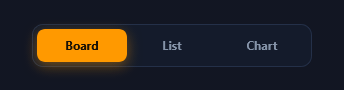</a> <b>Sliding Pill Tabs</b> <code>menus-sliding-pill-tabs</code></td><td align="center" valign="top" width="33%"> <b>Scrollable Tab Strip w/ Fade Edge</b> <code>menus-scrollable-tab-strip-w-fade-edge</code></td><td align="center" valign="top" width="33%"> <b>Segmented Control w/ Sliding Thumb</b> <code>menus-segmented-control-w-sliding-thumb</code></td></tr>
<tr><td align="center" valign="top" width="33%"> <b>Underline Tab Bar</b> <code>menus-underline-tab-bar</code></td><td align="center" valign="top" width="33%"> <b>Mobile Bottom Tab Bar</b> <code>menus-mobile-bottom-tab-bar</code></td></tr>
</table>

## RADIAL & GESTURE MENUS

<table>
<tr><td align="center" valign="top" width="33%"> <b>Radial / Pie Context Menu</b> <code>menus-radial-pie-context-menu</code></td><td align="center" valign="top" width="33%"><a href="../html/menus-long-press-circular-menu.html">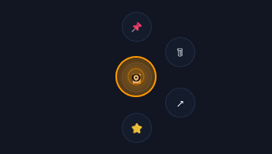</a> <b>Long-press Circular Menu</b> <code>menus-long-press-circular-menu</code></td><td align="center" valign="top" width="33%"><a href="../html/menus-draggable-radial-dial-menu.html">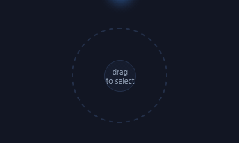</a> <b>Draggable Radial Dial Menu</b> <code>menus-draggable-radial-dial-menu</code></td></tr>
</table>

## STATIC MENU REFERENCES

<table>
<tr><td align="center" valign="top" width="33%"><a href="../html/menus-plain-static-dropdown.html">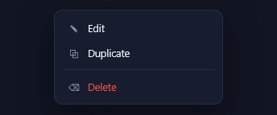</a> <b>Plain Static Dropdown</b> <code>menus-plain-static-dropdown</code></td><td align="center" valign="top" width="33%"><a href="../html/menus-plain-static-context-menu.html">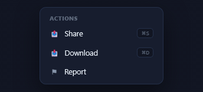</a> <b>Plain Static Context Menu</b> <code>menus-plain-static-context-menu</code></td></tr>
</table>
