# Notifications & Status

Every effect in Prism's **Notifications & Status** gallery, recorded as a looping GIF.

**50 effects** · 50 animated · 541 KB of GIF · click any GIF to open its standalone HTML sample (raw file; open it locally, GitHub shows source).

[← Showcase index](../README.md)

**Sections:** [TOASTS & SNACKBARS](#toasts-snackbars) · [PROGRESS NOTIFICATIONS](#progress-notifications) · [STATUS BANNERS & INDICATORS](#status-banners-indicators) · [LIVE & CONNECTION](#live-connection) · [EMPTY STATES & SKELETONS](#empty-states-skeletons) · [BADGES & COUNTS](#badges-counts)

## TOASTS & SNACKBARS

<table>
<tr><td align="center" valign="top" width="33%"> <b>Success Toast</b> <code>notify-success-toast</code></td><td align="center" valign="top" width="33%"> <b>Error Toast</b> <code>notify-error-toast</code></td><td align="center" valign="top" width="33%"> <b>Warning Toast</b> <code>notify-warning-toast</code></td></tr>
<tr><td align="center" valign="top" width="33%"> <b>Info Toast</b> <code>notify-info-toast</code></td><td align="center" valign="top" width="33%"> <b>Snackbar w/ Action</b> <code>notify-snackbar-w-action</code></td><td align="center" valign="top" width="33%"> <b>Stacking Toast Group</b> <code>notify-stacking-toast-group</code></td></tr>
<tr><td align="center" valign="top" width="33%"><a href="../html/notify-auto-dismiss-countdown.html">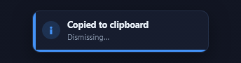</a> <b>Auto-dismiss Countdown</b> <code>notify-auto-dismiss-countdown</code></td><td align="center" valign="top" width="33%"><a href="../html/notify-icon-pop-toast.html">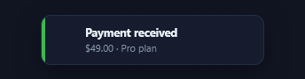</a> <b>Icon-pop Toast</b> <code>notify-icon-pop-toast</code></td></tr>
</table>

## PROGRESS NOTIFICATIONS

<table>
<tr><td align="center" valign="top" width="33%"><a href="../html/notify-upload-progress-toast.html">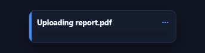</a> <b>Upload Progress Toast</b> <code>notify-upload-progress-toast</code></td><td align="center" valign="top" width="33%"><a href="../html/notify-multi-step-progress.html">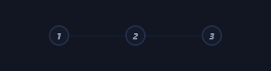</a> <b>Multi-step Progress</b> <code>notify-multi-step-progress</code></td><td align="center" valign="top" width="33%"><a href="../html/notify-determinate-bar.html">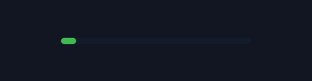</a> <b>Determinate Bar</b> <code>notify-determinate-bar</code></td></tr>
<tr><td align="center" valign="top" width="33%"><a href="../html/notify-indeterminate-bar.html">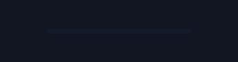</a> <b>Indeterminate Bar</b> <code>notify-indeterminate-bar</code></td><td align="center" valign="top" width="33%"> <b>Circular Progress Badge</b> <code>notify-circular-progress-badge</code></td><td align="center" valign="top" width="33%"> <b>Saving → Saved Swap</b> <code>notify-saving-saved-swap</code></td></tr>
<tr><td align="center" valign="top" width="33%"> <b>Download-complete Pulse</b> <code>notify-download-complete-pulse</code></td><td align="center" valign="top" width="33%"> <b>Segmented Progress</b> <code>notify-segmented-progress</code></td></tr>
</table>

## STATUS BANNERS & INDICATORS

<table>
<tr><td align="center" valign="top" width="33%"><a href="../html/notify-operational-banner.html">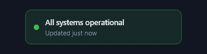</a> <b>Operational Banner</b> <code>notify-operational-banner</code></td><td align="center" valign="top" width="33%"><a href="../html/notify-degraded-banner.html">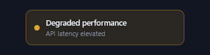</a> <b>Degraded Banner</b> <code>notify-degraded-banner</code></td><td align="center" valign="top" width="33%"><a href="../html/notify-incident-banner.html">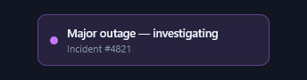</a> <b>Incident Banner</b> <code>notify-incident-banner</code></td></tr>
<tr><td align="center" valign="top" width="33%"><a href="../html/notify-maintenance-banner.html">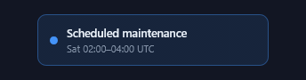</a> <b>Maintenance Banner</b> <code>notify-maintenance-banner</code></td><td align="center" valign="top" width="33%"><a href="../html/notify-offline-reconnecting.html">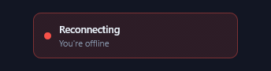</a> <b>Offline / Reconnecting</b> <code>notify-offline-reconnecting</code></td><td align="center" valign="top" width="33%"><a href="../html/notify-update-available-banner.html">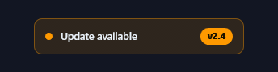</a> <b>Update-available Banner</b> <code>notify-update-available-banner</code></td></tr>
<tr><td align="center" valign="top" width="33%"><a href="../html/notify-sticky-status-bar.html">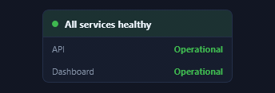</a> <b>Sticky Status Bar</b> <code>notify-sticky-status-bar</code></td><td align="center" valign="top" width="33%"> <b>Status Dot Legend</b> <code>notify-status-dot-legend</code></td><td align="center" valign="top" width="33%"><a href="../html/notify-resolved-all-clear.html">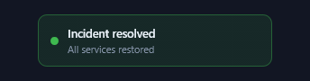</a> <b>Resolved / All-clear</b> <code>notify-resolved-all-clear</code></td></tr>
</table>

## LIVE & CONNECTION

<table>
<tr><td align="center" valign="top" width="33%"> <b>Pulsing Live Dot</b> <code>notify-pulsing-live-dot</code></td><td align="center" valign="top" width="33%"> <b>Sync Spinner → Check</b> <code>notify-sync-spinner-check</code></td><td align="center" valign="top" width="33%"> <b>Connection Strength</b> <code>notify-connection-strength</code></td></tr>
<tr><td align="center" valign="top" width="33%"> <b>Typing Presence</b> <code>notify-typing-presence</code></td><td align="center" valign="top" width="33%"> <b>Heartbeat / Last-seen</b> <code>notify-heartbeat-last-seen</code></td><td align="center" valign="top" width="33%"> <b>WebSocket Connected</b> <code>notify-websocket-connected</code></td></tr>
<tr><td align="center" valign="top" width="33%"> <b>Recording Indicator</b> <code>notify-recording-indicator</code></td><td align="center" valign="top" width="33%"> <b>Broadcasting Wave</b> <code>notify-broadcasting-wave</code></td><td align="center" valign="top" width="33%"> <b>Online Presence Ring</b> <code>notify-online-presence-ring</code></td></tr>
</table>

## EMPTY STATES & SKELETONS

<table>
<tr><td align="center" valign="top" width="33%"> <b>Empty-state Card</b> <code>notify-empty-state-card</code></td><td align="center" valign="top" width="33%"> <b>Profile Skeleton</b> <code>notify-profile-skeleton</code></td><td align="center" valign="top" width="33%"> <b>Card Skeleton</b> <code>notify-card-skeleton</code></td></tr>
<tr><td align="center" valign="top" width="33%"> <b>Table Skeleton</b> <code>notify-table-skeleton</code></td><td align="center" valign="top" width="33%"><a href="../html/notify-no-results-state.html">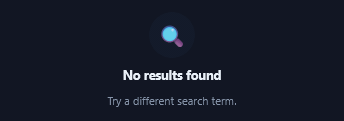</a> <b>No-results State</b> <code>notify-no-results-state</code></td><td align="center" valign="top" width="33%"> <b>Loading Shimmer List</b> <code>notify-loading-shimmer-list</code></td></tr>
<tr><td align="center" valign="top" width="33%"> <b>Paragraph Skeleton</b> <code>notify-paragraph-skeleton</code></td><td align="center" valign="top" width="33%"> <b>Spinner Placeholder</b> <code>notify-spinner-placeholder</code></td></tr>
</table>

## BADGES & COUNTS

<table>
<tr><td align="center" valign="top" width="33%"> <b>Bell w/ Count Badge</b> <code>notify-bell-w-count-badge</code></td><td align="center" valign="top" width="33%"> <b>Unread Pill</b> <code>notify-unread-pill</code></td><td align="center" valign="top" width="33%"> <b>&quot;New&quot; Corner Ribbon</b> <code>notify-new-corner-ribbon</code></td></tr>
<tr><td align="center" valign="top" width="33%"> <b>Count-up Badge</b> <code>notify-count-up-badge</code></td><td align="center" valign="top" width="33%"> <b>Status Chip Transition</b> <code>notify-status-chip-transition</code></td><td align="center" valign="top" width="33%"> <b>Stacked Avatars +more</b> <code>notify-stacked-avatars-more</code></td></tr>
<tr><td align="center" valign="top" width="33%"> <b>Priority-level Badge</b> <code>notify-priority-level-badge</code></td><td align="center" valign="top" width="33%"> <b>Dot Indicator Badge</b> <code>notify-dot-indicator-badge</code></td></tr>
</table>
