# Animated Objects

Every effect in Prism's **Animated Objects** gallery, recorded as a looping GIF.

**153 effects** · 153 animated · 10.4 MB of GIF · click any GIF to open its standalone HTML sample (raw file; open it locally, GitHub shows source).

[← Showcase index](../README.md)

**Sections:** [Structures & particles](#structures-particles) · [Signals & line](#signals-line) · [Weather & sky](#weather-sky) · [Ambient weather backdrops](#ambient-weather-backdrops) · [Mechanisms & orbits](#mechanisms-orbits) · [Vitals & status](#vitals-status) · [Time, launch & life](#time-launch-life) · [More mechanisms & infra](#more-mechanisms-infra) · [Animated Emoji](#animated-emoji) · [3D Objects](#3d-objects) · [2D & SVG Objects](#2d-svg-objects) · [FORGE LANDING KIT](#forge-landing-kit) · [AMBIENT BACKGROUNDS](#ambient-backgrounds) · [3D CSS OBJECTS](#3d-css-objects) · [SYNTHWAVE & OUTRUN](#synthwave-outrun) · [HOURGLASS & SAND](#hourglass-sand)

## Structures & particles

<table>
<tr><td align="center" valign="top" width="33%"> <b>DNA Helix</b> <code>objects-dna-helix</code></td><td align="center" valign="top" width="33%"> <b>Atom</b> <code>objects-atom</code></td><td align="center" valign="top" width="33%"> <b>Molecule Cluster</b> <code>objects-molecule-cluster</code></td></tr>
<tr><td align="center" valign="top" width="33%"> <b>Scanned Molecule</b> <code>objects-scanned-molecule</code></td><td align="center" valign="top" width="33%"><a href="../html/objects-test-tubes.html">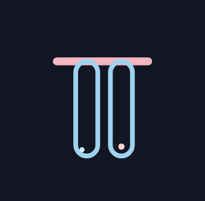</a> <b>Test Tubes</b> <code>objects-test-tubes</code></td></tr>
</table>

## Signals & line

<table>
<tr><td align="center" valign="top" width="33%"> <b>Hex Molecule</b> <code>objects-hex-molecule</code></td><td align="center" valign="top" width="33%"> <b>Signal Graph</b> <code>objects-signal-graph</code></td><td align="center" valign="top" width="33%"> <b>Path Trace</b> <code>objects-path-trace</code></td></tr>
<tr><td align="center" valign="top" width="33%"> <b>Body Scan</b> <code>objects-body-scan</code></td></tr>
</table>

## Weather & sky

<table>
<tr><td align="center" valign="top" width="33%"> <b>Sun</b> <code>objects-sun</code></td><td align="center" valign="top" width="33%"> <b>Rain Cloud</b> <code>objects-rain-cloud</code></td><td align="center" valign="top" width="33%"> <b>Drifting Cloud</b> <code>objects-drifting-cloud</code></td></tr>
<tr><td align="center" valign="top" width="33%"> <b>Thunderstorm</b> <code>objects-thunderstorm</code></td></tr>
</table>

## Ambient weather backdrops

<table>
<tr><td align="center" valign="top" width="33%"> <b>Snowfall</b> <code>objects-snowfall</code></td><td align="center" valign="top" width="33%"> <b>Windy Day</b> <code>objects-windy-day</code></td><td align="center" valign="top" width="33%"> <b>Rain</b> <code>objects-rain</code></td></tr>
<tr><td align="center" valign="top" width="33%"> <b>Downpour</b> <code>objects-downpour</code></td><td align="center" valign="top" width="33%"> <b>Tornado</b> <code>objects-tornado</code></td><td align="center" valign="top" width="33%"> <b>Hurricane</b> <code>objects-hurricane</code></td></tr>
<tr><td align="center" valign="top" width="33%"> <b>Sunny</b> <code>objects-sunny</code></td><td align="center" valign="top" width="33%"> <b>Sun Rays</b> <code>objects-sun-rays</code></td><td align="center" valign="top" width="33%"> <b>Passing Clouds</b> <code>objects-passing-clouds</code></td></tr>
<tr><td align="center" valign="top" width="33%"> <b>Sunbeams Through Clouds</b> <code>objects-sunbeams-through-clouds</code></td></tr>
</table>

## Mechanisms & orbits

<table>
<tr><td align="center" valign="top" width="33%"> <b>Gears</b> <code>objects-gears</code></td><td align="center" valign="top" width="33%"> <b>Radar Sweep</b> <code>objects-radar-sweep</code></td><td align="center" valign="top" width="33%"> <b>Orbiting Planets</b> <code>objects-orbiting-planets</code></td></tr>
<tr><td align="center" valign="top" width="33%"> <b>Flowing Pipes</b> <code>objects-flowing-pipes</code></td></tr>
</table>

## Vitals & status

<table>
<tr><td align="center" valign="top" width="33%"> <b>Pulsing Heart</b> <code>objects-pulsing-heart</code></td><td align="center" valign="top" width="33%"> <b>EKG Trace</b> <code>objects-ekg-trace</code></td><td align="center" valign="top" width="33%"> <b>Wi-Fi Signal</b> <code>objects-wi-fi-signal</code></td></tr>
<tr><td align="center" valign="top" width="33%"> <b>Signal Bars</b> <code>objects-signal-bars</code></td><td align="center" valign="top" width="33%"><a href="../html/objects-battery-charging.html">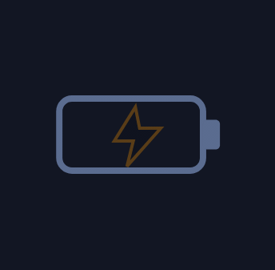</a> <b>Battery Charging</b> <code>objects-battery-charging</code></td><td align="center" valign="top" width="33%"> <b>Lock / Unlock</b> <code>objects-lock-unlock</code></td></tr>
</table>

## Time, launch & life

<table>
<tr><td align="center" valign="top" width="33%"><a href="../html/objects-hourglass.html">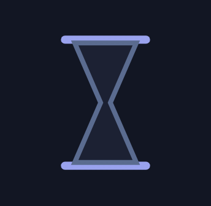</a> <b>Hourglass</b> <code>objects-hourglass</code></td><td align="center" valign="top" width="33%"> <b>Rocket Launch</b> <code>objects-rocket-launch</code></td><td align="center" valign="top" width="33%"> <b>Growing Plant</b> <code>objects-growing-plant</code></td></tr>
<tr><td align="center" valign="top" width="33%"> <b>Constellation</b> <code>objects-constellation</code></td></tr>
</table>

## More mechanisms & infra

<table>
<tr><td align="center" valign="top" width="33%"> <b>Gear Pair</b> <code>objects-gear-pair</code></td><td align="center" valign="top" width="33%"> <b>Cloud Upload</b> <code>objects-cloud-upload</code></td><td align="center" valign="top" width="33%"> <b>Database Sync</b> <code>objects-database-sync</code></td></tr>
<tr><td align="center" valign="top" width="33%"> <b>Shield Check</b> <code>objects-shield-check</code></td><td align="center" valign="top" width="33%"> <b>Magnifier Scan</b> <code>objects-magnifier-scan</code></td><td align="center" valign="top" width="33%"> <b>Satellite Dish</b> <code>objects-satellite-dish</code></td></tr>
<tr><td align="center" valign="top" width="33%"> <b>Floating Cube</b> <code>objects-floating-cube</code></td><td align="center" valign="top" width="33%"> <b>Progress Ring</b> <code>objects-progress-ring</code></td></tr>
</table>

## Animated Emoji

<table>
<tr><td align="center" valign="top" width="33%"> <b>Bounce</b> <code>objects-bounce</code></td><td align="center" valign="top" width="33%"> <b>Spinning Globe</b> <code>objects-spinning-globe</code></td><td align="center" valign="top" width="33%"> <b>Heartbeat</b> <code>objects-heartbeat</code></td></tr>
<tr><td align="center" valign="top" width="33%"> <b>Launch</b> <code>objects-launch</code></td><td align="center" valign="top" width="33%"> <b>Ring</b> <code>objects-ring</code></td><td align="center" valign="top" width="33%"> <b>Idea Glow</b> <code>objects-idea-glow</code></td></tr>
<tr><td align="center" valign="top" width="33%"> <b>Tada</b> <code>objects-tada</code></td><td align="center" valign="top" width="33%"> <b>Coin Flip</b> <code>objects-coin-flip</code></td><td align="center" valign="top" width="33%"> <b>Wobble</b> <code>objects-wobble</code></td></tr>
<tr><td align="center" valign="top" width="33%"> <b>Float</b> <code>objects-float</code></td><td align="center" valign="top" width="33%"> <b>Flip-In Check</b> <code>objects-flip-in-check</code></td><td align="center" valign="top" width="33%"> <b>Blink</b> <code>objects-blink</code></td></tr>
<tr><td align="center" valign="top" width="33%"> <b>Zoom Pulse</b> <code>objects-zoom-pulse</code></td><td align="center" valign="top" width="33%"> <b>Warning Shake</b> <code>objects-warning-shake</code></td><td align="center" valign="top" width="33%"> <b>Settings Turn</b> <code>objects-settings-turn</code></td></tr>
<tr><td align="center" valign="top" width="33%"> <b>Hot</b> <code>objects-hot</code></td></tr>
</table>

## 3D Objects

<table>
<tr><td align="center" valign="top" width="33%"> <b>Spinning Cube</b> <code>objects-spinning-cube</code></td><td align="center" valign="top" width="33%"> <b>Rotating Pyramid</b> <code>objects-rotating-pyramid</code></td><td align="center" valign="top" width="33%"> <b>Wireframe Sphere</b> <code>objects-wireframe-sphere</code></td></tr>
<tr><td align="center" valign="top" width="33%"> <b>3D Gear Train</b> <code>objects-3d-gear-train</code></td><td align="center" valign="top" width="33%"> <b>Orbiting System</b> <code>objects-orbiting-system</code></td><td align="center" valign="top" width="33%"> <b>Folding Box</b> <code>objects-folding-box</code></td></tr>
<tr><td align="center" valign="top" width="33%"> <b>3D Coin</b> <code>objects-3d-coin</code></td><td align="center" valign="top" width="33%"> <b>Polyhedron</b> <code>objects-polyhedron</code></td><td align="center" valign="top" width="33%"> <b>Server Rack</b> <code>objects-server-rack</code></td></tr>
<tr><td align="center" valign="top" width="33%"> <b>3D Map Pin</b> <code>objects-3d-map-pin</code></td><td align="center" valign="top" width="33%"> <b>Cube Grid Wave</b> <code>objects-cube-grid-wave</code></td><td align="center" valign="top" width="33%"> <b>Isometric Tower</b> <code>objects-isometric-tower</code></td></tr>
<tr><td align="center" valign="top" width="33%"> <b>Extruded Arrow</b> <code>objects-extruded-arrow</code></td><td align="center" valign="top" width="33%"> <b>Tesseract</b> <code>objects-tesseract</code></td><td align="center" valign="top" width="33%"> <b>Torus Ring</b> <code>objects-torus-ring</code></td></tr>
<tr><td align="center" valign="top" width="33%"> <b>3D Padlock</b> <code>objects-3d-padlock</code></td><td align="center" valign="top" width="33%"> <b>Floating Crystal</b> <code>objects-floating-crystal</code></td><td align="center" valign="top" width="33%"> <b>Radar Dish</b> <code>objects-radar-dish</code></td></tr>
</table>

## 2D & SVG Objects

<table>
<tr><td align="center" valign="top" width="33%"> <b>Hourglass</b> <code>objects-hourglass-2</code></td><td align="center" valign="top" width="33%"> <b>Satellite</b> <code>objects-satellite</code></td><td align="center" valign="top" width="33%"> <b>Rocket</b> <code>objects-rocket</code></td></tr>
<tr><td align="center" valign="top" width="33%"> <b>Lightbulb</b> <code>objects-lightbulb</code></td><td align="center" valign="top" width="33%"> <b>Battery Charging</b> <code>objects-battery-charging-2</code></td><td align="center" valign="top" width="33%"> <b>Wi-Fi Pulse</b> <code>objects-wi-fi-pulse</code></td></tr>
<tr><td align="center" valign="top" width="33%"> <b>Gears Mesh</b> <code>objects-gears-mesh</code></td><td align="center" valign="top" width="33%"> <b>Pendulum</b> <code>objects-pendulum</code></td><td align="center" valign="top" width="33%"> <b>Waving Flag</b> <code>objects-waving-flag</code></td></tr>
<tr><td align="center" valign="top" width="33%"> <b>Compass</b> <code>objects-compass</code></td><td align="center" valign="top" width="33%"> <b>Magnet</b> <code>objects-magnet</code></td><td align="center" valign="top" width="33%"> <b>Hot-Air Balloon</b> <code>objects-hot-air-balloon</code></td></tr>
</table>

## FORGE LANDING KIT

<table>
<tr><td align="center" valign="top" width="33%"> <b>Rising Embers</b> <code>objects-rising-embers</code></td><td align="center" valign="top" width="33%"> <b>Forge Flame Mark</b> <code>objects-forge-flame-mark</code></td><td align="center" valign="top" width="33%"> <b>Forge Landing Hero</b> <code>objects-forge-landing-hero</code></td></tr>
</table>

## AMBIENT BACKGROUNDS

<table>
<tr><td align="center" valign="top" width="33%"><a href="../html/objects-gradient-drift.html">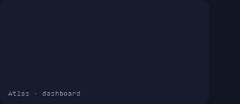</a> <b>Gradient Drift</b> <code>objects-gradient-drift</code></td><td align="center" valign="top" width="33%"><a href="../html/objects-mesh-gradient-blobs.html">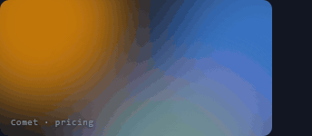</a> <b>Mesh Gradient Blobs</b> <code>objects-mesh-gradient-blobs</code></td><td align="center" valign="top" width="33%"><a href="../html/objects-aurora-curtains.html">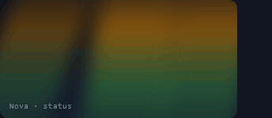</a> <b>Aurora Curtains</b> <code>objects-aurora-curtains</code></td></tr>
<tr><td align="center" valign="top" width="33%"><a href="../html/objects-film-grain.html">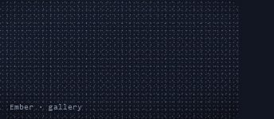</a> <b>Film Grain</b> <code>objects-film-grain</code></td><td align="center" valign="top" width="33%"><a href="../html/objects-dot-grid-flow.html">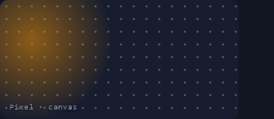</a> <b>Dot Grid Flow</b> <code>objects-dot-grid-flow</code></td><td align="center" valign="top" width="33%"><a href="../html/objects-diagonal-stripes-scroll.html">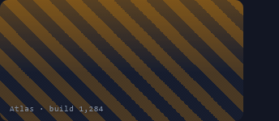</a> <b>Diagonal Stripes Scroll</b> <code>objects-diagonal-stripes-scroll</code></td></tr>
<tr><td align="center" valign="top" width="33%"><a href="../html/objects-floating-orbs.html">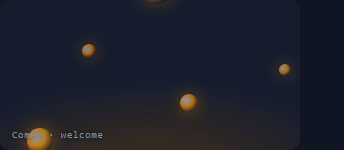</a> <b>Floating Orbs</b> <code>objects-floating-orbs</code></td><td align="center" valign="top" width="33%"><a href="../html/objects-wave-layers.html">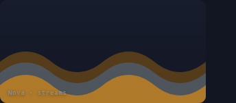</a> <b>Wave Layers</b> <code>objects-wave-layers</code></td><td align="center" valign="top" width="33%"> <b>Starfield Parallax</b> <code>objects-starfield-parallax</code></td></tr>
<tr><td align="center" valign="top" width="33%"><a href="../html/objects-hex-grid-pulse.html">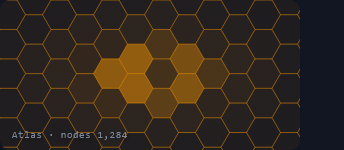</a> <b>Hex Grid Pulse</b> <code>objects-hex-grid-pulse</code></td><td align="center" valign="top" width="33%"><a href="../html/objects-topographic-contours.html">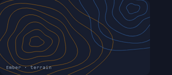</a> <b>Topographic Contours</b> <code>objects-topographic-contours</code></td><td align="center" valign="top" width="33%"><a href="../html/objects-ripple-rings.html">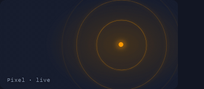</a> <b>Ripple Rings</b> <code>objects-ripple-rings</code></td></tr>
<tr><td align="center" valign="top" width="33%"><a href="../html/objects-spotlight-sweep.html">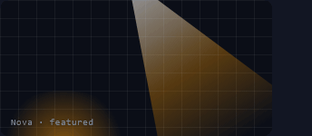</a> <b>Spotlight Sweep</b> <code>objects-spotlight-sweep</code></td><td align="center" valign="top" width="33%"><a href="../html/objects-confetti-drift.html">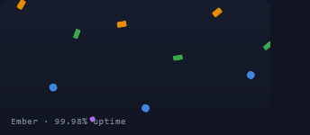</a> <b>Confetti Drift</b> <code>objects-confetti-drift</code></td><td align="center" valign="top" width="33%"><a href="../html/objects-bokeh.html">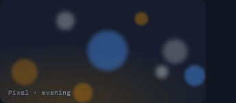</a> <b>Bokeh</b> <code>objects-bokeh</code></td></tr>
<tr><td align="center" valign="top" width="33%"><a href="../html/objects-circuit-traces.html">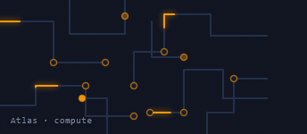</a> <b>Circuit Traces</b> <code>objects-circuit-traces</code></td><td align="center" valign="top" width="33%"><a href="../html/objects-plasma.html">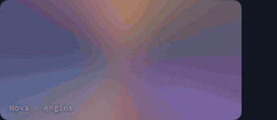</a> <b>Plasma</b> <code>objects-plasma</code></td><td align="center" valign="top" width="33%"><a href="../html/objects-checker-fade.html">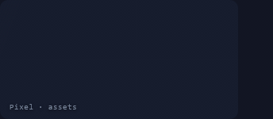</a> <b>Checker Fade</b> <code>objects-checker-fade</code></td></tr>
<tr><td align="center" valign="top" width="33%"><a href="../html/objects-morphing-blob.html">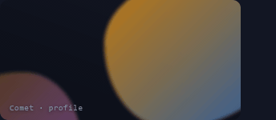</a> <b>Morphing Blob</b> <code>objects-morphing-blob</code></td><td align="center" valign="top" width="33%"><a href="../html/objects-scanline-sweep.html">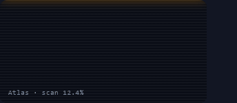</a> <b>Scanline Sweep</b> <code>objects-scanline-sweep</code></td><td align="center" valign="top" width="33%"><a href="../html/objects-horizon-grid.html">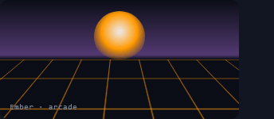</a> <b>Horizon Grid</b> <code>objects-horizon-grid</code></td></tr>
</table>

## 3D CSS OBJECTS

<table>
<tr><td align="center" valign="top" width="33%"> <b>Flip Card</b> <code>objects-flip-card</code></td><td align="center" valign="top" width="33%"> <b>Coin Toss</b> <code>objects-coin-toss</code></td><td align="center" valign="top" width="33%"><a href="../html/objects-cylinder-ring.html">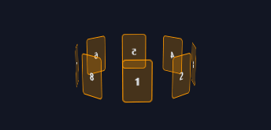</a> <b>Cylinder Ring</b> <code>objects-cylinder-ring</code></td></tr>
<tr><td align="center" valign="top" width="33%"> <b>Tri Fold Panel</b> <code>objects-tri-fold-panel</code></td><td align="center" valign="top" width="33%"><a href="../html/objects-deck-of-cards.html">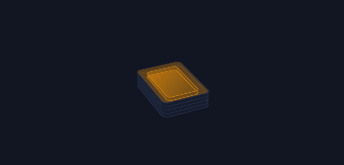</a> <b>Deck of Cards</b> <code>objects-deck-of-cards</code></td><td align="center" valign="top" width="33%"> <b>Crate Stack</b> <code>objects-crate-stack</code></td></tr>
<tr><td align="center" valign="top" width="33%"> <b>Opening Book</b> <code>objects-opening-book</code></td><td align="center" valign="top" width="33%"><a href="../html/objects-isometric-tile-floor.html">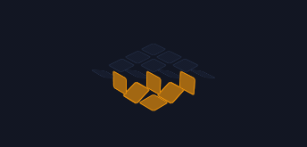</a> <b>Isometric Tile Floor</b> <code>objects-isometric-tile-floor</code></td><td align="center" valign="top" width="33%"><a href="../html/objects-hex-prism.html">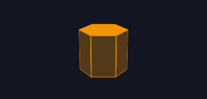</a> <b>Hex Prism</b> <code>objects-hex-prism</code></td></tr>
<tr><td align="center" valign="top" width="33%"> <b>Extruded Text</b> <code>objects-extruded-text</code></td><td align="center" valign="top" width="33%"><a href="../html/objects-tilted-phone-mock.html">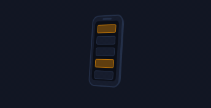</a> <b>Tilted Phone Mock</b> <code>objects-tilted-phone-mock</code></td><td align="center" valign="top" width="33%"><a href="../html/objects-cube-unfold.html">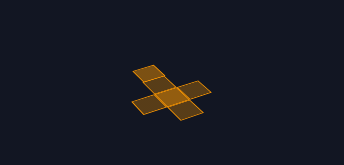</a> <b>Cube Unfold</b> <code>objects-cube-unfold</code></td></tr>
<tr><td align="center" valign="top" width="33%"><a href="../html/objects-exploded-layers.html">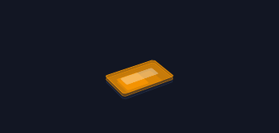</a> <b>Exploded Layers</b> <code>objects-exploded-layers</code></td><td align="center" valign="top" width="33%"> <b>Gyroscope Rings</b> <code>objects-gyroscope-rings</code></td><td align="center" valign="top" width="33%"> <b>3D Gauge Dial</b> <code>objects-3d-gauge-dial</code></td></tr>
<tr><td align="center" valign="top" width="33%"><a href="../html/objects-staircase-steps.html">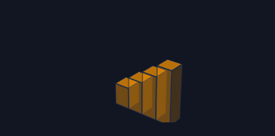</a> <b>Staircase Steps</b> <code>objects-staircase-steps</code></td><td align="center" valign="top" width="33%"><a href="../html/objects-floating-islands.html">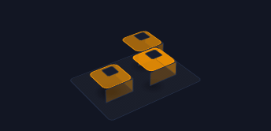</a> <b>Floating Islands</b> <code>objects-floating-islands</code></td><td align="center" valign="top" width="33%"> <b>Split Flap Counter</b> <code>objects-split-flap-counter</code></td></tr>
<tr><td align="center" valign="top" width="33%"><a href="../html/objects-hinged-door.html">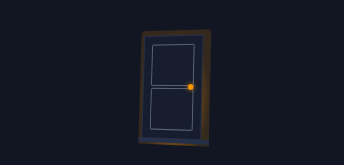</a> <b>Hinged Door</b> <code>objects-hinged-door</code></td><td align="center" valign="top" width="33%"> <b>Picker Drum</b> <code>objects-picker-drum</code></td></tr>
</table>

## SYNTHWAVE & OUTRUN

<table>
<tr><td align="center" valign="top" width="33%"><a href="../html/objects-outrun-sunset.html">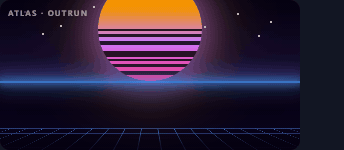</a> <b>Outrun Sunset</b> <code>objects-outrun-sunset</code></td><td align="center" valign="top" width="33%"><a href="../html/objects-neon-grid-drive.html">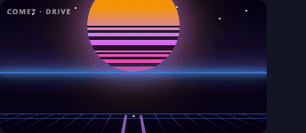</a> <b>Neon Grid Drive</b> <code>objects-neon-grid-drive</code></td><td align="center" valign="top" width="33%"><a href="../html/objects-retro-sunrise.html">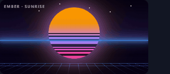</a> <b>Retro Sunrise</b> <code>objects-retro-sunrise</code></td></tr>
<tr><td align="center" valign="top" width="33%"> <b>Palm Sunset</b> <code>objects-palm-sunset</code></td><td align="center" valign="top" width="33%"> <b>Wireframe Peaks</b> <code>objects-wireframe-peaks</code></td><td align="center" valign="top" width="33%"><a href="../html/objects-grid-tunnel.html">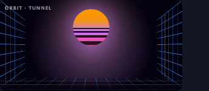</a> <b>Grid Tunnel</b> <code>objects-grid-tunnel</code></td></tr>
</table>

## HOURGLASS & SAND

<table>
<tr><td align="center" valign="top" width="33%"><a href="../html/objects-classic-hourglass.html">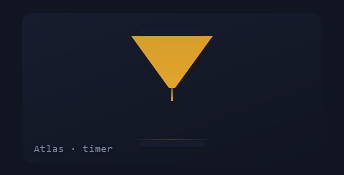</a> <b>Classic Hourglass</b> <code>objects-classic-hourglass</code></td><td align="center" valign="top" width="33%"><a href="../html/objects-wide-hourglass.html">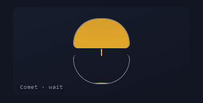</a> <b>Wide Hourglass</b> <code>objects-wide-hourglass</code></td><td align="center" valign="top" width="33%"><a href="../html/objects-falling-stream.html">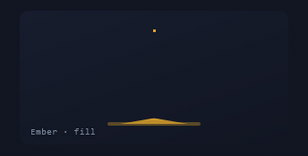</a> <b>Falling Stream</b> <code>objects-falling-stream</code></td></tr>
<tr><td align="center" valign="top" width="33%"><a href="../html/objects-egg-timer.html">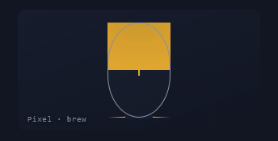</a> <b>Egg Timer</b> <code>objects-egg-timer</code></td><td align="center" valign="top" width="33%"><a href="../html/objects-pouring-pile.html">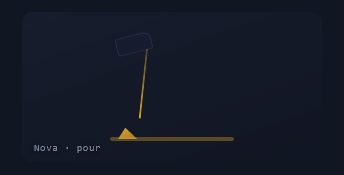</a> <b>Pouring Pile</b> <code>objects-pouring-pile</code></td><td align="center" valign="top" width="33%"><a href="../html/objects-percent-clock.html">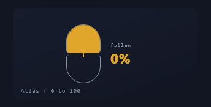</a> <b>Percent Clock</b> <code>objects-percent-clock</code></td></tr>
<tr><td align="center" valign="top" width="33%"><a href="../html/objects-flipping-hourglass.html">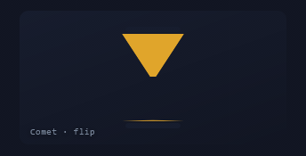</a> <b>Flipping Hourglass</b> <code>objects-flipping-hourglass</code></td><td align="center" valign="top" width="33%"><a href="../html/objects-twin-race.html">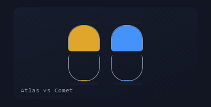</a> <b>Twin Race</b> <code>objects-twin-race</code></td><td align="center" valign="top" width="33%"><a href="../html/objects-timer-ring.html">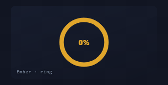</a> <b>Timer Ring</b> <code>objects-timer-ring</code></td></tr>
<tr><td align="center" valign="top" width="33%"><a href="../html/objects-dune-drift.html">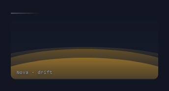</a> <b>Dune Drift</b> <code>objects-dune-drift</code></td><td align="center" valign="top" width="33%"><a href="../html/objects-sinking-in-sand.html">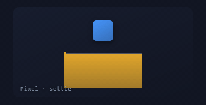</a> <b>Sinking In Sand</b> <code>objects-sinking-in-sand</code></td><td align="center" valign="top" width="33%"><a href="../html/objects-mandala-sweep.html">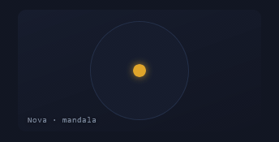</a> <b>Mandala Sweep</b> <code>objects-mandala-sweep</code></td></tr>
</table>
