# Obsidian Facets

Every effect in Prism's **Obsidian Facets** gallery, recorded as a looping GIF.

**130 effects** · 129 animated · 6.5 MB of GIF · click any GIF to open its standalone HTML sample (raw file; open it locally, GitHub shows source).

[← Showcase index](../README.md)

**Sections:** [OBSIDIAN CALLOUTS & ADMONITIONS](#obsidian-callouts-admonitions) · [GRAPH VIEW & LINK VISUALS](#graph-view-link-visuals) · [NOTE CHROME & HEADERS](#note-chrome-headers) · [PROPERTIES & METADATA](#properties-metadata) · [TASKS & DAILY NOTES](#tasks-daily-notes) · [DATAVIEW & DASHBOARDS](#dataview-dashboards) · [CANVAS & SPATIAL NOTES](#canvas-spatial-notes) · [VAULT AMBIENT & FOCUS](#vault-ambient-focus)

## OBSIDIAN CALLOUTS & ADMONITIONS

<table>
<tr><td align="center" valign="top" width="33%"><a href="../html/obsidian-glow-rail-callout.html">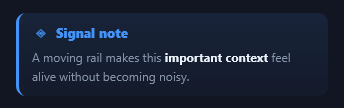</a> <b>Glow-Rail Callout</b> <code>obsidian-glow-rail-callout</code></td><td align="center" valign="top" width="33%"> <b>Fold-Open Callout</b> <code>obsidian-fold-open-callout</code></td><td align="center" valign="top" width="33%"><a href="../html/obsidian-orbiting-sparkle-tip.html">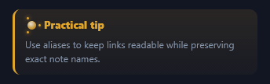</a> <b>Orbiting Sparkle Tip</b> <code>obsidian-orbiting-sparkle-tip</code></td></tr>
<tr><td align="center" valign="top" width="33%"><a href="../html/obsidian-reactor-warning.html">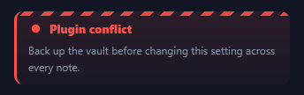</a> <b>Reactor Warning</b> <code>obsidian-reactor-warning</code></td><td align="center" valign="top" width="33%"><a href="../html/obsidian-typewriter-quote.html">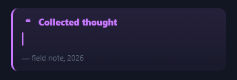</a> <b>Typewriter Quote</b> <code>obsidian-typewriter-quote</code></td><td align="center" valign="top" width="33%"> <b>Abstract Scanner</b> <code>obsidian-abstract-scanner</code></td></tr>
<tr><td align="center" valign="top" width="33%"><a href="../html/obsidian-question-ripple.html">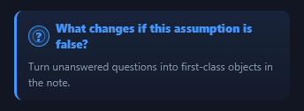</a> <b>Question Ripple</b> <code>obsidian-question-ripple</code></td><td align="center" valign="top" width="33%"><a href="../html/obsidian-check-bloom.html">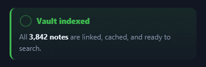</a> <b>Check Bloom</b> <code>obsidian-check-bloom</code></td><td align="center" valign="top" width="33%"><a href="../html/obsidian-info-ticker.html">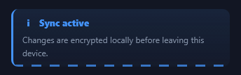</a> <b>Info Ticker</b> <code>obsidian-info-ticker</code></td></tr>
<tr><td align="center" valign="top" width="33%"><a href="../html/obsidian-caution-beacon.html">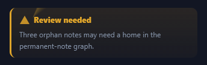</a> <b>Caution Beacon</b> <code>obsidian-caution-beacon</code></td><td align="center" valign="top" width="33%"> <b>Example Carousel</b> <code>obsidian-example-carousel</code></td><td align="center" valign="top" width="33%"><a href="../html/obsidian-self-checking-todo.html">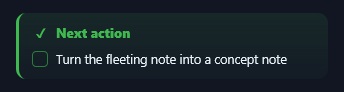</a> <b>Self-Checking Todo</b> <code>obsidian-self-checking-todo</code></td></tr>
<tr><td align="center" valign="top" width="33%"><a href="../html/obsidian-bug-crawl.html">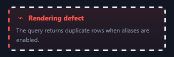</a> <b>Bug Crawl</b> <code>obsidian-bug-crawl</code></td><td align="center" valign="top" width="33%"><a href="../html/obsidian-nested-callout-stack.html">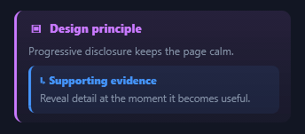</a> <b>Nested Callout Stack</b> <code>obsidian-nested-callout-stack</code></td><td align="center" valign="top" width="33%"><a href="../html/obsidian-aurora-header-callout.html">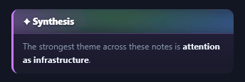</a> <b>Aurora Header Callout</b> <code>obsidian-aurora-header-callout</code></td></tr>
<tr><td align="center" valign="top" width="33%"><a href="../html/obsidian-priority-stamp.html">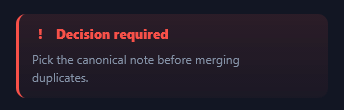</a> <b>Priority Stamp</b> <code>obsidian-priority-stamp</code></td><td align="center" valign="top" width="33%"> <b>Milestone Runner</b> <code>obsidian-milestone-runner</code></td><td align="center" valign="top" width="33%"><a href="../html/obsidian-whisper-aside.html">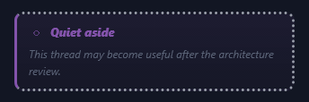</a> <b>Whisper Aside</b> <code>obsidian-whisper-aside</code></td></tr>
</table>

## GRAPH VIEW & LINK VISUALS

<table>
<tr><td align="center" valign="top" width="33%"><a href="../html/obsidian-local-graph-pulse.html">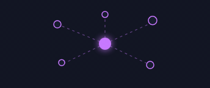</a> <b>Local Graph Pulse</b> <code>obsidian-local-graph-pulse</code></td><td align="center" valign="top" width="33%"> <b>Knowledge Constellation</b> <code>obsidian-knowledge-constellation</code></td><td align="center" valign="top" width="33%"><a href="../html/obsidian-orbiting-neighbors.html">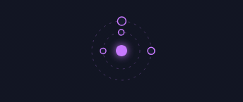</a> <b>Orbiting Neighbors</b> <code>obsidian-orbiting-neighbors</code></td></tr>
<tr><td align="center" valign="top" width="33%"><a href="../html/obsidian-sequential-hub-spokes.html">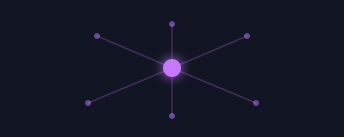</a> <b>Sequential Hub &amp; Spokes</b> <code>obsidian-sequential-hub-spokes</code></td><td align="center" valign="top" width="33%"> <b>Living Wikilink</b> <code>obsidian-living-wikilink</code></td><td align="center" valign="top" width="33%"><a href="../html/obsidian-hover-preview-float.html">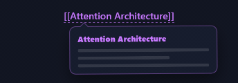</a> <b>Hover Preview Float</b> <code>obsidian-hover-preview-float</code></td></tr>
<tr><td align="center" valign="top" width="33%"> <b>Backlink Flow</b> <code>obsidian-backlink-flow</code></td><td align="center" valign="top" width="33%"> <b>Link-Trail Breadcrumbs</b> <code>obsidian-link-trail-breadcrumbs</code></td><td align="center" valign="top" width="33%"> <b>Link Strength Meter</b> <code>obsidian-link-strength-meter</code></td></tr>
<tr><td align="center" valign="top" width="33%"> <b>Unlinked Mentions Radar</b> <code>obsidian-unlinked-mentions-radar</code></td><td align="center" valign="top" width="33%"><a href="../html/obsidian-cluster-bloom.html">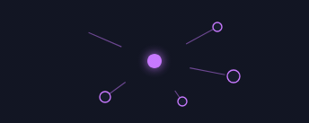</a> <b>Cluster Bloom</b> <code>obsidian-cluster-bloom</code></td><td align="center" valign="top" width="33%"><a href="../html/obsidian-bridge-note-shuttle.html">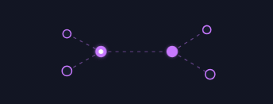</a> <b>Bridge-Note Shuttle</b> <code>obsidian-bridge-note-shuttle</code></td></tr>
<tr><td align="center" valign="top" width="33%"><a href="../html/obsidian-floating-tag-web.html">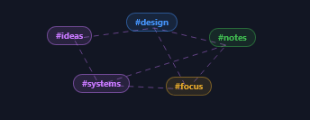</a> <b>Floating Tag Web</b> <code>obsidian-floating-tag-web</code></td><td align="center" valign="top" width="33%"><a href="../html/obsidian-graph-minimap-tour.html">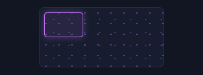</a> <b>Graph Minimap Tour</b> <code>obsidian-graph-minimap-tour</code></td><td align="center" valign="top" width="33%"> <b>Embedded Note Materialize</b> <code>obsidian-embedded-note-materialize</code></td></tr>
<tr><td align="center" valign="top" width="33%"> <b>Mention Ping</b> <code>obsidian-mention-ping</code></td></tr>
</table>

## NOTE CHROME & HEADERS

<table>
<tr><td align="center" valign="top" width="33%"><a href="../html/obsidian-holographic-note-title.html">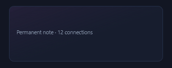</a> <b>Holographic Note Title</b> <code>obsidian-holographic-note-title</code></td><td align="center" valign="top" width="33%"><a href="../html/obsidian-breadcrumb-comet.html">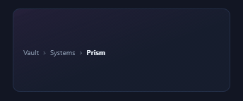</a> <b>Breadcrumb Comet</b> <code>obsidian-breadcrumb-comet</code></td><td align="center" valign="top" width="33%"><a href="../html/obsidian-reading-progress-halo.html">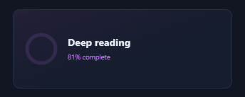</a> <b>Reading Progress Halo</b> <code>obsidian-reading-progress-halo</code></td></tr>
<tr><td align="center" valign="top" width="33%"><a href="../html/obsidian-cycling-note-tabs.html">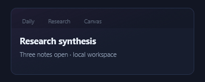</a> <b>Cycling Note Tabs</b> <code>obsidian-cycling-note-tabs</code></td><td align="center" valign="top" width="33%"><a href="../html/obsidian-metadata-curtain.html">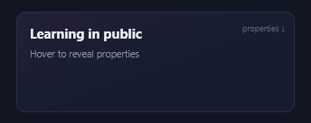</a> <b>Metadata Curtain</b> <code>obsidian-metadata-curtain</code></td><td align="center" valign="top" width="33%"><a href="../html/obsidian-section-fold-wave.html">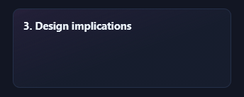</a> <b>Section Fold Wave</b> <code>obsidian-section-fold-wave</code></td></tr>
<tr><td align="center" valign="top" width="33%"><a href="../html/obsidian-heading-anchor-spark.html">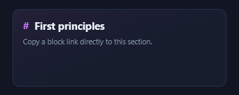</a> <b>Heading Anchor Spark</b> <code>obsidian-heading-anchor-spark</code></td><td align="center" valign="top" width="33%"><a href="../html/obsidian-outline-elevator.html">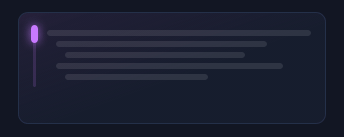</a> <b>Outline Elevator</b> <code>obsidian-outline-elevator</code></td><td align="center" valign="top" width="33%"><a href="../html/obsidian-note-status-crown.html">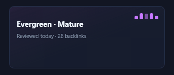</a> <b>Note Status Crown</b> <code>obsidian-note-status-crown</code></td></tr>
<tr><td align="center" valign="top" width="33%"><a href="../html/obsidian-focused-paragraph-lens.html">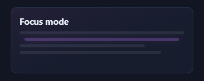</a> <b>Focused Paragraph Lens</b> <code>obsidian-focused-paragraph-lens</code></td><td align="center" valign="top" width="33%"><a href="../html/obsidian-sliding-alias-ribbon.html">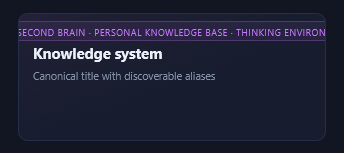</a> <b>Sliding Alias Ribbon</b> <code>obsidian-sliding-alias-ribbon</code></td><td align="center" valign="top" width="33%"><a href="../html/obsidian-source-trail-header.html">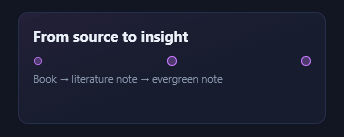</a> <b>Source Trail Header</b> <code>obsidian-source-trail-header</code></td></tr>
<tr><td align="center" valign="top" width="33%"><a href="../html/obsidian-wordcount-odometer.html">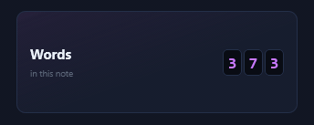</a> <b>Wordcount Odometer</b> <code>obsidian-wordcount-odometer</code></td><td align="center" valign="top" width="33%"><a href="../html/obsidian-reading-time-orbit.html">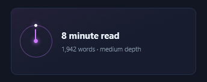</a> <b>Reading-Time Orbit</b> <code>obsidian-reading-time-orbit</code></td><td align="center" valign="top" width="33%"> <b>Pinboard Note Header</b> <code>obsidian-pinboard-note-header</code></td></tr>
<tr><td align="center" valign="top" width="33%"><a href="../html/obsidian-note-age-rings.html">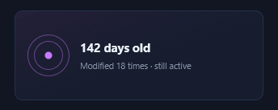</a> <b>Note-Age Rings</b> <code>obsidian-note-age-rings</code></td></tr>
</table>

## PROPERTIES & METADATA

<table>
<tr><td align="center" valign="top" width="33%"><a href="../html/obsidian-property-scanner.html">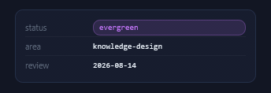</a> <b>Property Scanner</b> <code>obsidian-property-scanner</code></td><td align="center" valign="top" width="33%"> <b>YAML Prism</b> <code>obsidian-yaml-prism</code></td><td align="center" valign="top" width="33%"> <b>Animated Tag Stack</b> <code>obsidian-animated-tag-stack</code></td></tr>
<tr><td align="center" valign="top" width="33%"> <b>Status Morph Pill</b> <code>obsidian-status-morph-pill</code></td><td align="center" valign="top" width="33%"><a href="../html/obsidian-priority-thermometer.html">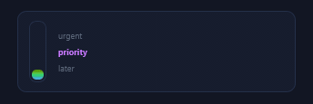</a> <b>Priority Thermometer</b> <code>obsidian-priority-thermometer</code></td><td align="center" valign="top" width="33%"><a href="../html/obsidian-date-countdown-arc.html">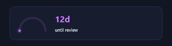</a> <b>Date Countdown Arc</b> <code>obsidian-date-countdown-arc</code></td></tr>
<tr><td align="center" valign="top" width="33%"> <b>Rating Star Cascade</b> <code>obsidian-rating-star-cascade</code></td><td align="center" valign="top" width="33%"><a href="../html/obsidian-multi-select-marquee.html">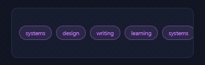</a> <b>Multi-Select Marquee</b> <code>obsidian-multi-select-marquee</code></td><td align="center" valign="top" width="33%"><a href="../html/obsidian-relation-thread.html">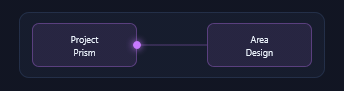</a> <b>Relation Thread</b> <code>obsidian-relation-thread</code></td></tr>
<tr><td align="center" valign="top" width="33%"><a href="../html/obsidian-boolean-toggle-spark.html">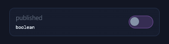</a> <b>Boolean Toggle Spark</b> <code>obsidian-boolean-toggle-spark</code></td><td align="center" valign="top" width="33%"> <b>Number Property Dial</b> <code>obsidian-number-property-dial</code></td><td align="center" valign="top" width="33%"> <b>Property Diff</b> <code>obsidian-property-diff</code></td></tr>
<tr><td align="center" valign="top" width="33%"><a href="../html/obsidian-field-validation-cycle.html">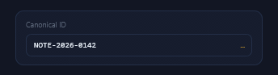</a> <b>Field Validation Cycle</b> <code>obsidian-field-validation-cycle</code></td><td align="center" valign="top" width="33%"><a href="../html/obsidian-formula-result-pulse.html">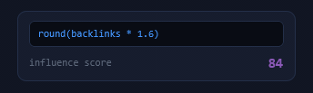</a> <b>Formula Result Pulse</b> <code>obsidian-formula-result-pulse</code></td><td align="center" valign="top" width="33%"> <b>Created/Modified Twins</b> <code>obsidian-created-modified-twins</code></td></tr>
<tr><td align="center" valign="top" width="33%"><a href="../html/obsidian-frontmatter-gate.html">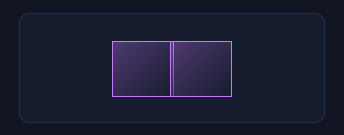</a> <b>Frontmatter Gate</b> <code>obsidian-frontmatter-gate</code></td></tr>
</table>

## TASKS & DAILY NOTES

<table>
<tr><td align="center" valign="top" width="33%"> <b>Daily-Note Sunrise</b> <code>obsidian-daily-note-sunrise</code></td><td align="center" valign="top" width="33%"><a href="../html/obsidian-habit-constellation.html">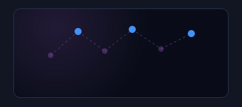</a> <b>Habit Constellation</b> <code>obsidian-habit-constellation</code></td><td align="center" valign="top" width="33%"> <b>Task Completion Sweep</b> <code>obsidian-task-completion-sweep</code></td></tr>
<tr><td align="center" valign="top" width="33%"><a href="../html/obsidian-kanban-flow.html">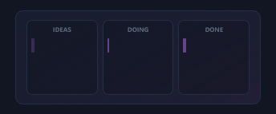</a> <b>Kanban Flow</b> <code>obsidian-kanban-flow</code></td><td align="center" valign="top" width="33%"> <b>Deadline Fuse</b> <code>obsidian-deadline-fuse</code></td><td align="center" valign="top" width="33%"> <b>Recurring Task Loop</b> <code>obsidian-recurring-task-loop</code></td></tr>
<tr><td align="center" valign="top" width="33%"> <b>Pomodoro Bloom</b> <code>obsidian-pomodoro-bloom</code></td><td align="center" valign="top" width="33%"><a href="../html/obsidian-streak-flame.html">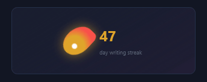</a> <b>Streak Flame</b> <code>obsidian-streak-flame</code></td><td align="center" valign="top" width="33%"><a href="../html/obsidian-energy-timeline.html">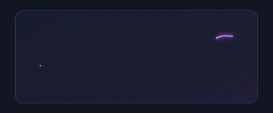</a> <b>Energy Timeline</b> <code>obsidian-energy-timeline</code></td></tr>
<tr><td align="center" valign="top" width="33%"> <b>Weekday Ribbon</b> <code>obsidian-weekday-ribbon</code></td><td align="center" valign="top" width="33%"> <b>Priority Swarm</b> <code>obsidian-priority-swarm</code></td><td align="center" valign="top" width="33%"> <b>Inbox Zero</b> <code>obsidian-inbox-zero</code></td></tr>
<tr><td align="center" valign="top" width="33%"> <b>Completed Confetti</b> <code>obsidian-completed-confetti</code></td><td align="center" valign="top" width="33%"> <b>Meeting Pulse</b> <code>obsidian-meeting-pulse</code></td><td align="center" valign="top" width="33%"> <b>Reflection Mirror</b> <code>obsidian-reflection-mirror</code></td></tr>
<tr><td align="center" valign="top" width="33%"> <b>Quick-Capture Beam</b> <code>obsidian-quick-capture-beam</code></td></tr>
</table>

## DATAVIEW & DASHBOARDS

<table>
<tr><td align="center" valign="top" width="33%"> <b>Dataview Query Scanner</b> <code>obsidian-dataview-query-scanner</code></td><td align="center" valign="top" width="33%"> <b>Stat Prism</b> <code>obsidian-stat-prism</code></td><td align="center" valign="top" width="33%"> <b>Heatmap Rain</b> <code>obsidian-heatmap-rain</code></td></tr>
<tr><td align="center" valign="top" width="33%"> <b>Living Sparkline</b> <code>obsidian-living-sparkline</code></td><td align="center" valign="top" width="33%"> <b>Progress Crystal</b> <code>obsidian-progress-crystal</code></td><td align="center" valign="top" width="33%"> <b>Table Row Focus</b> <code>obsidian-table-row-focus</code></td></tr>
<tr><td align="center" valign="top" width="33%"> <b>Filter Funnel</b> <code>obsidian-filter-funnel</code></td><td align="center" valign="top" width="33%"> <b>Group Accordion</b> <code>obsidian-group-accordion</code></td><td align="center" valign="top" width="33%"> <b>Calendar Matrix</b> <code>obsidian-calendar-matrix</code></td></tr>
<tr><td align="center" valign="top" width="33%"> <b>Vault Activity Rings</b> <code>obsidian-vault-activity-rings</code></td><td align="center" valign="top" width="33%"> <b>Vault Health ECG</b> <code>obsidian-vault-health-ecg</code></td><td align="center" valign="top" width="33%"> <b>Link Velocity Bars</b> <code>obsidian-link-velocity-bars</code></td></tr>
<tr><td align="center" valign="top" width="33%"> <b>Tag Distribution Orbit</b> <code>obsidian-tag-distribution-orbit</code></td><td align="center" valign="top" width="33%"> <b>Query Terminal</b> <code>obsidian-query-terminal</code></td><td align="center" valign="top" width="33%"> <b>Flipping KPI Card</b> <code>obsidian-flipping-kpi-card</code></td></tr>
<tr><td align="center" valign="top" width="33%"> <b>Data Freshness Beacon</b> <code>obsidian-data-freshness-beacon</code></td></tr>
</table>

## CANVAS & SPATIAL NOTES

<table>
<tr><td align="center" valign="top" width="33%"> <b>Floating Canvas Card</b> <code>obsidian-floating-canvas-card</code></td><td align="center" valign="top" width="33%"> <b>Portal Connection</b> <code>obsidian-portal-connection</code></td><td align="center" valign="top" width="33%"> <b>Canvas Group Aura</b> <code>obsidian-canvas-group-aura</code></td></tr>
<tr><td align="center" valign="top" width="33%"> <b>Thought-Path Traveler</b> <code>obsidian-thought-path-traveler</code></td><td align="center" valign="top" width="33%"> <b>Spatial Zoom</b> <code>obsidian-spatial-zoom</code></td><td align="center" valign="top" width="33%"> <b>Card-Stack Fan</b> <code>obsidian-card-stack-fan</code></td></tr>
<tr><td align="center" valign="top" width="33%"> <b>Canvas Radar</b> <code>obsidian-canvas-radar</code></td><td align="center" valign="top" width="33%"> <b>Sticky-Note Curl</b> <code>obsidian-sticky-note-curl</code></td><td align="center" valign="top" width="33%"> <b>Image Embed Ken Burns</b> <code>obsidian-image-embed-ken-burns</code></td></tr>
<tr><td align="center" valign="top" width="33%"> <b>PDF Portal</b> <code>obsidian-pdf-portal</code></td><td align="center" valign="top" width="33%"> <b>Mind-Map Branch Grow</b> <code>obsidian-mind-map-branch-grow</code></td><td align="center" valign="top" width="33%"> <b>Selection Lasso</b> <code>obsidian-selection-lasso</code></td></tr>
<tr><td align="center" valign="top" width="33%"> <b>Alignment Guides</b> <code>obsidian-alignment-guides</code></td><td align="center" valign="top" width="33%"> <b>Connection Traffic</b> <code>obsidian-connection-traffic</code> · static</td><td align="center" valign="top" width="33%"> <b>Idea Merge</b> <code>obsidian-idea-merge</code></td></tr>
<tr><td align="center" valign="top" width="33%"> <b>Infinite Canvas Drift</b> <code>obsidian-infinite-canvas-drift</code></td></tr>
</table>

## VAULT AMBIENT & FOCUS

<table>
<tr><td align="center" valign="top" width="33%"> <b>Opening Vault Door</b> <code>obsidian-opening-vault-door</code></td><td align="center" valign="top" width="33%"> <b>Focus Nebula</b> <code>obsidian-focus-nebula</code></td><td align="center" valign="top" width="33%"> <b>Cursor Firefly</b> <code>obsidian-cursor-firefly</code></td></tr>
<tr><td align="center" valign="top" width="33%"> <b>Zen Breathing Ring</b> <code>obsidian-zen-breathing-ring</code></td><td align="center" valign="top" width="33%"> <b>Rain Window</b> <code>obsidian-rain-window</code></td><td align="center" valign="top" width="33%"> <b>Page Turn</b> <code>obsidian-page-turn</code></td></tr>
<tr><td align="center" valign="top" width="33%"> <b>Ink Diffusion</b> <code>obsidian-ink-diffusion</code></td><td align="center" valign="top" width="33%"> <b>Knowledge Garden</b> <code>obsidian-knowledge-garden</code></td><td align="center" valign="top" width="33%"> <b>Synapse Field</b> <code>obsidian-synapse-field</code></td></tr>
<tr><td align="center" valign="top" width="33%"> <b>Midnight Aurora</b> <code>obsidian-midnight-aurora</code></td><td align="center" valign="top" width="33%"> <b>Candle Focus</b> <code>obsidian-candle-focus</code></td><td align="center" valign="top" width="33%"> <b>Coffee Steam</b> <code>obsidian-coffee-steam</code></td></tr>
<tr><td align="center" valign="top" width="33%"> <b>Quantum Cursor</b> <code>obsidian-quantum-cursor</code></td><td align="center" valign="top" width="33%"> <b>Vault Pulse</b> <code>obsidian-vault-pulse</code></td><td align="center" valign="top" width="33%"> <b>Paper-Grain Drift</b> <code>obsidian-paper-grain-drift</code></td></tr>
<tr><td align="center" valign="top" width="33%"> <b>Thought Bubbles</b> <code>obsidian-thought-bubbles</code></td></tr>
</table>
