# Text Shapes

Every effect in Prism's **Text Shapes** gallery, recorded as a looping GIF.

**53 effects** · 47 animated · 4.6 MB of GIF · click any GIF to open its standalone HTML sample (raw file; open it locally, GitHub shows source).

[← Showcase index](../README.md)

**Sections:** [Arcs & Rainbows](#arcs-rainbows) · [Circular / Around](#circular-around) · [Wave & Sine paths](#wave-sine-paths) · [Spiral & Vortex](#spiral-vortex) · [Filled shapes](#filled-shapes) · [Perspective & 3D tunnels](#perspective-3d-tunnels) · [Marquee](#marquee) · [3D Tunnels & Perspective](#3d-tunnels-perspective) · [2D Shaped Text](#2d-shaped-text)

## Arcs & Rainbows

<table>
<tr><td align="center" valign="top" width="33%"><a href="../html/shapes-rainbow-arc-hero.html">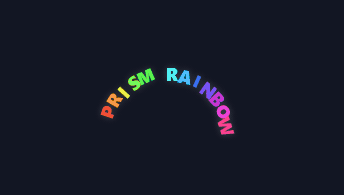</a> <b>Rainbow-Arc ★ hero</b> <code>shapes-rainbow-arc-hero</code></td><td align="center" valign="top" width="33%"><a href="../html/shapes-solid-arc.html">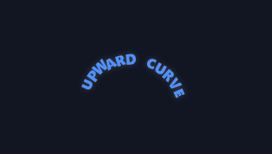</a> <b>Solid-Arc</b> <code>shapes-solid-arc</code></td><td align="center" valign="top" width="33%"><a href="../html/shapes-frown-arc.html">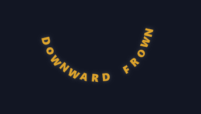</a> <b>Frown-Arc</b> <code>shapes-frown-arc</code></td></tr>
<tr><td align="center" valign="top" width="33%"><a href="../html/shapes-arc-rise.html">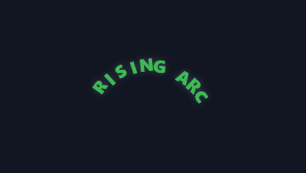</a> <b>Arc-Rise</b> <code>shapes-arc-rise</code></td></tr>
</table>

## Circular / Around

<table>
<tr><td align="center" valign="top" width="33%"> <b>Ring-Spin</b> <code>shapes-ring-spin</code></td><td align="center" valign="top" width="33%"> <b>Counter-Seal</b> <code>shapes-counter-seal</code></td><td align="center" valign="top" width="33%"> <b>Half-Ring</b> <code>shapes-half-ring</code></td></tr>
</table>

## Wave & Sine paths

<table>
<tr><td align="center" valign="top" width="33%"> <b>Sine-Wave</b> <code>shapes-sine-wave</code></td><td align="center" valign="top" width="33%"> <b>Flag-Wave</b> <code>shapes-flag-wave</code></td><td align="center" valign="top" width="33%"> <b>Bounce-Hop</b> <code>shapes-bounce-hop</code></td></tr>
</table>

## Spiral & Vortex

<table>
<tr><td align="center" valign="top" width="33%"><a href="../html/shapes-spiral-in.html">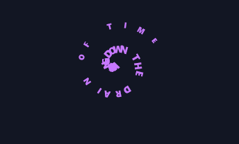</a> <b>Spiral-In</b> <code>shapes-spiral-in</code></td><td align="center" valign="top" width="33%"> <b>Vortex-Pull</b> <code>shapes-vortex-pull</code></td><td align="center" valign="top" width="33%"><a href="../html/shapes-galaxy-arm.html">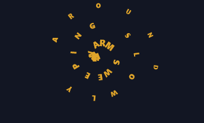</a> <b>Galaxy-Arm</b> <code>shapes-galaxy-arm</code></td></tr>
</table>

## Filled shapes

<table>
<tr><td align="center" valign="top" width="33%"><a href="../html/shapes-heart-fill.html">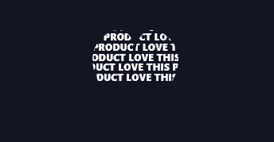</a> <b>Heart-Fill</b> <code>shapes-heart-fill</code></td><td align="center" valign="top" width="33%"><a href="../html/shapes-star-fill.html">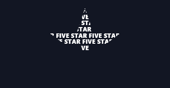</a> <b>Star-Fill</b> <code>shapes-star-fill</code></td><td align="center" valign="top" width="33%"><a href="../html/shapes-triangle-fill.html">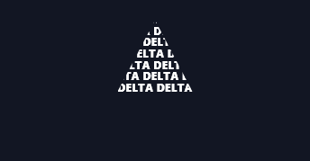</a> <b>Triangle-Fill</b> <code>shapes-triangle-fill</code></td></tr>
<tr><td align="center" valign="top" width="33%"><a href="../html/shapes-rainbow-fill.html">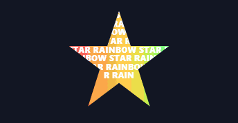</a> <b>Rainbow-Fill</b> <code>shapes-rainbow-fill</code></td></tr>
</table>

## Perspective & 3D tunnels

<table>
<tr><td align="center" valign="top" width="33%"> <b>Tunnel-Zoom</b> <code>shapes-tunnel-zoom</code></td><td align="center" valign="top" width="33%"> <b>Star-Crawl</b> <code>shapes-star-crawl</code></td><td align="center" valign="top" width="33%"> <b>Depth-Stream</b> <code>shapes-depth-stream</code></td></tr>
</table>

## Marquee

<table>
<tr><td align="center" valign="top" width="33%"><a href="../html/shapes-path-marquee-wave.html">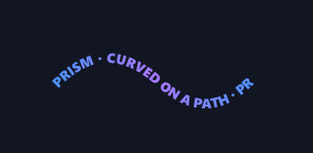</a> <b>Path-Marquee (wave)</b> <code>shapes-path-marquee-wave</code> · static</td><td align="center" valign="top" width="33%"><a href="../html/shapes-path-ring-circle.html">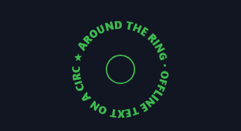</a> <b>Path-Ring (circle)</b> <code>shapes-path-ring-circle</code> · static</td><td align="center" valign="top" width="33%"><a href="../html/shapes-path-dome-static-arc.html">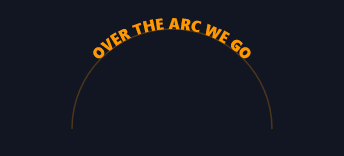</a> <b>Path-Dome (static arc)</b> <code>shapes-path-dome-static-arc</code> · static</td></tr>
</table>

## 3D Tunnels & Perspective

<table>
<tr><td align="center" valign="top" width="33%"> <b>Text Tunnel</b> <code>shapes-text-tunnel</code></td><td align="center" valign="top" width="33%"><a href="../html/shapes-3d-ring-of-text.html">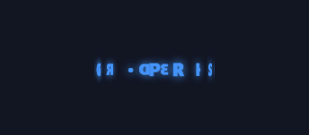</a> <b>3D Ring of Text</b> <code>shapes-3d-ring-of-text</code></td><td align="center" valign="top" width="33%"><a href="../html/shapes-cylinder-wrap.html">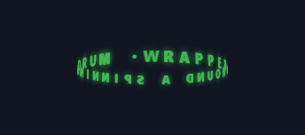</a> <b>Cylinder Wrap</b> <code>shapes-cylinder-wrap</code></td></tr>
<tr><td align="center" valign="top" width="33%"><a href="../html/shapes-text-cube.html">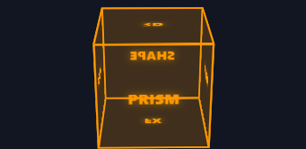</a> <b>Text Cube</b> <code>shapes-text-cube</code></td><td align="center" valign="top" width="33%"><a href="../html/shapes-character-helix.html">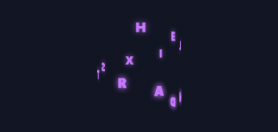</a> <b>Character Helix</b> <code>shapes-character-helix</code></td><td align="center" valign="top" width="33%"><a href="../html/shapes-word-carousel.html">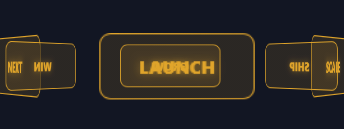</a> <b>Word Carousel</b> <code>shapes-word-carousel</code></td></tr>
<tr><td align="center" valign="top" width="33%"> <b>Vanishing Marquee</b> <code>shapes-vanishing-marquee</code></td><td align="center" valign="top" width="33%"><a href="../html/shapes-spiral-staircase.html">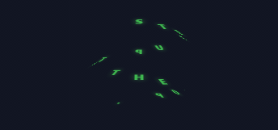</a> <b>Spiral Staircase</b> <code>shapes-spiral-staircase</code></td><td align="center" valign="top" width="33%"><a href="../html/shapes-orbiting-word-cloud.html">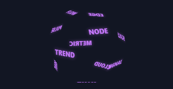</a> <b>Orbiting Word Cloud</b> <code>shapes-orbiting-word-cloud</code></td></tr>
<tr><td align="center" valign="top" width="33%"><a href="../html/shapes-letter-sphere.html">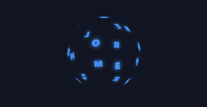</a> <b>Letter Sphere</b> <code>shapes-letter-sphere</code></td><td align="center" valign="top" width="33%"> <b>Extruded Word</b> <code>shapes-extruded-word</code></td><td align="center" valign="top" width="33%"> <b>Depth Wave</b> <code>shapes-depth-wave</code></td></tr>
<tr><td align="center" valign="top" width="33%"> <b>3D Flip Panel</b> <code>shapes-3d-flip-panel</code></td><td align="center" valign="top" width="33%"><a href="../html/shapes-triangular-prism.html">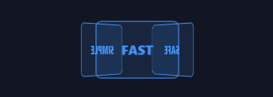</a> <b>Triangular Prism</b> <code>shapes-triangular-prism</code></td><td align="center" valign="top" width="33%"> <b>Fanning Pages</b> <code>shapes-fanning-pages</code></td></tr>
</table>

## 2D Shaped Text

<table>
<tr><td align="center" valign="top" width="33%"><a href="../html/shapes-full-circle.html">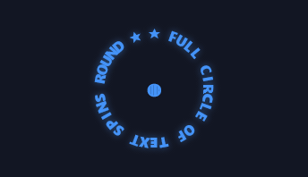</a> <b>Full Circle</b> <code>shapes-full-circle</code></td><td align="center" valign="top" width="33%"> <b>High-Amplitude Wave</b> <code>shapes-high-amplitude-wave</code></td><td align="center" valign="top" width="33%"> <b>Zigzag Path</b> <code>shapes-zigzag-path</code></td></tr>
<tr><td align="center" valign="top" width="33%"> <b>Bounce Path</b> <code>shapes-bounce-path</code></td><td align="center" valign="top" width="33%"> <b>Tight Spiral</b> <code>shapes-tight-spiral</code></td><td align="center" valign="top" width="33%"><a href="../html/shapes-loose-spiral.html">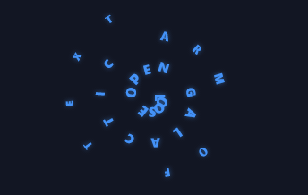</a> <b>Loose Spiral</b> <code>shapes-loose-spiral</code></td></tr>
<tr><td align="center" valign="top" width="33%"> <b>Star Fill (pulsing)</b> <code>shapes-star-fill-pulsing</code></td><td align="center" valign="top" width="33%"><a href="../html/shapes-heart-fill-beating.html">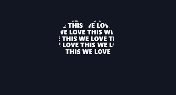</a> <b>Heart Fill (beating)</b> <code>shapes-heart-fill-beating</code></td><td align="center" valign="top" width="33%"> <b>Arrow Fill</b> <code>shapes-arrow-fill</code></td></tr>
<tr><td align="center" valign="top" width="33%"><a href="../html/shapes-triangle-fill-2.html">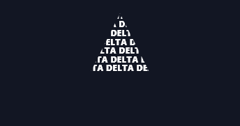</a> <b>Triangle Fill</b> <code>shapes-triangle-fill-2</code></td><td align="center" valign="top" width="33%"><a href="../html/shapes-hexagon-fill.html">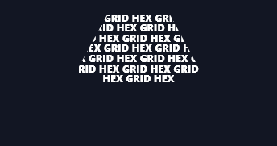</a> <b>Hexagon Fill</b> <code>shapes-hexagon-fill</code></td><td align="center" valign="top" width="33%"><a href="../html/shapes-diamond-fill.html">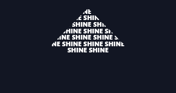</a> <b>Diamond Fill</b> <code>shapes-diamond-fill</code></td></tr>
<tr><td align="center" valign="top" width="33%"><a href="../html/shapes-infinity-loop.html">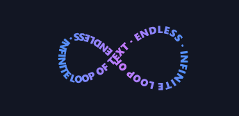</a> <b>Infinity Loop</b> <code>shapes-infinity-loop</code> · static</td><td align="center" valign="top" width="33%"><a href="../html/shapes-s-curve-path.html">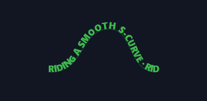</a> <b>S-Curve Path</b> <code>shapes-s-curve-path</code> · static</td><td align="center" valign="top" width="33%"><a href="../html/shapes-figure-8-track.html">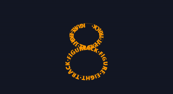</a> <b>Figure-8 Track</b> <code>shapes-figure-8-track</code> · static</td></tr>
</table>
