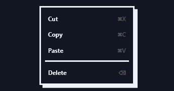
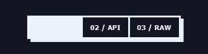
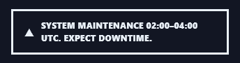
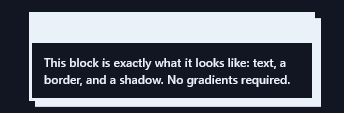
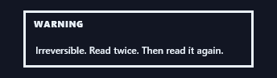
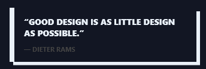
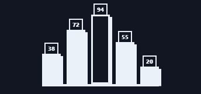
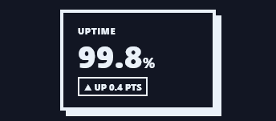
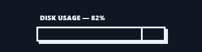
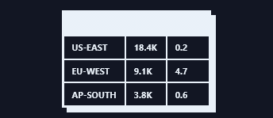

# Brutalist Web · Spectrums

Every Prism facet authored in the **Brutalist Web** visual language, recorded as a looping GIF.

**28 effects** · 7 animated · 64 KB of GIF · click any GIF to open its standalone HTML sample (raw file; open it locally, GitHub shows source).

[← Showcase index](../README.md)

<table>
<tr><td align="center" valign="top" width="33%"> <b>Raw Nav Bar</b> <code>spectrums-raw-nav-bar</code> · static</td><td align="center" valign="top" width="33%"> <b>Slab Dropdown</b> <code>spectrums-slab-dropdown</code> · static</td><td align="center" valign="top" width="33%"> <b>Right-Click Slab Menu</b> <code>spectrums-right-click-slab-menu</code> · static</td></tr>
<tr><td align="center" valign="top" width="33%"> <b>Block Tab Bar</b> <code>spectrums-block-tab-bar</code> · static</td><td align="center" valign="top" width="33%"> <b>Slam Button</b> <code>spectrums-slam-button</code></td><td align="center" valign="top" width="33%"> <b>Hot Accent Button</b> <code>spectrums-hot-accent-button</code></td></tr>
<tr><td align="center" valign="top" width="33%"> <b>Square Icon Buttons</b> <code>spectrums-square-icon-buttons</code></td><td align="center" valign="top" width="33%"> <b>Bordered Toggle Button</b> <code>spectrums-bordered-toggle-button</code></td><td align="center" valign="top" width="33%"> <b>Stamp Toast</b> <code>spectrums-stamp-toast</code> · static</td></tr>
<tr><td align="center" valign="top" width="33%"> <b>Hot Alert Stamp</b> <code>spectrums-hot-alert-stamp</code> · static</td><td align="center" valign="top" width="33%"> <b>Full-Width Warning Banner</b> <code>spectrums-full-width-warning-banner</code> · static</td><td align="center" valign="top" width="33%"> <b>Slab Callout</b> <code>spectrums-slab-callout</code> · static</td></tr>
<tr><td align="center" valign="top" width="33%"> <b>Hot Warning Callout</b> <code>spectrums-hot-warning-callout</code> · static</td><td align="center" valign="top" width="33%"> <b>Blockquote Slab</b> <code>spectrums-blockquote-slab</code> · static</td><td align="center" valign="top" width="33%"> <b>Slab Bar Chart</b> <code>spectrums-slab-bar-chart</code> · static</td></tr>
<tr><td align="center" valign="top" width="33%"> <b>Boxed KPI Slab</b> <code>spectrums-boxed-kpi-slab</code> · static</td><td align="center" valign="top" width="33%"> <b>Block Meter Bar</b> <code>spectrums-block-meter-bar</code> · static</td><td align="center" valign="top" width="33%"> <b>Ruled Data Table</b> <code>spectrums-ruled-data-table</code> · static</td></tr>
<tr><td align="center" valign="top" width="33%"> <b>Slab Text Field</b> <code>spectrums-slab-text-field</code></td><td align="center" valign="top" width="33%"> <b>Block Checkbox</b> <code>spectrums-block-checkbox</code> · static</td><td align="center" valign="top" width="33%"> <b>Raw Select Box</b> <code>spectrums-raw-select-box</code></td></tr>
<tr><td align="center" valign="top" width="33%"> <b>Block Range Slider</b> <code>spectrums-block-range-slider</code> · static</td><td align="center" valign="top" width="33%"> <b>Stacked Slab Headline</b> <code>spectrums-stacked-slab-headline</code> · static</td><td align="center" valign="top" width="33%"> <b>Highlighter Mark Text</b> <code>spectrums-highlighter-mark-text</code> · static</td></tr>
<tr><td align="center" valign="top" width="33%"> <b>Rotated Stamp Label</b> <code>spectrums-rotated-stamp-label</code> · static</td><td align="center" valign="top" width="33%"> <b>Slab Badge</b> <code>spectrums-slab-badge</code> · static</td><td align="center" valign="top" width="33%"> <b>Block Avatar</b> <code>spectrums-block-avatar</code> · static</td></tr>
<tr><td align="center" valign="top" width="33%"> <b>Palette Swatch Chips</b> <code>spectrums-palette-swatch-chips</code></td></tr>
</table>
