# Cyberpunk OS · Spectrums

Every Prism facet authored in the **Cyberpunk OS** visual language, recorded as a looping GIF.

**32 effects** · 31 animated · 303 KB of GIF · click any GIF to open its standalone HTML sample (raw file; open it locally, GitHub shows source).

[← Showcase index](../README.md)

<table>
<tr><td align="center" valign="top" width="33%"><a href="../html/spectrums-angular-dropdown-menu.html">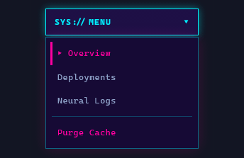</a> <b>Angular Dropdown Menu</b> <code>spectrums-angular-dropdown-menu</code></td><td align="center" valign="top" width="33%"> <b>Neon Underline Nav</b> <code>spectrums-neon-underline-nav</code></td><td align="center" valign="top" width="33%"><a href="../html/spectrums-floating-context-menu.html">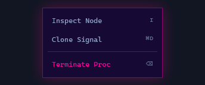</a> <b>Floating Context Menu</b> <code>spectrums-floating-context-menu</code></td></tr>
<tr><td align="center" valign="top" width="33%"><a href="../html/spectrums-cmd-palette.html">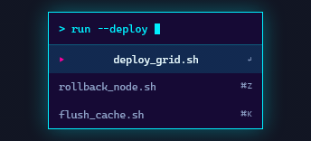</a> <b>Cmd:// Palette</b> <code>spectrums-cmd-palette</code></td><td align="center" valign="top" width="33%"> <b>Primary Neon Button</b> <code>spectrums-primary-neon-button</code></td><td align="center" valign="top" width="33%"> <b>Angular Icon Button</b> <code>spectrums-angular-icon-button</code></td></tr>
<tr><td align="center" valign="top" width="33%"> <b>Danger Button</b> <code>spectrums-danger-button</code></td><td align="center" valign="top" width="33%"> <b>Notched Toggle Switch</b> <code>spectrums-notched-toggle-switch</code></td><td align="center" valign="top" width="33%"><a href="../html/spectrums-cyan-success-toast.html">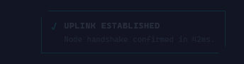</a> <b>Cyan Success Toast</b> <code>spectrums-cyan-success-toast</code></td></tr>
<tr><td align="center" valign="top" width="33%"> <b>Magenta Error Toast</b> <code>spectrums-magenta-error-toast</code></td><td align="center" valign="top" width="33%"><a href="../html/spectrums-alert-banner-strip.html">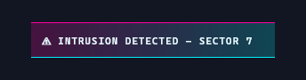</a> <b>Alert Banner Strip</b> <code>spectrums-alert-banner-strip</code></td><td align="center" valign="top" width="33%"> <b>Countdown-drain Toast</b> <code>spectrums-countdown-drain-toast</code></td></tr>
<tr><td align="center" valign="top" width="33%"><a href="../html/spectrums-info-callout.html">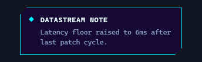</a> <b>Info Callout</b> <code>spectrums-info-callout</code></td><td align="center" valign="top" width="33%"><a href="../html/spectrums-warning-callout.html">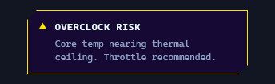</a> <b>Warning Callout</b> <code>spectrums-warning-callout</code></td><td align="center" valign="top" width="33%"><a href="../html/spectrums-breach-callout.html">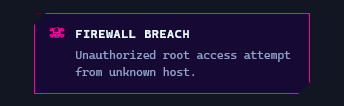</a> <b>Breach Callout</b> <code>spectrums-breach-callout</code></td></tr>
<tr><td align="center" valign="top" width="33%"><a href="../html/spectrums-terminal-log-callout.html">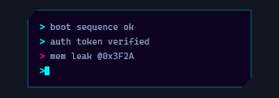</a> <b>Terminal-log Callout</b> <code>spectrums-terminal-log-callout</code></td><td align="center" valign="top" width="33%"> <b>Neon Bar Chart</b> <code>spectrums-neon-bar-chart</code></td><td align="center" valign="top" width="33%"><a href="../html/spectrums-grid-trace-line-chart.html">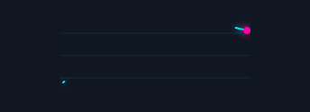</a> <b>Grid Trace Line Chart</b> <code>spectrums-grid-trace-line-chart</code></td></tr>
<tr><td align="center" valign="top" width="33%"> <b>Reactor Gauge</b> <code>spectrums-reactor-gauge</code> · static</td><td align="center" valign="top" width="33%"> <b>Flicker KPI Readout</b> <code>spectrums-flicker-kpi-readout</code></td><td align="center" valign="top" width="33%"> <b>Notched Text Input</b> <code>spectrums-notched-text-input</code></td></tr>
<tr><td align="center" valign="top" width="33%"><a href="../html/spectrums-search-field.html">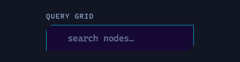</a> <b>Search Field</b> <code>spectrums-search-field</code></td><td align="center" valign="top" width="33%"><a href="../html/spectrums-magenta-select.html">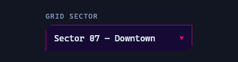</a> <b>Magenta Select</b> <code>spectrums-magenta-select</code></td><td align="center" valign="top" width="33%"> <b>Access-code OTP Cells</b> <code>spectrums-access-code-otp-cells</code></td></tr>
<tr><td align="center" valign="top" width="33%"> <b>Slice-glitch Headline</b> <code>spectrums-slice-glitch-headline</code></td><td align="center" valign="top" width="33%"> <b>Failing Neon Flicker</b> <code>spectrums-failing-neon-flicker</code></td><td align="center" valign="top" width="33%"> <b>Scanline Sweep Text</b> <code>spectrums-scanline-sweep-text</code></td></tr>
<tr><td align="center" valign="top" width="33%"><a href="../html/spectrums-terminal-type-prompt.html">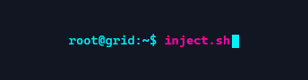</a> <b>Terminal Type Prompt</b> <code>spectrums-terminal-type-prompt</code></td><td align="center" valign="top" width="33%"> <b>Hex Node Icon</b> <code>spectrums-hex-node-icon</code></td><td align="center" valign="top" width="33%"> <b>Radar Sweep Object</b> <code>spectrums-radar-sweep-object</code></td></tr>
<tr><td align="center" valign="top" width="33%"> <b>Status Chip</b> <code>spectrums-status-chip</code></td><td align="center" valign="top" width="33%"> <b>Angular Loader</b> <code>spectrums-angular-loader</code></td></tr>
</table>
