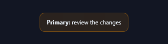
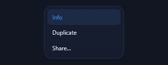
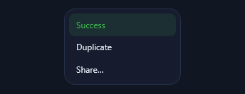
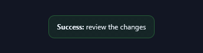
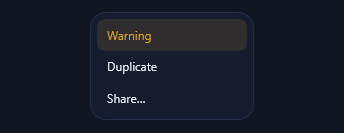
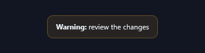
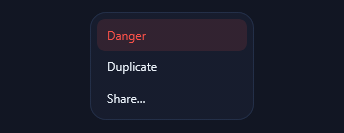
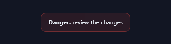
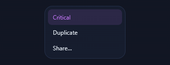

# Duolingo · Spectrums

Every Prism facet authored in the **Duolingo** visual language, recorded as a looping GIF.

**100 effects** · 100 animated · 1.3 MB of GIF · click any GIF to open its standalone HTML sample (raw file; open it locally, GitHub shows source).

[← Showcase index](../README.md)

<table>
<tr><td align="center" valign="top" width="33%"> <b>Pill Button · Primary</b> <code>duolingo-button-accent</code></td><td align="center" valign="top" width="33%"> <b>Switch Toggle · Primary</b> <code>duolingo-toggle-accent</code></td><td align="center" valign="top" width="33%"> <b>Status Chip · Primary</b> <code>duolingo-chip-accent</code></td></tr>
<tr><td align="center" valign="top" width="33%"> <b>Dropdown Menu · Primary</b> <code>duolingo-menu-accent</code></td><td align="center" valign="top" width="33%"> <b>Toast Notification · Primary</b> <code>duolingo-notification-accent</code></td><td align="center" valign="top" width="33%"> <b>Callout Banner · Primary</b> <code>duolingo-callout-accent</code></td></tr>
<tr><td align="center" valign="top" width="33%"> <b>Mini Bar Chart · Primary</b> <code>duolingo-chart-accent</code></td><td align="center" valign="top" width="33%"> <b>Text Field · Primary</b> <code>duolingo-input-accent</code></td><td align="center" valign="top" width="33%"> <b>Progress Bar · Primary</b> <code>duolingo-progress-accent</code></td></tr>
<tr><td align="center" valign="top" width="33%"> <b>Avatar Ring · Primary</b> <code>duolingo-avatar-accent</code></td><td align="center" valign="top" width="33%"> <b>Count Badge · Primary</b> <code>duolingo-badge-accent</code></td><td align="center" valign="top" width="33%"> <b>Segmented Tabs · Primary</b> <code>duolingo-tab-accent</code></td></tr>
<tr><td align="center" valign="top" width="33%"> <b>Tooltip · Primary</b> <code>duolingo-tooltip-accent</code></td><td align="center" valign="top" width="33%"> <b>Loading Spinner · Primary</b> <code>duolingo-spinner-accent</code></td><td align="center" valign="top" width="33%"> <b>Feature Card · Primary</b> <code>duolingo-card-accent</code></td></tr>
<tr><td align="center" valign="top" width="33%"> <b>Checkbox · Primary</b> <code>duolingo-checkbox-accent</code></td><td align="center" valign="top" width="33%"> <b>Range Slider · Primary</b> <code>duolingo-slider-accent</code></td><td align="center" valign="top" width="33%"> <b>Pill Button · Info</b> <code>duolingo-button-info</code></td></tr>
<tr><td align="center" valign="top" width="33%"> <b>Switch Toggle · Info</b> <code>duolingo-toggle-info</code></td><td align="center" valign="top" width="33%"> <b>Status Chip · Info</b> <code>duolingo-chip-info</code></td><td align="center" valign="top" width="33%"> <b>Dropdown Menu · Info</b> <code>duolingo-menu-info</code></td></tr>
<tr><td align="center" valign="top" width="33%"> <b>Toast Notification · Info</b> <code>duolingo-notification-info</code></td><td align="center" valign="top" width="33%"> <b>Callout Banner · Info</b> <code>duolingo-callout-info</code></td><td align="center" valign="top" width="33%"> <b>Mini Bar Chart · Info</b> <code>duolingo-chart-info</code></td></tr>
<tr><td align="center" valign="top" width="33%"> <b>Text Field · Info</b> <code>duolingo-input-info</code></td><td align="center" valign="top" width="33%"> <b>Progress Bar · Info</b> <code>duolingo-progress-info</code></td><td align="center" valign="top" width="33%"> <b>Avatar Ring · Info</b> <code>duolingo-avatar-info</code></td></tr>
<tr><td align="center" valign="top" width="33%"> <b>Count Badge · Info</b> <code>duolingo-badge-info</code></td><td align="center" valign="top" width="33%"> <b>Segmented Tabs · Info</b> <code>duolingo-tab-info</code></td><td align="center" valign="top" width="33%"> <b>Tooltip · Info</b> <code>duolingo-tooltip-info</code></td></tr>
<tr><td align="center" valign="top" width="33%"> <b>Loading Spinner · Info</b> <code>duolingo-spinner-info</code></td><td align="center" valign="top" width="33%"> <b>Feature Card · Info</b> <code>duolingo-card-info</code></td><td align="center" valign="top" width="33%"> <b>Checkbox · Info</b> <code>duolingo-checkbox-info</code></td></tr>
<tr><td align="center" valign="top" width="33%"> <b>Range Slider · Info</b> <code>duolingo-slider-info</code></td><td align="center" valign="top" width="33%"> <b>Pill Button · Success</b> <code>duolingo-button-pos</code></td><td align="center" valign="top" width="33%"> <b>Switch Toggle · Success</b> <code>duolingo-toggle-pos</code></td></tr>
<tr><td align="center" valign="top" width="33%"> <b>Status Chip · Success</b> <code>duolingo-chip-pos</code></td><td align="center" valign="top" width="33%"> <b>Dropdown Menu · Success</b> <code>duolingo-menu-pos</code></td><td align="center" valign="top" width="33%"> <b>Toast Notification · Success</b> <code>duolingo-notification-pos</code></td></tr>
<tr><td align="center" valign="top" width="33%"> <b>Callout Banner · Success</b> <code>duolingo-callout-pos</code></td><td align="center" valign="top" width="33%"> <b>Mini Bar Chart · Success</b> <code>duolingo-chart-pos</code></td><td align="center" valign="top" width="33%"> <b>Text Field · Success</b> <code>duolingo-input-pos</code></td></tr>
<tr><td align="center" valign="top" width="33%"> <b>Progress Bar · Success</b> <code>duolingo-progress-pos</code></td><td align="center" valign="top" width="33%"> <b>Avatar Ring · Success</b> <code>duolingo-avatar-pos</code></td><td align="center" valign="top" width="33%"> <b>Count Badge · Success</b> <code>duolingo-badge-pos</code></td></tr>
<tr><td align="center" valign="top" width="33%"> <b>Segmented Tabs · Success</b> <code>duolingo-tab-pos</code></td><td align="center" valign="top" width="33%"> <b>Tooltip · Success</b> <code>duolingo-tooltip-pos</code></td><td align="center" valign="top" width="33%"> <b>Loading Spinner · Success</b> <code>duolingo-spinner-pos</code></td></tr>
<tr><td align="center" valign="top" width="33%"> <b>Feature Card · Success</b> <code>duolingo-card-pos</code></td><td align="center" valign="top" width="33%"> <b>Checkbox · Success</b> <code>duolingo-checkbox-pos</code></td><td align="center" valign="top" width="33%"> <b>Range Slider · Success</b> <code>duolingo-slider-pos</code></td></tr>
<tr><td align="center" valign="top" width="33%"> <b>Pill Button · Warning</b> <code>duolingo-button-warn</code></td><td align="center" valign="top" width="33%"> <b>Switch Toggle · Warning</b> <code>duolingo-toggle-warn</code></td><td align="center" valign="top" width="33%"> <b>Status Chip · Warning</b> <code>duolingo-chip-warn</code></td></tr>
<tr><td align="center" valign="top" width="33%"> <b>Dropdown Menu · Warning</b> <code>duolingo-menu-warn</code></td><td align="center" valign="top" width="33%"> <b>Toast Notification · Warning</b> <code>duolingo-notification-warn</code></td><td align="center" valign="top" width="33%"> <b>Callout Banner · Warning</b> <code>duolingo-callout-warn</code></td></tr>
<tr><td align="center" valign="top" width="33%"> <b>Mini Bar Chart · Warning</b> <code>duolingo-chart-warn</code></td><td align="center" valign="top" width="33%"> <b>Text Field · Warning</b> <code>duolingo-input-warn</code></td><td align="center" valign="top" width="33%"> <b>Progress Bar · Warning</b> <code>duolingo-progress-warn</code></td></tr>
<tr><td align="center" valign="top" width="33%"> <b>Avatar Ring · Warning</b> <code>duolingo-avatar-warn</code></td><td align="center" valign="top" width="33%"> <b>Count Badge · Warning</b> <code>duolingo-badge-warn</code></td><td align="center" valign="top" width="33%"> <b>Segmented Tabs · Warning</b> <code>duolingo-tab-warn</code></td></tr>
<tr><td align="center" valign="top" width="33%"> <b>Tooltip · Warning</b> <code>duolingo-tooltip-warn</code></td><td align="center" valign="top" width="33%"> <b>Loading Spinner · Warning</b> <code>duolingo-spinner-warn</code></td><td align="center" valign="top" width="33%"> <b>Feature Card · Warning</b> <code>duolingo-card-warn</code></td></tr>
<tr><td align="center" valign="top" width="33%"> <b>Checkbox · Warning</b> <code>duolingo-checkbox-warn</code></td><td align="center" valign="top" width="33%"> <b>Range Slider · Warning</b> <code>duolingo-slider-warn</code></td><td align="center" valign="top" width="33%"> <b>Pill Button · Danger</b> <code>duolingo-button-neg</code></td></tr>
<tr><td align="center" valign="top" width="33%"> <b>Switch Toggle · Danger</b> <code>duolingo-toggle-neg</code></td><td align="center" valign="top" width="33%"> <b>Status Chip · Danger</b> <code>duolingo-chip-neg</code></td><td align="center" valign="top" width="33%"> <b>Dropdown Menu · Danger</b> <code>duolingo-menu-neg</code></td></tr>
<tr><td align="center" valign="top" width="33%"> <b>Toast Notification · Danger</b> <code>duolingo-notification-neg</code></td><td align="center" valign="top" width="33%"> <b>Callout Banner · Danger</b> <code>duolingo-callout-neg</code></td><td align="center" valign="top" width="33%"> <b>Mini Bar Chart · Danger</b> <code>duolingo-chart-neg</code></td></tr>
<tr><td align="center" valign="top" width="33%"> <b>Text Field · Danger</b> <code>duolingo-input-neg</code></td><td align="center" valign="top" width="33%"> <b>Progress Bar · Danger</b> <code>duolingo-progress-neg</code></td><td align="center" valign="top" width="33%"> <b>Avatar Ring · Danger</b> <code>duolingo-avatar-neg</code></td></tr>
<tr><td align="center" valign="top" width="33%"> <b>Count Badge · Danger</b> <code>duolingo-badge-neg</code></td><td align="center" valign="top" width="33%"> <b>Segmented Tabs · Danger</b> <code>duolingo-tab-neg</code></td><td align="center" valign="top" width="33%"> <b>Tooltip · Danger</b> <code>duolingo-tooltip-neg</code></td></tr>
<tr><td align="center" valign="top" width="33%"> <b>Loading Spinner · Danger</b> <code>duolingo-spinner-neg</code></td><td align="center" valign="top" width="33%"> <b>Feature Card · Danger</b> <code>duolingo-card-neg</code></td><td align="center" valign="top" width="33%"> <b>Checkbox · Danger</b> <code>duolingo-checkbox-neg</code></td></tr>
<tr><td align="center" valign="top" width="33%"> <b>Range Slider · Danger</b> <code>duolingo-slider-neg</code></td><td align="center" valign="top" width="33%"> <b>Pill Button · Critical</b> <code>duolingo-button-crit</code></td><td align="center" valign="top" width="33%"> <b>Switch Toggle · Critical</b> <code>duolingo-toggle-crit</code></td></tr>
<tr><td align="center" valign="top" width="33%"> <b>Status Chip · Critical</b> <code>duolingo-chip-crit</code></td><td align="center" valign="top" width="33%"> <b>Dropdown Menu · Critical</b> <code>duolingo-menu-crit</code></td><td align="center" valign="top" width="33%"> <b>Toast Notification · Critical</b> <code>duolingo-notification-crit</code></td></tr>
<tr><td align="center" valign="top" width="33%"> <b>Callout Banner · Critical</b> <code>duolingo-callout-crit</code></td><td align="center" valign="top" width="33%"> <b>Mini Bar Chart · Critical</b> <code>duolingo-chart-crit</code></td><td align="center" valign="top" width="33%"> <b>Text Field · Critical</b> <code>duolingo-input-crit</code></td></tr>
<tr><td align="center" valign="top" width="33%"> <b>Progress Bar · Critical</b> <code>duolingo-progress-crit</code></td><td align="center" valign="top" width="33%"> <b>Avatar Ring · Critical</b> <code>duolingo-avatar-crit</code></td><td align="center" valign="top" width="33%"> <b>Count Badge · Critical</b> <code>duolingo-badge-crit</code></td></tr>
<tr><td align="center" valign="top" width="33%"> <b>Segmented Tabs · Critical</b> <code>duolingo-tab-crit</code></td><td align="center" valign="top" width="33%"> <b>Tooltip · Critical</b> <code>duolingo-tooltip-crit</code></td><td align="center" valign="top" width="33%"> <b>Loading Spinner · Critical</b> <code>duolingo-spinner-crit</code></td></tr>
<tr><td align="center" valign="top" width="33%"> <b>Feature Card · Critical</b> <code>duolingo-card-crit</code></td></tr>
</table>
