# Glassmorphism · Spectrums

Every Prism facet authored in the **Glassmorphism** visual language, recorded as a looping GIF.

**30 effects** · 20 animated · 530 KB of GIF · click any GIF to open its standalone HTML sample (raw file; open it locally, GitHub shows source).

[← Showcase index](../README.md)

<table>
<tr><td align="center" valign="top" width="33%"><a href="../html/spectrums-frosted-dropdown-menu.html">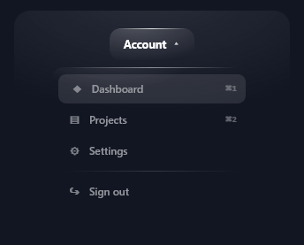</a> <b>Frosted Dropdown Menu</b> <code>spectrums-frosted-dropdown-menu</code></td><td align="center" valign="top" width="33%"><a href="../html/spectrums-frosted-pill-navbar.html">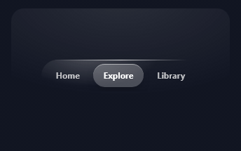</a> <b>Frosted Pill Navbar</b> <code>spectrums-frosted-pill-navbar</code></td><td align="center" valign="top" width="33%"><a href="../html/spectrums-glass-context-menu.html">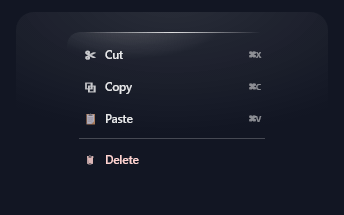</a> <b>Glass Context Menu</b> <code>spectrums-glass-context-menu</code></td></tr>
<tr><td align="center" valign="top" width="33%"><a href="../html/spectrums-frosted-segmented-control.html">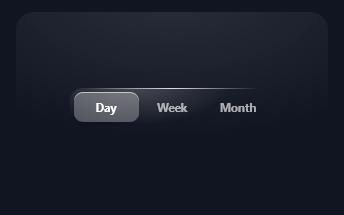</a> <b>Frosted Segmented Control</b> <code>spectrums-frosted-segmented-control</code></td><td align="center" valign="top" width="33%"><a href="../html/spectrums-frosted-primary-button.html">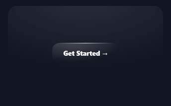</a> <b>Frosted Primary Button</b> <code>spectrums-frosted-primary-button</code></td><td align="center" valign="top" width="33%"><a href="../html/spectrums-glass-icon-button.html">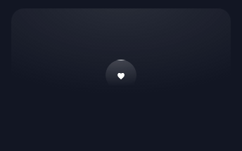</a> <b>Glass Icon Button</b> <code>spectrums-glass-icon-button</code></td></tr>
<tr><td align="center" valign="top" width="33%"><a href="../html/spectrums-frosted-toggle-switch.html">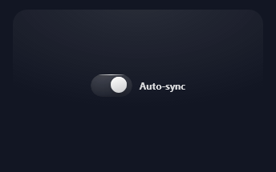</a> <b>Frosted Toggle Switch</b> <code>spectrums-frosted-toggle-switch</code></td><td align="center" valign="top" width="33%"><a href="../html/spectrums-glass-ghost-button.html">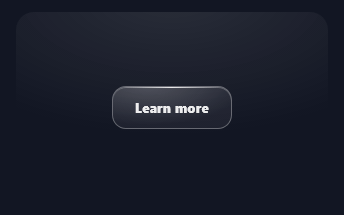</a> <b>Glass Ghost Button</b> <code>spectrums-glass-ghost-button</code></td><td align="center" valign="top" width="33%"> <b>Frosted Glass Toast</b> <code>spectrums-frosted-glass-toast</code></td></tr>
<tr><td align="center" valign="top" width="33%"><a href="../html/spectrums-glass-status-banner.html">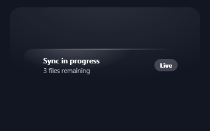</a> <b>Glass Status Banner</b> <code>spectrums-glass-status-banner</code></td><td align="center" valign="top" width="33%"><a href="../html/spectrums-stacking-glass-toast-queue.html">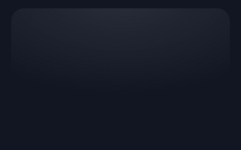</a> <b>Stacking Glass Toast Queue</b> <code>spectrums-stacking-glass-toast-queue</code></td><td align="center" valign="top" width="33%"><a href="../html/spectrums-glass-confirm-alert.html">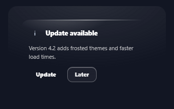</a> <b>Glass Confirm Alert</b> <code>spectrums-glass-confirm-alert</code></td></tr>
<tr><td align="center" valign="top" width="33%"><a href="../html/spectrums-frosted-warning-callout.html">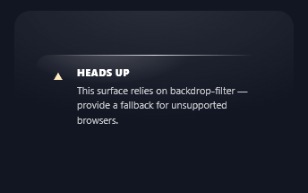</a> <b>Frosted Warning Callout</b> <code>spectrums-frosted-warning-callout</code> · static</td><td align="center" valign="top" width="33%"><a href="../html/spectrums-frosted-info-callout.html">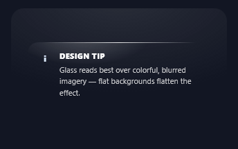</a> <b>Frosted Info Callout</b> <code>spectrums-frosted-info-callout</code> · static</td><td align="center" valign="top" width="33%"><a href="../html/spectrums-glass-pull-quote.html">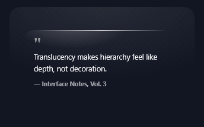</a> <b>Glass Pull-Quote</b> <code>spectrums-glass-pull-quote</code> · static</td></tr>
<tr><td align="center" valign="top" width="33%"><a href="../html/spectrums-frosted-kpi-card.html">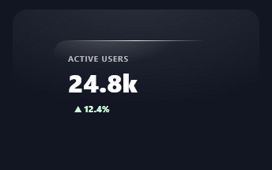</a> <b>Frosted KPI Card</b> <code>spectrums-frosted-kpi-card</code> · static</td><td align="center" valign="top" width="33%"><a href="../html/spectrums-glass-bar-chart.html">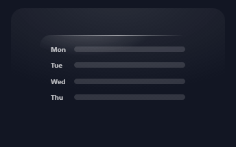</a> <b>Glass Bar Chart</b> <code>spectrums-glass-bar-chart</code></td><td align="center" valign="top" width="33%"><a href="../html/spectrums-glass-sparkline.html">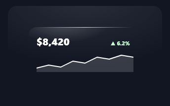</a> <b>Glass Sparkline</b> <code>spectrums-glass-sparkline</code> · static</td></tr>
<tr><td align="center" valign="top" width="33%"><a href="../html/spectrums-frosted-gauge-ring.html">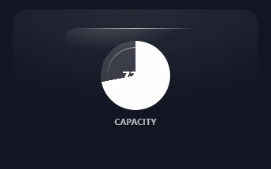</a> <b>Frosted Gauge Ring</b> <code>spectrums-frosted-gauge-ring</code> · static</td><td align="center" valign="top" width="33%"><a href="../html/spectrums-frosted-text-field.html">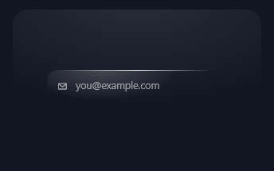</a> <b>Frosted Text Field</b> <code>spectrums-frosted-text-field</code></td><td align="center" valign="top" width="33%"><a href="../html/spectrums-glass-search-bar.html">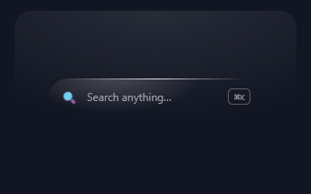</a> <b>Glass Search Bar</b> <code>spectrums-glass-search-bar</code> · static</td></tr>
<tr><td align="center" valign="top" width="33%"><a href="../html/spectrums-frosted-range-slider.html">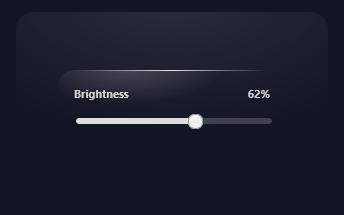</a> <b>Frosted Range Slider</b> <code>spectrums-frosted-range-slider</code> · static</td><td align="center" valign="top" width="33%"><a href="../html/spectrums-glass-star-rating.html">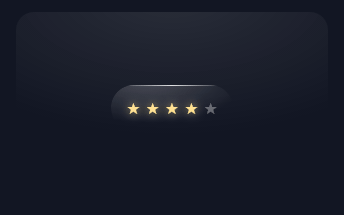</a> <b>Glass Star Rating</b> <code>spectrums-glass-star-rating</code></td><td align="center" valign="top" width="33%"><a href="../html/spectrums-frosted-headline-card.html">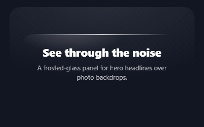</a> <b>Frosted Headline Card</b> <code>spectrums-frosted-headline-card</code> · static</td></tr>
<tr><td align="center" valign="top" width="33%"><a href="../html/spectrums-glass-label-pill.html">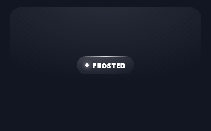</a> <b>Glass Label Pill</b> <code>spectrums-glass-label-pill</code> · static</td><td align="center" valign="top" width="33%"><a href="../html/spectrums-light-sweep-glass-title.html">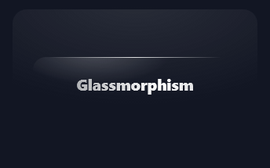</a> <b>Light-Sweep Glass Title</b> <code>spectrums-light-sweep-glass-title</code></td><td align="center" valign="top" width="33%"><a href="../html/spectrums-floating-glass-orb.html">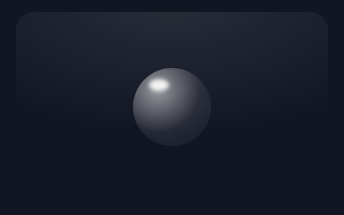</a> <b>Floating Glass Orb</b> <code>spectrums-floating-glass-orb</code></td></tr>
<tr><td align="center" valign="top" width="33%"><a href="../html/spectrums-frosted-app-icon.html">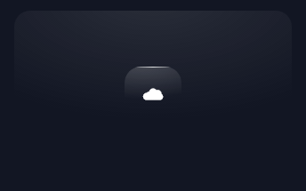</a> <b>Frosted App Icon</b> <code>spectrums-frosted-app-icon</code></td><td align="center" valign="top" width="33%"><a href="../html/spectrums-floating-glass-card-stack.html">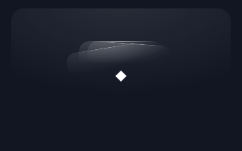</a> <b>Floating Glass Card Stack</b> <code>spectrums-floating-glass-card-stack</code></td><td align="center" valign="top" width="33%"><a href="../html/spectrums-glass-weather-widget.html">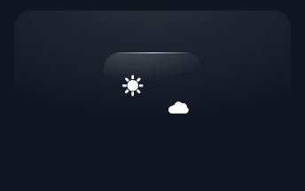</a> <b>Glass Weather Widget</b> <code>spectrums-glass-weather-widget</code></td></tr>
</table>
