# Material UI · Spectrums

Every Prism facet authored in the **Material UI** visual language, recorded as a looping GIF.

**28 effects** · 15 animated · 164 KB of GIF · click any GIF to open its standalone HTML sample (raw file; open it locally, GitHub shows source).

[← Showcase index](../README.md)

<table>
<tr><td align="center" valign="top" width="33%"><a href="../html/spectrums-tonal-dropdown-menu.html">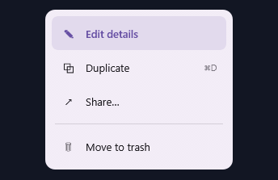</a> <b>Tonal Dropdown Menu</b> <code>spectrums-tonal-dropdown-menu</code></td><td align="center" valign="top" width="33%"><a href="../html/spectrums-fab-speed-dial-menu.html">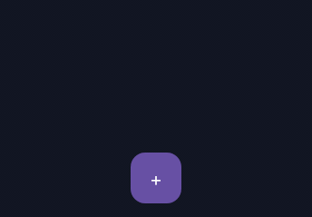</a> <b>FAB Speed-Dial Menu</b> <code>spectrums-fab-speed-dial-menu</code></td><td align="center" valign="top" width="33%"><a href="../html/spectrums-navigation-segmented-tabs.html">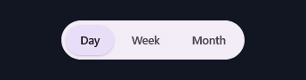</a> <b>Navigation Segmented Tabs</b> <code>spectrums-navigation-segmented-tabs</code></td></tr>
<tr><td align="center" valign="top" width="33%"><a href="../html/spectrums-context-checklist-menu.html">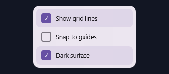</a> <b>Context Checklist Menu</b> <code>spectrums-context-checklist-menu</code> · static</td><td align="center" valign="top" width="33%"> <b>Filled Ripple Button</b> <code>spectrums-filled-ripple-button</code></td><td align="center" valign="top" width="33%"> <b>Elevated FAB</b> <code>spectrums-elevated-fab</code></td></tr>
<tr><td align="center" valign="top" width="33%"> <b>Outlined Button</b> <code>spectrums-outlined-button</code></td><td align="center" valign="top" width="33%"> <b>Icon Button State Layer</b> <code>spectrums-icon-button-state-layer</code></td><td align="center" valign="top" width="33%"> <b>Material Snackbar</b> <code>spectrums-material-snackbar</code></td></tr>
<tr><td align="center" valign="top" width="33%"> <b>Elevated Toast Card</b> <code>spectrums-elevated-toast-card</code></td><td align="center" valign="top" width="33%"><a href="../html/spectrums-tertiary-tonal-banner.html">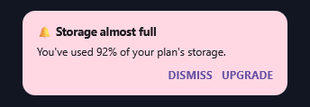</a> <b>Tertiary Tonal Banner</b> <code>spectrums-tertiary-tonal-banner</code> · static</td><td align="center" valign="top" width="33%"><a href="../html/spectrums-filled-tonal-callout.html">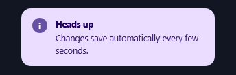</a> <b>Filled Tonal Callout</b> <code>spectrums-filled-tonal-callout</code> · static</td></tr>
<tr><td align="center" valign="top" width="33%"><a href="../html/spectrums-outlined-error-callout.html">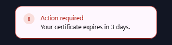</a> <b>Outlined Error Callout</b> <code>spectrums-outlined-error-callout</code> · static</td><td align="center" valign="top" width="33%"><a href="../html/spectrums-elevated-card-callout.html">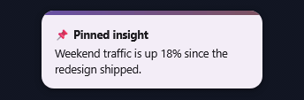</a> <b>Elevated Card Callout</b> <code>spectrums-elevated-card-callout</code> · static</td><td align="center" valign="top" width="33%"><a href="../html/spectrums-tonal-bar-chart.html">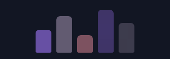</a> <b>Tonal Bar Chart</b> <code>spectrums-tonal-bar-chart</code></td></tr>
<tr><td align="center" valign="top" width="33%"><a href="../html/spectrums-elevated-kpi-card.html">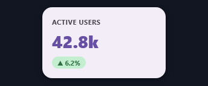</a> <b>Elevated KPI Card</b> <code>spectrums-elevated-kpi-card</code> · static</td><td align="center" valign="top" width="33%"> <b>Determinate Progress Ring</b> <code>spectrums-determinate-progress-ring</code></td><td align="center" valign="top" width="33%"> <b>Chip Sparkline</b> <code>spectrums-chip-sparkline</code> · static</td></tr>
<tr><td align="center" valign="top" width="33%"><a href="../html/spectrums-filled-text-field.html">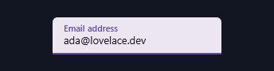</a> <b>Filled Text Field</b> <code>spectrums-filled-text-field</code> · static</td><td align="center" valign="top" width="33%"><a href="../html/spectrums-outlined-text-field.html">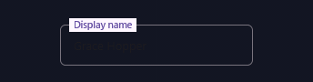</a> <b>Outlined Text Field</b> <code>spectrums-outlined-text-field</code> · static</td><td align="center" valign="top" width="33%"> <b>M3 Sliding Switch</b> <code>spectrums-m3-sliding-switch</code></td></tr>
<tr><td align="center" valign="top" width="33%"> <b>Filter Chip Row</b> <code>spectrums-filter-chip-row</code> · static</td><td align="center" valign="top" width="33%"><a href="../html/spectrums-bold-display-headline.html">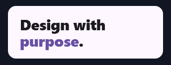</a> <b>Bold Display Headline</b> <code>spectrums-bold-display-headline</code> · static</td><td align="center" valign="top" width="33%"><a href="../html/spectrums-overline-title-scale.html">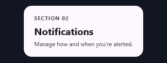</a> <b>Overline + Title Scale</b> <code>spectrums-overline-title-scale</code> · static</td></tr>
<tr><td align="center" valign="top" width="33%"> <b>Gradient Underline Sweep</b> <code>spectrums-gradient-underline-sweep</code></td><td align="center" valign="top" width="33%"> <b>Tonal Notification Badge</b> <code>spectrums-tonal-notification-badge</code></td><td align="center" valign="top" width="33%"> <b>Ringed Avatar</b> <code>spectrums-ringed-avatar</code> · static</td></tr>
<tr><td align="center" valign="top" width="33%"> <b>Tonal Icon Tile Grid</b> <code>spectrums-tonal-icon-tile-grid</code></td></tr>
</table>
