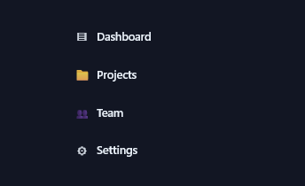
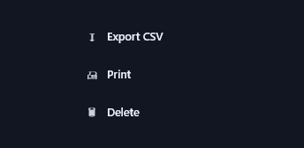
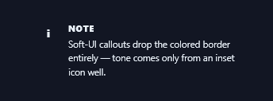
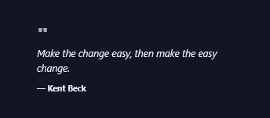
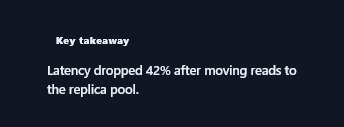
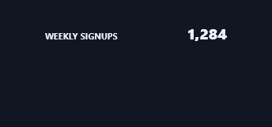

# Neumorphism · Spectrums

Every Prism facet authored in the **Neumorphism** visual language, recorded as a looping GIF.

**29 effects** · 16 animated · 62 KB of GIF · click any GIF to open its standalone HTML sample (raw file; open it locally, GitHub shows source).

[← Showcase index](../README.md)

<table>
<tr><td align="center" valign="top" width="33%"> <b>Soft Nav Menu</b> <code>spectrums-soft-nav-menu</code></td><td align="center" valign="top" width="33%"> <b>Sliding Thumb Segmented Control</b> <code>spectrums-sliding-thumb-segmented-control</code></td><td align="center" valign="top" width="33%"> <b>Icon Dock</b> <code>spectrums-icon-dock</code></td></tr>
<tr><td align="center" valign="top" width="33%"> <b>Static Dropdown Reference</b> <code>spectrums-static-dropdown-reference</code></td><td align="center" valign="top" width="33%"> <b>Extruded Primary Button</b> <code>spectrums-extruded-primary-button</code></td><td align="center" valign="top" width="33%"> <b>Circular Icon Buttons</b> <code>spectrums-circular-icon-buttons</code></td></tr>
<tr><td align="center" valign="top" width="33%"> <b>Pressable Toggle Switch</b> <code>spectrums-pressable-toggle-switch</code></td><td align="center" valign="top" width="33%"> <b>Toggleable Filter Pills</b> <code>spectrums-toggleable-filter-pills</code></td><td align="center" valign="top" width="33%"> <b>Floating Soft Toast</b> <code>spectrums-floating-soft-toast</code></td></tr>
<tr><td align="center" valign="top" width="33%"> <b>Status Banner</b> <code>spectrums-status-banner</code></td><td align="center" valign="top" width="33%"> <b>Progress Notification Card</b> <code>spectrums-progress-notification-card</code></td><td align="center" valign="top" width="33%"> <b>Soft Note Callout</b> <code>spectrums-soft-note-callout</code> · static</td></tr>
<tr><td align="center" valign="top" width="33%"> <b>Pressed Pull-Quote</b> <code>spectrums-pressed-pull-quote</code> · static</td><td align="center" valign="top" width="33%"> <b>Key Takeaway Plate</b> <code>spectrums-key-takeaway-plate</code> · static</td><td align="center" valign="top" width="33%"> <b>Inset-Track Bar Chart</b> <code>spectrums-inset-track-bar-chart</code></td></tr>
<tr><td align="center" valign="top" width="33%"> <b>Soft Ring Gauge</b> <code>spectrums-soft-ring-gauge</code></td><td align="center" valign="top" width="33%"> <b>KPI Tile Pair</b> <code>spectrums-kpi-tile-pair</code> · static</td><td align="center" valign="top" width="33%"> <b>Recessed Usage Bar</b> <code>spectrums-recessed-usage-bar</code> · static</td></tr>
<tr><td align="center" valign="top" width="33%"> <b>Inset Text Field</b> <code>spectrums-inset-text-field</code></td><td align="center" valign="top" width="33%"> <b>Recessed Search Bar</b> <code>spectrums-recessed-search-bar</code> · static</td><td align="center" valign="top" width="33%"> <b>Extruded Slider Thumb</b> <code>spectrums-extruded-slider-thumb</code> · static</td></tr>
<tr><td align="center" valign="top" width="33%"> <b>Seated Checkbox</b> <code>spectrums-seated-checkbox</code></td><td align="center" valign="top" width="33%"> <b>Embossed Headline</b> <code>spectrums-embossed-headline</code> · static</td><td align="center" valign="top" width="33%"> <b>Debossed Label Chip</b> <code>spectrums-debossed-label-chip</code> · static</td></tr>
<tr><td align="center" valign="top" width="33%"> <b>Extruded Title Plate</b> <code>spectrums-extruded-title-plate</code> · static</td><td align="center" valign="top" width="33%"> <b>Floating Soft Orb</b> <code>spectrums-floating-soft-orb</code></td><td align="center" valign="top" width="33%"> <b>Rounded Icon Tile</b> <code>spectrums-rounded-icon-tile</code> · static</td></tr>
<tr><td align="center" valign="top" width="33%"> <b>Concentric Ring Object</b> <code>spectrums-concentric-ring-object</code> · static</td><td align="center" valign="top" width="33%"> <b>App-Icon Glyph Well</b> <code>spectrums-app-icon-glyph-well</code> · static</td></tr>
</table>
