# Retro Terminal · Spectrums

Every Prism facet authored in the **Retro Terminal** visual language, recorded as a looping GIF.

**30 effects** · 30 animated · 1.0 MB of GIF · click any GIF to open its standalone HTML sample (raw file; open it locally, GitHub shows source).

[← Showcase index](../README.md)

<table>
<tr><td align="center" valign="top" width="33%"> <b>Phosphor Dropdown Menu</b> <code>spectrums-phosphor-dropdown-menu</code></td><td align="center" valign="top" width="33%"><a href="../html/spectrums-right-click-context-menu.html">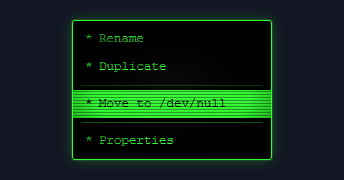</a> <b>Right-click Context Menu</b> <code>spectrums-right-click-context-menu</code></td><td align="center" valign="top" width="33%"><a href="../html/spectrums-scanline-boot-menu.html">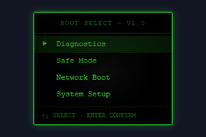</a> <b>Scanline Boot Menu</b> <code>spectrums-scanline-boot-menu</code></td></tr>
<tr><td align="center" valign="top" width="33%"><a href="../html/spectrums-command-palette.html">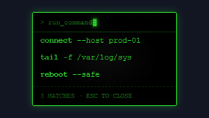</a> <b>Command Palette</b> <code>spectrums-command-palette</code></td><td align="center" valign="top" width="33%"> <b>Bracketed Phosphor Button</b> <code>spectrums-bracketed-phosphor-button</code></td><td align="center" valign="top" width="33%"><a href="../html/spectrums-amber-ghost-icon-buttons.html">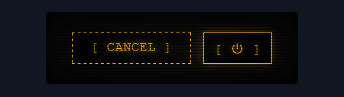</a> <b>Amber Ghost &amp; Icon Buttons</b> <code>spectrums-amber-ghost-icon-buttons</code></td></tr>
<tr><td align="center" valign="top" width="33%"><a href="../html/spectrums-terminal-toggle-switch.html">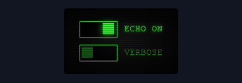</a> <b>Terminal Toggle Switch</b> <code>spectrums-terminal-toggle-switch</code></td><td align="center" valign="top" width="33%"><a href="../html/spectrums-system-toast.html">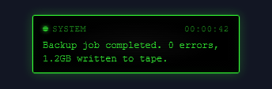</a> <b>System Toast</b> <code>spectrums-system-toast</code></td><td align="center" valign="top" width="33%"><a href="../html/spectrums-amber-warning-banner.html">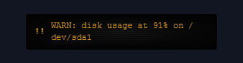</a> <b>Amber Warning Banner</b> <code>spectrums-amber-warning-banner</code></td></tr>
<tr><td align="center" valign="top" width="33%"><a href="../html/spectrums-scrolling-status-ticker.html">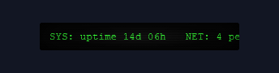</a> <b>Scrolling Status Ticker</b> <code>spectrums-scrolling-status-ticker</code></td><td align="center" valign="top" width="33%"><a href="../html/spectrums-function-key-status-bar.html">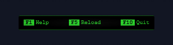</a> <b>Function-key Status Bar</b> <code>spectrums-function-key-status-bar</code></td><td align="center" valign="top" width="33%"><a href="../html/spectrums-box-drawn-note-callout.html">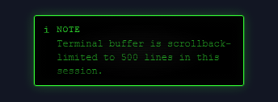</a> <b>Box-drawn Note Callout</b> <code>spectrums-box-drawn-note-callout</code></td></tr>
<tr><td align="center" valign="top" width="33%"><a href="../html/spectrums-flickering-danger-callout.html">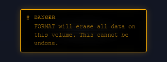</a> <b>Flickering Danger Callout</b> <code>spectrums-flickering-danger-callout</code></td><td align="center" valign="top" width="33%"><a href="../html/spectrums-fortune-file-quote-block.html">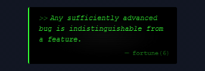</a> <b>Fortune-file Quote Block</b> <code>spectrums-fortune-file-quote-block</code></td><td align="center" valign="top" width="33%"><a href="../html/spectrums-hatched-phosphor-bar-chart.html">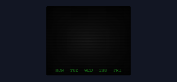</a> <b>Hatched Phosphor Bar Chart</b> <code>spectrums-hatched-phosphor-bar-chart</code></td></tr>
<tr><td align="center" valign="top" width="33%"><a href="../html/spectrums-ascii-line-plot.html">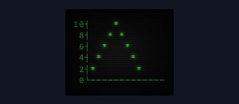</a> <b>ASCII Line Plot</b> <code>spectrums-ascii-line-plot</code></td><td align="center" valign="top" width="33%"><a href="../html/spectrums-block-glyph-meter-chart.html">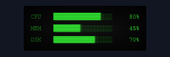</a> <b>Block-glyph Meter Chart</b> <code>spectrums-block-glyph-meter-chart</code></td><td align="center" valign="top" width="33%"><a href="../html/spectrums-vu-signal-meter.html">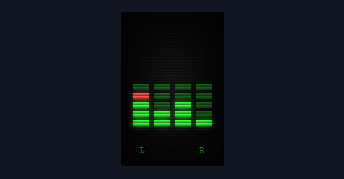</a> <b>VU Signal Meter</b> <code>spectrums-vu-signal-meter</code></td></tr>
<tr><td align="center" valign="top" width="33%"><a href="../html/spectrums-command-line-input.html">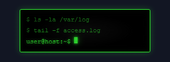</a> <b>Command-line Input</b> <code>spectrums-command-line-input</code></td><td align="center" valign="top" width="33%"><a href="../html/spectrums-amber-login-field.html">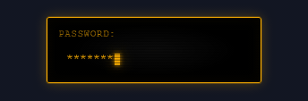</a> <b>Amber Login Field</b> <code>spectrums-amber-login-field</code></td><td align="center" valign="top" width="33%"> <b>Arrow Value Picker</b> <code>spectrums-arrow-value-picker</code></td></tr>
<tr><td align="center" valign="top" width="33%"><a href="../html/spectrums-ascii-checkbox-radio-group.html">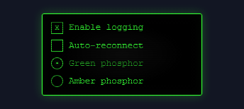</a> <b>ASCII Checkbox &amp; Radio Group</b> <code>spectrums-ascii-checkbox-radio-group</code></td><td align="center" valign="top" width="33%"><a href="../html/spectrums-glowing-phosphor-headline.html">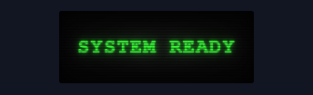</a> <b>Glowing Phosphor Headline</b> <code>spectrums-glowing-phosphor-headline</code></td><td align="center" valign="top" width="33%"><a href="../html/spectrums-flickering-alert-text.html">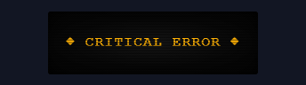</a> <b>Flickering Alert Text</b> <code>spectrums-flickering-alert-text</code></td></tr>
<tr><td align="center" valign="top" width="33%"><a href="../html/spectrums-ascii-rule-banner.html">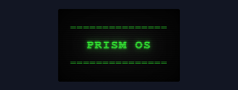</a> <b>ASCII Rule Banner</b> <code>spectrums-ascii-rule-banner</code></td><td align="center" valign="top" width="33%"> <b>Typewriter Boot Text</b> <code>spectrums-typewriter-boot-text</code></td><td align="center" valign="top" width="33%"> <b>3.5&quot; Floppy Disk Icon</b> <code>spectrums-3-5-floppy-disk-icon</code></td></tr>
<tr><td align="center" valign="top" width="33%"> <b>Oversized Blinking Cursor</b> <code>spectrums-oversized-blinking-cursor</code></td><td align="center" valign="top" width="33%"> <b>ASCII Busy Spinner</b> <code>spectrums-ascii-busy-spinner</code></td><td align="center" valign="top" width="33%"><a href="../html/spectrums-mini-crt-monitor-icon.html">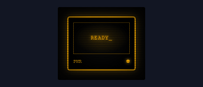</a> <b>Mini CRT Monitor Icon</b> <code>spectrums-mini-crt-monitor-icon</code></td></tr>
</table>
