# Skeuomorphic Hardware · Spectrums

Every Prism facet authored in the **Skeuomorphic Hardware** visual language, recorded as a looping GIF.

**30 effects** · 18 animated · 208 KB of GIF · click any GIF to open its standalone HTML sample (raw file; open it locally, GitHub shows source).

[← Showcase index](../README.md)

<table>
<tr><td align="center" valign="top" width="33%"><a href="../html/spectrums-brushed-control-panel-menu.html">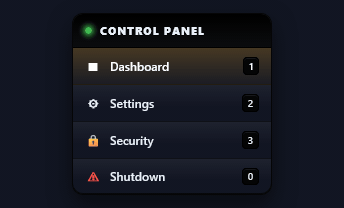</a> <b>Brushed Control Panel Menu</b> <code>spectrums-brushed-control-panel-menu</code></td><td align="center" valign="top" width="33%"> <b>Pressable Key-Bank Tabs</b> <code>spectrums-pressable-key-bank-tabs</code></td><td align="center" valign="top" width="33%"><a href="../html/spectrums-brushed-metal-context-menu.html">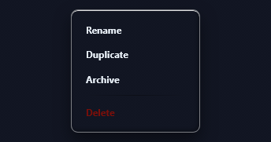</a> <b>Brushed-Metal Context Menu</b> <code>spectrums-brushed-metal-context-menu</code></td></tr>
<tr><td align="center" valign="top" width="33%"><a href="../html/spectrums-command-deck-keypad-menu.html">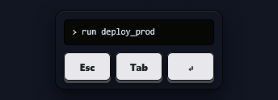</a> <b>Command-Deck Keypad Menu</b> <code>spectrums-command-deck-keypad-menu</code></td><td align="center" valign="top" width="33%"> <b>Chunky Tactile Push-Button</b> <code>spectrums-chunky-tactile-push-button</code></td><td align="center" valign="top" width="33%"> <b>Illuminated Power Button</b> <code>spectrums-illuminated-power-button</code></td></tr>
<tr><td align="center" valign="top" width="33%"> <b>Rocker-Switch Toggle Button</b> <code>spectrums-rocker-switch-toggle-button</code></td><td align="center" valign="top" width="33%"> <b>Emergency Stop Button</b> <code>spectrums-emergency-stop-button</code></td><td align="center" valign="top" width="33%"> <b>LED Status Panel Toast</b> <code>spectrums-led-status-panel-toast</code></td></tr>
<tr><td align="center" valign="top" width="33%"><a href="../html/spectrums-klaxon-alert-banner.html">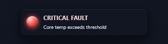</a> <b>Klaxon Alert Banner</b> <code>spectrums-klaxon-alert-banner</code></td><td align="center" valign="top" width="33%"><a href="../html/spectrums-indicator-led-strip.html">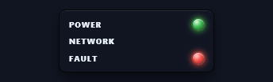</a> <b>Indicator LED Strip</b> <code>spectrums-indicator-led-strip</code></td><td align="center" valign="top" width="33%"><a href="../html/spectrums-riveted-info-plate.html">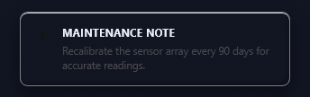</a> <b>Riveted Info Plate</b> <code>spectrums-riveted-info-plate</code> · static</td></tr>
<tr><td align="center" valign="top" width="33%"><a href="../html/spectrums-hazard-tape-callout.html">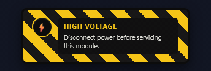</a> <b>Hazard Tape Callout</b> <code>spectrums-hazard-tape-callout</code> · static</td><td align="center" valign="top" width="33%"><a href="../html/spectrums-engraved-nameplate-callout.html">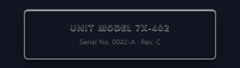</a> <b>Engraved Nameplate Callout</b> <code>spectrums-engraved-nameplate-callout</code> · static</td><td align="center" valign="top" width="33%"><a href="../html/spectrums-analog-dashboard-gauge.html">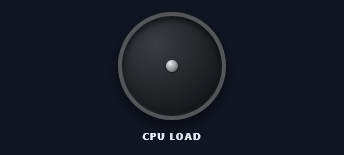</a> <b>Analog Dashboard Gauge</b> <code>spectrums-analog-dashboard-gauge</code></td></tr>
<tr><td align="center" valign="top" width="33%"> <b>LED Segment Bar Chart</b> <code>spectrums-led-segment-bar-chart</code></td><td align="center" valign="top" width="33%"> <b>Twin VU Meters</b> <code>spectrums-twin-vu-meters</code></td><td align="center" valign="top" width="33%"><a href="../html/spectrums-speedometer-kpi-dial.html">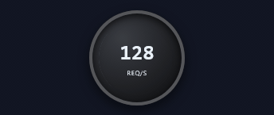</a> <b>Speedometer KPI Dial</b> <code>spectrums-speedometer-kpi-dial</code> · static</td></tr>
<tr><td align="center" valign="top" width="33%"> <b>Rotary Knob Dial</b> <code>spectrums-rotary-knob-dial</code></td><td align="center" valign="top" width="33%"> <b>Real Toggle Switch</b> <code>spectrums-real-toggle-switch</code></td><td align="center" valign="top" width="33%"><a href="../html/spectrums-keypad-pin-entry.html">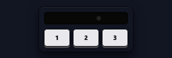</a> <b>Keypad PIN Entry</b> <code>spectrums-keypad-pin-entry</code></td></tr>
<tr><td align="center" valign="top" width="33%"><a href="../html/spectrums-mixer-style-slide-fader.html">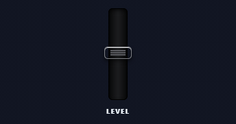</a> <b>Mixer-Style Slide Fader</b> <code>spectrums-mixer-style-slide-fader</code> · static</td><td align="center" valign="top" width="33%"><a href="../html/spectrums-amber-readout-text-field.html">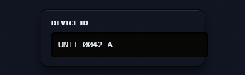</a> <b>Amber Readout Text Field</b> <code>spectrums-amber-readout-text-field</code> · static</td><td align="center" valign="top" width="33%"> <b>Debossed Engraved Label</b> <code>spectrums-debossed-engraved-label</code> · static</td></tr>
<tr><td align="center" valign="top" width="33%"> <b>Seven-Segment LED Readout</b> <code>spectrums-seven-segment-led-readout</code> · static</td><td align="center" valign="top" width="33%"> <b>Chrome Logotype</b> <code>spectrums-chrome-logotype</code> · static</td><td align="center" valign="top" width="33%"> <b>Rivet Fastener Set</b> <code>spectrums-rivet-fastener-set</code> · static</td></tr>
<tr><td align="center" valign="top" width="33%"> <b>Phillips-Head Screw</b> <code>spectrums-phillips-head-screw</code> · static</td><td align="center" valign="top" width="33%"> <b>Knurled Knob Cap</b> <code>spectrums-knurled-knob-cap</code> · static</td><td align="center" valign="top" width="33%"> <b>Jewel LED Indicator Light</b> <code>spectrums-jewel-led-indicator-light</code></td></tr>
</table>
