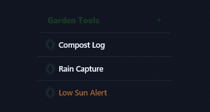
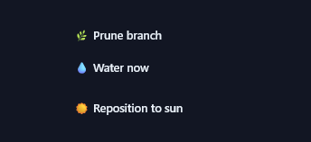
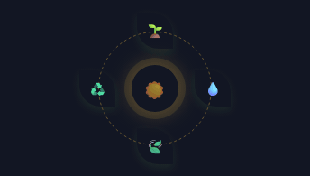
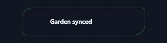
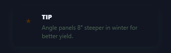
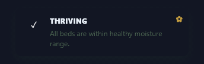
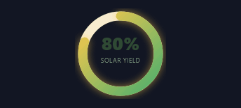
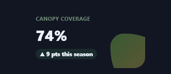
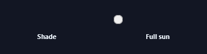

# Solarpunk · Spectrums

Every Prism facet authored in the **Solarpunk** visual language, recorded as a looping GIF.

**30 effects** · 26 animated · 684 KB of GIF · click any GIF to open its standalone HTML sample (raw file; open it locally, GitHub shows source).

[← Showcase index](../README.md)

<table>
<tr><td align="center" valign="top" width="33%"> <b>Canopy Dropdown</b> <code>spectrums-canopy-dropdown</code></td><td align="center" valign="top" width="33%"> <b>Solar Nav Pills</b> <code>spectrums-solar-nav-pills</code></td><td align="center" valign="top" width="33%"> <b>Meadow Context Menu</b> <code>spectrums-meadow-context-menu</code></td></tr>
<tr><td align="center" valign="top" width="33%"> <b>Sunburst Radial Menu</b> <code>spectrums-sunburst-radial-menu</code></td><td align="center" valign="top" width="33%"> <b>Blob Bloom Button</b> <code>spectrums-blob-bloom-button</code></td><td align="center" valign="top" width="33%"> <b>Leaf Press Button</b> <code>spectrums-leaf-press-button</code></td></tr>
<tr><td align="center" valign="top" width="33%"> <b>Sprout Hover Button</b> <code>spectrums-sprout-hover-button</code></td><td align="center" valign="top" width="33%"> <b>Sunrise Gradient Button</b> <code>spectrums-sunrise-gradient-button</code></td><td align="center" valign="top" width="33%"> <b>Sun-Glow Banner</b> <code>spectrums-sun-glow-banner</code></td></tr>
<tr><td align="center" valign="top" width="33%"> <b>Leaf-Fall Toast</b> <code>spectrums-leaf-fall-toast</code></td><td align="center" valign="top" width="33%"> <b>Bloom Success Toast</b> <code>spectrums-bloom-success-toast</code></td><td align="center" valign="top" width="33%"> <b>Compost Warning Banner</b> <code>spectrums-compost-warning-banner</code></td></tr>
<tr><td align="center" valign="top" width="33%"> <b>Leaf Note Callout</b> <code>spectrums-leaf-note-callout</code></td><td align="center" valign="top" width="33%"> <b>Solar Tip Callout</b> <code>spectrums-solar-tip-callout</code></td><td align="center" valign="top" width="33%"> <b>Thriving Success Callout</b> <code>spectrums-thriving-success-callout</code></td></tr>
<tr><td align="center" valign="top" width="33%"> <b>Growth Bars</b> <code>spectrums-growth-bars</code></td><td align="center" valign="top" width="33%"> <b>Solar Yield Ring</b> <code>spectrums-solar-yield-ring</code> · static</td><td align="center" valign="top" width="33%"> <b>Canopy Sparkline</b> <code>spectrums-canopy-sparkline</code></td></tr>
<tr><td align="center" valign="top" width="33%"> <b>Bloom KPI Card</b> <code>spectrums-bloom-kpi-card</code> · static</td><td align="center" valign="top" width="33%"> <b>Leaf Text Field</b> <code>spectrums-leaf-text-field</code></td><td align="center" valign="top" width="33%"> <b>Solar Toggle Switch</b> <code>spectrums-solar-toggle-switch</code></td></tr>
<tr><td align="center" valign="top" width="33%"> <b>Root Range Slider</b> <code>spectrums-root-range-slider</code> · static</td><td align="center" valign="top" width="33%"> <b>Petal Radio Select</b> <code>spectrums-petal-radio-select</code></td><td align="center" valign="top" width="33%"> <b>Sunrise Gradient Text</b> <code>spectrums-sunrise-gradient-text</code> · static</td></tr>
<tr><td align="center" valign="top" width="33%"> <b>Growing Vine Underline</b> <code>spectrums-growing-vine-underline</code></td><td align="center" valign="top" width="33%"> <b>Solar Flare Text</b> <code>spectrums-solar-flare-text</code></td><td align="center" valign="top" width="33%"> <b>CSS Sun</b> <code>spectrums-css-sun</code></td></tr>
<tr><td align="center" valign="top" width="33%"> <b>CSS Leaf</b> <code>spectrums-css-leaf</code></td><td align="center" valign="top" width="33%"> <b>Solar Panel Icon</b> <code>spectrums-solar-panel-icon</code></td><td align="center" valign="top" width="33%"> <b>Blob Cluster</b> <code>spectrums-blob-cluster</code></td></tr>
</table>
