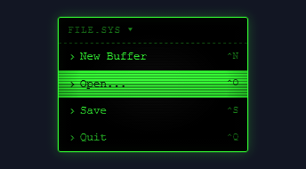

# Spectrums

Component families rendered across full visual languages. Each family has its own page.

[← Showcase index](../README.md)

<table>
<tr><td align="center" valign="top" width="33%"> <b><a href="spectrums-material-ui.md">Material UI</a></b> 28 effects</td><td align="center" valign="top" width="33%"> <b><a href="spectrums-cyberpunk-os.md">Cyberpunk OS</a></b> 32 effects</td><td align="center" valign="top" width="33%"> <b><a href="spectrums-neumorphism.md">Neumorphism</a></b> 29 effects</td></tr>
<tr><td align="center" valign="top" width="33%"> <b><a href="spectrums-glassmorphism.md">Glassmorphism</a></b> 30 effects</td><td align="center" valign="top" width="33%"> <b><a href="spectrums-brutalist-web.md">Brutalist Web</a></b> 28 effects</td><td align="center" valign="top" width="33%"> <b><a href="spectrums-skeuo-hardware.md">Skeuomorphic Hardware</a></b> 30 effects</td></tr>
<tr><td align="center" valign="top" width="33%"> <b><a href="spectrums-retro-terminal.md">Retro Terminal</a></b> 30 effects</td><td align="center" valign="top" width="33%"> <b><a href="spectrums-art-deco.md">Art Deco</a></b> 29 effects</td><td align="center" valign="top" width="33%"> <b><a href="spectrums-solarpunk.md">Solarpunk</a></b> 30 effects</td></tr>
<tr><td align="center" valign="top" width="33%"> <b><a href="spectrums-duolingo.md">Duolingo</a></b> 100 effects</td><td align="center" valign="top" width="33%"> <b><a href="spectrums-mailchimp.md">Mailchimp</a></b> 100 effects</td><td align="center" valign="top" width="33%"> <b><a href="spectrums-stackoverflow.md">Stack Overflow</a></b> 100 effects</td></tr>
<tr><td align="center" valign="top" width="33%"> <b><a href="spectrums-monzo.md">Monzo</a></b> 100 effects</td><td align="center" valign="top" width="33%"> <b><a href="spectrums-heroku.md">Heroku</a></b> 100 effects</td><td align="center" valign="top" width="33%"> <b><a href="spectrums-polaris.md">Shopify Polaris</a></b> 100 effects</td></tr>
<tr><td align="center" valign="top" width="33%"> <b><a href="spectrums-primer.md">GitHub Primer</a></b> 100 effects</td><td align="center" valign="top" width="33%"> <b><a href="spectrums-antd.md">Ant Design</a></b> 100 effects</td><td align="center" valign="top" width="33%"> <b><a href="spectrums-acorn.md">Acorn</a></b> 100 effects</td></tr>
<tr><td align="center" valign="top" width="33%"> <b><a href="spectrums-material3.md">Material 3</a></b> 100 effects</td><td align="center" valign="top" width="33%"> <b><a href="spectrums-cloudflare.md">cloudflare</a></b> 100 effects</td></tr>
</table>
