# Tables & Data Layouts

Every effect in Prism's **Tables & Data Layouts** gallery, recorded as a looping GIF.

**54 effects** · 54 animated · 1.1 MB of GIF · click any GIF to open its standalone HTML sample (raw file; open it locally, GitHub shows source).

[← Showcase index](../README.md)

**Sections:** [DATA TABLES](#data-tables) · [STATUS & DATA CELLS](#status-data-cells) · [MATRICES & COMPARISON](#matrices-comparison) · [KEY VALUE & DEFINITION](#key-value-definition) · [LISTS & TREES](#lists-trees) · [GRIDS & SCHEDULES](#grids-schedules) · [LEDGERS, LOGS & TOOLBARS](#ledgers-logs-toolbars)

## DATA TABLES

<table>
<tr><td align="center" valign="top" width="33%"> <b>Zebra Table + Scan</b> <code>tables-zebra-table-scan</code></td><td align="center" valign="top" width="33%"><a href="../html/tables-hover-glow-rows.html">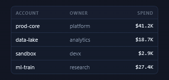</a> <b>Hover-Glow Rows</b> <code>tables-hover-glow-rows</code></td><td align="center" valign="top" width="33%"><a href="../html/tables-sortable-header.html">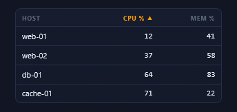</a> <b>Sortable Header</b> <code>tables-sortable-header</code></td></tr>
<tr><td align="center" valign="top" width="33%"><a href="../html/tables-row-move-arrows.html">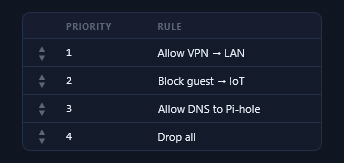</a> <b>Row Move Arrows</b> <code>tables-row-move-arrows</code></td><td align="center" valign="top" width="33%"><a href="../html/tables-flash-resort.html">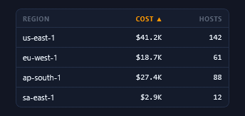</a> <b>Flash + Resort</b> <code>tables-flash-resort</code></td><td align="center" valign="top" width="33%"><a href="../html/tables-fall-land-resort.html">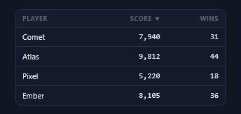</a> <b>Fall + Land Resort</b> <code>tables-fall-land-resort</code></td></tr>
<tr><td align="center" valign="top" width="33%"><a href="../html/tables-sticky-header-scroll.html">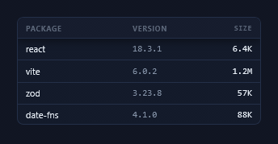</a> <b>Sticky Header Scroll</b> <code>tables-sticky-header-scroll</code></td><td align="center" valign="top" width="33%"><a href="../html/tables-dense-numeric-table.html">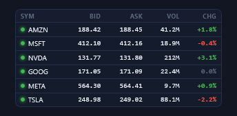</a> <b>Dense Numeric Table</b> <code>tables-dense-numeric-table</code></td><td align="center" valign="top" width="33%"><a href="../html/tables-row-selection.html">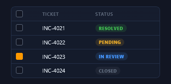</a> <b>Row Selection</b> <code>tables-row-selection</code></td></tr>
<tr><td align="center" valign="top" width="33%"><a href="../html/tables-expandable-detail-row.html">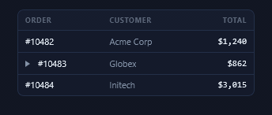</a> <b>Expandable Detail Row</b> <code>tables-expandable-detail-row</code></td><td align="center" valign="top" width="33%"><a href="../html/tables-inline-cell-edit.html">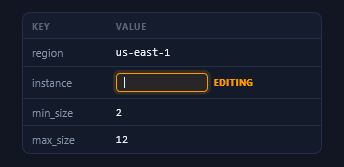</a> <b>Inline Cell Edit</b> <code>tables-inline-cell-edit</code></td><td align="center" valign="top" width="33%"><a href="../html/tables-totals-row-count-up.html">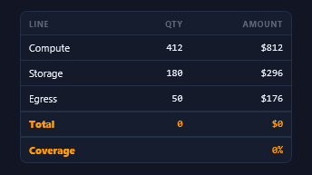</a> <b>Totals Row + Count-Up</b> <code>tables-totals-row-count-up</code></td></tr>
<tr><td align="center" valign="top" width="33%"> <b>Skeleton Table</b> <code>tables-skeleton-table</code></td></tr>
</table>

## STATUS & DATA CELLS

<table>
<tr><td align="center" valign="top" width="33%"><a href="../html/tables-status-pill-column.html">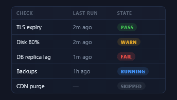</a> <b>Status Pill Column</b> <code>tables-status-pill-column</code></td><td align="center" valign="top" width="33%"><a href="../html/tables-progress-bar-cells.html">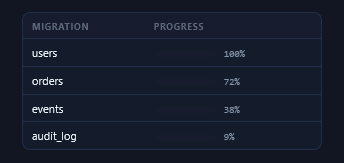</a> <b>Progress Bar Cells</b> <code>tables-progress-bar-cells</code></td><td align="center" valign="top" width="33%"><a href="../html/tables-sparkline-column.html">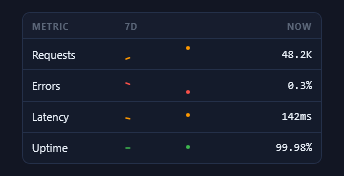</a> <b>Sparkline Column</b> <code>tables-sparkline-column</code></td></tr>
<tr><td align="center" valign="top" width="33%"><a href="../html/tables-delta-cells.html">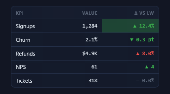</a> <b>Delta Cells</b> <code>tables-delta-cells</code></td><td align="center" valign="top" width="33%"><a href="../html/tables-avatar-presence-column.html">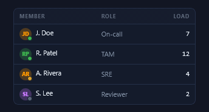</a> <b>Avatar + Presence Column</b> <code>tables-avatar-presence-column</code></td><td align="center" valign="top" width="33%"><a href="../html/tables-tag-chip-cells.html">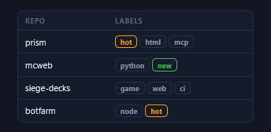</a> <b>Tag Chip Cells</b> <code>tables-tag-chip-cells</code></td></tr>
<tr><td align="center" valign="top" width="33%"><a href="../html/tables-heat-shaded-cells.html">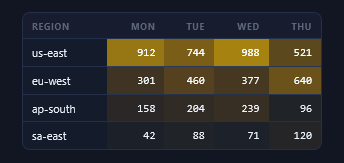</a> <b>Heat-Shaded Cells</b> <code>tables-heat-shaded-cells</code></td><td align="center" valign="top" width="33%"><a href="../html/tables-live-ticker-table.html">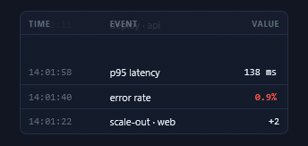</a> <b>Live Ticker Table</b> <code>tables-live-ticker-table</code></td></tr>
</table>

## MATRICES & COMPARISON

<table>
<tr><td align="center" valign="top" width="33%"><a href="../html/tables-feature-matrix.html">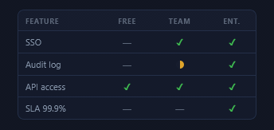</a> <b>Feature Matrix</b> <code>tables-feature-matrix</code></td><td align="center" valign="top" width="33%"><a href="../html/tables-heatmap-grid.html">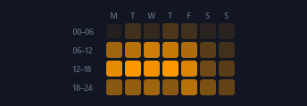</a> <b>Heatmap Grid</b> <code>tables-heatmap-grid</code></td><td align="center" valign="top" width="33%"><a href="../html/tables-pivot-crosshair.html">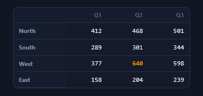</a> <b>Pivot Crosshair</b> <code>tables-pivot-crosshair</code></td></tr>
<tr><td align="center" valign="top" width="33%"><a href="../html/tables-risk-matrix.html">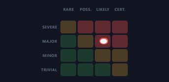</a> <b>Risk Matrix</b> <code>tables-risk-matrix</code></td><td align="center" valign="top" width="33%"><a href="../html/tables-comparison-columns.html">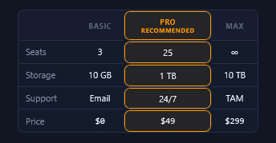</a> <b>Comparison Columns</b> <code>tables-comparison-columns</code></td><td align="center" valign="top" width="33%"><a href="../html/tables-correlation-matrix.html">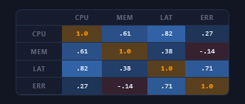</a> <b>Correlation Matrix</b> <code>tables-correlation-matrix</code></td></tr>
<tr><td align="center" valign="top" width="33%"> <b>Contribution Calendar</b> <code>tables-contribution-calendar</code></td><td align="center" valign="top" width="33%"><a href="../html/tables-dual-tone-contribution-calendar.html">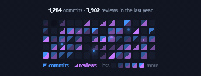</a> <b>Dual-Tone Contribution Calendar</b> <code>tables-dual-tone-contribution-calendar</code></td></tr>
</table>

## KEY VALUE & DEFINITION

<table>
<tr><td align="center" valign="top" width="33%"><a href="../html/tables-key-value-with-leaders.html">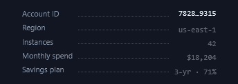</a> <b>Key-Value with Leaders</b> <code>tables-key-value-with-leaders</code></td><td align="center" valign="top" width="33%"><a href="../html/tables-spec-card.html">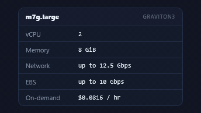</a> <b>Spec Card</b> <code>tables-spec-card</code></td><td align="center" valign="top" width="33%"><a href="../html/tables-definition-list.html">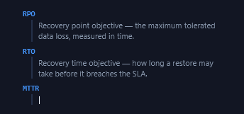</a> <b>Definition List</b> <code>tables-definition-list</code></td></tr>
<tr><td align="center" valign="top" width="33%"><a href="../html/tables-properties-inspector.html">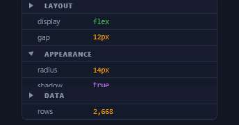</a> <b>Properties Inspector</b> <code>tables-properties-inspector</code></td><td align="center" valign="top" width="33%"><a href="../html/tables-json-tree.html">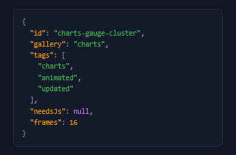</a> <b>JSON Tree</b> <code>tables-json-tree</code></td></tr>
</table>

## LISTS & TREES

<table>
<tr><td align="center" valign="top" width="33%"> <b>File Tree</b> <code>tables-file-tree</code></td><td align="center" valign="top" width="33%"><a href="../html/tables-org-chart.html">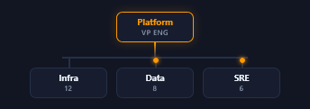</a> <b>Org Chart</b> <code>tables-org-chart</code></td><td align="center" valign="top" width="33%"> <b>Nested Outline</b> <code>tables-nested-outline</code></td></tr>
<tr><td align="center" valign="top" width="33%"><a href="../html/tables-numbered-steps.html">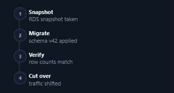</a> <b>Numbered Steps</b> <code>tables-numbered-steps</code></td><td align="center" valign="top" width="33%"> <b>Checklist</b> <code>tables-checklist</code></td><td align="center" valign="top" width="33%"><a href="../html/tables-leaderboard-swap.html">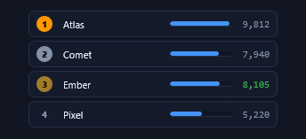</a> <b>Leaderboard Swap</b> <code>tables-leaderboard-swap</code></td></tr>
<tr><td align="center" valign="top" width="33%"><a href="../html/tables-timeline-list-now.html">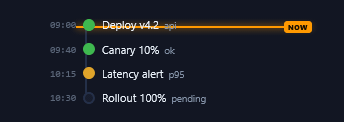</a> <b>Timeline List + Now</b> <code>tables-timeline-list-now</code></td></tr>
</table>

## GRIDS & SCHEDULES

<table>
<tr><td align="center" valign="top" width="33%"><a href="../html/tables-record-card-grid.html">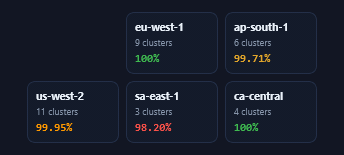</a> <b>Record Card Grid</b> <code>tables-record-card-grid</code></td><td align="center" valign="top" width="33%"><a href="../html/tables-gantt-rows.html">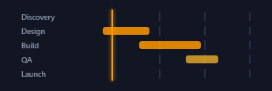</a> <b>Gantt Rows</b> <code>tables-gantt-rows</code></td><td align="center" valign="top" width="33%"><a href="../html/tables-weekly-schedule-grid.html">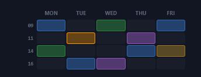</a> <b>Weekly Schedule Grid</b> <code>tables-weekly-schedule-grid</code></td></tr>
<tr><td align="center" valign="top" width="33%"><a href="../html/tables-month-calendar.html">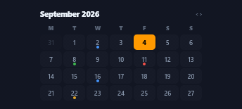</a> <b>Month Calendar</b> <code>tables-month-calendar</code></td><td align="center" valign="top" width="33%"><a href="../html/tables-kanban-columns.html">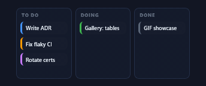</a> <b>Kanban Columns</b> <code>tables-kanban-columns</code></td><td align="center" valign="top" width="33%"><a href="../html/tables-bento-stat-grid.html">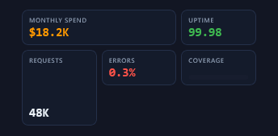</a> <b>Bento Stat Grid</b> <code>tables-bento-stat-grid</code></td></tr>
<tr><td align="center" valign="top" width="33%"> <b>Masonry Placeholder</b> <code>tables-masonry-placeholder</code></td></tr>
</table>

## LEDGERS, LOGS & TOOLBARS

<table>
<tr><td align="center" valign="top" width="33%"><a href="../html/tables-ledger-running-balance.html">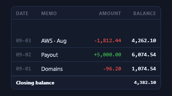</a> <b>Ledger + Running Balance</b> <code>tables-ledger-running-balance</code></td><td align="center" valign="top" width="33%"><a href="../html/tables-diff-table.html">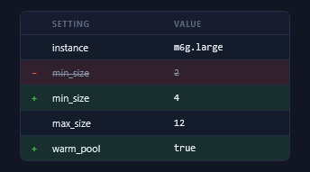</a> <b>Diff Table</b> <code>tables-diff-table</code></td><td align="center" valign="top" width="33%"><a href="../html/tables-audit-trail.html">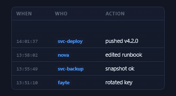</a> <b>Audit Trail</b> <code>tables-audit-trail</code></td></tr>
<tr><td align="center" valign="top" width="33%"><a href="../html/tables-pagination.html">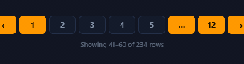</a> <b>Pagination</b> <code>tables-pagination</code></td><td align="center" valign="top" width="33%"><a href="../html/tables-table-toolbar.html">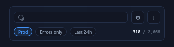</a> <b>Table Toolbar</b> <code>tables-table-toolbar</code></td><td align="center" valign="top" width="33%"> <b>Empty Table State</b> <code>tables-empty-table-state</code></td></tr>
</table>
