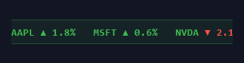

# Text Effects

Every effect in Prism's **Text Effects** gallery, recorded as a looping GIF.

**102 effects** · 88 animated · 2.8 MB of GIF · click any GIF to open its standalone HTML sample (raw file; open it locally, GitHub shows source).

[← Showcase index](../README.md)

**Sections:** [Gradient & Animated Fill](#gradient-animated-fill) · [Glow & Neon](#glow-neon) · [Outline & Stroke](#outline-stroke) · [Shadow & 3D / Extrude](#shadow-3d-extrude) · [Glitch & Distortion](#glitch-distortion) · [Reveal & Typewriter](#reveal-typewriter) · [Wave & Per](#wave-per) · [Shimmer & Metallic](#shimmer-metallic) · [Fire, Ice & Liquid](#fire-ice-liquid) · [Retro / VHS / Synthwave](#retro-vhs-synthwave) · [Variable](#variable) · [Scramble & Decode](#scramble-decode) · [Marquee & Ticker](#marquee-ticker) · [3D & Extrude](#3d-extrude) · [New Treatments](#new-treatments) · [FORGE LANDING KIT](#forge-landing-kit)

## Gradient & Animated Fill

<table>
<tr><td align="center" valign="top" width="33%"> <b>Gradient-Flow ★ staple</b> <code>text-gradient-flow-staple</code></td><td align="center" valign="top" width="33%"> <b>Gradient-Pan</b> <code>text-gradient-pan</code></td><td align="center" valign="top" width="33%"> <b>Rainbow-Scroll</b> <code>text-rainbow-scroll</code></td></tr>
<tr><td align="center" valign="top" width="33%"> <b>Spectrum-Cycle</b> <code>text-spectrum-cycle</code></td><td align="center" valign="top" width="33%"> <b>Gradient-Vertical</b> <code>text-gradient-vertical</code></td><td align="center" valign="top" width="33%"> <b>Duotone-Wipe</b> <code>text-duotone-wipe</code></td></tr>
</table>

## Glow & Neon

<table>
<tr><td align="center" valign="top" width="33%"> <b>Glow-Pulse</b> <code>text-glow-pulse</code></td><td align="center" valign="top" width="33%"> <b>Neon-Sign</b> <code>text-neon-sign</code></td><td align="center" valign="top" width="33%"> <b>Neon-Buzz</b> <code>text-neon-buzz</code></td></tr>
<tr><td align="center" valign="top" width="33%"> <b>Neon-Outline</b> <code>text-neon-outline</code></td><td align="center" valign="top" width="33%"> <b>Halation-Bloom</b> <code>text-halation-bloom</code></td><td align="center" valign="top" width="33%"> <b>Ember-Glow</b> <code>text-ember-glow</code></td></tr>
</table>

## Outline & Stroke

<table>
<tr><td align="center" valign="top" width="33%"> <b>Outline</b> <code>text-outline</code> · static</td><td align="center" valign="top" width="33%"> <b>Outline-to-Fill</b> <code>text-outline-to-fill</code></td><td align="center" valign="top" width="33%"> <b>Stroke-Breathe</b> <code>text-stroke-breathe</code></td></tr>
<tr><td align="center" valign="top" width="33%"> <b>Knockout-Stroke</b> <code>text-knockout-stroke</code> · static</td><td align="center" valign="top" width="33%"> <b>Dashed-Stroke</b> <code>text-dashed-stroke</code></td><td align="center" valign="top" width="33%"> <b>Engraved-Stroke</b> <code>text-engraved-stroke</code> · static</td></tr>
</table>

## Shadow & 3D / Extrude

<table>
<tr><td align="center" valign="top" width="33%"> <b>Stacked-3D</b> <code>text-stacked-3d</code> · static</td><td align="center" valign="top" width="33%"> <b>Extrude-Swing</b> <code>text-extrude-swing</code></td><td align="center" valign="top" width="33%"> <b>Long-Shadow</b> <code>text-long-shadow</code></td></tr>
<tr><td align="center" valign="top" width="33%"> <b>Retro-Pop</b> <code>text-retro-pop</code></td><td align="center" valign="top" width="33%"> <b>Letterpress</b> <code>text-letterpress</code> · static</td><td align="center" valign="top" width="33%"> <b>Block-Extrude</b> <code>text-block-extrude</code> · static</td></tr>
</table>

## Glitch & Distortion

<table>
<tr><td align="center" valign="top" width="33%"> <b>Datamosh-Glitch</b> <code>text-datamosh-glitch</code></td><td align="center" valign="top" width="33%"> <b>RGB-Split</b> <code>text-rgb-split</code></td><td align="center" valign="top" width="33%"> <b>Signal-Tear</b> <code>text-signal-tear</code></td></tr>
<tr><td align="center" valign="top" width="33%"> <b>Corrupt-Jitter</b> <code>text-corrupt-jitter</code></td><td align="center" valign="top" width="33%"> <b>Shudder</b> <code>text-shudder</code></td></tr>
</table>

## Reveal & Typewriter

<table>
<tr><td align="center" valign="top" width="33%"> <b>Typewriter</b> <code>text-typewriter</code></td><td align="center" valign="top" width="33%"> <b>Wipe-Reveal</b> <code>text-wipe-reveal</code></td><td align="center" valign="top" width="33%"> <b>Blur-Focus</b> <code>text-blur-focus</code></td></tr>
<tr><td align="center" valign="top" width="33%"> <b>Mask-Rise</b> <code>text-mask-rise</code></td><td align="center" valign="top" width="33%"> <b>Tracking-Expand</b> <code>text-tracking-expand</code></td><td align="center" valign="top" width="33%"> <b>Cursor-Block</b> <code>text-cursor-block</code></td></tr>
</table>

## Wave & Per

<table>
<tr><td align="center" valign="top" width="33%"> <b>Letter-Wave</b> <code>text-letter-wave</code></td><td align="center" valign="top" width="33%"> <b>Letter-Bounce</b> <code>text-letter-bounce</code></td><td align="center" valign="top" width="33%"> <b>Rubber-Stretch</b> <code>text-rubber-stretch</code></td></tr>
<tr><td align="center" valign="top" width="33%"> <b>Letter-Flip</b> <code>text-letter-flip</code></td><td align="center" valign="top" width="33%"> <b>Color-Runner</b> <code>text-color-runner</code></td><td align="center" valign="top" width="33%"> <b>Jelly-Sway</b> <code>text-jelly-sway</code></td></tr>
</table>

## Shimmer & Metallic

<table>
<tr><td align="center" valign="top" width="33%"> <b>Gold-Shine premium</b> <code>text-gold-shine-premium</code></td><td align="center" valign="top" width="33%"> <b>Chrome</b> <code>text-chrome</code></td><td align="center" valign="top" width="33%"> <b>Silver-Sheen</b> <code>text-silver-sheen</code></td></tr>
<tr><td align="center" valign="top" width="33%"> <b>Holographic-Foil</b> <code>text-holographic-foil</code></td><td align="center" valign="top" width="33%"> <b>Copper-Polish</b> <code>text-copper-polish</code></td><td align="center" valign="top" width="33%"> <b>Frosted-Glass</b> <code>text-frosted-glass</code> · static</td></tr>
</table>

## Fire, Ice & Liquid

<table>
<tr><td align="center" valign="top" width="33%"> <b>Flame</b> <code>text-flame</code></td><td align="center" valign="top" width="33%"> <b>Ice-Crystal</b> <code>text-ice-crystal</code></td><td align="center" valign="top" width="33%"> <b>Liquid-Flow</b> <code>text-liquid-flow</code></td></tr>
<tr><td align="center" valign="top" width="33%"> <b>Frost-Bite</b> <code>text-frost-bite</code> · static</td><td align="center" valign="top" width="33%"> <b>Smoke-Drift</b> <code>text-smoke-drift</code></td><td align="center" valign="top" width="33%"> <b>Molten-Lava</b> <code>text-molten-lava</code></td></tr>
</table>

## Retro / VHS / Synthwave

<table>
<tr><td align="center" valign="top" width="33%"> <b>VHS-Tracking</b> <code>text-vhs-tracking</code></td><td align="center" valign="top" width="33%"> <b>Synthwave</b> <code>text-synthwave</code></td><td align="center" valign="top" width="33%"> <b>Arcade-Blink</b> <code>text-arcade-blink</code></td></tr>
<tr><td align="center" valign="top" width="33%"> <b>Old-TV</b> <code>text-old-tv</code> · static</td><td align="center" valign="top" width="33%"> <b>Print-Misregister</b> <code>text-print-misregister</code> · static</td></tr>
</table>

## Variable

<table>
<tr><td align="center" valign="top" width="33%"> <b>Weight-Morph</b> <code>text-weight-morph</code></td><td align="center" valign="top" width="33%"> <b>Horizontal-Stretch</b> <code>text-horizontal-stretch</code></td><td align="center" valign="top" width="33%"> <b>Tracking-Pulse</b> <code>text-tracking-pulse</code></td></tr>
<tr><td align="center" valign="top" width="33%"> <b>Italic-Lean</b> <code>text-italic-lean</code></td><td align="center" valign="top" width="33%"> <b>Zoom-Pump</b> <code>text-zoom-pump</code></td><td align="center" valign="top" width="33%"> <b>3D-Rotate</b> <code>text-3d-rotate</code></td></tr>
</table>

## Scramble & Decode

<table>
<tr><td align="center" valign="top" width="33%"> <b>Scramble-In</b> <code>text-scramble-in</code> · static</td><td align="center" valign="top" width="33%"> <b>Decode-Glow</b> <code>text-decode-glow</code> · static</td><td align="center" valign="top" width="33%"> <b>Redact-Reveal</b> <code>text-redact-reveal</code> · static</td></tr>
</table>

## Marquee & Ticker

<table>
<tr><td align="center" valign="top" width="33%"> <b>Marquee-Scroll</b> <code>text-marquee-scroll</code></td><td align="center" valign="top" width="33%"> <b>Marquee-Reverse</b> <code>text-marquee-reverse</code></td><td align="center" valign="top" width="33%"> <b>Stock-Ticker</b> <code>text-stock-ticker</code></td></tr>
</table>

## 3D & Extrude

<table>
<tr><td align="center" valign="top" width="33%"> <b>Spin-3D</b> <code>text-spin-3d</code></td><td align="center" valign="top" width="33%"> <b>Extrude-Solid</b> <code>text-extrude-solid</code></td><td align="center" valign="top" width="33%"> <b>Flip-In (per letter)</b> <code>text-flip-in-per-letter</code></td></tr>
<tr><td align="center" valign="top" width="33%"> <b>Tumble-3D</b> <code>text-tumble-3d</code></td><td align="center" valign="top" width="33%"> <b>Cylinder-Ring</b> <code>text-cylinder-ring</code></td><td align="center" valign="top" width="33%"> <b>Isometric-Block</b> <code>text-isometric-block</code></td></tr>
<tr><td align="center" valign="top" width="33%"> <b>Depth-Parallax</b> <code>text-depth-parallax</code></td></tr>
</table>

## New Treatments

<table>
<tr><td align="center" valign="top" width="33%"> <b>Diagonal-Sweep</b> <code>text-diagonal-sweep</code></td><td align="center" valign="top" width="33%"> <b>Conic-Spin</b> <code>text-conic-spin</code></td><td align="center" valign="top" width="33%"> <b>Specular-Shine</b> <code>text-specular-shine</code></td></tr>
<tr><td align="center" valign="top" width="33%"> <b>Bad-Bulb Flicker</b> <code>text-bad-bulb-flicker</code></td><td align="center" valign="top" width="33%"> <b>Iridescent-Foil</b> <code>text-iridescent-foil</code></td><td align="center" valign="top" width="33%"> <b>Liquid-Fill</b> <code>text-liquid-fill</code></td></tr>
<tr><td align="center" valign="top" width="33%"> <b>Plasma-Flow</b> <code>text-plasma-flow</code></td><td align="center" valign="top" width="33%"> <b>Glacier-Sheen</b> <code>text-glacier-sheen</code></td><td align="center" valign="top" width="33%"> <b>Slice-Glitch</b> <code>text-slice-glitch</code></td></tr>
<tr><td align="center" valign="top" width="33%"> <b>Teletype</b> <code>text-teletype</code></td><td align="center" valign="top" width="33%"> <b>Matrix-Decode</b> <code>text-matrix-decode</code> · static</td><td align="center" valign="top" width="33%"> <b>Pendulum (per letter)</b> <code>text-pendulum-per-letter</code></td></tr>
<tr><td align="center" valign="top" width="33%"> <b>Elastic-In (per letter)</b> <code>text-elastic-in-per-letter</code></td><td align="center" valign="top" width="33%"> <b>Blur-Focus (per letter)</b> <code>text-blur-focus-per-letter</code></td><td align="center" valign="top" width="33%"> <b>Stroke-Trace</b> <code>text-stroke-trace</code></td></tr>
<tr><td align="center" valign="top" width="33%"> <b>Prism-Split</b> <code>text-prism-split</code></td><td align="center" valign="top" width="33%"> <b>Aurora-Drift</b> <code>text-aurora-drift</code></td><td align="center" valign="top" width="33%"> <b>Spotlight-Sweep</b> <code>text-spotlight-sweep</code></td></tr>
<tr><td align="center" valign="top" width="33%"> <b>Gooey-Wobble</b> <code>text-gooey-wobble</code></td><td align="center" valign="top" width="33%"> <b>Shadow-Pop</b> <code>text-shadow-pop</code></td><td align="center" valign="top" width="33%"> <b>Underline-Sweep</b> <code>text-underline-sweep</code></td></tr>
<tr><td align="center" valign="top" width="33%"> <b>Hologram-Scan</b> <code>text-hologram-scan</code></td><td align="center" valign="top" width="33%"> <b>Melt-Drip</b> <code>text-melt-drip</code></td></tr>
</table>

## FORGE LANDING KIT

<table>
<tr><td align="center" valign="top" width="33%"> <b>Forge Gradient Title</b> <code>text-forge-gradient-title</code></td><td align="center" valign="top" width="33%"> <b>Rotating Tagline</b> <code>text-rotating-tagline</code></td></tr>
</table>
